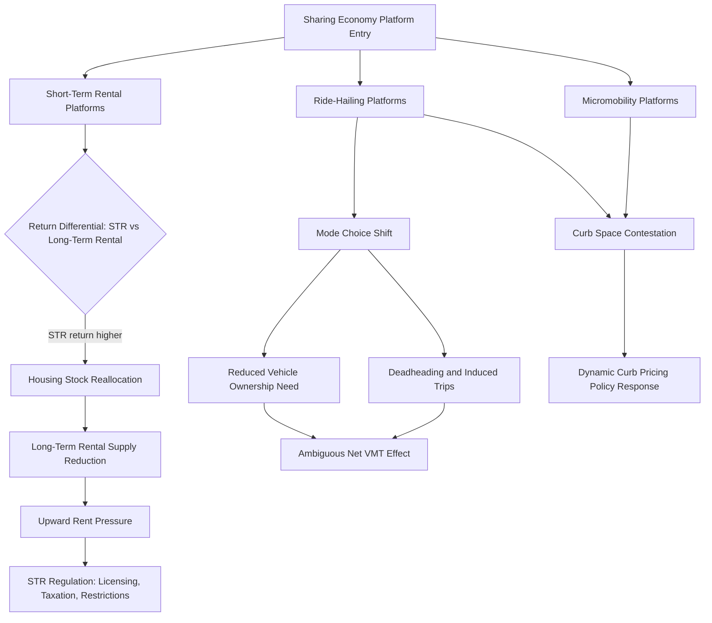

## Sharing Economy Platforms and Urban Space

### Definition and Scope

Sharing economy platforms and urban space examines how digital platforms enabling peer-to-peer exchange of underutilized assets — short-term accommodation (Airbnb and similar), ride-hailing (Uber, Lyft, and similar), and shared micromobility (dockless bikes and scooters) — reshape urban land use, housing markets, transportation patterns, and local labor markets. From an urban economics perspective, these platforms are significant because they alter the effective supply and utilization intensity of existing urban capital stock (housing units, vehicles, curb space) without requiring new physical construction, creating distinct economic dynamics from either traditional market provision or conventional public infrastructure investment.

### Theoretical Foundations

**Underutilized Asset Activation and Matching Efficiency**

The foundational economic logic of sharing economy platforms is reducing search and transaction costs sufficiently to activate previously underutilized capital stock — spare bedrooms, personal vehicles during non-commute hours, and similar low-utilization assets — for market exchange. In classical urban economic terms, this can be modeled as an increase in the effective supply of a given asset category at a given price point, without any change in the underlying physical stock, distinguishing sharing-economy-driven supply increases from the physical construction responses (new hotel rooms, new housing units, expanded transit fleets) that dominate traditional urban economic supply models.

**Short-Term Rental Platforms and Housing Market Conversion**

The core theoretical concern regarding short-term rental (STR) platforms like Airbnb is the potential conversion of long-term residential housing stock into short-term accommodation use, effectively reducing the *long-term rental* housing supply even as it increases *visitor accommodation* supply. This creates a cross-market spillover: if STR platform returns exceed long-term rental returns for a marginal unit (particularly in high-tourism-demand areas), landlords face an incentive to shift units from the long-term rental market to STR use, formally analogous to a change in relative asset returns inducing capital reallocation across markets:

$$\text{STR conversion incentive} \propto (R_{STR} - R_{LTR}) - C_{\text{switching}}$$

where $R_{STR}$ and $R_{LTR}$ are expected returns under short-term and long-term rental use respectively, and $C_{\text{switching}}$ represents conversion/operational costs. This reallocation mechanism is the central theoretical basis for concerns about STR platforms contributing to long-term rental housing affordability pressure in high-demand tourist and urban markets, discussed further below.

**Ride-Hailing and the Theory of Urban Transportation Mode Choice**

Ride-hailing platforms alter the standard urban transportation mode choice model by introducing a new mode with cost and convenience characteristics distinct from both private vehicle ownership and traditional taxi/transit alternatives — reducing the fixed cost of car-free urban living (no need to own a vehicle to access on-demand automobile transport) while potentially increasing per-trip marginal cost relative to owned-vehicle marginal cost. This has ambiguous theoretical implications for aggregate vehicle miles traveled (VMT): reduced need for vehicle ownership could reduce total driving for households substituting away from ownership, while "deadheading" (empty repositioning miles between rides) and induced trip-making by users who would otherwise have used transit or active transportation modes could increase aggregate VMT and congestion.

**Curb Space as a Contested Common-Pool Resource**

Ride-hailing pickup/dropoff activity and micromobility device parking have highlighted curb space specifically as an increasingly contested urban resource, historically allocated primarily through parking regulation frameworks designed for private vehicle storage rather than the higher-turnover, transaction-intensive uses characteristic of ride-hailing loading/unloading and shared micromobility device staging — motivating a distinct emerging literature on curb space pricing and management as a common-pool resource allocation problem analogous to (but institutionally distinct from) traditional parking economics.

### Empirical Evidence on Housing Market Effects

**Short-Term Rental Impact on Long-Term Rents**

A substantial empirical literature, using variation in local STR platform penetration and regulatory restrictions across cities and neighborhoods, has generally found that increased STR activity is associated with measurable increases in long-term rental prices and, in some studies, home prices, consistent with the theoretical housing-stock-reallocation mechanism described above. [Inference — the magnitude of this effect varies substantially across studies depending on local housing market tightness, STR regulatory environment, and the geographic concentration of STR activity within a city, and should not be treated as a single universal elasticity applicable across all markets] Effects are generally found to be concentrated in neighborhoods with higher STR platform penetration rather than uniformly distributed across a metro area, consistent with the localized nature of the underlying reallocation mechanism.

**Regulatory Responses and Their Effects**

Cities have adopted varying regulatory approaches to STR platforms, ranging from outright bans or severe restrictions on non-owner-occupied short-term rentals, to registration/licensing requirements, to STR-specific taxation designed to internalize some of the housing-market externality while preserving platform activity. Empirical evaluation of these regulatory interventions (often using difference-in-differences designs comparing regulated and unregulated jurisdictions or before/after regulatory implementation) generally finds that binding restrictions on STR activity are associated with measurable reductions in STR listing counts and, in at least some studies, corresponding reductions in long-term rental price pressure, though the precise magnitude and generalizability of these regulatory effects remains an active area of ongoing empirical research.

### Empirical Evidence on Transportation and Labor Market Effects

**Vehicle Miles Traveled and Congestion**

Empirical studies of ride-hailing's net effect on urban VMT and congestion have generally found evidence consistent with a net increase in vehicle miles traveled in major markets following ride-hailing platform entry and growth, driven substantially by deadheading miles and net mode-shift away from transit, walking, and cycling rather than away from private vehicle ownership as originally theorized by some early proponents of the platforms. [Unverified — findings vary by city, study period, and methodology; the balance of evidence regarding net congestion effects should be treated as an active area of ongoing research given rapid changes in platform market structure and city-specific transportation contexts over time]

**Gig Worker Labor Market Structure**

Ride-hailing and delivery platform labor markets have generated substantial labor economics literature examining the classification (employee versus independent contractor), compensation structure (per-trip/per-task piece-rate pay with platform-set algorithmic pricing), and locational/scheduling flexibility characteristics of gig platform work, representing a distinct labor market structure from traditional urban service sector employment with implications for local labor supply elasticity, income volatility, and social insurance coverage gaps that have prompted substantial and ongoing regulatory and policy debate across jurisdictions.

### Regulatory and Policy Frameworks

**Licensing and Registration Systems**

Many cities have moved from largely unregulated initial platform operation toward structured registration and licensing systems for both STR hosts and ride-hailing/micromobility operators, often requiring platform data-sharing agreements enabling municipal enforcement and monitoring of compliance with local zoning, safety, and tax obligations — reflecting a broader pattern of regulatory catch-up following initial rapid, often regulation-outpacing platform market entry.

**Taxation and Revenue Capture**

Occupancy taxes applied to STR platform transactions (paralleling traditional hotel occupancy tax structures) and per-trip fees or surcharges applied to ride-hailing transactions have become common municipal revenue mechanisms, serving simultaneously as general revenue generation and, in some jurisdictions, as Pigouvian-style congestion or housing-market-externality correction mechanisms, though the degree to which specific tax rates are calibrated to internalize estimated externality magnitudes (as opposed to being set primarily for revenue purposes) varies substantially across jurisdictions.

**Curb Space Management Reform**

Emerging municipal policy responses to curb space contestation include dynamic curb pricing pilots (varying loading zone pricing by time of day and demand), dedicated pickup/dropoff zones for ride-hailing separate from general parking, and micromobility device parking corral requirements — representing an evolving and still-developing area of urban transportation policy distinct from traditional static parking regulation frameworks.

### Diagram: Sharing Economy Platform Effects on Urban Space

### Illustration: Housing Stock Reallocation Under STR Platform Entry

<svg xmlns="http://www.w3.org/2000/svg" viewBox="0 0 640 340">
<text x="320" y="24" text-anchor="middle" font-size="15" font-weight="bold" fill="#1a1a1a">Housing Stock Split Between Rental Markets (svg_diagram)</text>
<rect x="90" y="70" width="200" height="200" fill="#eaf2f8" stroke="#2471a3" stroke-width="1.5" />
<text x="190" y="60" text-anchor="middle" font-size="12" fill="#333">Before STR Platform Entry</text>
<rect x="90" y="70" width="200" height="180" fill="#2471a3" opacity="0.7" />
<text x="190" y="165" text-anchor="middle" font-size="11" fill="#fff">Long-Term Rental Stock</text>
<rect x="90" y="250" width="200" height="20" fill="#c0392b" opacity="0.7" />
<text x="190" y="264" text-anchor="middle" font-size="9" fill="#fff">STR</text>
<rect x="350" y="70" width="200" height="200" fill="#eaf2f8" stroke="#2471a3" stroke-width="1.5" />
<text x="450" y="60" text-anchor="middle" font-size="12" fill="#333">After STR Platform Growth</text>
<rect x="350" y="70" width="200" height="140" fill="#2471a3" opacity="0.7" />
<text x="450" y="145" text-anchor="middle" font-size="11" fill="#fff">Long-Term Rental Stock</text>
<rect x="350" y="210" width="200" height="60" fill="#c0392b" opacity="0.7" />
<text x="450" y="244" text-anchor="middle" font-size="10" fill="#fff">STR-Converted Stock</text>
<line x1="290" y1="170" x2="350" y2="170" stroke="#333" stroke-width="1.5" marker-end="url(#arrhead)" />
</svg>

### Key Points

- Sharing economy platforms increase effective asset supply by activating underutilized existing capital stock rather than through new physical construction, distinguishing their economic dynamics from traditional infrastructure and housing supply responses
- The core housing market concern is cross-market capital reallocation: when short-term rental returns exceed long-term rental returns, units shift out of the long-term housing stock, with empirical evidence generally supporting measurable upward pressure on long-term rents in high-STR-penetration neighborhoods
- Ride-hailing's net effect on urban vehicle miles traveled is empirically ambiguous in theory but generally found to be net-positive (increasing VMT) in practice, driven by deadheading and mode-shift away from transit and active transportation rather than from vehicle ownership
- Curb space has emerged as a distinct contested urban resource requiring new management frameworks beyond traditional static parking regulation, given the higher-turnover nature of ride-hailing and micromobility use
- Regulatory responses (licensing, occupancy taxation, activity restrictions) have evolved substantially as cities have moved from largely unregulated initial platform entry toward more structured oversight frameworks

### Related Topics

- Short-term rental regulation design and comparative city policy approaches
- Curb space pricing and common-pool resource management
- Gig economy labor classification and social insurance policy
- Vehicle miles traveled measurement and urban congestion economics
- Housing supply elasticity and cross-market capital reallocation
- Micromobility infrastructure and dockless device management
- Transportation mode choice modeling under platform-mediated options
- Occupancy taxation and Pigouvian externality correction design
- Affordable housing policy design and STR interaction effects
- Platform labor market algorithmic wage-setting mechanisms