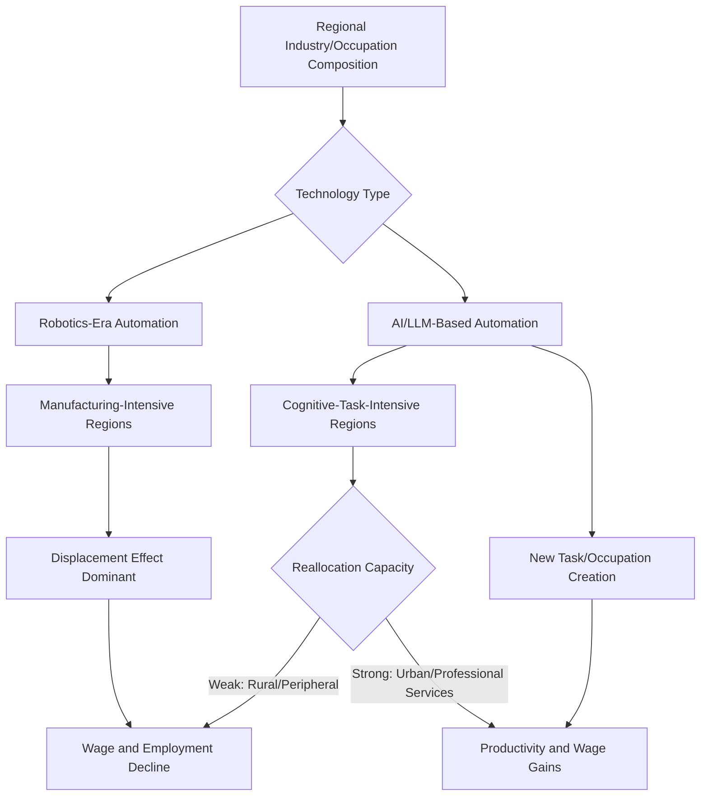

## Automation, Artificial Intelligence, and Regional Labor Markets

### Definition and Scope

Automation, artificial intelligence, and regional labor markets examines how technological change — both traditional robotics-driven automation and, more recently, AI/large language model-driven task substitution and augmentation — affects labor market outcomes differentially across geographic regions, rather than uniformly across a national economy. This subfield extends the task-based labor economics framework into an explicitly spatial dimension, analyzing why local industry composition, occupational structure, and reallocation capacity determine whether a given region experiences automation primarily as employment displacement, wage effects, or productivity-driven wage gains.

### Theoretical Foundations

**Task-Based Automation Framework**

The dominant theoretical framework, developed principally by Acemoglu and Restrepo, models production as a continuum of tasks that can be allocated either to labor or capital/automated systems. Automation is formalized as an expansion of the set of tasks performable by capital, which operates through two countervailing channels: a **displacement effect** (workers lose tasks previously allocated to labor, reducing labor demand and wages) and a **productivity effect** (automation lowers production costs, increasing output and potentially expanding demand for labor in non-automated tasks and creating entirely new task categories). The net regional labor market effect depends on the relative magnitude of these offsetting channels, which in turn depends on local industry composition and the pace of new task/occupation creation relative to displacement.

**Distinguishing Robotics-Era Automation from AI**

An important theoretical and empirical distinction in current research is between traditional industrial automation (robotics, primarily affecting routine manual and production tasks) and generative AI/LLM-based automation (primarily affecting cognitive, information-processing, and communication tasks). Foundational work on industrial robots found robust adverse effects of robots on employment and wages across U.S. commuting zones, with impacts concentrated in manufacturing-intensive regions. More recent theoretical work hypothesizes that AI may operate differently from robots in its labor market distributional consequences, potentially reversing certain patterns of wage polarization observed during the robotics era, since AI-based tools may enhance the capabilities of ordinary or lower-skill workers and enable a broader segment of the labor market to process information for tasks previously requiring specialized expertise — a hypothesis with direct implications for whether AI-driven regional labor market effects will replicate or diverge from the geographic patterns observed during the earlier robotics automation wave.

**Moravec's Paradox and AI Exposure Measurement**

A distinct methodological approach to measuring occupational AI exposure draws on Moravec's Paradox — the observation from robotics and AI research that high-level reasoning tasks require relatively little computation while sensorimotor and physical dexterity tasks require substantially more, historically making cognitive tasks more automatable by AI systems than physical/manual tasks, in contrast to the pattern typical of industrial robotics automation. Theory-based automation exposure indices built on this principle predict systematically different occupational and, by extension, regional exposure patterns than robotics-era exposure measures, since regions with concentrations of cognitive/information-processing employment (often urban, professional-services-heavy metro areas) may face different automation exposure profiles than regions with concentrations of manual/production employment (often smaller manufacturing-dependent metro areas and rural regions).

**Automation Displacing Where Reallocation Capacity Is Weakest**

Recent regional-framework research explicitly modeling the urban-rural divide in automation and AI exposure finds that the two technology types exhibit opposite occupational footprints with distinct spatial consequences: this research characterizes automation as displacing employment where reallocation capacity is weakest, predominantly in rural regions, while AI raises wages where it is already concentrated, in urban labor markets — a finding suggesting technological change may reshape rather than simply widen spatial inequality, since the two technology waves operate through different geographic channels rather than uniformly compounding disadvantage in the same locations. [Inference — this framework represents an emerging area of the literature; the authors note that completing pre-trend testing and cross-country replication are natural next steps, indicating these findings should be treated as provisional pending further validation]

### Empirical Identification Strategies

**Shift-Share/Bartik Exposure Instruments**

Following the approach pioneered in the robotics-automation literature, regional AI/automation exposure is typically constructed using a shift-share design: national-level technology exposure by occupation or industry is interacted with each region's pre-period occupational or industry employment composition, generating region-specific exposure measures that predict differential local automation intensity based on historical industry mix rather than contemporaneous local economic conditions — addressing the same reverse-causality concerns discussed in the broader place-based policy evaluation and infrastructure investment literatures.

**Online Job Posting Analysis**

A prominent recent empirical approach uses large-scale online job posting data to measure real-time shifts in labor demand for AI-exposed occupations. Regional Federal Reserve research applying this methodology to Texas found that job openings fell for occupations whose tasks are automatable by generative AI following the public release of ChatGPT in late 2022, with administrative state data further suggesting that AI automation has affected labor market outcomes such as employment and earnings specifically for recent college graduates, and that these shifts have prompted some current college students to adjust their fields of study in response — an early example of anticipatory human capital adjustment to perceived regional AI exposure.

**Methodological Debates on Timing and Attribution**

A significant methodological debate in current research concerns whether observed declines in job postings for AI-exposed occupations are properly attributable to AI technology diffusion specifically, as opposed to confounding macroeconomic factors. Some researchers find that job posting declines in AI-exposed occupations began in 2022 prior to the public release of large language model-based tools, and argue the timing corresponds better to the macroeconomic shift of rising interest rates than to the launch of LLM-based AI tools — a finding replicated across multiple independent studies, underscoring that causal attribution of regional labor market shifts specifically to AI technology remains methodologically contested and requires careful disentangling from concurrent macroeconomic conditions.

### Current Empirical Landscape and Firm-Level Evidence

**Net Employment Effects from Business Survey Data**

Recent business survey evidence suggests a shift in the aggregate employment impact of AI adoption. While earlier survey rounds indicated a neutral to slightly positive net employment impact from AI adoption, more recent survey findings show a negative global net employment impact over the trailing year, with a further marginal decline forecast, and firms reporting job losses attributable to AI adoption outnumbering those reporting job gains by a measurable margin, with employment reductions concentrated in categories such as administrative and office support, translation, manufacturing/production, and customer service roles. Notably, survey evidence indicates firms' primary stated objective in adopting AI is to achieve productivity gains rather than deliberate workforce reduction, suggesting the employment effects may be a secondary consequence of productivity-oriented AI deployment rather than the direct policy objective.

**Firm AI Adoption Acceleration**

Regional business surveys document rapid acceleration in AI tool adoption: two-thirds of firms surveyed in a recent regional business outlook survey reported using generative AI, up sharply from roughly 40 percent only two years prior, illustrating the pace at which regional firm-level AI exposure is increasing and underscoring the urgency of developing reliable regional labor market impact measurement frameworks to keep pace with adoption.

**Long-Horizon Aggregate Projections**

Longer-horizon macroeconomic projections estimate substantial cumulative global labor market exposure to AI-driven automation over an extended time horizon, with widely cited estimates suggesting several hundred million jobs globally are exposed to AI-driven automation over a roughly ten-year outlook period, while also projecting that AI-related job creation — particularly in power generation and data center infrastructure buildout required to support AI compute demand — will partially offset displacement effects, though the net regional distribution of these creation and displacement effects is expected to vary substantially depending on regional specialization in AI-exposed occupations versus AI-infrastructure-supporting industries. [Unverified — long-horizon macroeconomic projections of this kind carry substantial inherent uncertainty and should be treated as scenario-based estimates rather than precise forecasts]

### Regional Policy Implications

**Skills and Human Capital Policy**

Given evidence that automation displacement is concentrated where regional reallocation capacity is weakest, policy responses focused on retraining and skills development in automation-exposed regions represent a natural extension of the broader regional policy toolkit (discussed in the comparative regional policy approaches literature), though the specific skills mix required for effective transition into AI-complementary occupations remains an active area of workforce development policy design.

**Digital Infrastructure as a Regional Policy Lever**

Because AI-driven productivity gains appear concentrated in regions with existing digital/cognitive-task-intensive employment bases, digital infrastructure investment (broadband access, data center capacity) has been identified as a potential regional policy lever for broadening the geographic distribution of AI-complementary economic activity, paralleling infrastructure-as-regional-development-tool logic discussed in the infrastructure investment policy and comparative regional policy literatures, though the effectiveness of infrastructure investment alone (absent complementary human capital and industry-composition factors) in shifting a region's AI exposure profile remains empirically uncertain.

### Diagram: Regional AI/Automation Exposure Framework

### Illustration: Displacement vs. Productivity Effect Across Region Types

<svg xmlns="http://www.w3.org/2000/svg" viewBox="0 0 640 340">
<text x="320" y="24" text-anchor="middle" font-size="15" font-weight="bold" fill="#1a1a1a">Net Labor Market Effect by Regional Reallocation Capacity (svg_diagram)</text>
<line x1="90" y1="290" x2="580" y2="290" stroke="#333" stroke-width="1.5" />
<line x1="90" y1="290" x2="90" y2="50" stroke="#333" stroke-width="1.5" />
<text x="335" y="315" text-anchor="middle" font-size="11" fill="#333">Region Type</text>
<text x="45" y="170" text-anchor="middle" font-size="11" fill="#333" transform="rotate(-90 45 170)">Net Wage/Employment Effect</text>
<line x1="90" y1="190" x2="580" y2="190" stroke="#999" stroke-width="1" stroke-dasharray="3" />
<text x="590" y="195" font-size="10" fill="#999">0</text>
<rect x="150" y="190" width="80" height="80" fill="#c0392b" />
<text x="190" y="305" text-anchor="middle" font-size="10">Rural / Weak Reallocation</text>
<rect x="330" y="90" width="80" height="100" fill="#27ae60" />
<text x="370" y="305" text-anchor="middle" font-size="10">Urban / Strong Reallocation</text>
</svg>

### Key Points

- The task-based framework's displacement and productivity effects operate through offsetting channels whose net regional impact depends on local industry composition and the pace of new task creation relative to displacement
- Robotics-era automation and AI/LLM-based automation appear to exhibit distinct and potentially opposite occupational footprints, with robotics concentrated in manual/production tasks and AI concentrated in cognitive/information-processing tasks
- Emerging regional research suggests automation displaces employment predominantly where reallocation capacity is weakest (often rural regions), while AI-driven productivity gains concentrate where cognitive-task employment is already dense (often urban regions) — reshaping rather than simply widening spatial inequality
- Causal attribution of recent labor market shifts specifically to AI technology remains methodologically contested, with some evidence suggesting concurrent macroeconomic factors (interest rate changes) may explain observed job posting declines as well as or better than AI adoption timing
- Firm-level AI adoption is accelerating rapidly, with recent survey data showing a shift from neutral-to-positive to negative net employment impact assessments over a short period, though firms report productivity gains rather than workforce reduction as their primary adoption objective

### Related Topics

- Acemoglu-Restrepo task-based automation framework
- Shift-share (Bartik) instrument methodology in labor economics
- Moravec's Paradox and AI occupational exposure measurement
- Regional workforce development and retraining policy design
- Digital infrastructure investment as regional development policy
- Wage polarization and skill-biased technological change
- Data center and AI infrastructure buildout regional economic effects
- Remote work and the theory of city structure
- Comparative regional policy approaches
- New task creation and occupational emergence following technological shocks