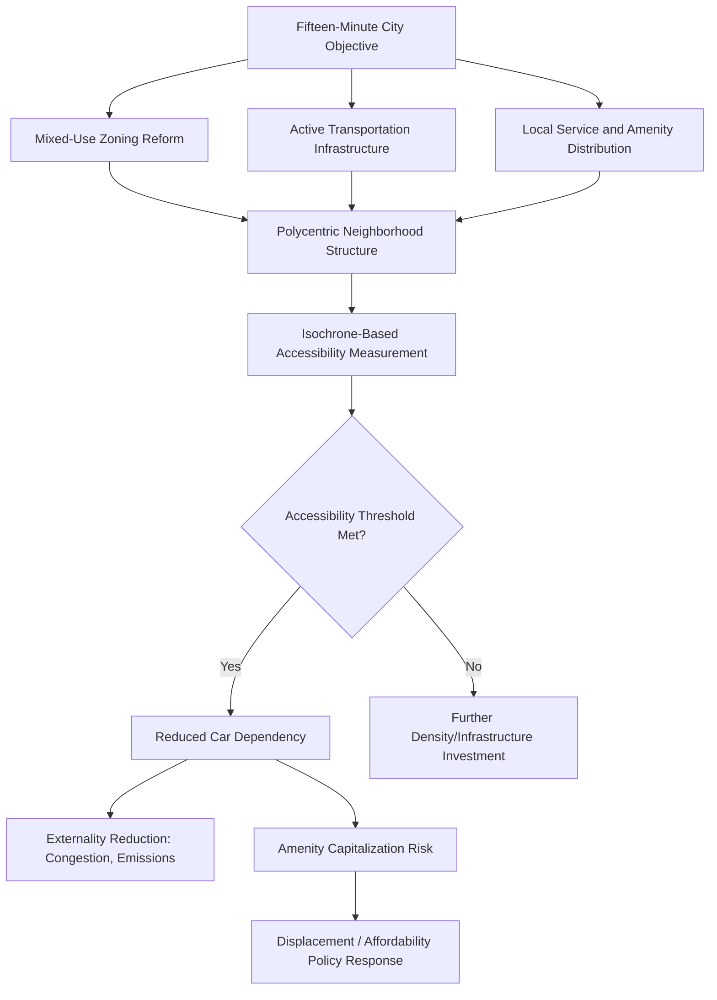

## The Fifteen-Minute City Concept

### Definition and Scope

The fifteen-minute city concept refers to an urban planning framework in which residents can access most daily needs — work, shopping, education, healthcare, leisure, and green space — within a fifteen-minute walk or bike ride from their home, without requiring a car. Popularized by urbanist Carlos Moreno and adopted prominently in Paris's post-2020 urban planning agenda under Mayor Anne Hidalgo, the concept represents a specific operationalization of polycentric, mixed-use urban design principles within urban economics, combining elements of accessibility planning, land use mix optimization, and active transportation infrastructure investment into a single organizing planning framework.

### Theoretical Foundations

**Accessibility versus Mobility Planning Paradigms**

The fifteen-minute city concept reflects a broader theoretical shift in transportation and urban planning from a **mobility-based paradigm** (planning that prioritizes maximizing vehicle speed and travel distance capacity, historically dominant in car-oriented 20th century planning) toward an **accessibility-based paradigm** (planning that prioritizes minimizing the time/distance required to reach needed destinations, regardless of travel mode). In accessibility-based frameworks, urban welfare is modeled as a function of the number and diversity of opportunities (jobs, amenities, services) reachable within a given time budget $T$:

$$A_i = \sum_{j} O_j \cdot f(t_{ij})$$

where $A_i$ is accessibility at location $i$, $O_j$ represents opportunities at destination $j$, and $f(t_{ij})$ is a decay function of travel time between $i$ and $j$. The fifteen-minute city framework essentially proposes a specific target decay threshold (approximately 15 minutes via walking/cycling) as a normative planning benchmark, distinguishing it from purely descriptive accessibility measurement used elsewhere in urban economics.

**Polycentricity and Local Land Use Mix**

Achieving fifteen-minute accessibility standards requires sufficient local land use mix and density to support a full range of daily-need destinations within a small geographic radius — implying a polycentric urban structure with many localized mixed-use neighborhood centers, in contrast to the classical monocentric city model's assumption of a single dominant employment/amenity center requiring longer-distance commuting for most residents. This connects the fifteen-minute city concept directly to the broader polycentric model extensions of urban spatial structure discussed in the remote-work and city-structure literature, sharing the underlying premise that reduced reliance on long-distance travel to a single center can reshape both land use patterns and travel behavior.

**Externality Correction Rationale**

The efficiency rationale for fifteen-minute city planning rests on correcting negative externalities associated with car-dependent, long-commute urban form: traffic congestion, vehicle emissions, and the substantial land area consumed by road and parking infrastructure in car-oriented cities. From this perspective, the fifteen-minute city represents a land-use-and-density-based complement to, or substitute for, the pricing-based externality correction mechanisms (congestion pricing, carbon taxation) more commonly analyzed in mainstream transportation economics — addressing the externality through reduced trip generation and shorter trip distances rather than through price signals on existing travel demand.

### Implementation Requirements and Planning Mechanisms

**Mixed-Use Zoning Reform**

Implementing fifteen-minute city principles generally requires relaxing single-use zoning restrictions that historically separated residential, commercial, and light institutional uses into distinct zones requiring longer-distance travel between them — connecting this concept directly to the broader zoning reform and land use regulation themes discussed in affordable housing policy design, since mixed-use zoning liberalization is a shared policy lever across both housing supply and fifteen-minute accessibility objectives.

**Active Transportation Infrastructure**

Achieving fifteen-minute walk/bike accessibility standards requires substantial investment in pedestrian and cycling infrastructure (protected bike lanes, widened sidewalks, traffic calming measures) to make active transportation modes genuinely viable and safe for the target travel distances, representing infrastructure investment prioritization distinct from — and in some implementation contexts explicitly reallocated from — traditional automobile-oriented road capacity investment.

**Local Service and Amenity Distribution**

Beyond zoning and transportation infrastructure, achieving genuine fifteen-minute accessibility requires sufficient local density and market demand to support a full range of daily-need services (grocery, healthcare, schools, recreation) at a neighborhood scale, which in lower-density or less economically diverse neighborhoods may require public investment or subsidy to establish viable local service provision that private market forces alone might not support at smaller catchment-area scales.

### Empirical Measurement Approaches

**Isochrone-Based Accessibility Mapping**

The primary empirical tool for evaluating fifteen-minute city implementation is isochrone mapping — calculating the actual geographic area reachable within a 15-minute walk or bike ride from a given location using real street network data (accounting for actual pedestrian/cycling infrastructure, topography, and barriers), then overlaying this against the location and diversity of daily-need destinations to produce a quantitative accessibility score for any given neighborhood.

**Amenity Diversity and Density Indices**

Complementary to pure travel-time accessibility, several implementation and evaluation frameworks incorporate amenity diversity indices measuring not just whether *some* amenities exist within the 15-minute radius, but whether a sufficiently diverse range of amenity categories (grocery, healthcare, education, recreation, employment) is represented, since a neighborhood with abundant restaurants but no grocery access or healthcare facilities would score poorly on genuine daily-need accessibility despite potentially scoring well on a simple destination-count metric.

### Empirical Evidence and Evaluation Considerations

**Paris Implementation and Observed Effects**

Paris's prominent implementation of fifteen-minute city principles, combined with substantial bike infrastructure expansion and pedestrianization of significant road space, has been associated with measurable increases in cycling mode share and reported reductions in car usage within the city, though isolating the causal contribution of the fifteen-minute city planning framework specifically from the broader package of contemporaneous transportation policy changes (congestion charging discussions, parking policy reform, bike infrastructure investment) implemented concurrently remains a significant empirical identification challenge, similar to identification challenges discussed throughout the place-based policy evaluation literature.

**Equity and Displacement Considerations**

As with other place-based amenity investments discussed in affordable housing policy design and place-based policy evaluation, fifteen-minute city implementation raises potential capitalization and displacement concerns: improved local accessibility and amenity provision may raise property values and rents in newly-upgraded neighborhoods, potentially displacing lower-income incumbent residents who were intended beneficiaries of improved local accessibility — an equity tension increasingly recognized in fifteen-minute city implementation literature and requiring explicit policy attention (affordability protections, inclusionary requirements) to avoid the concept primarily benefiting higher-income in-movers rather than existing neighborhood residents.

**Feasibility Variation Across Urban Contexts**

The fifteen-minute city concept, developed and most extensively implemented in a dense, historically mixed-use European city context (Paris), faces substantially different feasibility constraints in lower-density, more strictly single-use-zoned urban and suburban contexts common in much of North America and other car-oriented planning traditions, where achieving genuine fifteen-minute accessibility would require far more substantial density increases and zoning transformation than in already relatively dense, historically mixed-use urban fabric — an important caveat limiting direct transferability of specific implementation approaches across differing urban contexts. [Inference — the relative feasibility and appropriate implementation pathway varies substantially by starting density and existing land use pattern, and specific city-by-city implementation strategies should account for this rather than applying a uniform template]

**Controversy and Misinformation**

The fifteen-minute city concept has, in some public discourse contexts, become subject to politically charged misinterpretation, with some critics characterizing the concept as involving mandatory movement restrictions or surveillance-based enforcement of neighborhood boundaries — a characterization not supported by the actual planning literature or implemented policy proposals, which focus on voluntary accessibility improvement through land use and infrastructure investment rather than any restriction on residents' ability to travel beyond their neighborhood. [Unverified — public discourse and political controversy surrounding this concept have evolved and should be understood as separate from the substantive urban planning and economics literature described in this entry]

### Diagram: Fifteen-Minute City Planning Framework

### Illustration: Accessibility Radius and Amenity Mix

<svg xmlns="http://www.w3.org/2000/svg" viewBox="0 0 640 360">
<text x="320" y="24" text-anchor="middle" font-size="15" font-weight="bold" fill="#1a1a1a">Fifteen-Minute Walk/Bike Accessibility Radius (svg_diagram)</text>
<circle cx="320" cy="200" r="140" fill="#eaf6f1" stroke="#27ae60" stroke-width="2" />
<circle cx="320" cy="200" r="8" fill="#1a1a1a" />
<text x="320" y="225" text-anchor="middle" font-size="10" fill="#333">Home</text>
<circle cx="250" cy="130" r="6" fill="#2471a3" />
<text x="250" y="115" text-anchor="middle" font-size="10" fill="#2471a3">Grocery</text>
<circle cx="400" cy="120" r="6" fill="#c0392b" />
<text x="400" y="105" text-anchor="middle" font-size="10" fill="#c0392b">Healthcare</text>
<circle cx="420" cy="250" r="6" fill="#e67e22" />
<text x="420" y="270" text-anchor="middle" font-size="10" fill="#e67e22">School</text>
<circle cx="230" cy="270" r="6" fill="#8e44ad" />
<text x="230" y="290" text-anchor="middle" font-size="10" fill="#8e44ad">Park</text>
<circle cx="350" cy="90" r="6" fill="#16a085" />
<text x="350" y="75" text-anchor="middle" font-size="10" fill="#16a085">Transit</text>
<text x="320" y="360" text-anchor="middle" font-size="10" fill="#555">Radius ≈ 15-min walk/bike (street-network based, not straight-line)</text>
</svg>

### Key Points

- The fifteen-minute city reflects a shift from mobility-based to accessibility-based planning, targeting a specific normative travel-time threshold rather than maximizing vehicle throughput capacity
- Implementation requires coordinated action across mixed-use zoning reform, active transportation infrastructure, and local amenity distribution — no single policy lever alone is sufficient
- Isochrone-based accessibility mapping using actual street network data (not straight-line distance) is the standard empirical measurement approach, often combined with amenity diversity indices
- Amenity capitalization and displacement risk parallel similar concerns raised in place-based policy evaluation and affordable housing policy design, requiring explicit affordability policy attention
- Feasibility varies substantially by starting urban density and existing land use pattern, limiting direct transferability of specific implementation templates (e.g., Paris) to lower-density, single-use-zoned contexts

### Related Topics

- Accessibility-based transportation planning versus mobility-based paradigms
- Polycentric urban models and neighborhood center formation
- Mixed-use zoning reform and land use regulation
- Isochrone mapping and accessibility measurement methodology
- Active transportation infrastructure investment and mode share effects
- Amenity capitalization and residential displacement risk
- Congestion pricing and externality correction mechanisms
- Place-based policy evaluation methodology
- Remote work and the theory of city structure
- Comparative international urban planning frameworks