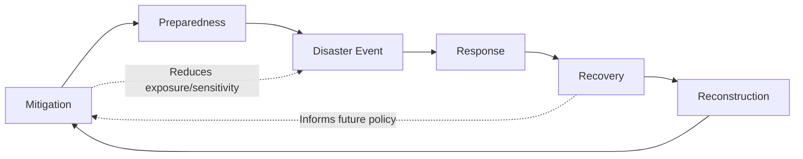

## Urban Resilience and Disaster Economics

### Definition and Conceptual Scope

Urban resilience refers to the capacity of a city's economic, social, physical, and institutional systems to absorb shocks, adapt to changing conditions, and recover functionality after disruptive events while maintaining essential structures and functions. Disaster economics is the subfield analyzing the costs, market responses, resource allocation, and recovery dynamics associated with natural hazards (earthquakes, floods, hurricanes), technological hazards (industrial accidents), and other large-scale disruptions (pandemics, infrastructure failures).

These fields intersect because disasters are fundamentally shocks to urban economic systems — capital stock, labor markets, supply chains, and agglomeration economies — and resilience describes the systemic properties that determine whether a shock produces a temporary dip or a permanent trajectory change.

**Key Points**

- Resilience is distinct from robustness: robustness resists damage; resilience recovers functionality after damage occurs
- Disasters reveal latent vulnerabilities in urban systems that were present but unpriced before the event
- Urban economic geography (density, agglomeration, network centrality) shapes both exposure to shocks and capacity to recover

### Theoretical Foundations

#### Resilience as an Economic Concept

The economic resilience literature (notably Rose, 2004; 2007) distinguishes several dimensions:

- **Static resilience**: the ability of a system to maintain function when a shock hits, given a fixed stock of resources — e.g., substituting inputs, using inventories, or rerouting supply chains immediately after disruption
- **Dynamic resilience**: the speed and completeness of recovery over time, involving reconstruction, reinvestment, and adaptation
- **Inherent resilience**: capacity that exists under normal (non-crisis) conditions, embedded in market flexibility and institutional adaptability
- **Adaptive resilience**: capacity that emerges specifically because of the crisis, through improvisation, innovation, and resource reallocation that would not occur absent the shock

#### Equilibrium and Path Dependence Perspectives

Two competing theoretical framings describe post-disaster urban trajectories:

1. **Equilibrium (bounce-back) view**: Cities return to their pre-disaster growth trajectory once physical capital is rebuilt, consistent with neoclassical growth models where disasters are transitory shocks to the capital stock
2. **Path-dependence (bifurcation) view**: Disasters can permanently alter a city's trajectory — either downward (population and firm flight, as in post-Katrina New Orleans) or upward (creative destruction enabling modernization, as theorized in reconstruction-led growth episodes)

[Inference] Empirical evidence is mixed and highly context-dependent: recovery outcomes depend heavily on pre-disaster institutional quality, human capital, and the scale of external reconstruction assistance, making a single universal model of recovery trajectories unreliable.

#### The "Creative Destruction" Hypothesis

Some economists (e.g., Skidmore and Toya, 2002) argue that disasters can spur productivity growth by forcing obsolete capital stock replacement with newer, more efficient technology and infrastructure. This is contested: the hypothesis tends to hold better for lower-intensity, more frequent climatic disasters and less well for catastrophic geophysical events, where capital and human losses can be too severe to generate net positive effects. [Unverified] Cross-country panel results supporting this hypothesis vary significantly by dataset, time period, and disaster classification methodology.

### Economic Costs of Disasters: Classification Framework

$$\text{Total Economic Loss} = \text{Direct Losses} + \text{Indirect Losses} + \text{Secondary/Higher-Order Effects}$$

- **Direct losses**: destruction of physical capital (buildings, infrastructure, inventory), measured at replacement or market value at the time of the event
- **Indirect losses**: disruption to production and consumption flows caused by direct damage — lost business income, supply chain interruption, foregone wages
- **Secondary (higher-order) effects**: macroeconomic ripple effects transmitted through inter-regional trade and financial linkages, including price effects, fiscal effects (reduced tax revenue, increased public spending), and long-term effects on investment and migration

**Example**

A flood destroys a factory (direct loss = replacement cost of the building and equipment). The factory's closure for six months causes lost wages and lost output for downstream firms that relied on its parts (indirect loss). National supply chains reroute orders to competitor regions, and some contracts are permanently lost even after the factory reopens (secondary/higher-order effect).

### Measuring Disaster Impact

#### Input-Output and CGE Approaches

- **Input-Output (I-O) models**: trace how a direct shock to one sector propagates through inter-industry linkages, useful for short-run indirect loss estimation but limited by fixed technical coefficients (no substitution behavior)
- **Computable General Equilibrium (CGE) models**: allow price adjustment, factor substitution, and behavioral responses, offering more realistic estimates of indirect and long-run effects at the cost of greater data and calibration requirements
- **Hybrid I-O/CGE and Adaptive Regional Input-Output (ARIO) models**: incorporate resilience explicitly by allowing bounded substitution and rationing rules during the recovery period

#### Night-Lights and Remote Sensing Proxies

Because official post-disaster GDP data is often delayed or unreliable in the immediate aftermath, researchers increasingly use satellite night-light intensity, geotagged social media activity, and mobile phone mobility data as high-frequency proxies for local economic activity and recovery trajectories. [Inference] These proxies are useful for real-time damage assessment, though they capture activity intensity rather than value-added directly, introducing measurement uncertainty in translating light or mobility changes into monetary loss estimates.

### The Economics of Urban Vulnerability

#### Exposure vs. Sensitivity vs. Adaptive Capacity

$$\text{Vulnerability} = f(\text{Exposure}, \text{Sensitivity}, \text{Adaptive Capacity})$$

- **Exposure**: the degree to which people, assets, and systems are located in hazard-prone areas (e.g., floodplains, seismic zones, coastlines)
- **Sensitivity**: the degree to which exposed systems are affected by a given hazard intensity (building codes, construction quality, population density)
- **Adaptive capacity**: the ability of households, firms, and institutions to adjust and cope with the hazard's effects (income, insurance access, social capital, institutional quality)

#### Why Cities Concentrate Disaster Risk

Urban agglomeration economics explains why cities often bear disproportionate absolute disaster losses even as they may be relatively more resilient per capita:

- High density concentrates capital value and population in exposed areas, particularly coastal and riverine cities that historically located near water for trade
- Complex, interdependent infrastructure networks (power, water, transport) create cascading failure risk — a single node failure can propagate across systems
- Informal settlements, common in rapidly urbanizing developing-country cities, often occupy the most hazard-exposed land due to land market exclusion, disproportionately raising sensitivity and lowering adaptive capacity for low-income residents

**Key Points**

- Poverty and disaster vulnerability are mutually reinforcing: poor households often cannot afford to locate in low-risk areas, adopt resilient construction, or self-insure
- Cities with strong institutions and pre-disaster planning show markedly different loss profiles than similarly exposed cities with weak governance, even under comparable hazard intensity

### Market Mechanisms and Failures in Disaster Contexts

#### Insurance Markets

- **Adverse selection**: those most at risk are most likely to seek coverage, raising average claims relative to premiums
- **Moral hazard**: insured parties may under-invest in mitigation, knowing losses will be compensated
- **Correlated risk problem**: unlike idiosyncratic risks (e.g., individual house fires), disaster losses are spatially correlated, meaning many policyholders file claims simultaneously, straining insurer reserves and often requiring reinsurance or public backstops
- **Government-backed insurance pools**: many jurisdictions establish public reinsurance mechanisms (e.g., national flood insurance programs) because private markets alone tend to underprovide affordable coverage in high-risk zones, though these programs are frequently criticized for mispricing risk and subsidizing development in hazard-prone areas

#### Land and Housing Market Responses

- Property values in disaster-exposed areas typically incorporate a **risk discount** reflecting expected damage probability, but [Inference] this discount is often smaller than actuarially justified due to information asymmetries, myopia, and the availability heuristic (recent disaster memory fades quickly, causing risk premiums to decay over time)
- Post-disaster reconstruction can trigger **filtering and gentrification dynamics**: rebuilt housing stock is often higher-quality and higher-cost than pre-disaster stock, displacing lower-income original residents (documented extensively in post-Katrina New Orleans research)
- **Building codes and land-use regulation** act as a form of ex-ante public risk management, internalizing externalities that individual property owners would not otherwise account for

#### Labor Market Effects

- Short-run: localized unemployment spikes in disaster-affected sectors (construction initially declines, then surges during rebuilding)
- Migration response: workers and households may permanently relocate ("disaster migration"), with outmigration more likely among renters, younger workers, and those without strong place-based social ties
- [Unverified] The extent to which disaster-induced migration is temporary displacement versus permanent relocation varies substantially by disaster severity, housing market conditions in the origin city, and availability of destinations with comparable labor market opportunities

### The Disaster Cycle and Economic Policy Response

#### Phase-by-Phase Economic Interventions

- **Mitigation** (pre-event): building codes, zoning restrictions on floodplain development, infrastructure hardening, subsidized retrofitting — economically justified when the discounted expected damage reduction exceeds mitigation cost
- **Preparedness** (pre-event): early warning systems, emergency stockpiles, evacuation planning — reduces loss of life and enables faster response, with generally very high benefit-cost ratios in empirical studies
- **Response** (immediate post-event): emergency relief, temporary housing, immediate liquidity support to affected households and firms
- **Recovery** (short-to-medium term): business interruption support, temporary employment programs, debris removal financing
- **Reconstruction** (medium-to-long term): capital rebuilding, often financed through combination of insurance payouts, public transfers, and private investment, with decisions here determining whether the "build back better" ideal is realized or whether pre-disaster vulnerabilities are simply reproduced

**Key Points**

- Benefit-cost analysis of mitigation spending consistently shows high returns (commonly cited estimates suggest each dollar spent on mitigation saves several dollars in avoided future losses), yet mitigation remains chronically underfunded relative to post-disaster response spending — a pattern attributed to political salience bias favoring visible post-disaster relief over invisible prevented losses
- Federal/national disaster aid can create a "charity hazard," in which anticipated government bailouts reduce incentives for local governments and individuals to invest in mitigation or purchase insurance

### Resilience Indicators and Measurement Frameworks

Common composite indices used in urban resilience assessment include:

| Framework | Core Dimensions | Primary Use |
| --- | --- | --- |
| Baseline Resilience Indicators for Communities (BRIC) | Social, economic, institutional, infrastructural, community capital | Cross-county/city comparative benchmarking (US-focused) |
| UNDRR City Resilience Scorecard | 10 essentials aligned with Sendai Framework | Municipal self-assessment and planning |
| Rockefeller Foundation City Resilience Framework | Health & wellbeing, economy & society, infrastructure & environment, leadership & strategy | Strategic city resilience planning |
| Disaster Resilience of Place (DROP) model | Vulnerability + resilience interacting dynamically | Academic/conceptual modeling of recovery trajectories |

[Inference] No single index is universally adopted as a standard; the appropriate indicator set depends heavily on data availability, hazard type, and the scale of governance being evaluated (municipal vs. metropolitan vs. national).

### Case-Illustrative Patterns (Synthesized, Not Exhaustive)

- **Hurricane Katrina, New Orleans (2005)**: illustrates path-dependence and demographic reshaping — significant permanent population loss concentrated among lower-income and Black residents, coupled with a smaller, more affluent post-recovery population; widely cited as the paradigm case against simple bounce-back assumptions
- **Kobe earthquake, Japan (1995)**: often cited in creative-destruction and inherent-resilience debates — Kobe's port lost significant relative market share to competing regional ports permanently even after physical reconstruction was completed, illustrating that physical rebuilding does not guarantee economic function restoration
- **Post-2008 and pandemic-era urban shocks**: increasingly analyzed using disaster-economics frameworks even though pandemics are non-geophysical hazards, since the shock propagation, market failure, and recovery-policy logic (business interruption, labor market disruption, urban exodus debates) parallel classical disaster economics closely

[Inference] These cases are illustrative rather than generalizable; recovery outcomes are highly sensitive to local institutional context, pre-existing inequality, and the specific policy choices made during reconstruction, so extrapolating a universal "resilience formula" from any single case risks overfitting to that city's particular conditions.

### Climate Change and the Evolving Disaster Economics Agenda

- Increasing frequency and intensity of climate-related hazards (heat waves, flooding, wildfire-urban interface events) is shifting disaster economics from an "episodic shock" framing toward a **chronic stress and compounding risk** framing
- **Managed retreat** economics: analyzing the costs and equity implications of relocating populations away from permanently high-risk areas, versus continued investment in protective infrastructure (levees, seawalls) — a live and unresolved policy debate in coastal urban economics
- **Climate gentrification**: emerging literature on how climate risk perception is beginning to reverse historical land-value gradients, with some higher-elevation, previously lower-value urban areas appreciating due to relative flood safety

### Conceptual Model: Urban System Resilience (SVG Diagram)

<svg xmlns="http://www.w3.org/2000/svg" viewBox="0 0 800 420">
<text x="400" y="30" text-anchor="middle" font-size="18" font-weight="bold" fill="#1a1a1a">Urban Economic Resilience Model (svg_diagram)</text>
<rect x="20" y="70" width="160" height="70" rx="8" fill="#dbeafe" stroke="#2563eb" stroke-width="1.5" />
<text x="100" y="100" text-anchor="middle" font-size="13" fill="#1e3a8a">Pre-Disaster</text>
<text x="100" y="118" text-anchor="middle" font-size="13" fill="#1e3a8a">Baseline Economy</text>
<rect x="240" y="70" width="160" height="70" rx="8" fill="#fee2e2" stroke="#dc2626" stroke-width="1.5" />
<text x="320" y="100" text-anchor="middle" font-size="13" fill="#7f1d1d">Disaster Shock</text>
<text x="320" y="118" text-anchor="middle" font-size="13" fill="#7f1d1d">(Capital/Labor Loss)</text>
<rect x="460" y="30" width="160" height="70" rx="8" fill="#dcfce7" stroke="#16a34a" stroke-width="1.5" />
<text x="540" y="60" text-anchor="middle" font-size="13" fill="#14532d">Path A: Recovery</text>
<text x="540" y="78" text-anchor="middle" font-size="13" fill="#14532d">Return to Trend</text>
<rect x="460" y="120" width="160" height="70" rx="8" fill="#fef9c3" stroke="#ca8a04" stroke-width="1.5" />
<text x="540" y="150" text-anchor="middle" font-size="13" fill="#713f12">Path B: Decline</text>
<text x="540" y="168" text-anchor="middle" font-size="13" fill="#713f12">Permanent Loss</text>
<rect x="680" y="75" width="100" height="60" rx="8" fill="#ede9fe" stroke="#7c3aed" stroke-width="1.5" />
<text x="730" y="100" text-anchor="middle" font-size="12" fill="#4c1d95">New</text>
<text x="730" y="116" text-anchor="middle" font-size="12" fill="#4c1d95">Trajectory</text>
<line x1="180" y1="105" x2="240" y2="105" stroke="#374151" stroke-width="2" marker-end="url(#arrow)" />
<line x1="400" y1="90" x2="460" y2="65" stroke="#374151" stroke-width="2" marker-end="url(#arrow)" />
<line x1="400" y1="120" x2="460" y2="155" stroke="#374151" stroke-width="2" marker-end="url(#arrow)" />
<line x1="620" y1="65" x2="680" y2="95" stroke="#374151" stroke-width="2" marker-end="url(#arrow)" />
<line x1="620" y1="155" x2="680" y2="115" stroke="#374151" stroke-width="2" marker-end="url(#arrow)" />
<text x="400" y="230" text-anchor="middle" font-size="12" fill="`#4b5563`">Determinants of Path A vs. Path B:</text>

<text x="400" y="255" text-anchor="middle" font-size="12" fill="`#4b5563`">Institutional quality • Pre-disaster human capital • Insurance/finance access</text>

<text x="400" y="278" text-anchor="middle" font-size="12" fill="`#4b5563`">Speed of policy response • External reconstruction aid • Agglomeration strength</text>

<rect x="150" y="320" width="500" height="70" rx="8" fill="#f3f4f6" stroke="#9ca3af" stroke-width="1" />
<text x="400" y="345" text-anchor="middle" font-size="12" fill="#374151" font-weight="bold">Resilience = f(Static Resilience, Dynamic Resilience)</text>
<text x="400" y="365" text-anchor="middle" font-size="11" fill="#374151">Static: immediate substitution/coping | Dynamic: recovery speed and completeness</text>
</svg>

### Policy Instruments Summary

**Key Points**

- **Ex-ante instruments**: building codes, zoning/land-use restrictions, risk-based insurance pricing, infrastructure investment, early-warning systems
- **Ex-post instruments**: disaster relief transfers, temporary tax relief, low-interest reconstruction loans, business interruption grants, displaced-worker retraining programs
- **Cross-cutting instruments**: catastrophe bonds and other risk-transfer financial instruments, regional mutual aid compacts, public-private reinsurance partnerships
- Optimal policy design generally seeks to align private incentives with social risk through accurate risk pricing while avoiding the "charity hazard" trap of implicit bailout guarantees that discourage mitigation investment

### Common Analytical Pitfalls

- Conflating physical reconstruction (buildings rebuilt) with full economic recovery (output, employment, and population restored) — these frequently diverge
- Treating disaster losses as purely destructive without accounting for potential reconstruction-driven stimulus effects in the short run, or conversely overstating "creative destruction" benefits without acknowledging permanent welfare losses from destroyed capital and lost lives
- Using national-level GDP impact estimates to infer local urban impacts, when disaster effects are often highly spatially concentrated and can be masked by national-level aggregation and inter-regional substitution
- Ignoring distributional effects: aggregate recovery statistics can mask highly unequal recovery experiences across income, race, and tenure (owner vs. renter) groups within the same city

**Related Topics**

- Climate change adaptation and urban planning economics
- Managed retreat and coastal relocation policy
- Catastrophe risk modeling and insurance-linked securities
- Regional input-output and CGE modeling techniques
- Urban infrastructure resilience and network theory
- Housing market dynamics in hazard-prone areas
- Informal settlements and disaster vulnerability in developing-country cities
- Post-disaster gentrification and displacement economics
- Benefit-cost analysis methods for public mitigation investment
- Urban agglomeration economics and shock propagation