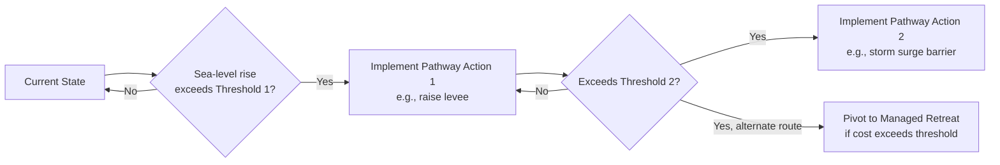

## Climate Risk and Coastal City Adaptation

### Definition and Conceptual Scope

Climate risk in the coastal urban context refers to the probability-weighted economic and physical exposure of cities to climate-driven hazards — sea-level rise, storm surge, coastal flooding, saltwater intrusion, and increased cyclone intensity. Coastal adaptation economics studies how households, firms, and governments allocate resources to reduce expected climate damages, either by resisting hazard exposure (protection), reducing sensitivity (accommodation), or withdrawing from exposure entirely (retreat).

This topic sits at the intersection of urban economics, environmental economics, and public finance, since coastal cities are simultaneously highly productive agglomeration centers (due to historical trade advantages of port locations) and disproportionately exposed to long-term, partially irreversible climate hazards.

**Key Points**

- Coastal cities account for a large and disproportionate share of global GDP and population relative to their land area, concentrating both value at risk and adaptation urgency
- Climate risk differs from classical disaster risk in being a slow-onset, partially predictable trend (sea-level rise) overlaid with acute shock risk (storm events), requiring both long-run planning and short-run emergency response frameworks
- Adaptation decisions are characterized by deep uncertainty, long time horizons, and high sunk-cost irreversibility, distinguishing them from standard risk-management problems

### The Three Canonical Adaptation Strategies

$$\text{Total Adaptation Cost} = \text{Protection Cost} + \text{Accommodation Cost} + \text{Retreat Cost} + \text{Residual Damage}$$

#### Protection

Engineering interventions that keep water out or reduce wave/surge energy: seawalls, levees, storm surge barriers, beach nourishment, and living shorelines (mangroves, oyster reefs, marshes used as "green infrastructure").

- Economically favored where land values and population density are high enough that protection cost per unit area is low relative to value protected
- Subject to significant **economies of scale** at the metropolitan level (e.g., large storm surge barriers protecting entire harbors), but this creates lock-in and path dependence once built
- **Levee effect / safe development paradox**: protection infrastructure can induce additional development behind it, since perceived risk falls, potentially increasing total value at risk if the structure is ever overtopped or fails — a well-documented moral hazard problem in floodplain and coastal economics

#### Accommodation

Modifying structures and land use to reduce damage from flooding without excluding water entirely: elevated buildings, flood-resistant construction materials, wet-proofing, permeable pavement, and floating architecture in some pilot contexts.

- Generally lower upfront capital cost than large protective infrastructure but leaves residual damage risk during actual flood events
- Often implemented through building codes and zoning rather than centralized public capital projects, distributing cost to individual property owners

#### Managed Retreat

Planned relocation of people, assets, and infrastructure away from high-risk zones, often through buyout programs, land-use rezoning, or phased withdrawal of public services and infrastructure investment in defined risk areas.

- Politically difficult due to concentrated, visible costs (displacement, loss of place attachment, property value loss) versus diffuse, long-term benefits (avoided future losses)
- Raises significant equity questions: retreat programs often proceed unevenly across income and racial groups, with lower-income and historically marginalized communities frequently facing both higher exposure and lower institutional capacity to negotiate favorable buyout terms
- [Inference] Empirical retreat programs to date (e.g., voluntary buyout schemes in various US flood-prone communities) suggest take-up rates and equity outcomes vary substantially based on program design, compensation adequacy, and the availability of comparable relocation destinations, making generalized success metrics difficult to establish

### Decision Framework: Real Options and Adaptive Pathways

Because future sea-level rise trajectories are uncertain and infrastructure has long lifespans, standard net-present-value analysis with a single forecast is often inadequate. Two complementary frameworks address this:

#### Real Options Analysis

Treats adaptation investment decisions like financial options: the value of **flexibility** (ability to delay, scale up, or abandon a strategy as new climate information arrives) is priced explicitly rather than assuming a single committed path.

$$NPV_{\text{flexible}} = NPV_{\text{static}} + \text{Value of Option to Adapt}$$

- Favors modular, staged infrastructure investments (e.g., a levee designed to be raised later) over one-time maximal builds calibrated to worst-case projections
- [Inference] The quantitative value of flexibility depends heavily on the assumed rate of future information arrival and the cost of retrofitting versus building to a higher initial specification, so option values calculated in specific case studies do not generalize precisely across different infrastructure types or locations

#### Dynamic Adaptive Policy Pathways (DAPP)

A planning methodology (developed prominently in Dutch delta management, e.g., the Thames Estuary 2100 and Dutch Delta Programme) that maps multiple possible future pathways of sequential decisions, each triggered by pre-defined monitoring thresholds ("adaptation tipping points").

- Avoids premature lock-in to a single long-term design while ensuring action is triggered before critical thresholds are breached
- Requires robust, continuous monitoring systems and credible institutional commitment to act on pre-agreed triggers — a governance requirement that is nontrivial in practice

### Economic Valuation of Coastal Climate Risk

#### Hedonic Property Value Models

Used to estimate how much housing markets already capitalize climate risk into prices:

$$P_i = \beta_0 + \beta_1 X_i + \beta_2 \text{FloodRisk}_i + \beta_3 \text{Elevation}_i + \epsilon_i$$

Where $P_i$ is property price, $X_i$ is a vector of standard hedonic characteristics (size, age, location amenities), and the coefficients on flood risk and elevation variables capture the implicit price of climate exposure.

[Inference] Empirical hedonic studies generally find a discount for flood-zone properties, but the magnitude is frequently smaller than actuarially fair pricing would imply and can fluctuate around major disaster events (rising sharply after a hurricane, then decaying within a few years) — consistent with availability-heuristic-driven risk perception rather than fully rational forward-looking pricing.

#### Value at Risk (VaR) and Expected Annual Damage

Coastal cities and insurers commonly quantify climate exposure using:

$$EAD = \sum_{i} P(\text{event}_i) \times \text{Damage}(\text{event}_i)$$

Expected Annual Damage (EAD) aggregates damage across the full probability distribution of flood/surge events (not just a single "100-year flood" scenario), providing a more complete risk metric for infrastructure investment prioritization.

#### Social Cost of Coastal Risk and Discounting Debates

Long-lived coastal infrastructure decisions are highly sensitive to the discount rate chosen, since costs are often near-term (construction) while a large share of avoided damages occur decades into the future.

- Standard market discount rates (5–7%) heavily discount long-run climate damages, favoring cheaper, less protective interventions
- Declining discount rate schedules and lower social discount rates (as used in some government climate guidance, e.g., UK Green Book approaches and US federal guidance updates) favor more front-loaded protective investment
- This is a genuinely contested normative question in public economics, not a purely technical one, since it embeds assumptions about intergenerational equity

### Institutional and Governance Dimensions

#### Coordination Problems

Coastal protection frequently exhibits **public good characteristics** at the metropolitan or regional scale (a storm surge barrier protects an entire harbor regardless of who pays), creating free-rider incentives among municipalities and property owners, and often requiring higher-level government (state/national) coordination or special-purpose regional authorities to finance and govern.

#### Insurance Market Dynamics Under Climate Change

- Rising and increasingly correlated coastal risk is straining private insurance markets, leading in several jurisdictions to insurer withdrawal from high-risk coastal zones, leaving public "insurer of last resort" programs to absorb an increasing share of exposure
- [Unverified] The long-run fiscal sustainability of public backstop insurance programs facing rising correlated climate risk is a subject of ongoing actuarial and policy debate, with outcomes dependent on future premium reform, federal/national subsidy levels, and the pace of climate change itself
- Some jurisdictions are experimenting with **risk-based repricing** (moving away from historically subsidized flat-rate premiums) to better signal risk to property markets, though this raises affordability and displacement concerns for existing lower-income coastal residents

#### Land Use Regulation as Adaptation Tool

- Coastal setback requirements, rolling easements (where development rights automatically retreat as shorelines move), and transfer of development rights programs are used to manage long-run exposure without requiring immediate physical relocation
- **Regulatory takings concerns**: aggressive retreat-oriented zoning can trigger legal challenges if property owners argue regulation has eliminated substantially all economic use of their land, creating a persistent tension between adaptation policy ambition and property rights law in many jurisdictions

### Equity and Distributional Considerations

**Key Points**

- Coastal climate risk exposure and adaptive capacity are frequently correlated with income and historical settlement patterns: lower-income coastal communities often occupy higher-exposure land (due to historical exclusion from higher-elevation areas) while having fewer resources for private adaptation (elevating homes, self-insuring, relocating)
- Public adaptation infrastructure investment decisions embed implicit distributional choices — protecting a high-value commercial district versus a lower-income residential area produces very different benefit-cost ratios under standard economic efficiency criteria, even though the equity implications diverge sharply from efficiency implications
- "Climate gentrification" is an emerging area of study: as climate risk becomes more visibly priced, some traditionally lower-value higher-elevation urban areas may see rising demand and displacement pressure on existing lower-income residents

### Financing Mechanisms for Coastal Adaptation

- **Municipal bonds and resilience bonds**: debt financing for large infrastructure with defined resilience-linked terms
- **Catastrophe bonds and parametric insurance**: risk-transfer instruments that pay out based on a defined trigger (e.g., storm wind speed or surge height) rather than assessed damage, enabling faster liquidity post-event
- **Public-private partnerships**: used for large-scale protective infrastructure where private capital shares construction/operation risk
- **Federal/national grant programs and cost-share requirements**: common in national flood risk management programs, though [Inference] cost-share requirements can disadvantage lower-capacity local governments that struggle to fund their required match, potentially skewing adaptation investment toward wealthier jurisdictions

### Illustrative International Approaches (Synthesized Patterns)

| Approach | Representative Context | Core Strategy |
| --- | --- | --- |
| Multi-layered delta defense with adaptive pathways | Netherlands (Delta Programme) | Combination of hard protection, spatial planning, and pathway-based sequential investment |
| Storm surge barrier plus land-use retreat mix | Thames Estuary, UK | Adaptive infrastructure planning with defined future decision points |
| Managed retreat/buyout programs | Various US flood-prone municipalities | Voluntary property buyouts converting land to open space/floodplain |
| Living shorelines and nature-based protection | Various tropical and subtropical coastal cities | Mangrove/wetland restoration as lower-cost, co-benefit-generating protection |

[Inference] These are illustrative patterns rather than a claim that any one approach is objectively superior; effectiveness depends on local hydrology, existing urban form, fiscal capacity, and institutional governance strength, so cross-context transferability of any single model should be treated cautiously.

### Conceptual Diagram: Coastal Adaptation Decision Space

<svg xmlns="http://www.w3.org/2000/svg" viewBox="0 0 800 460">
<text x="400" y="30" text-anchor="middle" font-size="18" font-weight="bold" fill="#1a1a1a">Coastal Adaptation Strategy Space (svg_diagram)</text>
<line x1="80" y1="400" x2="750" y2="400" stroke="#374151" stroke-width="1.5" />
<line x1="80" y1="400" x2="80" y2="60" stroke="#374151" stroke-width="1.5" />
<text x="415" y="430" text-anchor="middle" font-size="13" fill="#374151">Population Density / Land Value at Risk →</text>
<text x="40" y="230" text-anchor="middle" font-size="13" fill="#374151" transform="rotate(-90,40,230)">Sea-Level Rise Severity →</text>
<rect x="100" y="320" width="220" height="60" rx="6" fill="#dbeafe" stroke="#2563eb" />
<text x="210" y="345" text-anchor="middle" font-size="12" fill="#1e3a8a">Low density, low severity:</text>
<text x="210" y="363" text-anchor="middle" font-size="12" fill="#1e3a8a">Accommodation (elevate, code)</text>
<rect x="450" y="320" width="270" height="60" rx="6" fill="#dcfce7" stroke="#16a34a" />
<text x="585" y="345" text-anchor="middle" font-size="12" fill="#14532d">High density, low-moderate severity:</text>
<text x="585" y="363" text-anchor="middle" font-size="12" fill="#14532d">Protection (levees, barriers)</text>
<rect x="100" y="90" width="220" height="60" rx="6" fill="#fee2e2" stroke="#dc2626" />
<text x="210" y="115" text-anchor="middle" font-size="12" fill="#7f1d1d">Low density, high severity:</text>
<text x="210" y="133" text-anchor="middle" font-size="12" fill="#7f1d1d">Managed Retreat</text>
<rect x="450" y="90" width="270" height="60" rx="6" fill="#fef9c3" stroke="#ca8a04" />
<text x="585" y="112" text-anchor="middle" font-size="12" fill="#713f12">High density, high severity:</text>
<text x="585" y="130" text-anchor="middle" font-size="12" fill="#713f12">Hybrid: adaptive pathways,</text>
<text x="585" y="148" text-anchor="middle" font-size="12" fill="#713f12">staged protection + partial retreat</text>

<text x="415" y="220" text-anchor="middle" font-size="11" fill="`#6b7280`">Note: quadrant boundaries are illustrative;</text>

<text x="415" y="238" text-anchor="middle" font-size="11" fill="`#6b7280`">actual thresholds depend on local cost-benefit analysis</text>

</svg>

### Common Analytical Pitfalls

- Treating sea-level rise as a single deterministic forecast rather than a probability distribution with deep scientific and socioeconomic uncertainty, leading to poorly calibrated infrastructure sizing
- Ignoring the levee/safe-development paradox, in which protection investment inadvertently increases total future value at risk
- Applying standard short-run discount rates to multi-decade coastal infrastructure without acknowledging the normative stakes embedded in that choice
- Evaluating adaptation purely on aggregate efficiency (benefit-cost ratio) grounds without separately assessing distributional and equity outcomes across income and demographic groups
- Assuming managed retreat is purely a "failure" outcome, when in some contexts it can be the most economically and socially efficient long-run strategy compared to indefinitely escalating protection costs

**Related Topics**

- Urban resilience and disaster economics
- Hedonic pricing methods in environmental and urban economics
- Public finance of large-scale infrastructure and regional coordination
- Climate gentrification and housing market displacement
- Insurance market failures under correlated catastrophic risk
- Social discount rate debates in climate policy economics
- Nature-based infrastructure and green-gray hybrid systems
- Land use regulation, zoning, and regulatory takings law
- Real options theory applied to public infrastructure investment
- International comparative climate adaptation governance models