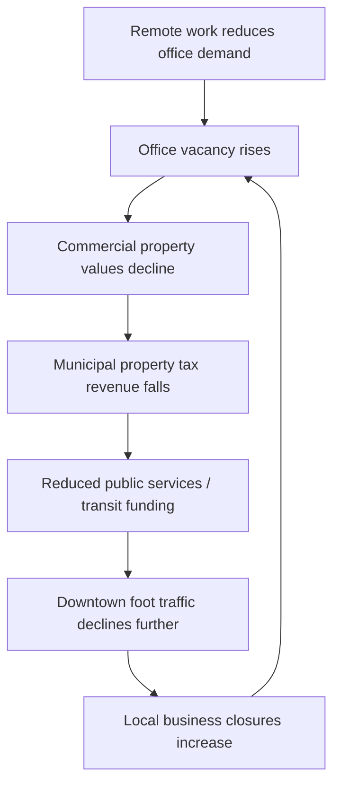

## Pandemics, Public Health, and Urban Density

### Definition and Conceptual Scope

This topic examines the bidirectional relationship between urban spatial structure — particularly population density and agglomeration — and infectious disease transmission, public health outcomes, and the economic costs and policy responses associated with epidemics and pandemics. It draws on urban economics, epidemiology, public economics, and network theory to analyze why cities are simultaneously engines of productivity growth and potential amplifiers of disease spread, and how public health policy interacts with urban economic systems.

**Key Points**

- Density is economically valuable (agglomeration economies, knowledge spillovers, thick labor markets) but can also increase contact rates relevant to disease transmission — the "urban density paradox"
- The relationship between density and transmission is not simply linear or deterministic; it is heavily mediated by infrastructure quality, housing conditions, mobility patterns, and public health capacity
- Pandemics function economically as a distinct shock type: simultaneously a demand shock, a supply shock, and a labor-market shock, with unusually strong spatial and sectoral heterogeneity in impact

### The Density-Transmission Relationship: Theoretical Nuance

#### Naive vs. Refined Density Hypotheses

The simplest model treats disease transmission as a function of physical proximity:

$$R_0 \propto \beta \times c \times D$$

Where $R_0$ is the basic reproduction number, $\beta$ is transmission probability per contact, $c$ is the contact rate, and $D$ is a density-related term. Under this naive framing, denser cities should experience uniformly higher transmission.

[Inference] Empirical evidence from COVID-19 and prior epidemics complicates this simple relationship substantially: several studies found weak or non-significant correlations between raw population density and case rates once controlling for other factors, while measures of **connectivity, overcrowding within households, and mobility** often proved more predictive than density per se. This suggests the causal channel runs through specific density-adjacent conditions rather than density as an undifferentiated aggregate measure.

#### Decomposing "Density" into Distinct Channels

- **Residential crowding**: persons per room/household, a strong predictor of within-household transmission independent of neighborhood-level density
- **Contact network structure**: dense cities often have highly efficient public transit and workplace networks that, while enabling productivity, also create high-connectivity nodes for disease spread (analogous to hub-and-spoke network vulnerability in network epidemiology)
- **Built environment ventilation and indoor air quality**: influences airborne transmission risk independent of population density metrics
- **Healthcare infrastructure density**: paradoxically, denser cities often have *better* per-capita access to hospitals and testing infrastructure, partially offsetting higher exposure risk

**Key Points**

- The correct object of analysis is often "effective density" (density weighted by contact-relevant behaviors and infrastructure) rather than raw population density
- Well-governed dense cities with strong public health infrastructure (extensively documented in comparative East Asian metropolitan responses during COVID-19) can outperform lower-density but less-prepared regions

### Economic Shock Structure of Pandemics

Unlike most natural disasters, pandemics generate simultaneous multi-channel shocks:

$$\text{Total Pandemic Impact} = \Delta(\text{Labor Supply}) + \Delta(\text{Consumer Demand}) + \Delta(\text{Supply Chains}) + \Delta(\text{Public Health Expenditure})$$

- **Labor supply shock**: illness, mortality, caregiving responsibilities, and voluntary/mandated withdrawal from in-person work reduce effective labor supply
- **Demand shock**: fear-driven and policy-driven reductions in consumption of contact-intensive services (restaurants, entertainment, in-person retail), often preceding formal lockdown policy and persisting after restrictions lift
- **Supply chain shock**: disruption to production and logistics networks, often geographically concentrated in specific manufacturing or logistics hub regions
- **Fiscal shock**: sharp increases in public health expenditure combined with reduced tax revenue from economic contraction

**Example**

During an urban pandemic event, a city's central business district sees office occupancy collapse (labor supply/demand shock via remote work substitution), downtown restaurants lose in-person customer bases permanently even after restrictions end (persistent demand shock), while suburban residential-area retail and delivery-adjacent logistics facilities see demand increases — producing a spatial reallocation of economic activity within the metropolitan area rather than uniform contraction.

### Spatial Economic Effects: Agglomeration Under Stress

#### The "Death of Distance" vs. "Death of the City" Debate

COVID-19 prompted significant debate about whether pandemic-driven remote work adoption would permanently erode the economic rationale for urban agglomeration:

- **Death-of-cities view**: if knowledge work can be performed remotely, the traditional agglomeration benefits (face-to-face knowledge spillovers, thick labor markets) diminish, favoring dispersion to lower-cost suburban and exurban locations
- **Agglomeration-persistence view**: face-to-face interaction retains unique value for innovation, mentorship, and tacit knowledge transfer that video-mediated communication cannot fully replicate, implying core urban cores retain long-run advantages even with partial remote work adoption

[Inference] Post-pandemic evidence as of the mid-2020s suggests a hybrid outcome rather than either extreme: many cities have retained core economic functions while experiencing meaningful and possibly durable shifts toward hybrid work arrangements, commercial real estate vacancy increases in central business districts, and some population dispersion to secondary cities and suburbs — though the long-run permanence of these shifts remains an active empirical question subject to revision as more post-pandemic data accumulates.

#### Commercial Real Estate and the "Urban Doom Loop" Hypothesis

A specific fiscal-economic concern raised prominently post-COVID: sustained office vacancy reduces commercial property tax revenue and downtown foot traffic, which reduces municipal fiscal capacity and downtown retail viability, potentially triggering further business closure and property value decline in a self-reinforcing cycle.

[Speculation] Whether this feedback loop materializes at a scale that meaningfully threatens municipal fiscal solvency in major cities remains contested among urban economists, with outcomes likely to vary significantly by city depending on economic diversification, existing fiscal reserves, and the pace of downtown repurposing (e.g., office-to-residential conversion).

### Public Health as Urban Infrastructure: An Economic Framing

#### Public Health Interventions as Public Goods

Disease surveillance, vaccination campaigns, and outbreak response infrastructure exhibit classic public good characteristics — non-excludable and non-rival benefits (herd immunity protects even non-vaccinated individuals) — creating a standard case for public provision and funding, since private markets systematically underprovide these goods due to free-riding.

#### Externalities and Non-Pharmaceutical Interventions (NPIs)

- Individual decisions to reduce contact (mask-wearing, voluntary distancing) generate **positive externalities** for others by reducing transmission risk, implying private incentives alone will under-provide these behaviors relative to the social optimum
- Mandated NPIs (lockdowns, capacity restrictions) function as a policy correction for this externality, but impose direct economic costs (foregone output, employment) that must be weighed against averted health costs — a genuinely contested cost-benefit calculation subject to significant modeling uncertainty and differing value-of-statistical-life assumptions across studies
- [Unverified] The precise optimal stringency and timing of NPIs is not settled in the economics literature; ex-post analyses of COVID-19 policy responses show a wide range of estimated effects depending on model specification, time period, and how substitution effects (voluntary behavior change absent mandates) are accounted for

#### Health Infrastructure Distribution and Urban Equity

- Hospital and healthcare facility access is frequently spatially uneven within cities, correlating with historical patterns of investment and segregation, producing "health care deserts" in specific neighborhoods
- Pandemic mortality and morbidity outcomes have been repeatedly documented to correlate with occupational exposure (essential/frontline worker status), housing crowding, and pre-existing health disparities — meaning pandemic economic and health impacts are rarely distributed uniformly across a city's population even where aggregate density is comparable

### Urban Density Policy Responses and Trade-offs

**Key Points**

- **Ventilation and building code reform**: post-pandemic building standard updates in some jurisdictions increasingly address indoor air quality as a public health-relevant urban infrastructure investment
- **Public space and transit redesign**: temporary and sometimes permanent reallocation of street space (outdoor dining, expanded sidewalks, bike lanes) emerged as low-cost adaptations enabling continued economic activity under distancing constraints
- **Decentralized/polycentric planning debate**: some pandemic-response discourse renewed interest in "15-minute city" and polycentric urban design concepts, aiming to reduce necessary long-distance commuting and concentrate essential services locally — though [Inference] evidence on whether such designs measurably reduce pandemic transmission risk (as opposed to serving other sustainability and quality-of-life goals) remains limited and is not the primary evidentiary basis typically cited for these planning approaches
- Density regulation trade-offs are asymmetric: permanently reducing density to manage rare pandemic risk sacrifices the continuous, well-documented economic benefits of agglomeration, making blanket density reduction a poor general policy response compared to targeted infrastructure and healthcare capacity investment

### Modeling Approaches in Pandemic Urban Economics

#### Epidemiological-Economic (Epi-Econ) Models

Integrate compartmental epidemiological models (SIR/SEIR frameworks) with economic behavior, allowing feedback between infection risk and economic activity:

$$\frac{dS}{dt} = -\beta(E_t) S I, \quad \frac{dI}{dt} = \beta(E_t) S I - \gamma I$$

Where $\beta(E_t)$ is transmission rate made endogenous to economic activity level $E_t$ (capturing the idea that economic activity itself drives contact rates, which drive transmission, which then feeds back into economic behavior via fear or policy response).

- These models allow analysis of the "voluntary social distancing" channel — individuals reduce economic activity in response to perceived infection risk even absent formal mandates, which standard epidemiological models alone do not capture
- [Inference] Calibration of behavioral response parameters in these models is empirically challenging and highly context-dependent, meaning model outputs are more useful for qualitative policy insight (identifying relevant channels and trade-offs) than precise quantitative forecasting

#### Spatial Network Epidemiology

Uses urban mobility network data (transit ridership, commuting patterns, mobile phone location data) to model disease spread through actual urban connectivity structure rather than assuming uniform mixing within a city — enabling more geographically targeted intervention design (e.g., identifying specific high-connectivity nodes such as major transit hubs for targeted intervention rather than city-wide measures).

### Comparative Institutional Patterns (Synthesized, Illustrative)

| Response Pattern | Illustrative Context Type | Key Economic Trade-off |
| --- | --- | --- |
| Extensive testing/tracing infrastructure with limited lockdown | Several East Asian metropolitan responses | Higher upfront public health infrastructure cost; lower aggregate economic contraction |
| Broad lockdown with fiscal transfer support | Various Western national/urban responses | Larger short-run GDP contraction; direct income support cushioning household impact |
| Limited formal restriction, reliance on voluntary behavior change | Some lower-capacity governance contexts | Lower measured formal economic contraction; potentially higher uncontrolled health costs and informal economic disruption |

[Inference] These patterns are illustrative generalizations from a highly heterogeneous global policy response; actual outcomes within each pattern varied substantially by specific city and time period, and drawing firm causal conclusions about which approach was unconditionally superior requires careful counterfactual analysis that remains an active area of ongoing economic research.

### Conceptual Diagram: Pandemic Shock Transmission Through Urban Economic System

<svg viewBox="0 0 800 440" xmlns="http://www.w3.org/2000/svg">
<text x="400" y="30" text-anchor="middle" font-size="18" font-weight="bold" fill="#1a1a1a">Pandemic Shock Propagation in Urban Economy (svg_diagram)</text>
<rect x="320" y="55" width="160" height="55" rx="8" fill="#fee2e2" stroke="#dc2626" stroke-width="1.5"/>
<text x="400" y="88" text-anchor="middle" font-size="13" fill="#7f1d1d">Pandemic Onset</text>
<rect x="60" y="150" width="160" height="55" rx="8" fill="#dbeafe" stroke="#2563eb" stroke-width="1.5"/>
<text x="140" y="183" text-anchor="middle" font-size="12" fill="#1e3a8a">Labor Supply Shock</text>
<rect x="320" y="150" width="160" height="55" rx="8" fill="#fef9c3" stroke="#ca8a04" stroke-width="1.5"/>
<text x="400" y="183" text-anchor="middle" font-size="12" fill="#713f12">Demand Shock</text>
<rect x="580" y="150" width="160" height="55" rx="8" fill="#dcfce7" stroke="#16a34a" stroke-width="1.5"/>
<text x="660" y="183" text-anchor="middle" font-size="12" fill="#14532d">Supply Chain Shock</text>
<rect x="60" y="260" width="680" height="55" rx="8" fill="#ede9fe" stroke="#7c3aed" stroke-width="1.5"/>
<text x="400" y="293" text-anchor="middle" font-size="13" fill="#4c1d95">Sectoral & Spatial Reallocation (CBD decline, suburban shift, sector-specific closures)</text>
<rect x="150" y="360" width="220" height="55" rx="8" fill="#f3f4f6" stroke="#6b7280" stroke-width="1.5"/>
<text x="260" y="393" text-anchor="middle" font-size="12" fill="#374151">Fiscal Stress</text>
<rect x="430" y="360" width="220" height="55" rx="8" fill="#f3f4f6" stroke="#6b7280" stroke-width="1.5"/>
<text x="540" y="393" text-anchor="middle" font-size="12" fill="#374151">Distributional/Equity Effects</text>
<line x1="400" y1="110" x2="140" y2="150" stroke="#374151" stroke-width="1.5" marker-end="url(#arrow2)"/>
<line x1="400" y1="110" x2="400" y2="150" stroke="#374151" stroke-width="1.5" marker-end="url(#arrow2)"/>
<line x1="400" y1="110" x2="660" y2="150" stroke="#374151" stroke-width="1.5" marker-end="url(#arrow2)"/>
<line x1="140" y1="205" x2="300" y2="260" stroke="#374151" stroke-width="1.5" marker-end="url(#arrow2)"/>
<line x1="400" y1="205" x2="400" y2="260" stroke="#374151" stroke-width="1.5" marker-end="url(#arrow2)"/>
<line x1="660" y1="205" x2="500" y2="260" stroke="#374151" stroke-width="1.5" marker-end="url(#arrow2)"/>
<line x1="300" y1="315" x2="260" y2="360" stroke="#374151" stroke-width="1.5" marker-end="url(#arrow2)"/>
<line x1="500" y1="315" x2="540" y2="360" stroke="#374151" stroke-width="1.5" marker-end="url(#arrow2)"/>
<defs>
<marker id="arrow2" markerWidth="10" markerHeight="10" refX="8" refY="3" orient="auto" markerUnits="strokeWidth">
<path d="M0,0 L0,6 L9,3 z" fill="#374151"/>
</marker>
</defs>
</svg>

### Common Analytical Pitfalls

- Treating "density" as a single undifferentiated variable rather than decomposing it into crowding, connectivity, and infrastructure-quality channels with distinct causal roles
- Drawing simple cross-city correlations between density and pandemic outcomes without adequately controlling for confounding factors like healthcare capacity, governance quality, and demographic composition
- Assuming pandemic-driven behavioral and locational shifts (remote work, urban outmigration) are necessarily permanent, when [Inference] longer-run post-pandemic data has shown partial reversion in several dimensions, indicating some pandemic-era trends were more transitory than early projections suggested
- Ignoring within-city distributional heterogeneity by relying solely on city-average economic and health impact statistics
- Applying a single optimal-NPI-stringency conclusion across all urban contexts, when optimal policy response is highly sensitive to local healthcare capacity, population age structure, and economic structure

**Related Topics**

- Urban resilience and disaster economics
- Agglomeration economies and knowledge spillover theory
- Remote work economics and spatial labor market restructuring
- Municipal public finance and property tax base stability
- Health economics and public goods provision theory
- Network epidemiology and spatial contact modeling
- Housing crowding and residential density policy
- Urban planning concepts: polycentric and "15-minute city" design
- Commercial real estate conversion and adaptive reuse economics
- Externality theory and non-pharmaceutical intervention cost-benefit analysis