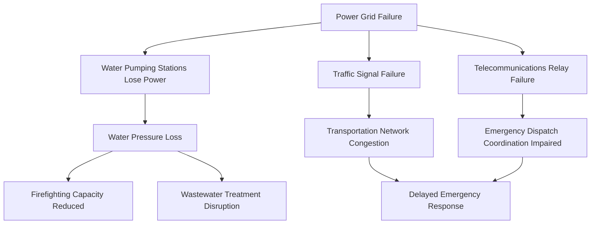

## Infrastructure Vulnerability and Recovery

### Definition and Conceptual Scope

Infrastructure vulnerability refers to the susceptibility of urban physical and network systems — power, water, transportation, communications, wastewater — to disruption from hazards, aging, or interdependency failures, and the economic consequences of that susceptibility. Infrastructure recovery economics studies the process, sequencing, financing, and efficiency of restoring these systems to functional capacity after disruption, along with the economic multiplier effects of infrastructure downtime on the broader urban economy.

This topic sits within urban and regional economics because infrastructure networks are the physical substrate enabling agglomeration economies; their failure directly translates into productivity loss, and the speed and pattern of their recovery substantially determines a city's broader economic resilience trajectory.

**Key Points**

- Infrastructure systems are typically **networked and interdependent**, meaning failure in one system (e.g., power) can cascade into failure of dependent systems (water pumping, telecommunications, traffic signals), producing effects far exceeding the direct damage to the initially failed component
- Infrastructure has long asset lifespans (decades) but is frequently underinvested in maintenance relative to optimal lifecycle cost, a pattern often termed the **infrastructure investment gap**
- Recovery is not merely physical restoration; it involves sequencing decisions with significant economic efficiency implications, since restoring some infrastructure components before others can differentially affect total economic recovery speed

### Economic Characteristics of Infrastructure Systems

#### Network Externalities and Public Good Properties

Most urban infrastructure exhibits characteristics that justify public involvement even where privately operated:

- **Natural monopoly characteristics**: high fixed costs and low marginal costs (e.g., water pipe networks, electricity grids) make duplicate competing networks economically inefficient, historically justifying regulated monopoly or public provision
- **Network externalities**: the value of infrastructure connection increases with the number of other connected users and nodes (a transit network's value rises with route coverage and ridership)
- **Interdependency (system-of-systems) structure**: modern urban infrastructure is not a set of isolated systems but a tightly coupled network-of-networks, where electrical substations power water treatment plants, which supply cooling water to power generation, which powers telecommunications relay stations, and so on

#### Interdependency and Cascading Failure

[Inference] The severity of cascading failure is highly sensitive to redundancy design (backup generators, distributed water storage, network reroute capacity) built into each system, meaning two cities facing identical initiating hazards can experience vastly different cascading failure severity based on prior infrastructure investment choices — this is a key policy-relevant insight rather than an inevitable feature of interdependency itself.

### Classifying Infrastructure Vulnerability

#### Physical Vulnerability

- **Age and deterioration**: infrastructure built decades ago (mid-20th century in many developed-economy cities) is approaching or has exceeded original design life, with deferred maintenance compounding failure risk
- **Design-standard obsolescence**: infrastructure designed to historical climate and load parameters may be inadequately specified for current or projected future stress levels (e.g., stormwater systems designed for historical rainfall intensities inadequate for current precipitation patterns)
- **Single points of failure**: specific nodes (a single bridge, a single substation) whose failure disproportionately disrupts network function due to lack of redundant routing

#### Economic Vulnerability

- **Criticality**: some infrastructure components carry disproportionate economic weight relative to their replacement cost (a single bridge connecting a port to inland markets may account for economic activity vastly exceeding the bridge's own construction value)
- **Redundancy gaps**: economic vulnerability rises sharply where no substitute routing or backup capacity exists, since marginal disruption cost becomes non-linear (small physical damage can produce large output loss if it is the only connection)
- **Ownership and financing fragmentation**: infrastructure systems are frequently owned and financed by multiple, poorly coordinated public and private entities, complicating both maintenance investment and coordinated recovery prioritization

### Measuring and Modeling Infrastructure Vulnerability

#### Network Analysis Metrics

Graph-theoretic measures are commonly used to identify critical infrastructure nodes:

$$C_B(v) = \sum_{s \neq v \neq t} \frac{\sigma_{st}(v)}{\sigma_{st}}$$

Where $C_B(v)$ is the **betweenness centrality** of node $v$ — the share of shortest paths between all other node pairs $s,t$ that pass through $v$. High-betweenness nodes (e.g., a bridge or transit hub serving as the primary route between two large sub-networks) represent critical vulnerability points whose failure disproportionately disrupts overall network connectivity.

Related standard measures include **degree centrality** (number of direct connections a node has) and **network robustness indices** measuring how quickly overall connectivity degrades as nodes are sequentially removed (simulating cascading or targeted failure).

#### Fragility Curves

Engineering-economic models linking hazard intensity to probability of infrastructure component failure:

$$P(\text{failure} \mid \text{hazard intensity} = x) = \Phi\left(\frac{\ln(x/\theta)}{\beta}\right)$$

Where $\Phi$ is the standard normal cumulative distribution function, $\theta$ is the median hazard intensity causing failure, and $\beta$ is a dispersion parameter reflecting uncertainty in the specific failure threshold. These curves, standard in structural and infrastructure engineering, are combined with economic loss functions to estimate expected infrastructure damage and downtime under different hazard scenarios.

#### Restoration Curves and Recovery Modeling

Recovery economics models typically represent infrastructure functionality restoration over time using S-shaped or stepped restoration curves:

$$Q(t) = Q_0 + (Q_{\max} - Q_0)\left(1 - e^{-\lambda t}\right)$$

Where $Q(t)$ is functional capacity at time $t$, $Q_0$ is immediate post-disaster capacity, $Q_{\max}$ is full restored capacity, and $\lambda$ is a recovery-rate parameter reflecting resource availability, repair complexity, and prioritization decisions. [Inference] The recovery-rate parameter is not a fixed physical constant but is substantially influenced by policy and financing decisions (e.g., emergency funding speed, contractor mobilization, permitting expediency), meaning modeled recovery timelines are scenario-dependent projections rather than fixed predictions.

### Recovery Sequencing and Prioritization Economics

#### The Restoration Prioritization Problem

Given limited repair resources (crews, materials, funding) immediately after a disruptive event, recovery planners face an optimization problem:

$$\max \sum_{i} w_i \cdot Q_i(t) \quad \text{subject to resource constraints}$$

Where $w_i$ represents the economic or social importance weight of infrastructure component $i$. In practice, prioritization typically follows a hierarchy:

1. **Life-safety-critical systems**: hospitals, emergency services access routes, water for firefighting
2. **High-centrality network nodes**: components whose restoration reconnects the largest share of dependent network function (restoring a critical bridge or substation often unlocks recovery of multiple dependent systems simultaneously)
3. **High economic-multiplier components**: infrastructure whose restoration enables the largest cascading economic activity resumption (e.g., a port or major freight corridor)
4. **General residential and lower-criticality commercial infrastructure**: typically restored after higher-priority systems, though this creates well-documented equity tensions when lower-priority designation correlates with lower-income areas

**Key Points**

- Restoration prioritization based purely on economic-multiplier or centrality criteria can systematically disadvantage lower-income or politically less-influential neighborhoods if those areas are not major nodes in commercial network structure, even though residents there may have equal or greater need
- Post-disaster infrastructure recovery governance increasingly incorporates explicit equity criteria alongside efficiency criteria, reflecting recognition that pure efficiency-based prioritization can reproduce or worsen existing spatial inequality

### Financing Infrastructure Resilience and Recovery

#### Pre-Disaster Resilience Investment

- **Asset hardening**: seismic retrofitting, flood-proofing substations, undergrounding vulnerable above-ground power lines
- **Redundancy investment**: building backup capacity and alternative routing paths, which carries an "insurance-like" economic character — costly under normal conditions but valuable in reducing expected disruption costs
- **Benefit-cost analysis challenges**: resilience investment benefits are probabilistic and realized only in the event of a disruption that may or may not occur within the asset's service life, making these investments politically harder to justify than infrastructure with immediately visible service benefits — a structural bias toward underinvestment in resilience relative to new capacity expansion

#### Post-Disaster Recovery Financing

- **Emergency federal/national transfers**: often the primary funding source for major infrastructure recovery, particularly for smaller municipalities lacking independent fiscal capacity for large-scale reconstruction
- **Insurance and self-insurance pools**: public infrastructure is frequently self-insured or covered through specialized public infrastructure insurance pools rather than conventional private insurance markets
- **Build-back-better financing provisions**: some disaster recovery funding frameworks explicitly permit or require using recovery funds to rebuild to higher resilience standards rather than simple like-for-like replacement, recognizing that reconstruction presents a cost-effective opportunity to reduce future vulnerability (since incremental cost of building more resilient infrastructure during already-planned reconstruction is typically lower than retrofitting later)
- [Inference] The extent to which "build back better" financing provisions are actually utilized in practice varies considerably across jurisdictions and disaster events, depending on funding rules, technical capacity of local recovery agencies, and time pressure to restore basic service quickly rather than optimize for long-run resilience

### Infrastructure Recovery and Regional Economic Multipliers

The speed of infrastructure recovery has multiplier effects on broader economic recovery, since infrastructure functions as an input to virtually all other economic activity:

$$\Delta \text{GDP}_{\text{regional}} = \sum_{i} \alpha_i \cdot \Delta Q_i(t)$$

Where $\alpha_i$ represents the output elasticity of regional GDP with respect to functional capacity of infrastructure system $i$. Empirical estimates of these elasticities vary substantially by infrastructure type and regional economic structure — [Unverified] transportation and power infrastructure elasticities tend to be estimated as relatively high in the literature given their role as near-universal inputs, but precise magnitudes are highly context- and methodology-dependent and should not be treated as universal constants transferable across all regional contexts without local calibration.

### Aging Infrastructure and the Maintenance Deficit

A distinct but related vulnerability channel involves gradual infrastructure deterioration absent any acute disaster event:

- **Deferred maintenance dynamics**: infrastructure maintenance is often politically and fiscally deprioritized relative to new capital projects (new infrastructure is more visible and politically rewarding than maintaining existing assets), producing a structural bias toward maintenance underinvestment across many public finance systems
- **Lifecycle cost economics**: standard infrastructure asset management theory demonstrates that deferred maintenance typically increases total lifecycle cost (a stitch-in-time effect, where earlier lower-cost interventions prevent later higher-cost failures), yet short political and budget cycles frequently favor deferring visible maintenance costs
- **Infrastructure investment gap estimates**: numerous national engineering societies and infrastructure assessment bodies periodically publish estimates of the gap between current infrastructure investment and estimated needed investment to maintain infrastructure in a state of good repair; [Inference] the precision of these gap estimates depends heavily on methodology and assumed service standards, so headline gap figures should be treated as directional indicators of underinvestment rather than precise budgetary requirements

### Illustrative Institutional Approaches to Resilient Infrastructure Governance

| Approach | Core Mechanism | Primary Trade-off |
| --- | --- | --- |
| Asset management systems with condition-based maintenance scheduling | Data-driven prioritization of maintenance spending based on real-time asset condition monitoring | Requires significant upfront data/sensor investment and institutional capacity |
| Resilience bonds and infrastructure-specific catastrophe risk transfer | Financial market risk transfer tied to defined infrastructure performance triggers | Requires sophisticated financial market access, often limited to larger/wealthier jurisdictions |
| Regional infrastructure authorities | Consolidated governance across fragmented municipal boundaries for infrastructure planning and recovery coordination | Requires overcoming jurisdictional coordination and political authority-sharing challenges |
| Distributed/decentralized infrastructure design (microgrids, decentralized water treatment) | Reduces single-point-of-failure risk through redundant distributed capacity | Higher per-unit capital cost than centralized systems in normal operating conditions |

### Conceptual Diagram: Infrastructure Resilience Investment Trade-off

<svg xmlns="http://www.w3.org/2000/svg" viewBox="0 0 800 420">
<text x="400" y="30" text-anchor="middle" font-size="18" font-weight="bold" fill="#1a1a1a">Infrastructure Resilience Investment Trade-off (svg_diagram)</text>
<line x1="90" y1="360" x2="740" y2="360" stroke="#374151" stroke-width="1.5" />
<line x1="90" y1="360" x2="90" y2="60" stroke="#374151" stroke-width="1.5" />
<text x="415" y="390" text-anchor="middle" font-size="13" fill="#374151">Resilience Investment Level →</text>
<text x="45" y="210" text-anchor="middle" font-size="13" fill="#374151" transform="rotate(-90,45,210)">Cost / Expected Loss →</text>
<path d="M 90 340 Q 400 320 720 90" stroke="#dc2626" stroke-width="2.5" fill="none" />
<text x="620" y="120" font-size="12" fill="#7f1d1d">Upfront investment cost</text>
<path d="M 90 90 Q 400 200 720 340" stroke="#2563eb" stroke-width="2.5" fill="none" />
<text x="150" y="105" font-size="12" fill="#1e3a8a">Expected disruption loss</text>
<path d="M 90 250 Q 400 130 720 250" stroke="#16a34a" stroke-width="2.5" stroke-dasharray="6,4" fill="none" />
<text x="330" y="145" font-size="12" fill="#14532d" font-weight="bold">Total expected cost (sum)</text>
<circle cx="400" cy="180" r="6" fill="#16a34a" />
<text x="400" y="165" text-anchor="middle" font-size="11" fill="#14532d" font-weight="bold">Optimal investment point</text>

<text x="415" y="230" text-anchor="middle" font-size="11" fill="`#6b7280`">Curve shapes vary by infrastructure type and hazard profile;</text>

<text x="415" y="248" text-anchor="middle" font-size="11" fill="`#6b7280`">optimal point shifts with local risk and discount rate assumptions</text>

</svg>

### Common Analytical Pitfalls

- Analyzing infrastructure systems in isolation without accounting for cross-system interdependency, substantially underestimating cascading failure risk
- Treating restoration timelines as fixed engineering parameters rather than outcomes substantially influenced by financing speed, permitting processes, and political prioritization decisions
- Prioritizing recovery purely by economic-multiplier or network-centrality criteria without separately evaluating equity implications for lower-priority-ranked but high-need communities
- Assuming deferred maintenance is a cost-neutral delay rather than accounting for the well-established lifecycle cost increase associated with deferred intervention
- Treating headline infrastructure investment gap figures as precise budgetary facts rather than methodology-dependent directional estimates

**Related Topics**

- Urban resilience and disaster economics
- Network theory and graph-based vulnerability analysis
- Municipal public finance and capital budgeting
- Public-private partnerships in infrastructure delivery
- Climate risk and coastal city adaptation
- Asset management and lifecycle cost analysis
- Regional economic multiplier estimation methods
- Transportation network economics and freight corridor criticality
- Water and energy utility regulation economics
- Equity considerations in public infrastructure investment prioritization