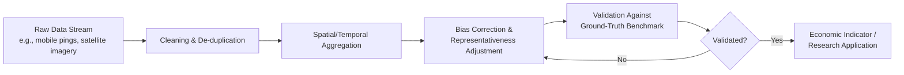

## Real-Time Big Data Applications in Urban Measurement

### Definition and Conceptual Scope

Real-time big data applications in urban measurement refer to the collection, processing, and analytical use of high-frequency, granular data streams — mobile device location signals, sensor networks, satellite imagery, transit smart-card data, social media activity, utility meter data — to measure urban economic activity, mobility, and welfare conditions at spatial and temporal resolutions unattainable through traditional survey-based or administrative data sources. Within urban and regional economics, this constitutes a methodological shift enabling near-real-time observation of phenomena traditionally measured only with substantial lag (GDP, employment, migration) or at low spatial resolution (census-tract or larger).

**Key Points**

- Traditional urban economic data (censuses, labor force surveys, GDP accounts) typically has lags of months to years and spatial resolution limited to administrative boundaries; big data sources can provide daily or even hourly granularity at the level of individual city blocks
- This shift enables new empirical strategies in urban economics: measuring agglomeration effects, testing spatial equilibrium models, and evaluating policy interventions using quasi-experimental designs with far larger effective sample sizes and finer geographic resolution
- The core methodological trade-off is between traditional data's **representativeness and validated measurement** versus big data's **granularity and timeliness**, with significant work required to translate proxy signals into economically meaningful measures

### Major Categories of Urban Big Data Sources

#### Mobile Location and Mobility Data

- **GPS/cellular location data**: aggregated, often anonymized mobile device location pings used to construct origin-destination mobility matrices, dwell-time estimates at points of interest, and commuting pattern reconstruction
- **Mobility indices**: composite measures (e.g., aggregate movement relative to a historical baseline) widely used during the COVID-19 pandemic to track real-time behavioral response to policy and risk, illustrating the value of these data streams for rapid economic and public health monitoring during acute events
- [Inference] Mobile location data samples are generally not random draws from the population — coverage depends on device ownership, app permissions, and carrier/vendor market share — meaning representativeness must be assessed and, where possible, corrected for demographic and geographic sampling bias before drawing population-level economic conclusions

#### Satellite and Remote Sensing Data

- **Night-time lights (NTL) data**: satellite-measured light intensity, widely used as a proxy for economic activity, particularly valuable in contexts with weak or delayed official statistics (some developing-economy and sub-national contexts)
- **Land use and land cover classification**: satellite imagery processed via machine learning classification to track urban expansion, informal settlement growth, and land use change at high temporal frequency
- **Building footprint and construction activity detection**: high-resolution imagery combined with computer vision techniques to estimate construction activity and urban development intensity as a leading indicator of local economic investment

$$\hat{GDP}_{r,t} = \alpha + \beta \cdot \ln(\text{NTL}_{r,t}) + \gamma X_{r,t} + \epsilon_{r,t}$$

Where regional GDP $\hat{GDP}_{r,t}$ is estimated as a function of log night-light intensity $\text{NTL}_{r,t}$ and control variables $X_{r,t}$. [Inference] The relationship between night-light intensity and economic output is not uniform across contexts — the light-to-output elasticity varies by sector composition, urbanization level, and lighting technology adoption, so cross-context transferability of a single calibrated elasticity is limited without local validation.

#### Transit and Transportation Sensor Data

- **Smart-card/farecard transaction data**: provides granular, high-frequency ridership data by station and time, enabling detailed study of commuting pattern shifts, labor market geography, and transit-oriented development effects
- **Traffic sensor and probe vehicle data**: real-time congestion measurement used both operationally (traffic management) and analytically (measuring economic activity via freight and commercial vehicle movement patterns)
- **Ride-hailing and micromobility platform data**: where available (often through research partnerships or regulatory reporting requirements), offers granular trip-level data useful for studying urban mobility substitution patterns and last-mile transportation economics

#### Utility and Sensor Network Data

- **Smart meter data** (electricity, water): high-frequency consumption data enabling granular measurement of commercial and residential activity levels, occupancy patterns, and — during disruptions — real-time damage and outage assessment
- **Environmental sensor networks**: air quality, noise, and temperature sensor networks increasingly deployed at fine spatial resolution, enabling environmental justice research and hedonic valuation studies using far more granular exposure measures than previously available

#### Social Media and Web-Scraped Data

- **Geotagged social media activity**: used as a proxy for foot traffic, event attendance, and neighborhood vibrancy, though [Unverified] subject to significant demographic skew in platform usage that limits generalizability without correction
- **Online job postings and real estate listings**: scraped at scale to construct real-time labor demand and housing market indices at far finer geographic and occupational/property-type resolution than traditional survey-based indices, though requiring careful deduplication and representativeness adjustment methodology

### Methodological Framework for Urban Big Data Analysis

#### From Raw Signal to Economic Measure: The Validation Pipeline

- **Ground-truth validation** is a critical and often under-resourced step: big data proxies should be validated against traditional survey or administrative benchmarks wherever feasible before being used as standalone economic indicators, since proxy-benchmark relationships can shift over time as underlying platform usage or sensor coverage changes
- **Temporal consistency checks**: sensor and platform-based data sources are subject to changing measurement methodology over time (e.g., a mobility platform changing its underlying algorithm or user base), requiring ongoing revalidation rather than treating early calibration as permanently valid

#### Common Statistical and Machine Learning Techniques

- **Spatial interpolation and kriging**: used to convert point-level sensor data (e.g., specific air quality monitor locations) into continuous spatial surfaces for area-level economic analysis
- **Machine learning classification** (convolutional neural networks for imagery, gradient boosting for tabular sensor data): used extensively for automated feature extraction from satellite imagery (building detection, land use classification) and for combining multiple noisy proxy signals into composite indices
- **Nowcasting models**: statistical models combining high-frequency proxy data with lower-frequency official statistics to produce real-time or near-real-time estimates of lagging official indicators (e.g., nowcasting quarterly regional GDP using weekly mobility and transaction data), typically using mixed-frequency time series methods such as MIDAS (Mixed Data Sampling) regression

$$Y_t^{Q} = \beta_0 + \sum_{k=0}^{K} \beta_k B(k;\theta) X_{t-k}^{M} + \epsilon_t$$

Where $Y_t^Q$ is the quarterly target variable (e.g., regional GDP), $X_{t-k}^M$ is higher-frequency (monthly/weekly) proxy data, and $B(k;\theta)$ is a parameterized weighting function (as in standard MIDAS regression specifications) determining how recent high-frequency observations are weighted in predicting the lower-frequency target.

### Applications in Urban Economic Research and Policy

#### Measuring Agglomeration and Spatial Spillovers

Granular mobility and transaction data enable direct measurement of face-to-face interaction patterns and spatial spillover effects that were previously inferred indirectly through proximity measures alone, allowing more direct tests of agglomeration economy theories (e.g., directly observing which firms' employees interact spatially rather than assuming interaction based on geographic distance alone).

#### Real-Time Policy Evaluation

- **Natural experiment identification**: high-frequency data enables tighter event-study designs around policy changes (e.g., measuring immediate mobility and economic activity response to a transit fare change or zoning reform using daily data rather than waiting for annual survey results)
- **Disaster and crisis monitoring**: as referenced in disaster and pandemic economics contexts, real-time mobility, night-light, and utility data provide near-immediate damage assessment and recovery tracking, substantially compressing the traditional multi-month lag in post-disaster economic loss estimation

#### Urban Informality and Data-Scarce Contexts

[Inference] In contexts with weak administrative data infrastructure (common in many rapidly urbanizing developing-economy cities), satellite-based and mobile-data-based measurement can partially substitute for missing formal statistics, though the accuracy of such substitution depends heavily on local calibration efforts and generally cannot fully replace the analytical value of well-designed household and firm surveys, particularly for measuring informal-sector activity that leaves limited digital or observable physical footprint.

### Data Governance, Privacy, and Ethical Considerations

**Key Points**

- **Privacy and re-identification risk**: aggregated and anonymized mobility data can, under certain conditions, be re-identified to individual-level movement patterns, raising substantial privacy concerns that have prompted regulatory scrutiny and differential privacy technique adoption in some data-sharing frameworks
- **Data access asymmetry**: much high-value urban big data (ride-hailing platform data, mobile carrier data, social media data) is proprietary and access is frequently restricted to specific research partnerships or purchased data products, creating unequal research capacity between well-resourced institutions and others, and raising reproducibility concerns when underlying data cannot be independently accessed for replication
- **Representativeness and equity concerns**: digital data sources systematically underrepresent populations with lower smartphone/internet access, potentially biasing urban measurement and, if used uncritically for resource allocation decisions, risking further disadvantaging already underserved populations
- [Unverified] The long-run regulatory environment governing commercial data access for urban research and policy purposes continues to evolve across jurisdictions, and current data access arrangements should not be assumed stable for long-term research infrastructure planning

### Standard Technical Architecture for Urban Big Data Pipelines

For applied urban data science work, a standard architecture pattern typically includes:

1. **Ingestion layer**: streaming data ingestion (e.g., message queue systems handling high-throughput sensor/mobile data feeds) or batch ingestion for periodic sources (satellite imagery passes, monthly administrative extracts)
2. **Storage layer**: typically a combination of a data lake for raw/unstructured data (imagery, raw location pings) and a structured data warehouse for processed, aggregated indicators
3. **Processing layer**: distributed computing frameworks for large-scale spatial and temporal aggregation, often combined with specialized geospatial processing libraries and, for imagery, GPU-accelerated machine learning inference pipelines
4. **Validation and modeling layer**: statistical validation against benchmarks, nowcasting model estimation, and bias-correction routines
5. **Presentation/application layer**: dashboards, APIs, or integration into policy decision-support tools for end-user consumption (city agencies, researchers, the public)

[Inference] Specific technology choices (particular cloud platforms, processing frameworks, database systems) within this architecture vary considerably by institutional context, budget, and existing technical capacity, so this represents a generalized conceptual pattern rather than a single prescribed technology stack.

### Conceptual Diagram: Urban Big Data Measurement Ecosystem

<svg xmlns="http://www.w3.org/2000/svg" viewBox="0 0 800 460">
<text x="400" y="30" text-anchor="middle" font-size="18" font-weight="bold" fill="#1a1a1a">Urban Big Data Measurement Ecosystem (svg_diagram)</text>
<rect x="40" y="65" width="150" height="55" rx="8" fill="#dbeafe" stroke="#2563eb" stroke-width="1.5" />
<text x="115" y="98" text-anchor="middle" font-size="12" fill="#1e3a8a">Mobile Location Data</text>
<rect x="220" y="65" width="150" height="55" rx="8" fill="#dcfce7" stroke="#16a34a" stroke-width="1.5" />
<text x="295" y="98" text-anchor="middle" font-size="12" fill="#14532d">Satellite Imagery</text>
<rect x="400" y="65" width="150" height="55" rx="8" fill="#fef9c3" stroke="#ca8a04" stroke-width="1.5" />
<text x="475" y="98" text-anchor="middle" font-size="12" fill="#713f12">Transit/Sensor Data</text>
<rect x="580" y="65" width="180" height="55" rx="8" fill="#fee2e2" stroke="#dc2626" stroke-width="1.5" />
<text x="670" y="98" text-anchor="middle" font-size="12" fill="#7f1d1d">Social Media/Web Data</text>
<rect x="220" y="180" width="360" height="55" rx="8" fill="#ede9fe" stroke="#7c3aed" stroke-width="1.5" />
<text x="400" y="213" text-anchor="middle" font-size="13" fill="#4c1d95">Cleaning, Aggregation, Bias Correction</text>
<rect x="220" y="280" width="360" height="55" rx="8" fill="#e0f2fe" stroke="#0284c7" stroke-width="1.5" />
<text x="400" y="313" text-anchor="middle" font-size="13" fill="#075985">Validation Against Ground-Truth Benchmarks</text>
<rect x="60" y="380" width="220" height="55" rx="8" fill="#f3f4f6" stroke="#6b7280" stroke-width="1.5" />
<text x="170" y="405" text-anchor="middle" font-size="12" fill="#374151">Academic Research</text>
<text x="170" y="422" text-anchor="middle" font-size="12" fill="#374151">(agglomeration, spillovers)</text>
<rect x="300" y="380" width="220" height="55" rx="8" fill="#f3f4f6" stroke="#6b7280" stroke-width="1.5" />
<text x="410" y="405" text-anchor="middle" font-size="12" fill="#374151">Real-Time Policy</text>
<text x="410" y="422" text-anchor="middle" font-size="12" fill="#374151">Evaluation &amp; Nowcasting</text>
<rect x="540" y="380" width="220" height="55" rx="8" fill="#f3f4f6" stroke="#6b7280" stroke-width="1.5" />
<text x="650" y="405" text-anchor="middle" font-size="12" fill="#374151">Disaster/Crisis</text>
<text x="650" y="422" text-anchor="middle" font-size="12" fill="#374151">Real-Time Monitoring</text>
<line x1="115" y1="120" x2="330" y2="180" stroke="#374151" stroke-width="1.3" marker-end="url(#arrow3)" />
<line x1="295" y1="120" x2="370" y2="180" stroke="#374151" stroke-width="1.3" marker-end="url(#arrow3)" />
<line x1="475" y1="120" x2="430" y2="180" stroke="#374151" stroke-width="1.3" marker-end="url(#arrow3)" />
<line x1="670" y1="120" x2="470" y2="180" stroke="#374151" stroke-width="1.3" marker-end="url(#arrow3)" />
<line x1="400" y1="235" x2="400" y2="280" stroke="#374151" stroke-width="1.3" marker-end="url(#arrow3)" />
<line x1="350" y1="335" x2="200" y2="380" stroke="#374151" stroke-width="1.3" marker-end="url(#arrow3)" />
<line x1="400" y1="335" x2="410" y2="380" stroke="#374151" stroke-width="1.3" marker-end="url(#arrow3)" />
<line x1="450" y1="335" x2="620" y2="380" stroke="#374151" stroke-width="1.3" marker-end="url(#arrow3)" />
</svg>

### Common Analytical Pitfalls

- Treating unvalidated big data proxies as direct measures of economic variables without ground-truth benchmarking, risking systematic bias propagation into policy or research conclusions
- Ignoring sample selection bias inherent in device- and platform-based data sources, particularly regarding demographic and socioeconomic representativeness
- Assuming proxy-to-target relationships (e.g., night-lights to GDP, mobility to economic activity) are stable across time and geography without local recalibration
- Overlooking privacy and re-identification risks when working with granular location or behavioral data, particularly at fine spatial resolution in low-population-density areas where aggregation provides less inherent anonymization
- Conflating data granularity with data validity — high temporal/spatial resolution does not automatically confer measurement accuracy or representativeness

**Related Topics**

- Urban resilience and disaster economics
- Nowcasting methods and mixed-frequency time series econometrics
- Agglomeration economies and spatial spillover measurement
- Urban informality and data-scarce context measurement strategies
- Data privacy, differential privacy, and re-identification risk
- Machine learning applications in spatial and geospatial economics
- Smart city technology and municipal data governance frameworks
- Hedonic valuation using high-resolution environmental sensor data
- Transportation network economics and mobility pattern analysis
- Administrative data linkage and traditional survey methodology comparison