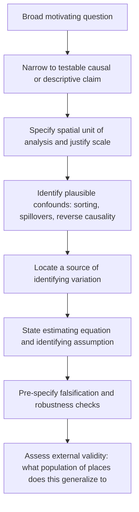

## Formulating Research Questions in Urban and Regional Economics

### Purpose and Position in the Research Pipeline

The research question is the pivot point that connects a theoretical or policy motivation to an identification strategy and an empirical design. In urban and regional economics specifically, question formulation is complicated by the field's core methodological challenge: spatial units (cities, neighborhoods, regions) are not randomly assigned, are interdependent through migration and trade linkages, and are characterized by persistent unobserved heterogeneity (amenities, history, institutions). A well-formulated question anticipates these problems rather than discovering them after data collection.

**Key Points**

- A research question in this field must specify not just *what* relationship is of interest, but *at what spatial and temporal scale* it operates, since urban economic phenomena are frequently scale-dependent (a relationship visible at the metro level may vanish or reverse at the tract level — the Modifiable Areal Unit Problem, discussed below).
- The question should be formulated jointly with a candidate source of identifying variation; in urban economics, "what is the effect of X on Y" is rarely answerable without also asking "what varies X independently of Y."

### Taxonomy of Question Types

#### Descriptive Questions

Establish stylized facts about spatial patterns: population density gradients, wage differentials across city size, the spatial distribution of poverty. Examples: "How has the urban wage premium changed since 1980?" or "What is the shape of the rent gradient in mid-sized U.S. metros?" These questions do not require causal identification but require care in measurement — consistent geographic boundaries over time, appropriate cost-of-living deflators, and defensible aggregation units.

#### Causal / Mechanism Questions

Ask whether and how a specific factor affects an urban or regional outcome: "Does minimum wage variation affect low-wage employment concentration within a metro?" or "What is the causal effect of a new transit line on nearby property values?" These require an identification strategy — natural experiment, instrumental variable, discontinuity, or structural model — specified at the question-formulation stage, not retrofitted afterward.

#### Structural / Quantitative Questions

Ask about counterfactuals or welfare magnitudes that cannot be answered by reduced-form variation alone: "What would be the welfare gain from removing zoning restrictions in coastal cities?" These require a fully specified equilibrium model (e.g., quantitative spatial models in the Redding-Rossi-Hansberg tradition) because the counterfactual (a policy that has never been observed) lies outside the support of existing data.

#### Predictive / Forecasting Questions

Common in applied and policy-facing work: "Which neighborhoods are likely to gentrify in the next decade?" These prioritize out-of-sample predictive accuracy over causal interpretability, and the appropriate formulation specifies the prediction target, horizon, and evaluation metric up front.

### The FINER and PICO-Style Frameworks Adapted to Spatial Economics

Generic research-question checklists (FINER: Feasible, Interesting, Novel, Ethical, Relevant) apply, but urban/regional economics benefits from a spatially explicit adaptation:

| Criterion | Generic Version | Spatial Economics Adaptation |
| --- | --- | --- |
| **Feasible** | Data and methods exist | Geocoded/linked data exist at the *scale the question requires*; boundary changes over the study period are documented |
| **Identified** | A causal channel is plausible | A source of spatial or temporal variation exists that is plausibly exogenous to the outcome (e.g., historical infrastructure, geological features, policy discontinuities at borders) |
| **Novel** | Fills a gap in the literature | Distinguishes itself from closely related "treatment effect of X in city Y" replications; clarifies whether the contribution is empirical, methodological, or theoretical |
| **Externally relevant** | Matters to policy or theory | Specifies the population of places to which findings are meant to generalize (this is often the weakest link in urban economics, given reliance on single-city or single-country natural experiments) |
| **Scale-explicit** | — (no generic equivalent) | States the spatial unit of analysis and justifies it against the theoretical mechanism |

### Core Formulation Challenges Specific to This Field

#### The Modifiable Areal Unit Problem (MAUP)

Because urban data can be aggregated at multiple nested scales (block, tract, ZIP code, county, metro, commuting zone), the same underlying microdata can produce different — sometimes contradictory — estimated relationships depending on the chosen unit of aggregation and its boundaries. A well-formulated question specifies the spatial unit *ex ante*, ideally justified by the economic mechanism (e.g., labor markets are better approximated by commuting zones than by counties, since commuting zones are constructed from observed commuting flows).

#### Reflection Problem / Endogenous Sorting

Manski's reflection problem — the difficulty of distinguishing endogenous peer effects from correlated unobservables and simultaneity — is endemic to neighborhood-effects research. If asking "does neighborhood X cause outcome Y," the question must be formulated with an explicit strategy for separating:

1. **Endogenous effects**: outcome Y in a neighborhood depends on average Y of neighbors.
2. **Contextual (exogenous) effects**: outcome depends on neighbors' fixed characteristics.
3. **Correlated effects**: neighbors share the same unobserved local shocks or self-select into the neighborhood based on unobserved traits correlated with Y.

Failing to formulate the question with this trichotomy in mind is a frequent source of unidentifiable follow-up designs.

#### Spatial Sorting and Selection

Because people and firms choose locations, cross-sectional and even many panel comparisons across places confound the causal effect of place-based factors with the effect of *who selects into* those places. A well-posed question asks either (a) for a *conditional* effect holding sorting fixed (requiring a design that neutralizes selection, e.g. lottery-based mobility programs like Moving to Opportunity), or (b) explicitly incorporates sorting as part of the object of interest (as in Rosen-Roback compensating differential frameworks, where sorting equilibrium *is* the mechanism under study, not a nuisance to net out).

#### Spatial Autocorrelation and SUTVA Violations

Urban/regional outcomes are rarely independent across nearby units — a shock to one city or neighborhood spills over into adjacent units through commuting, migration, trade, and price competition (SUTVA — the Stable Unit Treatment Value Assumption — is frequently violated by construction). A question of the form "what is the effect of a policy in city A" must specify whether spillovers to city B are a nuisance (requiring buffer zones or spatial-lag corrections) or a first-order object of interest (requiring an explicit spatial equilibrium framework to quantify).

**(svg_diagram) Trichotomy of Confounds in Spatial/Neighborhood Research Questions**

<svg xmlns="http://www.w3.org/2000/svg" viewBox="0 0 700 400" font-family="Helvetica, Arial, sans-serif">
<rect x="0" y="0" width="700" height="400" fill="#ffffff" />
<text x="350" y="26" text-anchor="middle" font-size="15" font-weight="bold" fill="#1a1a1a">Confounds to Address When Formulating a Spatial Research Question (svg_diagram)</text>
<circle cx="230" cy="200" r="120" fill="#1f77b4" fill-opacity="0.18" stroke="#1f77b4" stroke-width="2" />
<circle cx="470" cy="200" r="120" fill="#d62728" fill-opacity="0.18" stroke="#d62728" stroke-width="2" />
<circle cx="350" cy="320" r="120" fill="#2ca02c" fill-opacity="0.18" stroke="#2ca02c" stroke-width="2" />

<text x="160" y="150" font-size="13" font-weight="bold" fill="`#1f77b4`">Endogenous</text>

<text x="160" y="168" font-size="11" fill="`#1f77b4`">Outcome depends on</text>

<text x="160" y="182" font-size="11" fill="`#1f77b4`">neighbors' outcomes</text>

<text x="500" y="150" font-size="13" font-weight="bold" fill="`#d62728`">Contextual</text>

<text x="500" y="168" font-size="11" fill="`#d62728`">Outcome depends on</text>

<text x="500" y="182" font-size="11" fill="`#d62728`">neighbors' fixed traits</text>

<text x="300" y="380" font-size="13" font-weight="bold" fill="`#2ca02c`">Correlated</text>

<text x="270" y="398" font-size="11" fill="`#2ca02c`">Shared unobserved shocks / self-selection</text>

<text x="330" y="230" font-size="11" fill="#333" font-weight="bold">Reflection</text>

<text x="325" y="244" font-size="11" fill="#333" font-weight="bold">Problem</text>

</svg>

### Sources of Identifying Variation Commonly Built Into Question Design

| Strategy | How It Enters Question Formulation | Representative Application |
| --- | --- | --- |
| **Border/boundary discontinuity** | "Does outcome Y jump discretely at a policy or jurisdictional boundary, holding local amenities fixed?" | School-district boundary effects on housing prices; state minimum-wage border-county pairs |
| **Historical/persistence instruments** | "Can a plausibly exogenous historical shock (e.g., historical rail placement, wartime bombing, natural disaster) serve as an instrument for a modern spatial characteristic?" | Historical transportation infrastructure instrumenting current density (Duranton-Turner tradition) |
| **Policy-induced discontinuities (RD)** | "Is there a threshold rule (population cutoff, zoning boundary, program eligibility) generating quasi-random assignment near the cutoff?" | Place-based program eligibility thresholds (Empowerment Zones, Opportunity Zones) |
| **Shift-share / Bartik instruments** | "Can national/sectoral shocks interacted with local industry composition generate local demand shocks uncorrelated with local supply factors?" | Local labor demand shocks from national industry trends |
| **Natural experiments from geography/geology** | "Does a geographic feature (ruggedness, coastline, river confluence) generate variation unrelated to unobserved economic potential?" | Land-slope instruments for urban expansion patterns |
| **Randomized/lottery-based mobility programs** | "Does random assignment to a residential mobility voucher isolate the causal effect of neighborhood from selection?" | Moving to Opportunity and similar housing-voucher experiments |

### From Question to Design: A Worked Formulation Process

**Example** — Motivating question: *"Do transit investments reduce commute-based sorting by income across neighborhoods?"*

1. **Narrow to a testable causal claim**: "Does the opening of a new rail line change the income composition of tracts within a defined walking-distance buffer, relative to comparable tracts outside the buffer?"
2. **Specify spatial unit and buffer**: Census tract, 0.5-mile buffer around new stations — justified by empirical walkshed literature, not arbitrary convenience.
3. **Identify the confound**: Line placement is not random — planners route transit toward areas already expected to grow (reverse causality / selection into treatment).
4. **Build the identification strategy into the question**: Reformulate as "Among announced-but-not-yet-built stations (to hold planner selection into the *sample* fixed), does the *timing* of opening — plausibly driven by construction/funding delays orthogonal to local economic trends — generate a difference-in-differences design comparing tracts near early-opened vs. late-opened stations?"
5. **State the estimating equation** implied by the final question:

$$Y_{it} = \alpha_i + \lambda_t + \beta \cdot \text{Post}_{it} \times \text{NearStation}_i + \varepsilon_{it}$$

where $\alpha_i$ are tract fixed effects, $\lambda_t$ are time fixed effects, and $\beta$ is the coefficient of interest — with the question formulation stage responsible for justifying that $\text{Post}_{it} \times \text{NearStation}_i$ is uncorrelated with $\varepsilon_{it}$ conditional on the fixed effects (the parallel trends assumption), typically supported with event-study pre-trend evidence.

**(svg_diagram) Question Formulation Pipeline**

### Falsification, Robustness, and Pre-Specification

A well-formulated question in this field anticipates its own stress tests before data collection or estimation begins:

- **Placebo/pre-trend checks**: for quasi-experimental designs, specify in advance what a pre-trend violation would look like and how it would be interpreted.
- **Alternative spatial units**: specify secondary units (e.g., ZIP code as well as tract) to check MAUP sensitivity.
- **Spillover/buffer robustness**: specify a range of buffer distances or a spatial-lag specification to check sensitivity to the spillover-radius assumption.
- **Heterogeneity specification**: pre-specify subgroups (city size, region, baseline density) if heterogeneous effects are of theoretical interest, to avoid post-hoc subgroup mining.

**Key Points**

- Registering a pre-analysis plan (increasingly common in applied microeconomics generally, and gradually more common in urban economics) is one institutional mechanism for enforcing this discipline, though [Inference] its adoption in urban/regional economics specifically lags behind fields like development economics, and practice varies considerably by subfield and journal.

### Common Pitfalls in Question Formulation

- **Scale mismatch**: formulating a question motivated by an individual-level or firm-level mechanism but testing it only with aggregated metro-level data (or vice versa), producing an ecological-inference problem.
- **Unacknowledged simultaneity**: asking "does density cause productivity" without addressing that productive places also attract density (this pairing is one of the most heavily revisited identification problems in urban economics, spanning decades of instrument development).
- **Ignoring general equilibrium feedback**: a partial-equilibrium question ("effect of policy in city A") can be misleading if the true object of interest is a general-equilibrium reallocation across the full system of cities (e.g., a local place-based subsidy may simply relocate activity from untreated places rather than creating it, which the question formulation should explicitly flag as a margin to be tested, e.g. via a "donut" analysis of neighboring untreated areas).
- **Vague external validity claims**: formulating single-city findings as if generalizable to "cities" broadly, without a formulated hypothesis about which city characteristics (size, industry mix, housing supply elasticity) would moderate the estimated effect elsewhere.

### Related Topics

- Quantitative spatial equilibrium models (Redding-Rossi-Hansberg framework) as a response to structural counterfactual questions
- Rosen-Roback compensating differentials and spatial equilibrium sorting
- Shift-share (Bartik) instrument construction and recent econometric critiques (Goldsmith-Pinkham, Sorkin, Swift)
- Moving to Opportunity and lottery-based neighborhood effects designs
- Regression discontinuity designs at administrative and geographic boundaries
- Spatial econometrics: spatial lag vs. spatial error models, Moran's I diagnostics
- Pre-analysis plans and replication standards in applied urban economics
- Commuting zones vs. MSAs vs. administrative boundaries as units of analysis