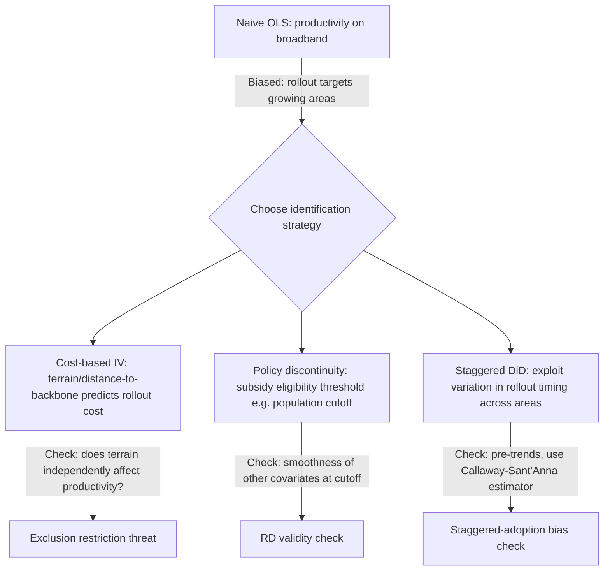

## Identifying Causal Effects in Spatial Data

### Why Spatial Data Breaks Standard Causal Inference Assumptions

Standard causal inference frameworks (Rubin Causal Model, potential outcomes) assume unit independence — the **Stable Unit Treatment Value Assumption (SUTVA)** — under which one unit's potential outcome does not depend on another unit's treatment status. Spatial data systematically violates this assumption through three interlocking channels:

1. **Spillovers/interference**: treatment in one location affects outcomes in nearby untreated locations (via commuting, trade, migration, price arbitrage).
2. **Spatial autocorrelation**: nearby units share unobserved characteristics (soil quality, climate, historical institutions, agglomeration spillovers) that are correlated with both treatment assignment and outcomes — a spatial analogue of omitted variable bias.
3. **Endogenous sorting/selection**: people and firms self-select into locations partly based on anticipated or realized treatment, so location itself is a choice variable correlated with unobserved potential outcomes.

**Key Points**

- Most identification strategies in spatial economics are best understood as different ways of neutralizing one or more of these three channels, not as a single unified toolkit — the right strategy depends on which channel is empirically dominant for the question at hand.
- The presence of spatial autocorrelation in the *outcome* is not itself proof of a causal spatial effect; it is equally consistent with correlated unobservables and does not, by itself, identify anything.

### The Reflection Problem, Formally

Manski's decomposition applies directly to spatial contexts (a neighborhood being the natural "group"). For an outcome $y_i$ of unit $i$ in group $g$:

$$y_i = \alpha + \beta \, \bar{y}_{-i,g} + \gamma' \bar{x}_{-i,g} + \delta' x_i + \mu_g + \varepsilon_i$$

where $\bar{y}_{-i,g}$ is the average outcome of other units in the group (**endogenous effect**, coefficient $\beta$), $\bar{x}_{-i,g}$ is the average of neighbors' exogenous characteristics (**contextual effect**, $\gamma$), and $\mu_g$ is a group-level unobserved shock (**correlated effect**). Because $\bar{y}_{-i,g}$ is mechanically a function of the same equilibrium that determines $y_i$, and $\mu_g$ is unobserved, $\beta$, $\gamma$, and $\mu_g$ are not separately identified without additional structure — this is the reflection problem. Solutions require either exogenous variation that shifts $\bar{x}_{-i,g}$ without directly affecting $y_i$, a nonlinear/network structure that breaks the linear-in-means collinearity (Bramoullé-Djebbari-Fortin approach using partially overlapping peer groups), or randomized group assignment that eliminates $\mu_g$ correlation with treatment.

### Identification Strategies for Spatial Causal Questions

#### 1. Spatial Regression Discontinuity (Boundary Discontinuity Designs)

Compares outcomes for units on either side of an administrative, jurisdictional, or policy boundary, under the assumption that unobserved local characteristics vary smoothly across the boundary while the treatment (policy regime) changes discretely.

$$y_i = \alpha + \tau \cdot D_i + f(\text{location}_i) + \varepsilon_i$$

where $D_i$ indicates being on the treated side and $f(\cdot)$ is a smooth function of geographic location (often a flexible polynomial in latitude/longitude or distance-to-boundary), estimated locally within a bandwidth of the boundary. Common applications: school-district boundary effects on housing prices, state-border minimum wage comparisons (Dube-Lester-Reich), and municipal tax-jurisdiction boundaries.

**Key identification threat**: boundaries are rarely drawn randomly — historical boundaries often follow natural features (rivers, ridgelines) that independently affect the outcome, and jurisdictions can *sort* their boundaries endogenously over time in response to anticipated policy differences. Robustness requires testing covariate balance on both sides of the boundary and, where possible, using boundaries whose placement predates the outcome-relevant policy variation by a substantial margin.

**(svg_diagram) Spatial RD: Treatment Discontinuity at a Jurisdictional Boundary**

<svg xmlns="http://www.w3.org/2000/svg" viewBox="0 0 700 420" font-family="Helvetica, Arial, sans-serif">
<rect x="0" y="0" width="700" height="420" fill="#ffffff" />
<text x="350" y="24" text-anchor="middle" font-size="15" font-weight="bold" fill="#1a1a1a">Spatial RD at a Policy Boundary (svg_diagram)</text>
<line x1="80" y1="360" x2="620" y2="360" stroke="#333" stroke-width="1.5" />
<line x1="80" y1="360" x2="80" y2="60" stroke="#333" stroke-width="1.5" />
<text x="560" y="380" font-size="13" fill="#333">Distance to boundary</text>
<text x="30" y="55" font-size="13" fill="#333">Outcome y</text>

<line x1="350" y1="60" x2="350" y2="360" stroke="#999" stroke-dasharray="5,4" />
<text x="356" y="80" font-size="12" fill="#666">boundary</text>

<path d="M 90 260 C 180 250, 270 230, 345 210" stroke="#1f77b4" stroke-width="2.5" fill="none" />

<path d="M 355 150 C 430 140, 520 120, 610 100" stroke="#d62728" stroke-width="2.5" fill="none" />
<circle cx="345" cy="210" r="4" fill="#1f77b4" />
<circle cx="355" cy="150" r="4" fill="#d62728" />
<line x1="345" y1="210" x2="355" y2="150" stroke="#ff7f0e" stroke-width="2" stroke-dasharray="3,2" />
<text x="365" y="180" font-size="12" fill="#ff7f0e" font-weight="bold">τ = discontinuity</text>

<text x="150" y="300" font-size="12" fill="`#1f77b4`">Untreated jurisdiction</text>

<text x="420" y="300" font-size="12" fill="`#d62728`">Treated jurisdiction</text>

</svg>

#### 2. Difference-in-Differences with Spatial Treatment

Compares changes in outcomes over time between treated locations (e.g., near a new transit station, inside an enterprise zone) and untreated comparison locations, before and after treatment. The core identifying assumption is **parallel trends**: in the absence of treatment, treated and control locations would have evolved similarly.

**Spatial-specific complications**:

- **Treatment spillovers into "control" units**: nearby untreated locations may be indirectly affected (e.g., displaced economic activity, commuting substitution), biasing the control group's trend and attenuating the estimated effect. The standard mitigation is to define a "donut" — excluding units within some buffer of treated units from the control group — or to model spillovers explicitly with distance-decay terms.
- **Staggered adoption bias**: when treatment timing varies across locations (as is common — different transit lines open in different years, different zones are designated at different times), standard two-way fixed effects estimators can be badly biased due to already-treated units acting as negative-weighted controls for later-treated units (Goodman-Bacon decomposition; de Chaisemartin-D'Haultfœuille; Callaway-Sant'Anna, Sun-Abraham estimators are the standard corrections).
- **Choice of comparison geography**: whether to compare to immediately adjacent areas (more comparable but more likely to suffer spillover contamination) or geographically distant areas (less spillover risk but weaker parallel-trends plausibility) is a first-order design choice, not a robustness afterthought.

#### 3. Instrumental Variables Using Spatial/Geographic Variation

An instrument $Z_i$ must satisfy relevance (correlated with the endogenous spatial treatment) and exclusion (affects the outcome only through the treatment, not directly or via other channels). Spatial applications draw instruments from three broad sources:

- **Historical persistence instruments**: a historical feature that shaped a modern spatial characteristic but plausibly has no *direct* effect on the modern outcome except through that channel (e.g., historical railroad placement instrumenting current road density; WWII bombing intensity instrumenting postwar rebuilding density in Davis-Weinstein-style work).
- **Physical geography instruments**: terrain ruggedness, river confluence, coastal access, soil suitability — used because they are fixed, pre-date economic activity, and are argued to be orthogonal to unobserved modern productivity shocks (though their exclusion restriction is frequently contested if the geographic feature has its *own* direct effect on the outcome, e.g., ruggedness affecting both historical settlement *and* modern trade costs independently).
- **Shift-share (Bartik) instruments**: constructed as $Z_i = \sum_k s_{ik,0} \cdot g_{k,t}$, a location's baseline industry composition $s_{ik,0}$ interacted with national industry growth rates $g_{k,t}$. Recent methodological work (Goldsmith-Pinkham, Sorkin, and Swift; Borusyak, Hull, and Jaravel) clarifies that identification can come either from the exogeneity of the shares (conditional on their own set of controls) or from the exogeneity of the shocks — these are distinct identifying assumptions requiring different diagnostic checks (e.g., testing whether pre-period shares predict pre-period outcome trends).

$$\hat{\tau}_{IV} = \frac{\text{Cov}(Z_i, y_i)}{\text{Cov}(Z_i, D_i)}$$

**Key Points**

- The **exclusion restriction is the binding constraint** in nearly all spatial IV applications — reviewers and replications in this literature devote disproportionate attention to plausible direct channels through which the instrument could affect the outcome outside the hypothesized treatment path, since geographic and historical instruments are rarely as clean as randomized instruments.

#### 4. Matching and Synthetic Control Methods

For settings with a small number of treated spatial units (a single city adopting a policy, one region receiving a large infrastructure investment) and many potential comparison units, the **synthetic control method** (Abadie-Diamond-Hainmueller) constructs a weighted combination of untreated "donor pool" units that best reproduces the treated unit's pre-treatment outcome trajectory, then uses the gap between the treated unit and its synthetic counterfactual post-treatment as the estimated effect.

$$\hat{Y}_{1t}^{N} = \sum_{j=2}^{J+1} w_j^* Y_{jt}, \quad w^* = \arg\min_w \sum_{t < T_0} \left( Y_{1t} - \sum_j w_j Y_{jt} \right)^2 \text{ s.t. } w_j \geq 0, \sum w_j = 1$$

Widely used for single large-scale regional/city policy evaluations (e.g., German reunification effects on West German GDP, single-state minimum wage or tax policy changes). Inference is nonstandard (small-sample, based on placebo permutation tests rather than asymptotic standard errors) because of the single-treated-unit design.

#### 5. Spatial Panel Methods and Explicit Spillover Modeling

When spillovers are the object of interest rather than a nuisance, spatial econometric models explicitly parameterize the interdependence using a spatial weights matrix $W$ (commonly based on inverse distance, contiguity, or economic distance):

- **Spatial Lag Model (SAR)**: $y = \rho W y + X\beta + \varepsilon$ — outcome in one location depends directly on outcomes in neighboring locations (models genuine spillover/interaction).
- **Spatial Error Model (SEM)**: $y = X\beta + u$, $u = \lambda Wu + \varepsilon$ — spatial correlation enters through unobserved shocks, not a structural interaction (models nuisance autocorrelation, not spillover per se).
- **Spatial Durbin Model (SDM)**: $y = \rho Wy + X\beta + WX\theta + \varepsilon$ — nests both, and is generally the preferred starting specification because it does not impose the SAR/SEM restriction a priori (LeSage and Pace's specification-testing guidance).

**Key Points**

- SAR and SEM are observationally similar in many finite samples, and distinguishing "genuine spillover" from "correlated unobservables masquerading as spillover" using $W$ alone is a known weak point of this literature — the specification of $W$ itself is rarely testable and is usually assumed rather than derived from theory, which is a standard critique of purely spatial-econometric (as opposed to natural-experiment-based) approaches to causal identification.

### Comparing Approaches by Which Threat They Address

| Strategy | Neutralizes Spillover Bias? | Neutralizes Correlated Unobservables? | Neutralizes Sorting/Selection? | Typical Data Requirement |
| --- | --- | --- | --- | --- |
| Spatial RD | Partial (near boundary) | Yes, locally | Partial | Precise geocoding near a sharp boundary |
| DiD with spatial treatment | Requires donut/buffer design | Yes, via unit fixed effects | No (assumes parallel trends, not solved sorting) | Panel data, pre/post treatment |
| IV (historical/geographic) | No, unless instrument is spillover-free | Yes, if exclusion holds | Yes, if exclusion holds | Valid instrument + first-stage strength |
| Shift-share IV | No | Partial, depends on shares/shocks exogeneity | Partial | Industry-by-location panel |
| Synthetic control | No (assumes no spillover to donor pool) | Yes, via pre-trend matching | Partial | Long pre-treatment panel, single/few treated units |
| Spatial lag/error models | Models it explicitly (SAR) | Models it explicitly (SEM) | No | Full spatial weights matrix, cross-section or panel |
| Randomized mobility programs (MTO-style) | N/A (random assignment) | Yes, by design | Yes, by design | Experimental/lottery data — rare |

### Worked Example: Diagnosing an Identification Strategy

**Research question**: "Does broadband internet expansion increase local firm productivity?"

**Naive approach**: regress firm productivity on local broadband availability. **Problem**: broadband providers roll out service to areas with higher expected demand (i.e., areas already growing) — classic reverse causality/selection.

**Candidate identification strategies and their trade-offs**:

Each branch requires its own falsification test before the question can be considered answerable with the chosen design — this is the standard practical workflow linking question formulation (prior topic) to an implementable identification strategy.

### Common Pitfalls

- **Interpreting spatial autocorrelation in residuals as evidence of a causal spillover**: significant Moran's I statistics on regression residuals indicate misspecification or omitted spatially-correlated variables, not proof of a structural spatial mechanism.
- **Defining the control group without accounting for treatment spillover**: using immediately adjacent untreated units as controls when those units are plausibly affected by the treatment (e.g., businesses relocating just outside a treated zone) biases DiD/synthetic control estimates toward zero or in an ambiguous direction.
- **Applying two-way fixed effects DiD naively under staggered treatment timing**: without using a heterogeneity-robust estimator, comparisons implicitly use already-treated units as controls for later-treated units, which can produce severely biased or even sign-reversed estimates if effects are dynamic.
- **Treating the spatial weights matrix $W$ as a neutral technical choice**: results in SAR/SEM/SDM models can be sensitive to the functional form of $W$ (contiguity vs. inverse distance vs. k-nearest-neighbors), and this sensitivity is a genuine identification concern, not merely a robustness footnote.
- **Overstating exclusion restrictions for geographic/historical instruments**: reviewers in this literature routinely reject IV strategies where the instrument (e.g., ruggedness, historical settlement) plausibly has a direct channel to the modern outcome beyond the hypothesized treatment path.

### Related Topics

- Goodman-Bacon decomposition and heterogeneity-robust staggered DiD estimators (Callaway-Sant'Anna, Sun-Abraham, de Chaisemartin-D'Haultfœuille)
- Shift-share instrument validity: Goldsmith-Pinkham-Sorkin-Swift vs. Borusyak-Hull-Jaravel frameworks
- Synthetic control inference and placebo permutation testing
- Spatial weights matrix specification and sensitivity analysis
- Quantitative spatial equilibrium models as an alternative to reduced-form spillover estimation
- Moving to Opportunity and randomized neighborhood-effects designs
- Network-based peer effects identification (Bramoullé-Djebbari-Fortin)
- Modifiable Areal Unit Problem and its interaction with causal identification