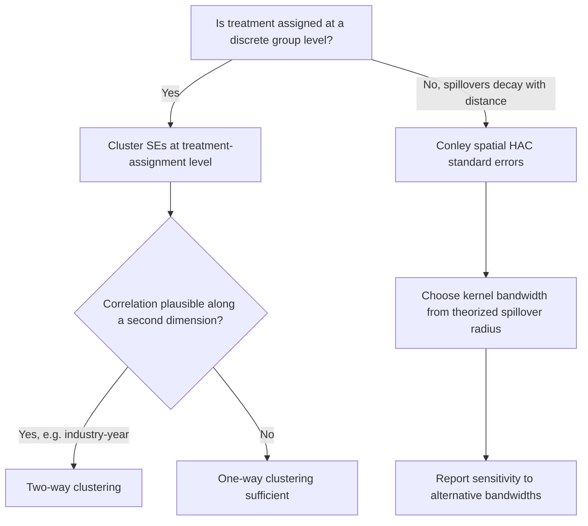
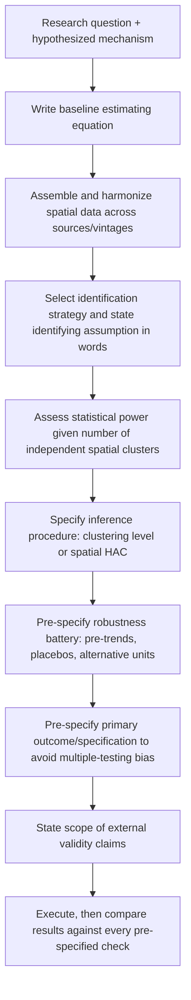

## Designing an Original Empirical Study

### Position in the Research Workflow

This topic operationalizes the prior two chapter items — question formulation and causal identification — into an executable study design. Where "formulating research questions" establishes *what* is being asked and "identifying causal effects in spatial data" catalogs *which identification strategies exist*, designing an original empirical study is the integration step: choosing data, specifying estimating equations, pre-committing to inference procedures, and building in the diagnostics that will make the result credible to a skeptical reader.

**Key Points**

- A study design is not simply "pick an identification strategy and run a regression" — it requires a coherent chain from theoretical mechanism, to measurable proxy, to data source, to estimator, to inference procedure, with each link explicitly justified.
- Originality in applied urban/regional economics most often comes from **new data, new institutional variation, or a new combination of existing identification strategies** applied to an under-examined setting — rarely from a wholly novel econometric technique.

### Step 1 — Translate the Research Question into a Testable Specification

#### From Mechanism to Estimating Equation

Start from the theoretical mechanism identified during question formulation and write down the equation that would be true if that mechanism operates, plus the equation that captures the empirical strategy chosen to isolate it. For a generic reduced-form design:

$$Y_{it} = \alpha_i + \lambda_t + \beta \, D_{it} + X_{it}'\gamma + \varepsilon_{it}$$

Each term should be traceable to a design decision made in the prior steps:

- $\alpha_i$ (unit fixed effects): absorbs time-invariant unobserved heterogeneity across spatial units — justified if selection into treatment is plausibly time-invariant conditional on unit identity.
- $\lambda_t$ (time fixed effects): absorbs common shocks (national business cycle, aggregate price trends) affecting all units simultaneously.
- $D_{it}$: the treatment variable, whose source of variation was established during identification-strategy selection (policy discontinuity, instrument, staggered rollout, etc.).
- $X_{it}$: time-varying controls — included only if theoretically motivated, since indiscriminately adding controls can introduce bad-control bias if any $X_{it}$ is itself an outcome of treatment.

#### Falsifiability and Pre-Specified Alternative Hypotheses

A design is stronger when it specifies, in advance, what pattern of results would be inconsistent with the hypothesized mechanism (falsification) as well as what a competing explanation would predict. For example, if testing whether transit access causes rent increases via improved accessibility, a design that also tests for anticipatory price effects *before* the announced opening date can distinguish an accessibility-driven mechanism from pure speculative capitalization.

### Step 2 — Data Architecture

#### Sourcing and Linking Spatial Data

Original empirical work in this field typically requires assembling data from multiple sources at potentially mismatched geographies and vintages:

| Data Category | Common Sources | Typical Geographic Unit |
| --- | --- | --- |
| Demographic/economic outcomes | Census/ACS, LEHD/LODES (U.S.), national statistical agencies | Tract, block group, ZIP, commuting zone |
| Housing/land prices | Zillow, CoreLogic, deed records, assessor data | Parcel, tract |
| Firm-level data | National Establishment Time-Series (NETS), Compustat, business registries | Establishment/firm, aggregable to tract or county |
| Transportation/infrastructure | GTFS transit feeds, DOT construction records, historical maps/GIS archives | Point/line features, network-based |
| Historical/instrument sources | Digitized historical maps, archival records, geological surveys | Varies — often requires manual geocoding |

**Key Points**

- Geographic boundary changes over time (tract redefinitions between Census years, annexations, jurisdictional mergers) are a routine and underappreciated source of measurement error; a credible design specifies the crosswalk methodology (e.g., NHGIS/Longitudinal Tract Database standardization) used to harmonize units across the study period.
- Linking data across sources at different native geographies (e.g., firm-level point data to tract-level demographic data) requires an explicit spatial join methodology — nearest-centroid, area-weighted interpolation, or population-weighted interpolation — and the choice can materially affect results, so it should be justified and tested for robustness, not treated as a mechanical preprocessing step.

#### Sample Construction and Scope Decisions

Decisions to document and justify at the design stage:

- **Geographic scope**: single metro, national sample of metros, or cross-country — trades off internal validity (cleaner identification, fewer confounds) against external validity (generalizability of findings).
- **Time window**: long enough to capture pre-trends and post-treatment dynamics, short enough to avoid confounding from unrelated policy changes or structural breaks within the window.
- **Unit of observation**: chosen to match the theoretical mechanism (per the MAUP discussion in the prior chapter item), not simply the finest-grained data available.
- **Sample restrictions and their justification**: e.g., excluding border counties, top-coding outliers, restricting to balanced panels — each restriction should be pre-specified and its effect on the sample documented, since post-hoc sample trimming is a common source of specification-search bias.

### Step 3 — Empirical Strategy Implementation

#### Baseline Specification and Identifying Assumption Statement

The design document (or paper's empirical strategy section) should state explicitly:

1. The **identifying assumption** in words (e.g., "conditional on tract and year fixed effects, timing of transit station opening is uncorrelated with contemporaneous local economic shocks").
2. The **testable implications** of that assumption (parallel pre-trends, covariate balance, smoothness at a discontinuity) and how they will be checked.
3. The **estimator** appropriate to the design, including any corrections needed for known biases (e.g., heterogeneity-robust staggered DiD estimators if treatment timing varies, as flagged in the causal-identification chapter item).

#### Power and Sample Size Considerations

Before finalizing a design, an original study should assess whether the available spatial variation provides sufficient statistical power to detect an effect of plausible/policy-relevant magnitude. This is particularly binding in spatial economics because:

- The number of truly independent spatial clusters is often much smaller than the number of observations (clustering by state or metro can leave only dozens of independent units even with millions of individual-level observations).
- Spatial autocorrelation inflates the effective variance of estimates beyond what naive (non-clustered) standard errors would suggest.

A minimal power check: simulate or analytically compute the minimum detectable effect (MDE) given the number of independent clusters, outcome variance, and intended significance level, and compare it against the smallest economically meaningful effect size the theory predicts — if the MDE exceeds plausible effect sizes, the design needs more clusters, a longer panel, or a different identification strategy before data collection proceeds.

### Step 4 — Inference Procedure

#### Clustering and Standard Errors

Because of spatial and serial correlation, standard error choice is a design decision, not an afterthought:

- **Cluster by the level at which treatment varies** (e.g., if treatment is assigned at the metro level, cluster at the metro level even if the data is at the tract level) — clustering at a finer level than treatment assignment produces severely understated standard errors (Abadie, Athey, Imbens, Wooldridge).
- **Spatial HAC (Conley) standard errors**: when spillovers decay continuously with distance rather than clustering into discrete groups, Conley standard errors allow for correlation between any two observations as a function of their geographic distance, with a kernel bandwidth chosen based on the theorized spatial extent of spillovers.
- **Two-way clustering**: appropriate when correlation plausibly exists along two dimensions simultaneously (e.g., both within-metro and within-industry-year).

**(svg_diagram) Standard Error Choice Given Spatial Correlation Structure**

#### Multiple Testing and Specification Search

Original empirical designs that test multiple outcomes, subgroups, or specifications should pre-specify a primary outcome/specification and treat others as secondary, or apply multiple-testing corrections (Bonferroni, Benjamini-Hochberg false discovery rate control) when reporting a family of related hypotheses. This is particularly relevant in spatial economics given the temptation to test effects across many geographic subsamples until a significant result emerges.

### Step 5 — Robustness and Validity Checks Built Into the Design

A design should specify, before estimation, the battery of checks that will accompany the headline result:

- **Pre-trend/event-study plots**: for any DiD-style design, report dynamic treatment effects in event time, not just a single post-period average, to visually and statistically assess pre-trend violations.
- **Placebo tests**: apply the identification strategy to an outcome or time period where no effect is theoretically expected (e.g., testing for an "effect" of a policy before it was announced, or on an outcome plausibly unaffected by the mechanism).
- **Alternative geographic units**: re-estimate at a coarser or finer spatial aggregation to check MAUP sensitivity.
- **Alternative control groups / donor pools**: for matching or synthetic control designs, report sensitivity to the composition of the comparison group.
- **Leave-one-out analysis**: particularly important for shift-share and synthetic control designs, where a single dominant unit (industry, donor city) can drive the entire result.
- **Bounding exercises when a clean identification strategy is unavailable**: e.g., Oster's coefficient-stability bounds for assessing robustness to omitted variable bias when using selection-on-observables assumptions.

### Step 6 — External Validity and Scope of Claims

An original study design should state, in advance, what population of places or time periods the finding is intended to generalize to, and what institutional or geographic features of the study setting might limit that generalization. [Inference] Because a large share of causal identification strategies in urban/regional economics rely on setting-specific institutional variation (a particular country's zoning law, a particular city's transit expansion), explicit discussion of which features of the setting are essential to the mechanism versus incidental to the identification strategy is good design practice, though the degree of emphasis this receives varies substantially by journal and subfield norms.

### Integrated Design Checklist

### Worked Example: Design Sketch

**Question**: "Does zoning deregulation increase housing supply elasticity in mid-sized U.S. metros?"

- **Mechanism**: relaxed zoning reduces regulatory cost of new construction, shifting the supply curve for housing units.
- **Data**: parcel-level building permits (local government records), zoning ordinance text/dates (hand-coded or from a zoning-atlas project), housing price indices (Zillow/CoreLogic), harmonized to a consistent tract definition across the study period.
- **Identification**: staggered difference-in-differences exploiting the timing of zoning reform adoption across cities, using a heterogeneity-robust estimator (Callaway-Sant'Anna) given staggered timing.
- **Identifying assumption**: conditional on city and year fixed effects, the *timing* of zoning reform adoption is uncorrelated with contemporaneous local housing demand shocks — supported by an event-study plot showing flat pre-trends in permit issuance before reform passage.
- **Inference**: cluster standard errors at the city level (the level of treatment assignment); report Conley spatial HAC standard errors as a robustness check given potential spillovers to unreformed neighboring jurisdictions.
- **Robustness**: donut specification excluding tracts within a small buffer of city borders (to address cross-border spillover contamination); leave-one-out check dropping the largest reforming city; alternative unit of analysis at the county level.
- **External validity statement**: findings scoped explicitly to mid-sized metros with home-rule zoning authority, since the mechanism (local zoning discretion) may not generalize to states with centralized land-use regulation.

### Common Pitfalls

- **Choosing the identification strategy after seeing preliminary results**: reverses the proper design sequence and invites specification search; the identification strategy should be justified by institutional knowledge of the setting, not by which specification produces a significant coefficient.
- **Mismatched geographic vintages across linked datasets**: silently interpolating or nearest-matching across incompatible tract definitions without documenting the crosswalk method, producing measurement error that is difficult to diagnose after the fact.
- **Clustering standard errors at a level finer than treatment assignment**: a frequent and severe error that overstates precision.
- **Treating a single robustness check as sufficient**: a design that reports only one alternative specification, rather than a full pre-specified battery, is more vulnerable to the critique that the reported check was itself selected because it happened to support the result.
- **Neglecting spillovers into the control group**: using immediately adjacent units as controls without a donut or spillover-robustness check, particularly relevant given the extensive discussion of this issue in the causal-identification chapter item.

### Related Topics

- Pre-analysis plan registration and its adoption in applied microeconomics
- Conley spatial HAC standard errors: kernel choice and bandwidth selection
- Oster bounds and selection-on-observables sensitivity analysis
- Callaway-Sant'Anna and Sun-Abraham staggered DiD estimators (deepened implementation)
- Crosswalk methodologies for harmonizing Census geographies over time (NHGIS, Longitudinal Tract Database)
- Event-study specifications and dynamic treatment effect visualization
- Replication and data-sharing standards in applied urban economics journals
- Writing the empirical strategy and robustness sections of a capstone paper