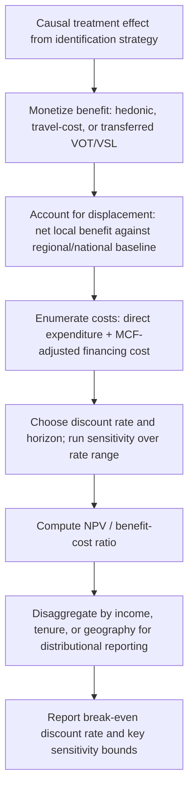

## Policy Evaluation and Cost-Benefit Analysis

### Position in the Research Workflow

This item is the translation step from causal estimates (produced using the identification strategies from prior chapter items) into a welfare or policy recommendation. A credible causal estimate of $\beta$ — the effect of a policy on an outcome — is a necessary but not sufficient input to policy evaluation; converting it into a cost-benefit judgment requires additional structure: monetization of benefits, an accounting of costs (including fiscal and deadweight-loss costs), a discounting framework, and an explicit treatment of distributional weights.

**Key Points**

- Causal identification answers "what changed because of the policy"; cost-benefit analysis (CBA) answers "was the change worth its cost, and to whom" — these are distinct analytical tasks, and a common error in capstone-level work is treating a well-identified treatment effect as if it were automatically a welfare conclusion.
- In spatial/regional settings specifically, policy evaluation must confront **local vs. aggregate welfare**: a policy that raises welfare in the treated location may do so partly by reallocating (not creating) economic activity from other locations — a distinction central to place-based policy evaluation.

### Core Welfare Framework

#### From Treatment Effect to Willingness to Pay

The building block of CBA is willingness to pay (WTP) — the monetary value an individual would give up to obtain a benefit, or requires to accept a cost. For a policy generating a marginal change in a good or amenity, the change in consumer surplus is:

$$\Delta CS = \int_{q_0}^{q_1} p(q) \, dq$$

For discrete policy changes affecting price and quantity jointly (a common case in transportation, housing, and local public goods evaluation), the exact welfare measure requires either compensating variation (CV) or equivalent variation (EV), which coincide with the simple consumer-surplus triangle only under quasi-linear preferences (no income effects) — a common simplifying assumption in applied CBA that should be flagged as an assumption, not treated as automatically valid.

#### The Kaldor-Hicks Criterion

Most applied CBA relies on the **potential Pareto improvement (Kaldor-Hicks) criterion**: a policy is judged efficient if aggregate benefits exceed aggregate costs, regardless of whether the winners actually compensate the losers. This is a deliberately weaker standard than a strict Pareto improvement and is the conventional basis for the **Net Present Value (NPV)** decision rule:

$$NPV = \sum_{t=0}^{T} \frac{B_t - C_t}{(1+r)^t}$$

where $B_t$ and $C_t$ are monetized benefits and costs in period $t$, and $r$ is the discount rate. A policy passes the standard CBA efficiency test if $NPV > 0$.

**Key Points**

- The Kaldor-Hicks criterion is silent on distribution — a policy with large aggregate net benefits concentrated among high-income winners and small losses spread among low-income losers still "passes," which is why applied regional policy evaluation increasingly reports distributional breakdowns alongside the aggregate NPV rather than relying on the aggregate figure alone.

### Discounting

#### Choice of Discount Rate

The discount rate $r$ converts future costs and benefits into present-value terms and is frequently the single most consequential — and most contested — parameter in a regional CBA, particularly for long-lived infrastructure investments (transit lines, flood protection, regional highway expansion) where benefit streams extend decades into the future.

Three broad approaches to setting $r$:

- **Social rate of time preference (SRTP)**: based on the rate at which society is willing to trade present for future consumption, often derived from the Ramsey formula $r = \rho + \eta g$, where $\rho$ is pure time preference, $\eta$ is the elasticity of marginal utility of consumption, and $g$ is the growth rate of per-capita consumption.
- **Social opportunity cost of capital (SOC)**: based on the pre-tax return that displaced private capital would have earned, generally higher than SRTP-based rates.
- **Government-mandated rates**: many jurisdictions and agencies (e.g., U.S. OMB Circular A-94, various national infrastructure appraisal guidance) specify official discount rates for public project evaluation; [Unverified] the specific numerical rate in current official guidance should be checked against the current version of the relevant document rather than assumed from prior training data, since these rates are periodically revised.

**Key Points**

- Sensitivity analysis over a plausible range of discount rates (not a single point estimate) is standard practice precisely because long-horizon regional infrastructure evaluations can flip from positive to negative NPV depending on the chosen rate — this should be reported as a range or a discount-rate breakeven point, not suppressed in favor of a single headline number.

### Monetizing Non-Market Goods in Spatial Contexts

Much of what regional and urban policy evaluation must value has no direct market price: travel time savings, air quality improvements, noise reduction, neighborhood amenities, accident risk reduction. Standard valuation methods:

| Method | Approach | Typical Urban/Regional Application |
| --- | --- | --- |
| **Hedonic pricing** | Infers implicit prices of non-market attributes from variation in market prices (housing, wages) holding other characteristics fixed | Valuing air quality, school quality, transit access via housing price gradients |
| **Travel cost method** | Infers recreational/amenity value from the cost (time + money) people incur to access a site | Valuing urban parks, waterfronts |
| **Stated preference (contingent valuation, choice experiments)** | Directly surveys WTP for a hypothetical scenario | Valuing amenities with no revealed-preference market analogue (e.g., preserving open space with no visitation) |
| **Value of statistical life (VSL) / value of time (VOT)** | Typically transferred from prior revealed- or stated-preference studies (wage-risk tradeoffs for VSL; mode-choice models for VOT) | Standard inputs to transportation project appraisal |
| **Benefit transfer** | Applies a valuation estimate from an existing study to a new context, adjusted for income/context differences | Common when a primary valuation study is infeasible within project scope, but introduces external-validity risk that should be explicitly flagged |

#### The Hedonic Method in Detail

The hedonic price function decomposes an observed price (typically housing) into implicit prices of constituent characteristics:

$$P_i = \beta_0 + \beta_1 \text{Structure}_i + \beta_2 \text{Neighborhood}_i + \beta_3 \text{Amenity}_i + \varepsilon_i$$

The coefficient $\beta_3$ is interpreted as the marginal implicit price of the amenity, and under specific conditions (identical preferences, no binding relocation costs, full market equilibrium) can be used to recover marginal WTP. This connects directly to the causal-identification chapter item: $\beta_3$ is only interpretable as a causal willingness-to-pay estimate if the amenity is not correlated with unobserved neighborhood quality — precisely the sorting/omitted-variable concern discussed there, which is why modern hedonic applications in urban economics typically pair the hedonic regression with a quasi-experimental source of variation in the amenity (e.g., using the timing of a transit station opening, rather than cross-sectional proximity alone, to identify $\beta_3$).

### Costs: What to Include and How

#### Direct, Indirect, and Opportunity Costs

- **Direct costs**: construction, administrative, and operating expenditures directly attributable to the policy.
- **Deadweight loss of taxation**: because public funds are typically raised through distortionary taxation, many CBA frameworks apply a **marginal cost of public funds (MCF)** multiplier greater than 1 to public expenditures, reflecting the efficiency cost of the taxes used to finance them — omitting this systematically overstates the net benefit of publicly funded regional projects relative to privately financed alternatives.
- **Opportunity cost of land and displaced activity**: for place-based interventions (enterprise zones, transit-oriented development subsidies), the relevant cost includes not just direct expenditure but the value of economic activity that would have occurred at the same location absent the policy, and — critically for regional analysis — whether displaced activity from elsewhere in the region is a real cost or merely a transfer (see below).

#### Local Benefit vs. Regional/National Net Effect

A defining methodological issue in regional policy CBA is distinguishing:

- **Gross local benefit**: the observed improvement in the treated area (higher employment, higher property values).
- **Net regional/national benefit**: the gross local benefit minus activity/employment displaced from other areas within the relevant welfare-accounting boundary.

If a place-based subsidy simply relocates a firm from an untreated to a treated location within the same metro area, the *national* welfare gain may be close to zero (a pure transfer plus deadweight loss from the subsidy's tax financing) even though the *local* treatment effect is large and positive. This is precisely why the "donut"/spillover-robustness checks discussed in the causal-identification chapter item are not just an econometric nicety but a first-order input to a correct cost-benefit calculation — a design that fails to test for negative spillovers to nearby areas risks a CBA that substantially overstates net social benefit by mistaking displacement for creation.

**(svg_diagram) Gross Local Benefit vs. Net Regional Benefit Under Displacement**

<svg xmlns="http://www.w3.org/2000/svg" viewBox="0 0 700 380" font-family="Helvetica, Arial, sans-serif">
<rect x="0" y="0" width="700" height="380" fill="#ffffff" />
<text x="350" y="24" text-anchor="middle" font-size="15" font-weight="bold" fill="#1a1a1a">Gross Local vs. Net Regional Benefit (svg_diagram)</text>

<rect x="60" y="80" width="220" height="160" fill="#2ca02c" fill-opacity="0.15" stroke="#2ca02c" stroke-width="2" />
<text x="170" y="70" text-anchor="middle" font-size="13" font-weight="bold" fill="#2ca02c">Treated Area</text>
<text x="170" y="150" text-anchor="middle" font-size="12" fill="#333">+120 jobs</text>
<text x="170" y="170" text-anchor="middle" font-size="11" fill="#666">(gross local benefit)</text>

<rect x="420" y="80" width="220" height="160" fill="#d62728" fill-opacity="0.15" stroke="#d62728" stroke-width="2" />
<text x="530" y="70" text-anchor="middle" font-size="13" font-weight="bold" fill="#d62728">Nearby Untreated Area</text>
<text x="530" y="150" text-anchor="middle" font-size="12" fill="#333">−80 jobs</text>
<text x="530" y="170" text-anchor="middle" font-size="11" fill="#666">(displacement)</text>

<line x1="280" y1="160" x2="420" y2="160" stroke="#666" stroke-width="2" marker-end="url(#arrow)" />
<text x="350" y="145" text-anchor="middle" font-size="11" fill="#666">firm relocation</text>

<rect x="220" y="290" width="260" height="60" fill="#1f77b4" fill-opacity="0.15" stroke="#1f77b4" stroke-width="2" />
<text x="350" y="315" text-anchor="middle" font-size="12" font-weight="bold" fill="#1f77b4">Net regional benefit = +40 jobs</text>
<text x="350" y="333" text-anchor="middle" font-size="11" fill="#666">minus deadweight loss of subsidy financing</text>
</svg>

### Distributional Weighting

Standard CBA aggregates benefits and costs without regard to who receives them (a dollar of benefit to a low-income household counts the same as a dollar to a high-income household). Applied policy evaluation, especially for place-based and housing policy, increasingly supplements the aggregate NPV with:

- **Distributional weights**: scaling benefits/costs by the marginal utility of income for the recipient group (often using an assumed diminishing marginal utility function, e.g., $u'(y) = y^{-\eta}$), producing a distributionally weighted NPV alongside the unweighted figure.
- **Disaggregated reporting by income quintile, tenure status (renter/owner), or demographic group**: rather than a single weighted index, many applied studies simply report benefit and cost incidence by subgroup and let the incidence pattern speak for itself, avoiding the additional normative assumption embedded in a specific weighting function.

[Inference] The choice between reporting a single distributionally-weighted NPV versus disaggregated incidence tables is partly a matter of disciplinary and agency convention rather than a settled methodological question, and practice varies across transportation appraisal, housing policy evaluation, and environmental CBA traditions.

### Integrating Causal Estimates Into a CBA Pipeline

### Worked Example

A proposed light-rail extension is projected to generate $12 million per year in travel-time savings (valued using a transferred VOT estimate) and $3 million per year in reduced traffic accidents (using a transferred VSL-based estimate), for 20 years, against an upfront construction cost of $180 million and $2 million per year in operating costs, financed by a local tax with an assumed marginal cost of public funds of 1.2.

**Step 1 — Annual net benefit before financing cost:**

$$B_t - C_t = (12 + 3) - 2 = 13 \text{ million/year (years 1–20)}$$

**Step 2 — Adjust upfront cost for MCF:**

$$\text{Adjusted construction cost} = 180 \times 1.2 = 216 \text{ million}$$

**Step 3 — NPV at $r = 5\%$:**

$$NPV = -216 + \sum_{t=1}^{20} \frac{13}{(1.05)^t} = -216 + 13 \times 12.462 \approx -216 + 162.0 = -54.0 \text{ million}$$

**Step 4 — Break-even discount rate**: solving for the rate at which NPV = 0 requires a lower $r$ (since a lower discount rate raises the present value of the 20-year benefit stream) — illustrating why the project's viability is discount-rate-sensitive and why a single-rate NPV without a reported breakeven or sensitivity range would understate the analytical uncertainty.

**Step 5 — Displacement/spillover check**: if a portion of the projected ridership and associated time savings represents travelers diverted from parallel bus routes rather than net-new trips extracted from car travel, the gross $12 million time-savings figure could overstate net benefit — a companion causal analysis of mode-shift patterns (using the identification strategies from the prior chapter item) would be needed to confirm the composition of the benefit before treating it as fully additive.

**Key Points**

- This example is illustrative and uses assumed figures rather than sourced value-of-time or accident-valuation estimates; any capstone application of this framework to a real project should source current, jurisdiction-appropriate valuation parameters (e.g., current DOT value-of-time guidance) rather than reuse illustrative numbers.

### Common Pitfalls

- **Treating a positive local treatment effect as automatically welfare-improving at the regional/national level**: ignores displacement, a first-order concern for place-based policy evaluation.
- **Omitting the marginal cost of public funds when evaluating publicly financed projects**: understates the true cost of tax-financed interventions relative to privately financed alternatives.
- **Reporting a single-point NPV without discount-rate sensitivity**: especially problematic for long-horizon infrastructure projects where the NPV sign can flip within a plausible range of discount rates.
- **Using benefit-transfer valuations without adjusting for income or contextual differences from the source study**: a common and easily overlooked source of overstated or understated benefits.
- **Conflating the Kaldor-Hicks efficiency test with a claim about fairness or actual compensation**: aggregate NPV positivity does not imply that losers are compensated or that the policy is equitable, and applied work should not present it as such without a distributional analysis.

### Related Topics

- Marginal cost of public funds: theory and empirical estimates across tax instruments
- Hedonic pricing identification: combining cross-sectional hedonics with quasi-experimental amenity variation
- Value of statistical life and value of time: derivation and benefit-transfer practice
- Place-based policy evaluation and the displacement/creation distinction (Neumark-Simpson, Kline-Moretti)
- Distributional weighting in applied CBA: theoretical basis and agency practice
- Transportation project appraisal guidance and official discount rate frameworks
- Enterprise zones, Opportunity Zones, and empirical evidence on net job creation vs. relocation
- Capstone paper structure: presenting causal estimates alongside a policy-relevant CBA section