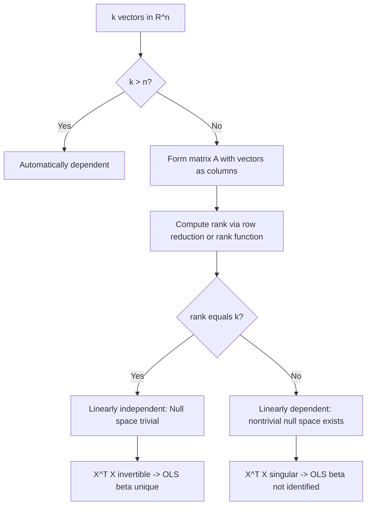

## Vector Spaces and Linear Independence

### Definition of a Vector Space

A vector space $V$ over a field $\mathbb{F}$ (typically $\mathbb{R}$ in econometrics) is a set equipped with two operations — vector addition and scalar multiplication — satisfying eight axioms:

1. Closure under addition: $\mathbf{u} + \mathbf{v} \in V$
2. Commutativity: $\mathbf{u} + \mathbf{v} = \mathbf{v} + \mathbf{u}$
3. Associativity of addition: $(\mathbf{u} + \mathbf{v}) + \mathbf{w} = \mathbf{u} + (\mathbf{v} + \mathbf{w})$
4. Additive identity: there exists $\mathbf{0} \in V$ such that $\mathbf{v} + \mathbf{0} = \mathbf{v}$
5. Additive inverse: for each $\mathbf{v}$, there exists $-\mathbf{v}$ such that $\mathbf{v} + (-\mathbf{v}) = \mathbf{0}$
6. Closure under scalar multiplication: $c\mathbf{v} \in V$
7. Distributivity: $c(\mathbf{u} + \mathbf{v}) = c\mathbf{u} + c\mathbf{v}$ and $(c+d)\mathbf{v} = c\mathbf{v} + d\mathbf{v}$
8. Compatibility and identity: $c(d\mathbf{v}) = (cd)\mathbf{v}$ and $1\mathbf{v} = \mathbf{v}$

**Key Points**

- The canonical example in econometrics is $\mathbb{R}^n$, the space of $n$-dimensional real column vectors, which underlies the observation vectors, parameter vectors, and error vectors used throughout regression analysis.
- A **subspace** $W \subseteq V$ is itself a vector space if it is closed under addition and scalar multiplication and contains $\mathbf{0}$.
- The **column space** (or range) of a matrix $X$, denoted $\text{Col}(X)$, is the subspace spanned by its columns — this is the central object in ordinary least squares (OLS), since the fitted values $\hat{\mathbf{y}} = X\hat{\beta}$ must lie in $\text{Col}(X)$.
- The **null space** of $X$, $\text{Null}(X) = \{\mathbf{v} : X\mathbf{v} = \mathbf{0}\}$, characterizes the directions in parameter space along which the model is unidentified (relevant to perfect multicollinearity).

### Linear Combinations and Span

A linear combination of vectors $\mathbf{v}_1, \dots, \mathbf{v}_k \in V$ is any expression:

$$c_1 \mathbf{v}_1 + c_2 \mathbf{v}_2 + \cdots + c_k \mathbf{v}_k, \quad c_i \in \mathbb{F}$$

The **span** of a set $S = \{\mathbf{v}_1, \dots, \mathbf{v}_k\}$ is the set of all linear combinations of vectors in $S$:

$$\text{span}(S) = \left\{ \sum_{i=1}^{k} c_i \mathbf{v}_i : c_i \in \mathbb{F} \right\}$$

$\text{span}(S)$ is always a subspace of $V$. In regression, the fitted value vector $\hat{\mathbf{y}}$ is by construction the element of $\text{span}(\text{columns of } X)$ that is closest (in Euclidean distance) to $\mathbf{y}$ — this is the geometric interpretation of OLS as an orthogonal projection.

### Linear Independence

A set of vectors $\{\mathbf{v}_1, \dots, \mathbf{v}_k\}$ is **linearly independent** if the only solution to:

$$c_1 \mathbf{v}_1 + c_2 \mathbf{v}_2 + \cdots + c_k \mathbf{v}_k = \mathbf{0}$$

is the trivial solution $c_1 = c_2 = \cdots = c_k = 0$. If a nontrivial solution exists, the set is **linearly dependent** — meaning at least one vector can be written as a linear combination of the others.

**Example**

Consider three regressors stacked as columns of a design matrix $X = [\mathbf{x}_1 \; \mathbf{x}_2 \; \mathbf{x}_3]$:

$$\mathbf{x}_1 = \begin{pmatrix} 1 \\ 2 \\ 3 \end{pmatrix}, \quad \mathbf{x}_2 = \begin{pmatrix} 2 \\ 4 \\ 6 \end{pmatrix}, \quad \mathbf{x}_3 = \begin{pmatrix} 1 \\ 0 \\ 1 \end{pmatrix}$$

Here $\mathbf{x}_2 = 2\mathbf{x}_1$, so setting $c_1 = 2, c_2 = -1, c_3 = 0$ gives $2\mathbf{x}_1 - \mathbf{x}_2 + 0\mathbf{x}_3 = \mathbf{0}$, a nontrivial solution. The set $\{\mathbf{x}_1, \mathbf{x}_2, \mathbf{x}_3\}$ is linearly **dependent**. This is a textbook case of **perfect multicollinearity**: $X^\top X$ is singular, $(X^\top X)^{-1}$ does not exist, and OLS estimates for $\beta$ are not unique (they are only identified up to the null space direction $(2, -1, 0)^\top$).

### Practical Test for Independence

For $k$ vectors in $\mathbb{R}^n$, arrange them as columns of a matrix $A$ ($n \times k$). The vectors are linearly independent if and only if:

- $\text{rank}(A) = k$ (full column rank), equivalently
- If $k = n$: $\det(A) \neq 0$
- The reduced row echelon form of $A$ has a pivot in every column
- The equation $A\mathbf{c} = \mathbf{0}$ has only the trivial solution (i.e., $\text{Null}(A) = \{\mathbf{0}\}$)

**Key Points**

- Any set of $k$ vectors in $\mathbb{R}^n$ with $k > n$ is automatically linearly dependent, since there are more unknowns ($c_i$) than equations, guaranteeing a nontrivial solution.
- In econometric software, near-dependence (severe but imperfect multicollinearity) manifests as a near-singular $X^\top X$ with a very small determinant and large condition number, even though technical linear independence holds.

### Basis and Dimension

A **basis** of a vector space $V$ is a linearly independent set that spans $V$. Every vector in $V$ has a *unique* representation as a linear combination of basis vectors. All bases of a given vector space contain the same number of elements, called the **dimension**, $\dim(V)$.

- The **standard basis** of $\mathbb{R}^n$ is $\{\mathbf{e}_1, \dots, \mathbf{e}_n\}$, where $\mathbf{e}_i$ has a 1 in position $i$ and 0 elsewhere.
- $\dim(\mathbb{R}^n) = n$.
- **Rank-Nullity Theorem**: for an $n \times k$ matrix $A$ representing a linear map, $\text{rank}(A) + \text{nullity}(A) = k$, where $\text{nullity}(A) = \dim(\text{Null}(A))$.

In the regression context, if $X$ is $n \times p$ (n observations, p regressors including the intercept) and $\text{rank}(X) = r < p$, then $\dim(\text{Null}(X)) = p - r > 0$, confirming that the parameter vector $\beta$ is not point-identified — this is precisely why software either drops redundant columns or returns an error/warning under perfect multicollinearity.

### Why This Matters for OLS Identification

The OLS normal equations are:

$$X^\top X \hat{\beta} = X^\top \mathbf{y}$$

**Key Points**

- $X^\top X$ is invertible **if and only if** the columns of $X$ are linearly independent (equivalently, $X$ has full column rank $p$).
- If columns are dependent, $X^\top X$ is singular, and $\hat{\beta}$ is not unique — infinitely many solutions satisfy the normal equations, all yielding the same fitted values $\hat{\mathbf{y}}$ (since $\hat{\mathbf{y}}$ depends only on $\text{Col}(X)$, not on the specific basis representation).
- This is the algebraic root of the **dummy variable trap**: including all $k$ categories of a categorical variable plus an intercept creates a linear dependency, since the sum of all dummy columns equals the intercept column (a vector of ones).
- [Inference] In finite-sample applied work, exact linear dependence is rare by chance with continuous data but common by construction (e.g., including a variable and its exact transformation redundantly, or all levels of a factor with an intercept), so this typically reflects a specification error rather than a data anomaly.

### Diagram: Geometric Interpretation of Span and Independence (svg_diagram)

<svg xmlns="http://www.w3.org/2000/svg" viewBox="0 0 640 420">
<rect x="0" y="0" width="640" height="420" fill="#ffffff" />
<text x="320" y="28" font-size="16" font-family="sans-serif" font-weight="bold" text-anchor="middle" fill="#111827">Linear Independence vs. Dependence (svg_diagram)</text>

<text x="150" y="60" font-size="14" font-family="sans-serif" font-weight="bold" text-anchor="middle" fill="`#111827`">Independent: span is a plane</text>

<line x1="150" y1="220" x2="150" y2="90" stroke="`#d1d5db`" stroke-width="1" />

<line x1="30" y1="220" x2="270" y2="220" stroke="`#d1d5db`" stroke-width="1" />

<line x1="150" y1="220" x2="90" y2="120" stroke="`#2563eb`" stroke-width="3" marker-end="url(#arrow1)" />

<text x="75" y="110" font-size="12" font-family="sans-serif" fill="`#2563eb`">v1</text>

<line x1="150" y1="220" x2="230" y2="150" stroke="`#dc2626`" stroke-width="3" marker-end="url(#arrow2)" />

<text x="235" y="145" font-size="12" font-family="sans-serif" fill="`#dc2626`">v2</text>

<polygon points="150,220 90,120 175,105 230,150" fill="`#93c5fd`" fill-opacity="0.3" stroke="none" />

<text x="150" y="245" font-size="11" font-family="sans-serif" text-anchor="middle" fill="`#374151`">dim(span) = 2</text>

<text x="470" y="60" font-size="14" font-family="sans-serif" font-weight="bold" text-anchor="middle" fill="`#111827`">Dependent: span is a line</text>

<line x1="470" y1="220" x2="470" y2="90" stroke="`#d1d5db`" stroke-width="1" />

<line x1="350" y1="220" x2="590" y2="220" stroke="`#d1d5db`" stroke-width="1" />

<line x1="470" y1="220" x2="410" y2="120" stroke="`#2563eb`" stroke-width="3" marker-end="url(#arrow3)" />

<text x="392" y="112" font-size="12" font-family="sans-serif" fill="`#2563eb`">v1</text>

<line x1="470" y1="220" x2="440" y2="150" stroke="`#dc2626`" stroke-width="3" marker-end="url(#arrow4)" />

<text x="415" y="150" font-size="12" font-family="sans-serif" fill="`#dc2626`">v2 = 0.5 v1</text>

<line x1="470" y1="220" x2="410" y2="120" stroke="`#111827`" stroke-width="1" stroke-dasharray="4,3" />

<text x="470" y="245" font-size="11" font-family="sans-serif" text-anchor="middle" fill="`#374151`">dim(span) = 1</text>

<text x="320" y="290" font-size="12" font-family="sans-serif" text-anchor="middle" fill="`#4b5563`">Left: v1, v2 point in different directions -&gt; span two-dimensional plane -&gt; independent</text>

<text x="320" y="310" font-size="12" font-family="sans-serif" text-anchor="middle" fill="`#4b5563`">Right: v2 is a scalar multiple of v1 -&gt; span collapses to a one-dimensional line -&gt; dependent</text>

<text x="320" y="340" font-size="12" font-family="sans-serif" text-anchor="middle" fill="`#374151`" font-style="italic">In regression: dependent regressor columns collapse Col(X), making X^T X singular</text>

</svg>

### Diagram: Decision Flow for Checking Independence

### Connection to Eigenvalues and Orthogonality

**Key Points**

- A linearly independent set can be converted into an **orthonormal basis** via the Gram-Schmidt process, which underlies the QR decomposition used in numerically stable OLS computation.
- The eigenvectors corresponding to distinct eigenvalues of a symmetric matrix (such as $X^\top X$ or a variance-covariance matrix) are automatically linearly independent (in fact orthogonal), which is why principal component analysis (PCA) can always construct a full orthogonal basis from the eigendecomposition of a covariance matrix.
- The condition number of $X^\top X$ (ratio of largest to smallest eigenvalue) quantifies *how close* a full-rank matrix is to being linearly dependent — a large condition number signals near-multicollinearity even when technical independence (full rank) holds.

### Worked Numerical Example: Rank and Independence Check

Given regressors:

$$\mathbf{x}_1 = \begin{pmatrix}1\\1\\1\\1\end{pmatrix}, \quad \mathbf{x}_2 = \begin{pmatrix}1\\2\\3\\4\end{pmatrix}, \quad \mathbf{x}_3 = \begin{pmatrix}2\\3\\4\\5\end{pmatrix}$$

Check: is $\{\mathbf{x}_1, \mathbf{x}_2, \mathbf{x}_3\}$ independent?

Notice $\mathbf{x}_3 = \mathbf{x}_1 + \mathbf{x}_2$ (check: $1+1=2$, $1+2=3$, $1+3=4$, $1+4=5$ ✓). So $\mathbf{x}_1 + \mathbf{x}_2 - \mathbf{x}_3 = \mathbf{0}$ is a nontrivial dependency, confirming rank$(A) = 2 < 3$. If this were a design matrix (intercept, a variable, and its "plus 1" transform), regressing $\mathbf{y}$ on all three would fail or require dropping one column.

**Output**

| Vector Set | Rank | Independent? | Consequence for $X^\top X$ |
| --- | --- | --- | --- |
| $\{\mathbf{x}_1, \mathbf{x}_2\}$ | 2 | Yes | Invertible |
| $\{\mathbf{x}_1, \mathbf{x}_2, \mathbf{x}_3\}$ | 2 | No | Singular |

### Related Topics

- Matrix rank, row space, and the four fundamental subspaces
- Gram-Schmidt orthogonalization and QR decomposition
- Eigenvalues, eigenvectors, and spectral decomposition
- Multicollinearity diagnostics: variance inflation factor (VIF), condition number
- Projection matrices and the geometry of OLS
- Identification and estimability in linear models