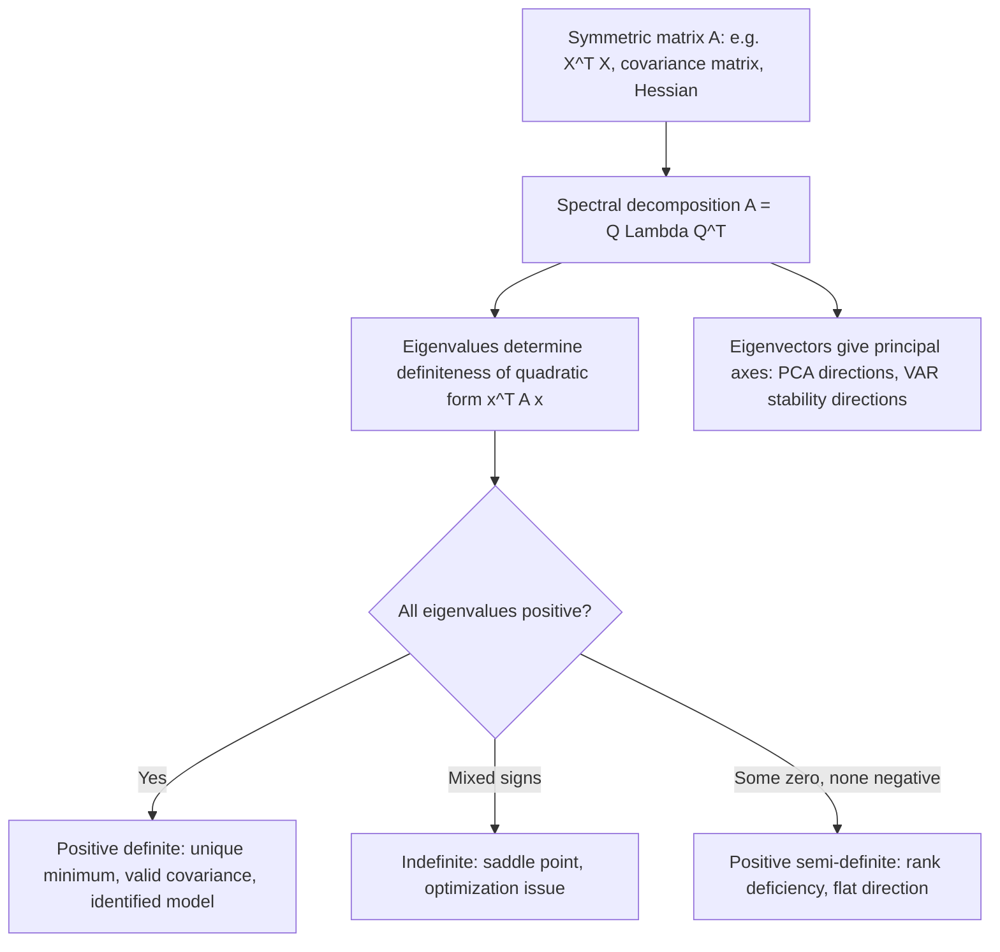

## Eigenvalues, Eigenvectors, and Quadratic Forms

### Definitions

For a square matrix $A \in \mathbb{R}^{n \times n}$, a nonzero vector $\mathbf{v}$ is an **eigenvector** with corresponding **eigenvalue** $\lambda$ if:

$$A\mathbf{v} = \lambda \mathbf{v}$$

This means $A$ acts on $\mathbf{v}$ purely as a scalar rescaling — the direction of $\mathbf{v}$ is preserved (or reversed if $\lambda < 0$), not rotated.

**Key Points**

- Eigenvalues are found by solving the **characteristic equation**: $\det(A - \lambda I) = 0$, a degree-$n$ polynomial in $\lambda$ with (counting multiplicity) exactly $n$ roots over $\mathbb{C}$.
- For each eigenvalue $\lambda_i$, the corresponding eigenvectors span the **eigenspace** $\text{Null}(A - \lambda_i I)$.
- $\text{tr}(A) = \sum_i \lambda_i$ (sum of eigenvalues equals sum of diagonal entries).
- $\det(A) = \prod_i \lambda_i$ (product of eigenvalues equals the determinant).
- $A$ is singular if and only if $0$ is an eigenvalue.

### Worked Example: Computing Eigenvalues and Eigenvectors

Let:

$$A = \begin{pmatrix} 4 & 1 \\ 2 & 3 \end{pmatrix}$$

Characteristic equation:

$$\det(A - \lambda I) = (4-\lambda)(3-\lambda) - 2 = \lambda^2 - 7\lambda + 10 = 0$$

Factoring: $(\lambda - 5)(\lambda - 2) = 0$, so $\lambda_1 = 5$, $\lambda_2 = 2$.

**For $\lambda_1 = 5$**: solve $(A - 5I)\mathbf{v} = \mathbf{0}$:

$$\begin{pmatrix} -1 & 1 \\ 2 & -2 \end{pmatrix}\mathbf{v} = \mathbf{0} \implies v_1 = v_2 \implies \mathbf{v}_1 = \begin{pmatrix}1\\1\end{pmatrix}$$

**For $\lambda_2 = 2$**: solve $(A - 2I)\mathbf{v} = \mathbf{0}$:

$$\begin{pmatrix} 2 & 1 \\ 2 & 1 \end{pmatrix}\mathbf{v} = \mathbf{0} \implies 2v_1 = -v_2 \implies \mathbf{v}_2 = \begin{pmatrix}1\\-2\end{pmatrix}$$

**Output**

| Eigenvalue | Eigenvector | Check: $\text{tr}(A) = 5+2=7$ | $\det(A) = 5 \times 2 = 10$ |
| --- | --- | --- | --- |
| $\lambda_1 = 5$ | $(1, 1)^\top$ | matches $4+3=7$ ✓ | matches $4(3)-1(2)=10$ ✓ |
| $\lambda_2 = 2$ | $(1, -2)^\top$ |  |  |

### Diagonalization and Spectral Decomposition

If $A$ has $n$ linearly independent eigenvectors, it is **diagonalizable**:

$$A = P\Lambda P^{-1}$$

where $P$'s columns are the eigenvectors and $\Lambda = \text{diag}(\lambda_1, \dots, \lambda_n)$.

**Key Points**

- **Spectral Theorem**: every real **symmetric** matrix is diagonalizable by an **orthogonal** matrix, $A = Q\Lambda Q^\top$, where $Q^\top Q = I$ (eigenvectors are orthonormal) and all eigenvalues are real.
- This is the theoretical backbone of **Principal Component Analysis (PCA)**: applied to a covariance matrix $\Sigma$, the eigenvectors (columns of $Q$) are the principal component directions, and the eigenvalues are the variances explained along each direction.
- Diagonalization simplifies matrix powers: $A^k = P\Lambda^k P^{-1}$, useful in dynamic systems (e.g., stability analysis of VAR models, where eigenvalues of the companion matrix determine stationarity).
- Not every matrix is diagonalizable (e.g., defective matrices with repeated eigenvalues but insufficient independent eigenvectors), but symmetric matrices are always diagonalizable — which covers the vast majority of matrices encountered in econometrics ($X^\top X$, covariance matrices, correlation matrices).

### Quadratic Forms

A **quadratic form** in $\mathbf{x} \in \mathbb{R}^n$ associated with symmetric matrix $A$ is the scalar-valued function:

$$Q(\mathbf{x}) = \mathbf{x}^\top A \mathbf{x} = \sum_{i=1}^n \sum_{j=1}^n A_{ij} x_i x_j$$

**Key Points**

- Quadratic forms appear throughout econometrics: the **residual sum of squares** $\text{RSS} = \mathbf{e}^\top \mathbf{e}$, the **Mahalanobis distance** $(\mathbf{x}-\boldsymbol{\mu})^\top \Sigma^{-1} (\mathbf{x}-\boldsymbol{\mu})$, and Wald test statistics $(\hat{\theta} - \theta_0)^\top [\text{Var}(\hat{\theta})]^{-1} (\hat{\theta} - \theta_0)$ are all quadratic forms.
- The sign behavior of $Q(\mathbf{x})$ is fully determined by the eigenvalues of $A$ (since $A$ symmetric $\Rightarrow$ diagonalizable by orthogonal $Q$, so $Q(\mathbf{x}) = \mathbf{y}^\top \Lambda \mathbf{y} = \sum_i \lambda_i y_i^2$ under the change of variables $\mathbf{y} = Q^\top\mathbf{x}$).

### Classification of Quadratic Forms (Definiteness)

| Classification | Condition on $\mathbf{x}^\top A \mathbf{x}$ | Eigenvalue condition |
| --- | --- | --- |
| Positive definite | $> 0$ for all $\mathbf{x} \neq \mathbf{0}$ | all $\lambda_i > 0$ |
| Positive semi-definite | $\geq 0$ for all $\mathbf{x}$ | all $\lambda_i \geq 0$ |
| Negative definite | $< 0$ for all $\mathbf{x} \neq \mathbf{0}$ | all $\lambda_i < 0$ |
| Negative semi-definite | $\leq 0$ for all $\mathbf{x}$ | all $\lambda_i \leq 0$ |
| Indefinite | sign varies with $\mathbf{x}$ | mixed signs |

**Key Points**

- $X^\top X$ is always positive semi-definite (since $\mathbf{x}^\top X^\top X \mathbf{x} = \|X\mathbf{x}\|^2 \geq 0$), and positive **definite** if and only if $X$ has full column rank (linearly independent columns) — directly linking back to the rank/independence discussion and confirming when OLS has a unique solution.
- A variance-covariance matrix $\Sigma$ is always positive semi-definite (and positive definite if no variable is an exact linear combination of others — i.e., no perfect multicollinearity among the underlying random variables).
- The **Hessian matrix** of second partial derivatives in optimization (e.g., maximizing a log-likelihood) must be negative semi-definite at a maximum; checking eigenvalue signs of the Hessian is the standard second-order condition in M-estimation and MLE.
- Practical test for positive definiteness without computing eigenvalues explicitly: **Sylvester's criterion** — all leading principal minors (determinants of the top-left $k \times k$ submatrices) must be strictly positive.

### Diagram: Quadratic Form Level Sets by Definiteness (svg_diagram)

<svg xmlns="http://www.w3.org/2000/svg" viewBox="0 0 640 300">
<rect x="0" y="0" width="640" height="300" fill="#ffffff" />
<text x="320" y="24" font-size="16" font-family="sans-serif" font-weight="bold" text-anchor="middle" fill="#111827">Quadratic Form Level Sets (svg_diagram)</text>

<text x="115" y="55" font-size="12" font-family="sans-serif" font-weight="bold" text-anchor="middle" fill="`#111827`">Positive definite</text>

<line x1="30" y1="150" x2="200" y2="150" stroke="`#d1d5db`" />

<line x1="115" y1="80" x2="115" y2="220" stroke="`#d1d5db`" />

<ellipse cx="115" cy="150" rx="60" ry="35" fill="none" stroke="`#2563eb`" stroke-width="2" />

<ellipse cx="115" cy="150" rx="35" ry="20" fill="none" stroke="`#2563eb`" stroke-width="1.5" opacity="0.6" />

<text x="115" y="245" font-size="11" font-family="sans-serif" text-anchor="middle" fill="`#374151`">bowl-shaped, unique min at 0</text>

<text x="320" y="55" font-size="12" font-family="sans-serif" font-weight="bold" text-anchor="middle" fill="`#111827`">Indefinite</text>

<line x1="235" y1="150" x2="405" y2="150" stroke="`#d1d5db`" />

<line x1="320" y1="80" x2="320" y2="220" stroke="`#d1d5db`" />

<path d="M 260 100 Q 320 150 380 100" fill="none" stroke="`#dc2626`" stroke-width="2" />

<path d="M 260 200 Q 320 150 380 200" fill="none" stroke="`#dc2626`" stroke-width="2" />

<path d="M 290 220 Q 320 150 290 80" fill="none" stroke="`#dc2626`" stroke-width="2" opacity="0.6" />

<path d="M 350 220 Q 320 150 350 80" fill="none" stroke="`#dc2626`" stroke-width="2" opacity="0.6" />

<text x="320" y="245" font-size="11" font-family="sans-serif" text-anchor="middle" fill="`#374151`">saddle point, sign varies</text>

<text x="525" y="55" font-size="12" font-family="sans-serif" font-weight="bold" text-anchor="middle" fill="`#111827`">Positive semi-definite</text>

<line x1="440" y1="150" x2="610" y2="150" stroke="`#d1d5db`" />

<line x1="525" y1="80" x2="525" y2="220" stroke="`#d1d5db`" />

<line x1="470" y1="170" x2="580" y2="130" stroke="`#16a34a`" stroke-width="3" />

<line x1="485" y1="185" x2="565" y2="115" stroke="`#16a34a`" stroke-width="2" opacity="0.6" />

<text x="525" y="245" font-size="11" font-family="sans-serif" text-anchor="middle" fill="`#374151`">flat direction, rank-deficient</text>

<text x="320" y="280" font-size="12" font-family="sans-serif" text-anchor="middle" fill="`#4b5563`">Eigenvalue signs of A determine the curvature of x^T A x along each principal axis</text>

</svg>

### Application: Optimization and Second-Order Conditions

For a twice-differentiable objective function $f(\boldsymbol{\theta})$ (e.g., a log-likelihood $\ell(\boldsymbol{\theta})$ or sum of squared residuals), the **Hessian** $H = \nabla^2 f(\boldsymbol{\theta})$ evaluated at a critical point $\boldsymbol{\theta}^*$ classifies the point:

- $H$ negative definite $\Rightarrow$ local maximum
- $H$ positive definite $\Rightarrow$ local minimum
- $H$ indefinite $\Rightarrow$ saddle point

**Key Points**

- In MLE, the **information matrix** $\mathcal{I}(\theta) = -E[H]$ is required to be positive definite for the asymptotic variance of $\hat{\theta}$ (given by $\mathcal{I}(\theta)^{-1}$) to exist and be well-defined.
- In nonlinear least squares and GMM, checking that the Hessian (or its Gauss-Newton approximation) remains positive definite throughout iterative optimization is a standard numerical diagnostic; a Hessian that loses positive definiteness partway through often signals a poorly identified model or near-flat likelihood surface.

### Application: Stability of Dynamic Systems (VAR Models)

For a VAR(1) process $\mathbf{y}_t = A\mathbf{y}_{t-1} + \boldsymbol{\varepsilon}_t$:

**Key Points**

- The process is **covariance-stationary** if and only if all eigenvalues of $A$ have modulus strictly less than 1: $|\lambda_i| < 1$ for all $i$.
- For higher-order VAR($p$) models, this condition is checked on the eigenvalues of the **companion matrix** (a block matrix reformulation into VAR(1) form).
- [Inference] This eigenvalue-based stability check is standard practice in applied macroeconometrics, though the specific numerical threshold used for "sufficiently less than 1" in finite samples can be a matter of judgment given estimation uncertainty in $\hat{A}$.

### Diagram: From Eigendecomposition to Applications

### Related Topics

- Vector spaces, linear independence, and rank (prerequisite for understanding definiteness conditions)
- Principal Component Analysis (PCA) and factor analysis
- Positive definiteness and Sylvester's criterion in constrained optimization
- Hessian matrices and second-order conditions in MLE/GMM
- VAR model stability and unit root / cointegration analysis
- Singular Value Decomposition (SVD) as a generalization for non-square matrices