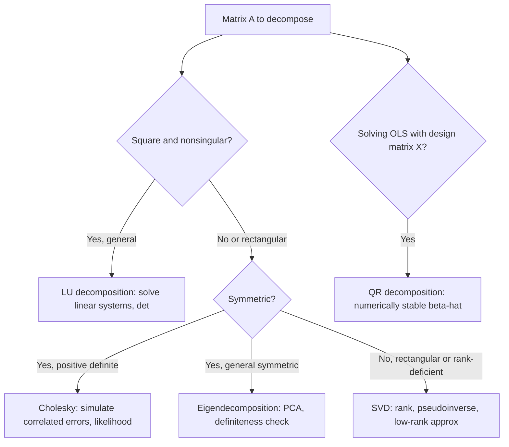

## Matrix Decompositions and Their Applications

### Overview

Matrix decompositions rewrite a matrix as a product of simpler matrices (triangular, diagonal, orthogonal) with special structure. In econometrics they serve three main purposes: **numerical stability** (avoiding direct matrix inversion, which amplifies rounding error), **computational efficiency**, and **structural insight** (revealing rank, definiteness, or variance structure).

### LU Decomposition

Factors a square matrix $A$ as $A = LU$, where $L$ is lower triangular (with unit diagonal) and $U$ is upper triangular. In practice, partial pivoting is used: $PA = LU$, where $P$ is a permutation matrix.

**Key Points**

- Derived from Gaussian elimination — $U$ is the row echelon form obtained during elimination, and $L$ records the elimination multipliers.
- Once $A = LU$, solving $A\mathbf{x} = \mathbf{b}$ reduces to two cheap triangular solves: $L\mathbf{z} = \mathbf{b}$ (forward substitution), then $U\mathbf{x} = \mathbf{z}$ (back substitution), each $O(n^2)$ instead of the $O(n^3)$ cost of full elimination if repeated for multiple right-hand sides.
- $\det(A) = \det(P)^{-1} \prod_i U_{ii}$ (product of pivots, adjusted for row swaps) — this is how software computes determinants efficiently rather than via cofactor expansion.
- LU decomposition requires $A$ to be square and (for the pivot-free version) have nonzero leading principal minors; with partial pivoting it works for any nonsingular square matrix.

### QR Decomposition

Factors $A \in \mathbb{R}^{n \times p}$ (with $n \geq p$, full column rank) as:

$$A = QR$$

where $Q \in \mathbb{R}^{n \times p}$ has orthonormal columns ($Q^\top Q = I_p$) and $R \in \mathbb{R}^{p \times p}$ is upper triangular.

**Key Points**

- Computed via **Gram-Schmidt orthogonalization** (classical or modified, the latter being more numerically stable) or via **Householder reflections** (the standard in production numerical software, e.g., LAPACK).
- **Primary econometric application**: solving OLS without explicitly forming $X^\top X$. Since $X = QR$:

$$X^\top X \hat{\beta} = X^\top \mathbf{y} \implies R^\top Q^\top Q R \hat{\beta} = R^\top Q^\top \mathbf{y} \implies R\hat{\beta} = Q^\top \mathbf{y}$$

which is solved by back substitution on the triangular system $R\hat{\beta} = Q^\top\mathbf{y}$.

**Key Points**

- This QR-based approach avoids explicitly computing $X^\top X$, which squares the **condition number** of the problem (condition number of $X^\top X$ is the square of that of $X$) and thus amplifies numerical error under near-multicollinearity — this is why most professional statistical software (R's `lm()`, many implementations underlying Python's statsmodels) uses QR rather than the normal equations for OLS.
- $\hat{\beta}$ is unique and well-defined precisely when $X$ has full column rank, consistent with the rank/invertibility conditions discussed for $X^\top X$.

### Cholesky Decomposition

For a symmetric **positive definite** matrix $A$, the Cholesky decomposition is:

$$A = LL^\top$$

where $L$ is lower triangular with strictly positive diagonal entries.

**Key Points**

- Exists uniquely if and only if $A$ is symmetric positive definite; a semi-definite (rank-deficient) $A$ requires a modified (pivoted) version.
- Roughly twice as computationally efficient as general LU decomposition, since it exploits symmetry.
- **Applications**: simulating correlated random variables (given desired covariance $\Sigma$, draw $\mathbf{z} \sim N(\mathbf{0}, I)$, then $\mathbf{x} = L\mathbf{z}$ has covariance $LL^\top = \Sigma$ — the standard method in Monte Carlo simulation of multivariate normal errors); efficient evaluation of the multivariate normal log-likelihood (the quadratic form $(\mathbf{x}-\boldsymbol{\mu})^\top \Sigma^{-1} (\mathbf{x}-\boldsymbol{\mu})$ and $\log\det(\Sigma)$ can both be computed cheaply from $L$ without forming $\Sigma^{-1}$ explicitly); a fast numerical test for positive definiteness (Cholesky succeeds if and only if $A \succ 0$).

### Eigendecomposition (Spectral Decomposition)

For a symmetric matrix $A$:

$$A = Q\Lambda Q^\top$$

where $Q$ is orthogonal (eigenvectors as columns) and $\Lambda$ is diagonal (eigenvalues).

**Key Points**

- (As covered under eigenvalues/quadratic forms) foundational to PCA, definiteness checks, and matrix power computation.
- For a non-symmetric square matrix, the general eigendecomposition $A = P\Lambda P^{-1}$ may involve complex eigenvalues/eigenvectors and may not exist at all if $A$ is defective (insufficient independent eigenvectors) — this is why SVD (below) is preferred for general, potentially non-square or non-diagonalizable matrices.

### Singular Value Decomposition (SVD)

For **any** matrix $A \in \mathbb{R}^{m \times n}$ (not necessarily square or full rank):

$$A = U\Sigma V^\top$$

where $U \in \mathbb{R}^{m \times m}$ and $V \in \mathbb{R}^{n \times n}$ are orthogonal, and $\Sigma \in \mathbb{R}^{m \times n}$ is diagonal (rectangular) with non-negative **singular values** $\sigma_1 \geq \sigma_2 \geq \cdots \geq 0$ on the diagonal.

**Key Points**

- SVD always exists, for any matrix, regardless of rank, shape, or symmetry — the most general and numerically robust of all standard decompositions.
- $\text{rank}(A)$ = number of nonzero singular values; this is the numerically preferred method for rank determination in practice, since it is more robust to floating-point rounding than row reduction.
- Relationship to eigendecomposition: the singular values of $A$ are the square roots of the eigenvalues of $A^\top A$ (or $AA^\top$), and the columns of $V$ are the eigenvectors of $A^\top A$.
- **Moore-Penrose pseudoinverse**: $A^+ = V\Sigma^+ U^\top$ (where $\Sigma^+$ inverts nonzero singular values and leaves zeros as zero), giving a well-defined minimum-norm solution to $A\mathbf{x} = \mathbf{b}$ even when $A$ is singular or non-square — used for OLS under perfect multicollinearity or in underdetermined systems ($p > n$, relevant to high-dimensional/regularized regression).
- **Principal Component Analysis** can be computed directly via SVD of the (centered) data matrix rather than eigendecomposition of the covariance matrix, which is often more numerically stable, especially when $n < p$.
- **Low-rank approximation**: truncating $\Sigma$ to its $k$ largest singular values gives the best rank-$k$ approximation to $A$ in the Frobenius/spectral norm sense (Eckart-Young theorem) — the mathematical basis for dimensionality reduction techniques.

### Comparison Table

| Decomposition | Applies to | Form | Primary econometric use |
| --- | --- | --- | --- |
| LU | Square, nonsingular | $PA = LU$ | Efficient linear system solving, determinants |
| QR | Any full-column-rank matrix | $A = QR$ | Numerically stable OLS estimation |
| Cholesky | Symmetric positive definite | $A = LL^\top$ | Simulating correlated errors, likelihood evaluation |
| Eigendecomposition | Symmetric (diagonalizable) | $A = Q\Lambda Q^\top$ | PCA, definiteness, matrix powers |
| SVD | Any matrix | $A = U\Sigma V^\top$ | Rank determination, pseudoinverse, dimensionality reduction |

### Diagram: Decomposition Choice by Matrix Structure

### Diagram: Decomposition Pipeline for OLS Estimation (svg_diagram)

<svg xmlns="http://www.w3.org/2000/svg" viewBox="0 0 660 260">
<rect x="0" y="0" width="660" height="260" fill="#ffffff" />
<text x="330" y="24" font-size="16" font-family="sans-serif" font-weight="bold" text-anchor="middle" fill="#111827">QR-Based OLS Pipeline (svg_diagram)</text>
<rect x="20" y="80" width="120" height="60" rx="6" fill="#dbeafe" stroke="#2563eb" stroke-width="1.5" />
<text x="80" y="115" font-size="13" font-family="sans-serif" text-anchor="middle" fill="#1e3a8a">Design matrix X</text>
<line x1="140" y1="110" x2="185" y2="110" stroke="#374151" stroke-width="2" marker-end="url(#qa)" />
<text x="162" y="100" font-size="10" font-family="sans-serif" text-anchor="middle">decompose</text>
<rect x="185" y="80" width="120" height="60" rx="6" fill="#fef3c7" stroke="#d97706" stroke-width="1.5" />
<text x="245" y="105" font-size="13" font-family="sans-serif" text-anchor="middle" fill="#78350f">X = Q R</text>
<text x="245" y="123" font-size="10" font-family="sans-serif" text-anchor="middle" fill="#78350f">Q orthonormal, R triangular</text>
<line x1="305" y1="110" x2="350" y2="110" stroke="#374151" stroke-width="2" marker-end="url(#qb)" />
<rect x="350" y="80" width="140" height="60" rx="6" fill="#bbf7d0" stroke="#16a34a" stroke-width="1.5" />
<text x="420" y="105" font-size="12" font-family="sans-serif" text-anchor="middle" fill="#14532d">R beta-hat = Q^T y</text>
<text x="420" y="123" font-size="10" font-family="sans-serif" text-anchor="middle" fill="#14532d">back substitution</text>
<line x1="490" y1="110" x2="535" y2="110" stroke="#374151" stroke-width="2" marker-end="url(#qc)" />
<rect x="535" y="80" width="105" height="60" rx="6" fill="#e0e7ff" stroke="#4338ca" stroke-width="1.5" />
<text x="587" y="115" font-size="13" font-family="sans-serif" text-anchor="middle" fill="#312e81">beta-hat</text>

<text x="330" y="190" font-size="12" font-family="sans-serif" text-anchor="middle" fill="`#4b5563`">Avoids forming X^T X directly, preventing condition number squaring</text>

<text x="330" y="210" font-size="12" font-family="sans-serif" text-anchor="middle" fill="`#4b5563`">and preserving numerical accuracy under near-multicollinearity</text>

</svg>

### Worked Example: Cholesky for Correlated Error Simulation

Suppose a Monte Carlo study requires simulating errors $\boldsymbol{\varepsilon} \sim N(\mathbf{0}, \Sigma)$ with:

$$\Sigma = \begin{pmatrix} 4 & 2 \\ 2 & 5 \end{pmatrix}$$

Compute Cholesky factor $L$ such that $LL^\top = \Sigma$:

$$L_{11} = \sqrt{4} = 2, \quad L_{21} = 2/L_{11} = 1, \quad L_{22} = \sqrt{5 - 1^2} = 2$$

$$L = \begin{pmatrix} 2 & 0 \\ 1 & 2 \end{pmatrix}$$

Verify: $LL^\top = \begin{pmatrix} 2 & 0 \\ 1 & 2 \end{pmatrix}\begin{pmatrix} 2 & 1 \\ 0 & 2 \end{pmatrix} = \begin{pmatrix} 4 & 2 \\ 2 & 5 \end{pmatrix}$ ✓

**Output**

Draw $\mathbf{z} = (z_1, z_2)^\top$ with independent standard normal entries, then $\boldsymbol{\varepsilon} = L\mathbf{z}$ has the target covariance $\Sigma$ — this is the standard procedure for generating correlated disturbances or correlated regressors in simulation studies (e.g., studying finite-sample bias under multicollinearity).

### Practical / Software Notes

**Key Points**

- [Inference] Most modern statistical and numerical packages (R, Python/NumPy-SciPy, MATLAB, Stata's Mata) rely on the LAPACK library for these decompositions under the hood; exact function names and default algorithm choices (e.g., which QR method, pivoting strategy) vary by package and version, so behavior specifics should be checked against current documentation.
- SVD is generally the most numerically robust choice when rank or near-singularity is a concern, at higher computational cost than LU/Cholesky for well-conditioned problems.
- Cholesky is preferred whenever positive definiteness is guaranteed (e.g., a valid covariance matrix) due to its speed advantage over full eigendecomposition or SVD.

### Related Topics

- Vector spaces, linear independence, and rank
- Eigenvalues, eigenvectors, and quadratic forms
- Condition number and numerical stability in regression
- Principal Component Analysis via eigendecomposition vs. SVD
- Moore-Penrose pseudoinverse and generalized least squares under rank deficiency
- Multivariate normal distribution simulation and likelihood evaluation