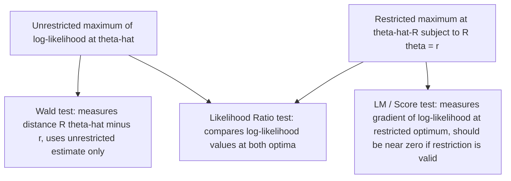

## Matrix Calculus and Optimization

### Purpose and Scope

Matrix calculus generalizes ordinary derivatives to functions of vectors and matrices, enabling compact derivation of estimators (OLS, MLE, GMM) that would otherwise require tedious scalar-by-scalar differentiation. Optimization theory then uses these derivatives to characterize and locate extrema (minima of loss functions, maxima of likelihoods).

### Gradient (Vector Derivative)

For a scalar-valued function $f: \mathbb{R}^n \to \mathbb{R}$, the **gradient** is the vector of partial derivatives:

$$\nabla f(\mathbf{x}) = \begin{pmatrix} \partial f / \partial x_1 \\ \vdots \\ \partial f / \partial x_n \end{pmatrix}$$

**Key Points**

- Convention used throughout (the "denominator layout" / numerator convention varies by textbook — this reference uses the common econometrics convention where $\nabla f$ is a column vector matching $\mathbf{x}$'s shape).
- The gradient points in the direction of steepest ascent of $f$; $-\nabla f$ points toward steepest descent, the basis of gradient-descent optimization algorithms.
- At an interior critical point (local max, min, or saddle), $\nabla f(\mathbf{x}^*) = \mathbf{0}$ — the **first-order condition (FOC)**.

### Essential Vector Derivative Rules

| Function $f(\mathbf{x})$ | Gradient $\nabla f(\mathbf{x})$ |
| --- | --- |
| $\mathbf{a}^\top \mathbf{x}$ (linear form) | $\mathbf{a}$ |
| $\mathbf{x}^\top \mathbf{x}$ | $2\mathbf{x}$ |
| $\mathbf{x}^\top A \mathbf{x}$, $A$ symmetric | $2A\mathbf{x}$ |
| $\mathbf{x}^\top A \mathbf{x}$, $A$ general | $(A + A^\top)\mathbf{x}$ |
| $\mathbf{a}^\top A \mathbf{x}$ | $A^\top \mathbf{a}$ |

**Key Points**

- These rules are the direct multivariate analogues of scalar rules ($\frac{d}{dx}(ax) = a$, $\frac{d}{dx}(x^2) = 2x$), and can be verified component-by-component from the definition.
- The quadratic form rule $\nabla(\mathbf{x}^\top A \mathbf{x}) = 2A\mathbf{x}$ (for symmetric $A$) is the single most-used identity in deriving OLS, since the residual sum of squares is a quadratic form.

### Derivation of the OLS Estimator via Matrix Calculus

The objective is to minimize the residual sum of squares:

$$S(\boldsymbol{\beta}) = (\mathbf{y} - X\boldsymbol{\beta})^\top (\mathbf{y} - X\boldsymbol{\beta})$$

**Step 1 — Expand:**

$$S(\boldsymbol{\beta}) = \mathbf{y}^\top\mathbf{y} - 2\boldsymbol{\beta}^\top X^\top \mathbf{y} + \boldsymbol{\beta}^\top X^\top X \boldsymbol{\beta}$$

**Step 2 — Differentiate** using $\nabla_{\boldsymbol{\beta}}(\mathbf{a}^\top\boldsymbol{\beta}) = \mathbf{a}$ (with $\mathbf{a} = X^\top\mathbf{y}$) and $\nabla_{\boldsymbol{\beta}}(\boldsymbol{\beta}^\top A \boldsymbol{\beta}) = 2A\boldsymbol{\beta}$ (with $A = X^\top X$, symmetric):

$$\nabla_{\boldsymbol{\beta}} S(\boldsymbol{\beta}) = -2X^\top \mathbf{y} + 2X^\top X \boldsymbol{\beta}$$

**Step 3 — Set to zero (FOC)** and solve the **normal equations**:

$$X^\top X \boldsymbol{\beta} = X^\top \mathbf{y} \implies \hat{\boldsymbol{\beta}} = (X^\top X)^{-1} X^\top \mathbf{y}$$

**Step 4 — Second-order condition**: the Hessian is $\nabla^2 S(\boldsymbol{\beta}) = 2X^\top X$, which is positive semi-definite always, and positive **definite** when $X$ has full column rank — confirming $\hat{\boldsymbol{\beta}}$ is a genuine minimum (not a saddle point) exactly under the same full-rank condition required for $(X^\top X)^{-1}$ to exist.

**Output**

| Step | Result |
| --- | --- |
| Objective | $S(\boldsymbol{\beta}) = \|\mathbf{y} - X\boldsymbol{\beta}\|^2$ |
| FOC | $X^\top X\boldsymbol{\beta} = X^\top\mathbf{y}$ |
| Solution | $\hat{\boldsymbol{\beta}} = (X^\top X)^{-1}X^\top\mathbf{y}$ |
| SOC | Hessian $2X^\top X \succeq 0$; strict minimum iff $X$ full column rank |

### The Jacobian Matrix

For a vector-valued function $\mathbf{g}: \mathbb{R}^n \to \mathbb{R}^m$, the **Jacobian** is the $m \times n$ matrix of all first partial derivatives:

$$J = \frac{\partial \mathbf{g}}{\partial \mathbf{x}^\top} = \begin{pmatrix} \partial g_1/\partial x_1 & \cdots & \partial g_1/\partial x_n \\ \vdots & \ddots & \vdots \\ \partial g_m/\partial x_1 & \cdots & \partial g_m/\partial x_n \end{pmatrix}$$

**Key Points**

- For a linear map $\mathbf{g}(\mathbf{x}) = A\mathbf{x}$, the Jacobian is simply $A$.
- The **change-of-variables formula** for probability densities uses the absolute value of the determinant of the Jacobian: if $\mathbf{y} = \mathbf{g}(\mathbf{x})$ is a bijective transformation, $f_Y(\mathbf{y}) = f_X(\mathbf{g}^{-1}(\mathbf{y})) \left| \det J_{\mathbf{g}^{-1}}(\mathbf{y}) \right|$ — essential in deriving distributions of transformed random vectors (e.g., in deriving the Wishart distribution or transformed-error models).
- The Jacobian appears in the **Delta Method**: for $\hat{\boldsymbol{\theta}} \xrightarrow{d} N(\boldsymbol{\theta}, \Sigma)$ and a differentiable transformation $\mathbf{g}(\boldsymbol{\theta})$, $\mathbf{g}(\hat{\boldsymbol{\theta}}) \xrightarrow{d} N(\mathbf{g}(\boldsymbol{\theta}), J\Sigma J^\top)$, where $J$ is the Jacobian of $\mathbf{g}$ evaluated at $\boldsymbol{\theta}$ — the standard tool for obtaining standard errors of nonlinear functions of estimated parameters (e.g., marginal effects, elasticities).

### The Hessian Matrix

The **Hessian** of $f: \mathbb{R}^n \to \mathbb{R}$ is the $n \times n$ matrix of second partial derivatives:

$$H = \nabla^2 f(\mathbf{x}), \quad H_{ij} = \frac{\partial^2 f}{\partial x_i \partial x_j}$$

**Key Points**

- $H$ is always symmetric when $f$ has continuous second partial derivatives (Young's/Clairaut's theorem: $\partial^2 f/\partial x_i \partial x_j = \partial^2 f/\partial x_j \partial x_i$).
- **Second-order conditions**: at a critical point $\mathbf{x}^*$ where $\nabla f(\mathbf{x}^*) = \mathbf{0}$: $H(\mathbf{x}^*) \succ 0$ (positive definite) $\Rightarrow$ local minimum; $H(\mathbf{x}^*) \prec 0$ $\Rightarrow$ local maximum; $H(\mathbf{x}^*)$ indefinite $\Rightarrow$ saddle point.
- In **Maximum Likelihood Estimation**, the negative expected Hessian of the log-likelihood is the **Fisher Information Matrix**: $\mathcal{I}(\theta) = -E\left[\nabla^2 \ell(\theta)\right]$, whose inverse gives the asymptotic Cramér-Rao lower bound variance of the MLE.
- The (negative inverse of the) observed Hessian at the MLE, $[-H(\hat{\theta})]^{-1}$, is the standard plug-in estimator for the variance-covariance matrix of $\hat{\theta}$ reported by most statistical software.

### Constrained Optimization: Lagrange Multipliers

To minimize/maximize $f(\mathbf{x})$ subject to equality constraint $g(\mathbf{x}) = c$, form the **Lagrangian**:

$$\mathcal{L}(\mathbf{x}, \lambda) = f(\mathbf{x}) - \lambda\big(g(\mathbf{x}) - c\big)$$

**Key Points**

- FOCs: $\nabla_{\mathbf{x}} \mathcal{L} = \nabla f(\mathbf{x}) - \lambda \nabla g(\mathbf{x}) = \mathbf{0}$ and $\nabla_\lambda \mathcal{L} = -(g(\mathbf{x}) - c) = 0$ (recovers the constraint).
- Geometrically, at the optimum, $\nabla f$ is parallel to $\nabla g$ — the level curve of $f$ is tangent to the constraint surface.
- **Econometric application**: deriving **Restricted Least Squares** — minimizing $S(\boldsymbol{\beta})$ subject to linear restrictions $R\boldsymbol{\beta} = \mathbf{r}$ yields $\hat{\boldsymbol{\beta}}_R = \hat{\boldsymbol{\beta}} - (X^\top X)^{-1}R^\top\left[R(X^\top X)^{-1}R^\top\right]^{-1}(R\hat{\boldsymbol{\beta}} - \mathbf{r})$, the foundation of the **F-test** for linear hypotheses.
- Constrained MLE (e.g., testing parameter restrictions) similarly uses Lagrangian methods, connecting directly to the **Lagrange Multiplier (LM) / Score test** in the trinity of classical hypothesis tests (Wald, LR, LM).

### Diagram: The Trinity of Classical Tests via Optimization Geometry

### Numerical Optimization Methods

When closed-form solutions (like OLS) are unavailable — as in most nonlinear models (logit, probit, GARCH, nonlinear GMM) — iterative numerical methods locate the optimum.

**Key Points**

- **Newton-Raphson**: updates $\boldsymbol{\theta}_{k+1} = \boldsymbol{\theta}_k - [H(\boldsymbol{\theta}_k)]^{-1}\nabla f(\boldsymbol{\theta}_k)$, using both gradient and Hessian; converges quadratically near the optimum but requires computing/inverting the Hessian each iteration.
- **Method of Scoring**: replaces the observed Hessian with the expected Hessian (Fisher Information), often more stable and used specifically for likelihood maximization.
- **BHHH (Berndt-Hall-Hall-Hausman)**: approximates the Hessian using the outer product of individual score contributions (the "OPG" estimator), avoiding second-derivative computation entirely — widely used in econometric MLE software.
- **Gradient descent / quasi-Newton (BFGS, L-BFGS)**: use only gradient information (or approximate curvature), generally more robust but slower to converge than Newton-Raphson for well-behaved problems.
- [Inference] The specific default optimizer used by a given statistical package (e.g., for `glm()`, `optim()`, or MLE routines) varies across software and versions, and convergence behavior can depend on starting values and problem scaling — practitioners should consult the specific tool's documentation rather than assume a universal default.

### Diagram: Newton-Raphson Iteration Geometry (svg_diagram)

<svg xmlns="http://www.w3.org/2000/svg" viewBox="0 0 600 280">
<rect x="0" y="0" width="600" height="280" fill="#ffffff" />
<text x="300" y="24" font-size="16" font-family="sans-serif" font-weight="bold" text-anchor="middle" fill="#111827">Newton-Raphson Iteration (svg_diagram)</text>
<line x1="40" y1="230" x2="560" y2="230" stroke="#9ca3af" stroke-width="1" />
<text x="565" y="235" font-size="11" font-family="sans-serif" fill="#374151">theta</text>
<path d="M 60 200 Q 200 20 320 80 Q 420 130 560 210" fill="none" stroke="#2563eb" stroke-width="2.5" />
<text x="180" y="45" font-size="11" font-family="sans-serif" fill="#2563eb">log-likelihood f(theta)</text>
<circle cx="140" cy="130" r="4" fill="#dc2626" />
<text x="140" y="150" font-size="11" font-family="sans-serif" text-anchor="middle" fill="#dc2626">theta_0</text>
<line x1="140" y1="130" x2="140" y2="230" stroke="#dc2626" stroke-width="1" stroke-dasharray="3,2" />
<circle cx="230" cy="55" r="4" fill="#16a34a" />
<text x="230" y="40" font-size="11" font-family="sans-serif" text-anchor="middle" fill="#16a34a">theta_1</text>
<line x1="230" y1="55" x2="230" y2="230" stroke="#16a34a" stroke-width="1" stroke-dasharray="3,2" />
<circle cx="255" cy="48" r="4" fill="#7c3aed" />
<text x="278" y="48" font-size="11" font-family="sans-serif" fill="#7c3aed">theta* (converged)</text>
<path d="M 140 130 Q 190 90 230 55" fill="none" stroke="#374151" stroke-width="1.5" marker-end="url(#nr)" />
<text x="155" y="95" font-size="10" font-family="sans-serif" fill="#374151">step using -H^-1 grad(f)</text>

<text x="300" y="260" font-size="12" font-family="sans-serif" text-anchor="middle" fill="`#4b5563`">Each step uses local curvature (Hessian) to jump toward the maximum, converging quadratically near theta*</text>

</svg>

### Chain Rule and Composite Functions

**Key Points**

- For $f(\mathbf{g}(\mathbf{x}))$ where $\mathbf{g}: \mathbb{R}^n \to \mathbb{R}^m$ and $f: \mathbb{R}^m \to \mathbb{R}$: $\nabla_{\mathbf{x}} f(\mathbf{g}(\mathbf{x})) = J_{\mathbf{g}}(\mathbf{x})^\top \nabla f(\mathbf{g}(\mathbf{x}))$, the matrix-calculus chain rule.
- This underlies **backpropagation-style** derivative computation in nonlinear models (e.g., deriving gradients for maximum likelihood in models with link functions, such as the logit/probit log-likelihood gradient involving both the linear index $X\boldsymbol{\beta}$ and the nonlinear link).
- Example: for logistic regression, $p_i = \Lambda(\mathbf{x}_i^\top\boldsymbol{\beta})$ where $\Lambda$ is the logistic CDF; the log-likelihood gradient $\nabla_{\boldsymbol{\beta}} \ell(\boldsymbol{\beta}) = \sum_i (y_i - p_i)\mathbf{x}_i = X^\top(\mathbf{y} - \mathbf{p})$ follows directly from the chain rule applied through the link function.

### Related Topics

- Eigenvalues, eigenvectors, and quadratic forms (Hessian definiteness)
- Matrix decompositions (Cholesky/QR use in optimization routines)
- Maximum Likelihood Estimation: asymptotic theory and information matrix
- Wald, Likelihood Ratio, and Lagrange Multiplier test trinity
- Nonlinear least squares and Gauss-Newton algorithm
- Delta method and asymptotic variance of nonlinear transformations