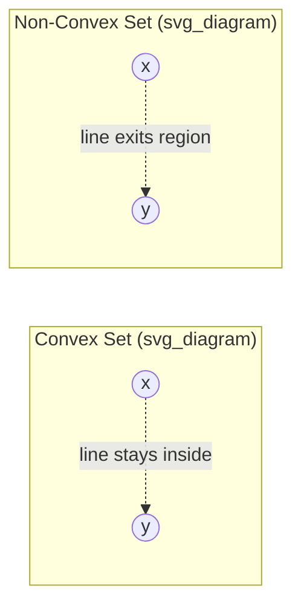

## Convex Analysis and Constrained Optimization

### Introduction

Convex analysis provides the mathematical scaffolding underlying most estimation and inference procedures in statistics and econometrics: maximum likelihood, M-estimation, quantile regression, LASSO-type regularization, and support vector machines all reduce to convex or partially convex optimization problems. Understanding convexity guarantees existence, uniqueness, and computational tractability of solutions, and constrained optimization theory (Lagrangian duality, KKT conditions) explains estimator behavior under restrictions such as parameter constraints, moment conditions, or sparsity penalties.

### Convex Sets

**Definition**

A set $C \subseteq \mathbb{R}^n$ is convex if for all $x, y \in C$ and $\lambda \in [0,1]$:

$$\lambda x + (1-\lambda) y \in C$$

**Key Points**

- Intersections of convex sets are convex; unions generally are not.
- Examples relevant to econometrics: the parameter space for probabilities $[0,1]^k$, the simplex $\{p \in \mathbb{R}^k_+ : \sum p_i = 1\}$ used in GMM weighting, positive semidefinite matrix cones (covariance estimation), and half-spaces defined by linear moment restrictions.
- A **convex hull** $\text{conv}(S)$ is the smallest convex set containing $S$; relevant in bounds analysis and partial identification (e.g., Manski bounds).

**Illustration**

### Convex Functions

**Definition**

$f: \mathbb{R}^n \to \mathbb{R}$ is convex if its domain is convex and for all $x, y$, $\lambda \in [0,1]$:

$$f(\lambda x + (1-\lambda) y) \le \lambda f(x) + (1-\lambda) f(y)$$

Strict convexity replaces $\le$ with $<$ for $x \neq y$, $\lambda \in (0,1)$, and guarantees a unique minimizer when one exists.

**First- and Second-Order Characterizations**

If $f$ is differentiable:

$$f(y) \ge f(x) + \nabla f(x)^\top (y - x) \quad \forall x,y$$

If $f$ is twice differentiable, $f$ is convex iff its Hessian is positive semidefinite everywhere:

$$\nabla^2 f(x) \succeq 0$$

**Key Points**

- Strong convexity ($\nabla^2 f \succeq mI$ for $m>0$) yields linear convergence rates in gradient-based estimation algorithms and tighter concentration bounds for M-estimators.
- The negative log-likelihood of many exponential-family models (Gaussian, Poisson, logistic) is convex in the natural parameter, which is why MLE in GLMs is typically a well-behaved convex program.
- $L_p$ norms for $p \ge 1$ are convex; this underlies convexity of LASSO ($L_1$) and Ridge ($L_2$) penalties.
- Quantile loss (check function) $\rho_\tau(u) = u(\tau - \mathbb{1}\{u<0\})$ is convex but not differentiable, motivating subgradient methods.

**Example**

Show the OLS objective $f(\beta) = \|y - X\beta\|_2^2$ is convex:

$$\nabla^2 f(\beta) = 2X^\top X \succeq 0$$

since $X^\top X$ is positive semidefinite for any $X$, confirming global convexity and explaining why the normal equations $X^\top X \beta = X^\top y$ yield a global minimum (unique if $X^\top X \succ 0$, i.e., $X$ has full column rank).

### Convex Optimization Problems

**Standard Form**

$$\min_{x} f_0(x) \quad \text{s.t.} \quad f_i(x) \le 0,\ i=1,\dots,m, \quad h_j(x) = 0,\ j=1,\dots,p$$

This is a convex program when $f_0, f_1,\dots,f_m$ are convex and $h_j$ are affine. Under these conditions, any local minimum is a global minimum — the central computational advantage exploited throughout econometric estimation.

**Key Points**

- Linear programming, quadratic programming (with PSD Hessian), and second-order cone programming are all special cases.
- GMM with a fixed weighting matrix is a convex quadratic program in $\beta$ when moment conditions are linear in parameters.
- Non-convex econometric problems (e.g., mixture models, some nonlinear GMM, MLE for models with multimodal likelihoods) lose the local-equals-global guarantee, motivating multiple starting values or convex relaxations.

### Lagrangian Duality

**The Lagrangian**

$$\mathcal{L}(x, \lambda, \nu) = f_0(x) + \sum_{i=1}^m \lambda_i f_i(x) + \sum_{j=1}^p \nu_j h_j(x)$$

where $\lambda_i \ge 0$ are dual variables for inequality constraints and $\nu_j$ are unrestricted for equality constraints.

**Dual Function and Weak Duality**

$$g(\lambda, \nu) = \inf_x \mathcal{L}(x,\lambda,\nu)$$

Weak duality always holds: $g(\lambda,\nu) \le p^\star$ for any feasible $\lambda \ge 0, \nu$, where $p^\star$ is the primal optimal value. Under **Slater's condition** (existence of a strictly feasible point for convex problems), strong duality holds: $d^\star = p^\star$, meaning the duality gap is zero.

**Key Points**

- Duality underlies computation of standard errors in constrained GMM and the interpretation of Lagrange multipliers as shadow prices — the marginal change in the objective per unit relaxation of a constraint.
- In LASSO, the dual problem provides safe screening rules and connects the tuning parameter $\lambda$ to an implicit constraint on $\|\beta\|_1$.

### Karush-Kuhn-Tucker (KKT) Conditions

For a convex problem satisfying constraint qualification (e.g., Slater's condition), $x^\star$ is optimal if and only if there exist $\lambda^\star \ge 0$, $\nu^\star$ such that:

$$\text{Stationarity:} \quad \nabla f_0(x^\star) + \sum_i \lambda_i^\star \nabla f_i(x^\star) + \sum_j \nu_j^\star \nabla h_j(x^\star) = 0$$

$$\text{Primal feasibility:} \quad f_i(x^\star) \le 0,\ h_j(x^\star) = 0$$

$$\text{Dual feasibility:} \quad \lambda_i^\star \ge 0$$

$$\text{Complementary slackness:} \quad \lambda_i^\star f_i(x^\star) = 0 \ \forall i$$

**Key Points**

- Complementary slackness formalizes that either a constraint binds ($f_i(x^\star)=0$) or its multiplier is zero — central to interpreting active constraints in constrained MLE (e.g., variance components bounded at zero, imposing non-negativity on variance parameters).
- In LASSO, the KKT conditions for the subgradient of $\|\beta\|_1$ produce the well-known characterization: coefficients are zero exactly when $|X_j^\top(y - X\beta)| \le \lambda$, giving the basis for coordinate descent and LARS algorithms.
- For inequality-constrained econometric estimators (e.g., estimating a production function with monotonicity/concavity constraints), KKT conditions determine which shape constraints bind at the optimum.

**Example**

Ridge regression with an explicit constraint, $\min \|y-X\beta\|_2^2$ s.t. $\|\beta\|_2^2 \le t$:

$$\mathcal{L}(\beta,\lambda) = \|y-X\beta\|_2^2 + \lambda(\|\beta\|_2^2 - t)$$

Stationarity gives $\beta^\star = (X^\top X + \lambda I)^{-1}X^\top y$ — the familiar ridge estimator, with $\lambda$ acting as the Lagrange multiplier on the norm constraint. This equivalence between the penalized (Lagrangian) form and the constrained form is a standard duality result, valid for the specific $\lambda$ that corresponds to the chosen $t$.

### Constrained Optimization Algorithms in Econometric Practice

**Key Points**

- **Projected gradient descent**: for simple constraint sets (boxes, simplices), project iterates back onto the feasible region after each gradient step.
- **Interior-point methods**: solve a sequence of unconstrained problems using log-barrier functions to approximate inequality constraints, standard in commercial QP/NLP solvers used for GMM and MLE with parameter restrictions.
- **Active-set methods**: iteratively guess which inequality constraints are binding, solve the resulting equality-constrained problem, and update the active set — efficient for constrained least squares with a moderate number of inequality constraints (e.g., monotonicity-constrained regression).
- **Coordinate descent / proximal gradient**: exploit separability of $L_1$-type penalties; standard for LASSO, elastic net, and grouped-variable selection (group LASSO) in high-dimensional econometrics.
- **Augmented Lagrangian / ADMM**: split composite objectives (loss + penalty) into subproblems, widely used for scalable estimation with sparsity and fused constraints (e.g., fused LASSO for structural breaks).

### Applications in Statistics and Econometrics

**Key Points**

- **MLE with parameter restrictions**: imposing $\sigma^2 \ge 0$, correlation coefficients in $[-1,1]$, or cointegrating rank restrictions are constrained convex (or convexifiable) programs.
- **Quantile regression**: reformulated as a linear program via the check-function's convex piecewise-linear structure, solvable by simplex or interior-point methods.
- **Support Vector Machines / classification-based econometric methods**: quadratic program with box constraints on dual variables via the kernel trick.
- **GMM and Empirical Likelihood**: EL maximizes an entropy-like concave objective subject to moment-matching equality constraints, solved via inner/outer Lagrangian duality (Owen's EL framework).
- **Portfolio optimization / Markowitz**: minimize variance $x^\top \Sigma x$ subject to budget and return constraints — canonical convex QP with direct KKT interpretation of the efficient frontier.
- **Isotonic and shape-constrained regression**: monotonicity/convexity constraints handled via convex QP with corresponding KKT active-set structure.

### Common Pitfalls

**Key Points**

- Mistaking a stationary point for a global minimum in non-convex settings (e.g., nonlinear GMM with a non-convex objective) — only convexity guarantees this equivalence. [Inference: convergence behavior in specific non-convex applied problems may vary by starting values and solver, so this should be treated as solver-and-problem-dependent]
- Ignoring constraint qualification (Slater's condition failing) can break strong duality, leading to a nonzero duality gap and biased inference from Lagrange-multiplier-based tests.
- Applying standard asymptotic theory (normality of $\sqrt{n}(\hat\theta - \theta_0)$) directly to constrained estimators when constraints bind at the true parameter value — boundary problems require specialized asymptotics (e.g., Andrews, 1999, for parameters on the boundary of the parameter space).

**Related Topics**

- Lagrange multiplier (score) tests and their relationship to KKT multipliers
- Subgradient methods and non-smooth convex optimization
- Duality theory in empirical likelihood and generalized empirical likelihood (GEL)
- Semidefinite programming for covariance matrix estimation
- Non-convex optimization: EM algorithm and local optima in mixture models
- LASSO, elastic net, and other regularization paths
- Shape-constrained nonparametric regression (isotonic, convex regression)
- Interior-point methods and computational complexity of convex programs