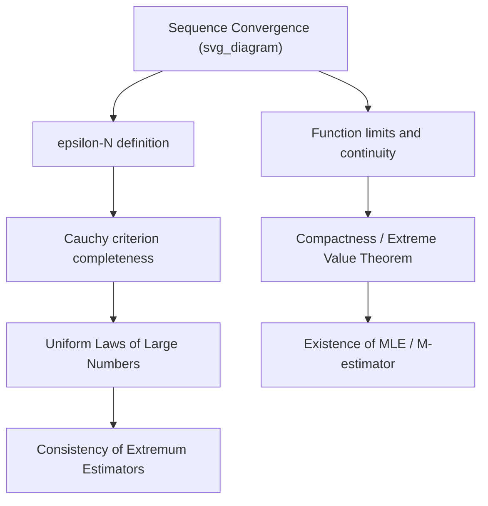

## Real Analysis and Limit Concepts

### Introduction

Real analysis furnishes the rigorous foundation for asymptotic theory in statistics and econometrics — consistency, convergence in probability, and limiting distributions all rest on precise notions of sequences, limits, continuity, and completeness. Without this machinery, statements like "the estimator converges to the true parameter as $n \to \infty$" have no formal meaning.

### Sequences and Limits

**Definition**

A sequence $\{x_n\}$ converges to $L$ (written $x_n \to L$ or $\lim_{n\to\infty} x_n = L$) if:

$$\forall \varepsilon > 0,\ \exists N \in \mathbb{N} \text{ such that } n > N \implies |x_n - L| < \varepsilon$$

**Key Points**

- This $\varepsilon$-$N$ definition is the template for later probabilistic convergence definitions (convergence in probability replaces $|x_n - L|$ with a probability statement).
- A sequence that converges is bounded, but boundedness does not imply convergence (e.g., $(-1)^n$).
- **Monotone Convergence Theorem**: a bounded monotone sequence in $\mathbb{R}$ always converges — used to establish existence of limits for MLE profile likelihood sequences and EM algorithm iterates.
- **Cauchy sequences**: $\{x_n\}$ is Cauchy if $\forall \varepsilon>0,\ \exists N$ such that $m,n>N \implies |x_n-x_m|<\varepsilon$. Because $\mathbb{R}$ is **complete**, every Cauchy sequence converges — this completeness property is what guarantees numerical optimization algorithms (gradient descent, Newton-Raphson) converge to a limit when iterates become arbitrarily close to each other.

### Limits of Functions and Continuity

**Definition**

$$\lim_{x \to a} f(x) = L \iff \forall \varepsilon>0,\ \exists \delta>0 \text{ s.t. } 0<|x-a|<\delta \implies |f(x)-L|<\varepsilon$$

$f$ is continuous at $a$ if $\lim_{x\to a} f(x) = f(a)$.

**Key Points**

- **Uniform continuity** strengthens pointwise continuity by requiring $\delta$ to work uniformly across the domain — relevant to establishing uniform laws of large numbers (ULLN), which underlie consistency proofs for extremum estimators over a parameter space.
- **Lipschitz continuity** ($|f(x)-f(y)| \le K|x-y|$) is a common regularity condition imposed on moment functions in GMM/M-estimation to control the modulus of continuity in stochastic equicontinuity arguments.
- The **Extreme Value Theorem** (continuous functions on compact sets attain max/min) underlies existence proofs for M-estimators and MLE: if the objective is continuous and the parameter space is compact, a maximizer exists.

### Compactness

**Key Points**

- A set $K \subset \mathbb{R}^n$ is compact iff it is closed and bounded (Heine-Borel theorem).
- Compactness of the parameter space is a standard regularity condition (e.g., in Newey and McFadden's extremum estimator consistency theorems) ensuring the existence of a well-defined maximizer/minimizer and enabling uniform convergence arguments.
- Sequential compactness (every sequence has a convergent subsequence) is the practical tool used in consistency proofs: any sequence of parameter estimates in a compact space has a convergent subsequence, whose limit is then shown to equal the true parameter.

### Modes of Convergence (Bridge to Probability)

While full measure-theoretic treatment belongs to probability theory, several deterministic analogs matter directly:

**Key Points**

- **Pointwise vs. uniform convergence of functions**: $f_n \to f$ pointwise does not imply $f_n \to f$ uniformly; uniform convergence is required to interchange limits and integrals/derivatives (justifying, e.g., differentiating an expected log-likelihood under the integral sign).
- **Dominated Convergence Theorem** (Lebesgue): if $f_n \to f$ pointwise and $|f_n| \le g$ for an integrable $g$, then $\int f_n \to \int f$ — this is the formal justification for many "interchange limit and expectation" steps in asymptotic theory (e.g., showing the expected score function has mean zero).
- **Monotone Convergence Theorem (measure-theoretic version)**: parallels the sequence version and justifies limit-integral interchanges when integrands increase monotonically, used in some variance calculations.

**Illustration**

### Differentiability and Taylor Expansions

**Key Points**

- Differentiability of the log-likelihood is required for score-function-based inference; twice differentiability with continuity of the second derivative supports the **Taylor expansion argument** central to deriving the asymptotic normality of MLE:

$$\ell'(\hat\theta) \approx \ell'(\theta_0) + \ell''(\theta_0)(\hat\theta - \theta_0)$$

- **Mean Value Theorem**: used to bound remainder terms in Taylor expansions within consistency and asymptotic normality proofs — $\exists \xi$ between $\theta_0$ and $\hat\theta$ such that $\ell'(\hat\theta) - \ell'(\theta_0) = \ell''(\xi)(\hat\theta-\theta_0)$.
- **Implicit Function Theorem**: used to characterize how estimators defined implicitly by first-order conditions (e.g., $g(\hat\theta, X) = 0$) vary smoothly with the data, foundational to the delta method and sensitivity analysis.

**Example**

Delta method derivation sketch: if $\sqrt{n}(\hat\theta - \theta_0) \xrightarrow{d} N(0,\Sigma)$ and $g$ is continuously differentiable at $\theta_0$, a first-order Taylor expansion gives:

$$\sqrt{n}(g(\hat\theta) - g(\theta_0)) \approx \nabla g(\theta_0)^\top \sqrt{n}(\hat\theta - \theta_0) \xrightarrow{d} N(0, \nabla g(\theta_0)^\top \Sigma \nabla g(\theta_0))$$

The rigor of this argument depends entirely on real-analytic differentiability and continuity conditions on $g$.

### Metric Spaces and Function Spaces

**Key Points**

- Statistical asymptotics increasingly relies on convergence in infinite-dimensional function spaces (e.g., empirical processes indexed by a class of functions) — requiring notions of metric spaces beyond $\mathbb{R}^n$.
- **Completeness of function spaces** (e.g., $L^2$) underlies the existence and properties of projection-based estimators (sieve estimation, nonparametric regression).
- **Arzelà–Ascoli theorem** (equicontinuity + boundedness implies relative compactness) is the analytic backbone of stochastic equicontinuity conditions used to establish uniform convergence of empirical processes — critical in semiparametric and nonparametric estimation theory.

### Common Pitfalls

**Key Points**

- Confusing pointwise convergence with uniform convergence when justifying interchange of limits, sums, and integrals in derivations of estimator properties.
- Assuming continuity is sufficient where **uniform continuity** or **Lipschitz continuity** is actually required for uniform convergence arguments (e.g., ULLN proofs).
- Overlooking that compactness of the parameter space is not innocuous — with unbounded parameter spaces, additional tail conditions are needed to ensure existence and consistency of estimators. [Inference: the precise regularity conditions required vary by estimator class and are typically stated explicitly in the relevant asymptotic theory reference, so this generalization should be checked against the specific estimator under study]

**Related Topics**

- Measure theory and probability foundations
- Stochastic convergence: convergence in probability, almost sure convergence, convergence in distribution
- Uniform laws of large numbers and stochastic equicontinuity
- Empirical process theory
- Delta method and asymptotic normality of M-estimators
- Functional analysis for semiparametric/nonparametric estimation
- Implicit function theorem applications in GMM