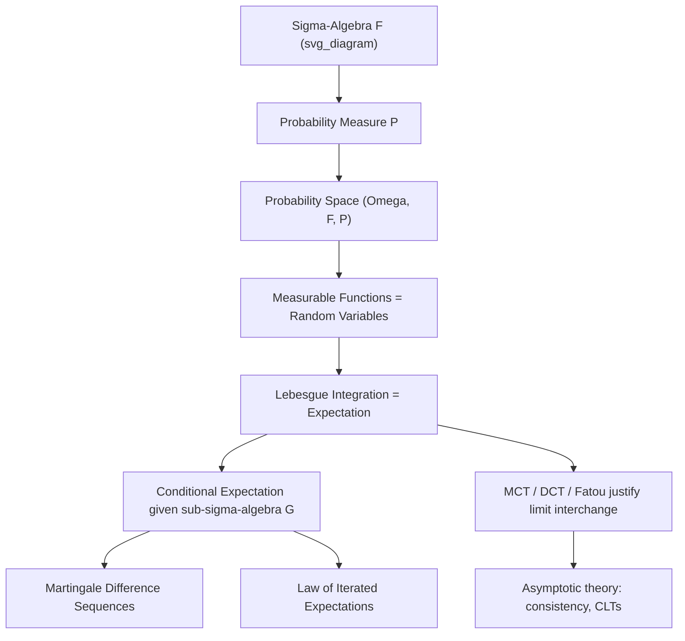

## Measure-Theoretic Preliminaries

### Introduction

Measure theory provides the rigorous foundation of modern probability theory, resolving pathologies that arise when trying to assign "probability" or "size" to arbitrary subsets of infinite sample spaces. Econometrics and statistics rely on measure theory to define random variables and expectations formally, justify limit interchanges in asymptotic theory, and handle continuous, discrete, and mixed distributions within a single unified framework.

### Sigma-Algebras

**Definition**

A collection $\mathcal{F}$ of subsets of a set $\Omega$ is a $\sigma$-algebra if:

1. $\Omega \in \mathcal{F}$
2. $A \in \mathcal{F} \implies A^c \in \mathcal{F}$ (closed under complementation)
3. $A_1, A_2, \dots \in \mathcal{F} \implies \bigcup_{i=1}^\infty A_i \in \mathcal{F}$ (closed under countable unions)

**Key Points**

- The pair $(\Omega, \mathcal{F})$ is called a **measurable space**.
- $\mathcal{F}$ represents the collection of "events" to which probabilities can be meaningfully assigned; not every subset of $\Omega$ need be measurable for uncountable $\Omega$.
- The **Borel $\sigma$-algebra** $\mathcal{B}(\mathbb{R})$, generated by open intervals, is the standard $\sigma$-algebra on $\mathbb{R}$ and underlies virtually all continuous-variable statistical models.
- **Filtrations** $\{\mathcal{F}_t\}$ (increasing sequences of $\sigma$-algebras) formalize information accumulation over time — essential in time series econometrics for defining martingale difference sequences and conditional expectations given past information.

### Measures and Probability Measures

**Definition**

A measure $\mu: \mathcal{F} \to [0,\infty]$ satisfies:

1. $\mu(\emptyset) = 0$
2. **Countable additivity**: for disjoint $A_1, A_2, \dots \in \mathcal{F}$,

   $$\mu\left(\bigcup_{i=1}^\infty A_i\right) = \sum_{i=1}^\infty \mu(A_i)$$

A **probability measure** $P$ additionally satisfies $P(\Omega) = 1$. The triple $(\Omega, \mathcal{F}, P)$ is a **probability space**.

**Key Points**

- Countable additivity (rather than merely finite additivity) is what enables limit theorems — continuity of measure from below/above depends on it.
- **Continuity from below**: if $A_n \uparrow A$ (increasing sequence with union $A$), then $\mu(A_n) \to \mu(A)$ — used directly in proofs of almost-sure convergence.
- **Lebesgue measure** on $\mathbb{R}^n$ is the canonical measure generalizing length/area/volume, providing the reference measure for continuous distributions.
- **Counting measure** underlies discrete probability distributions within the same unified framework.

### Measurable Functions and Random Variables

**Definition**

A function $X: \Omega \to \mathbb{R}$ is **measurable** (a random variable) with respect to $\mathcal{F}$ if:

$$X^{-1}((-\infty, a]) = \{\omega \in \Omega : X(\omega) \le a\} \in \mathcal{F} \quad \forall a \in \mathbb{R}$$

**Key Points**

- This formalizes the intuitive requirement that "the probability that $X \le a$" be a well-defined event.
- Measurability with respect to a sub-$\sigma$-algebra $\mathcal{G} \subset \mathcal{F}$ formalizes the notion that a random variable is "known" or "determined" given the information in $\mathcal{G}$ — foundational for conditional expectation.
- Sums, products, and (pointwise) limits of measurable functions are measurable — a closure property that justifies constructing complex statistics (sample means, order statistics, empirical CDFs) from simple random variables while retaining measurability.

### Integration and Expectation

**Definition**

The **Lebesgue integral** of a measurable function $X$ with respect to $P$ (i.e., the expectation) is constructed in stages: first for simple functions (finite linear combinations of indicators), then extended via monotone limits to nonnegative measurable functions, then to general measurable functions via $X = X^+ - X^-$:

$$E[X] = \int_\Omega X \, dP$$

**Key Points**

- The Lebesgue integral generalizes the Riemann integral and, critically, handles a broader class of functions and permits interchange of limits and integration under weaker conditions.
- **Monotone Convergence Theorem (MCT)**: if $0 \le X_n \uparrow X$, then $E[X_n] \to E[X]$.
- **Dominated Convergence Theorem (DCT)**: if $X_n \to X$ a.s. and $|X_n| \le Y$ with $E[Y] < \infty$, then $E[X_n] \to E[X]$. This is the workhorse theorem for justifying "interchange expectation and limit" steps throughout asymptotic theory (e.g., showing that the expected score function is zero at the true parameter, or that variance formulas can be computed by differentiating under the integral).
- **Fatou's Lemma**: $E[\liminf X_n] \le \liminf E[X_n]$ for nonnegative $X_n$ — a weaker but more broadly applicable tool when domination fails.

**Example**

Interchanging differentiation and integration to derive the information matrix equality relies on DCT: given a parametric density $f(x;\theta)$ satisfying regularity conditions,

$$\frac{\partial}{\partial \theta}\int f(x;\theta)\,dx = \int \frac{\partial f(x;\theta)}{\partial \theta}\,dx$$

is valid because DCT permits swapping the derivative (a limit) with the integral, provided the derivative is dominated by an integrable function — this technical condition is often glossed over in applied treatments but is precisely a measure-theoretic requirement.

### Conditional Expectation

**Definition**

Given $(\Omega,\mathcal{F},P)$ and a sub-$\sigma$-algebra $\mathcal{G} \subset \mathcal{F}$, the conditional expectation $E[X \mid \mathcal{G}]$ is the (a.s. unique) $\mathcal{G}$-measurable random variable satisfying:

$$\int_A E[X\mid\mathcal{G}]\, dP = \int_A X\, dP \quad \forall A \in \mathcal{G}$$

**Key Points**

- This measure-theoretic definition of conditional expectation subsumes the elementary "conditional density" definition and extends naturally to conditioning on continuous random variables or infinite-dimensional information sets — essential for formalizing regression as $E[Y\mid X]$.
- **Law of Iterated Expectations**: $E[E[X\mid\mathcal{G}]] = E[X]$, and more generally $E[E[X\mid\mathcal{F}_1]\mid\mathcal{F}_2] = E[X\mid\mathcal{F}_2]$ for $\mathcal{F}_2 \subset \mathcal{F}_1$ — the theoretical basis for the tower property used constantly in deriving moment conditions and instrument validity in IV estimation.
- **Martingale difference sequences** ($E[\varepsilon_t \mid \mathcal{F}_{t-1}] = 0$) are defined directly via conditional expectation with respect to a filtration, forming the basis of martingale CLTs used in time series and panel asymptotics.

**Illustration**

### Distributions, Densities, and the Radon–Nikodym Theorem

**Key Points**

- A random variable $X$ induces a **distribution (pushforward) measure** $P_X$ on $(\mathbb{R}, \mathcal{B}(\mathbb{R}))$ via $P_X(B) = P(X^{-1}(B))$.
- The **Radon–Nikodym theorem** guarantees that if $P_X$ is absolutely continuous with respect to Lebesgue measure $\lambda$ (written $P_X \ll \lambda$), then there exists a density $f$ such that $P_X(B) = \int_B f\, d\lambda$ — this theorem is what formally justifies writing $P(X \in B) = \int_B f(x)\,dx$ for continuous random variables.
- This same theorem underlies the existence of the **likelihood ratio** in hypothesis testing and change-of-measure arguments (e.g., Girsanov-type reweighting in some estimation contexts) whenever one probability measure is absolutely continuous with respect to another.

### Independence and Product Measures

**Key Points**

- Events $A, B$ are independent if $P(A \cap B) = P(A)P(B)$; random variables $X,Y$ are independent if their joint distribution equals the product measure of their marginals: $P_{X,Y} = P_X \times P_Y$.
- **Fubini's theorem** permits computing integrals with respect to product measures as iterated integrals, subject to integrability conditions — used to justify computing expectations of functions of independent random variables via iterated expectation.
- The i.i.d. sampling assumption ubiquitous in cross-sectional econometrics is formally the assumption that observations are drawn according to a product probability measure.

### Almost Sure Statements and Null Sets

**Key Points**

- A property holds **almost surely (a.s.)** if it holds on a set of probability 1, i.e., the set where it fails is a **null set** ($P(N) = 0$).
- This distinction (a.s. vs. everywhere) is measure-theoretically essential: strong laws of large numbers, almost sure convergence of estimators, and pathwise properties of stochastic processes are all stated a.s., not for every $\omega \in \Omega$.
- Two random variables that agree a.s. are considered "the same" random variable for essentially all statistical purposes, since expectations and probabilities are insensitive to null sets.

### Common Pitfalls

**Key Points**

- Conflating the elementary "density" definition of conditional expectation with its measure-theoretic definition — the latter is required when conditioning on continuous or infinite-dimensional information sets (e.g., conditioning on an entire past sample path in time series).
- Assuming interchange of limit and expectation is automatic; DCT or MCT conditions must actually be verified (or at least plausibly assumed) — a step frequently elided in applied derivations. [Inference: the specific integrability/domination conditions needed vary by application and should be checked against the relevant regularity conditions in the source derivation]
- Treating measurability as a technical formality rather than a substantive restriction — in econometric applications involving infinite-dimensional parameter spaces (nonparametric/semiparametric models), measurability of estimators and test statistics is a genuine, sometimes nontrivial, requirement.

**Related Topics**

- Probability spaces and axiomatic probability theory
- Modes of stochastic convergence (a.s., in probability, in distribution, in $L^p$)
- Laws of large numbers and central limit theorems
- Martingale theory and martingale CLTs
- Empirical process theory and Donsker classes
- Radon–Nikodym derivatives and likelihood ratio tests
- Stochastic processes and filtrations in time series econometrics