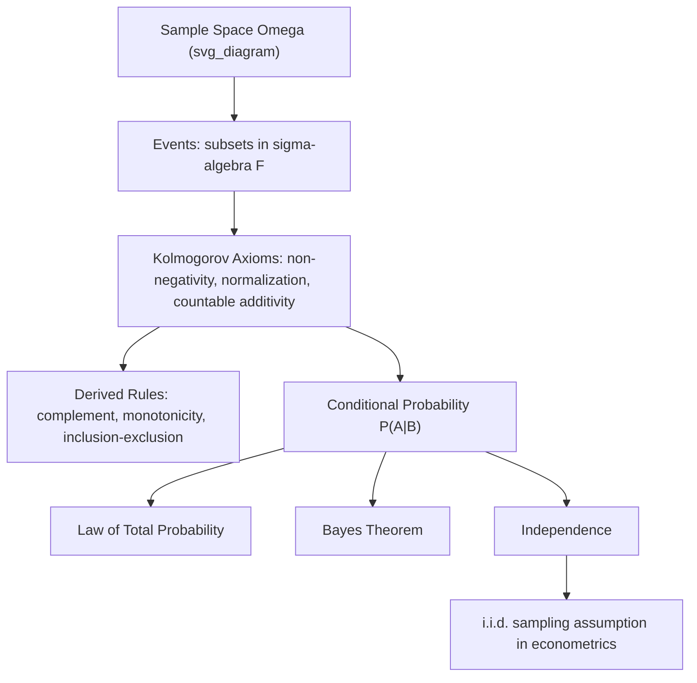

## Sample Spaces, Events, and Probability Axioms

### Introduction

The axiomatic foundation of probability theory, formalized by Kolmogorov, establishes sample spaces, events, and probability measures as the primitive objects from which all of statistics and econometrics is built. Every subsequent concept — random variables, distributions, expectation, hypothesis testing — rests on this axiomatic base.

### Sample Spaces

**Definition**

The **sample space** $\Omega$ is the set of all possible outcomes of a random experiment.

**Key Points**

- $\Omega$ can be finite (a coin flip: $\Omega = \{H,T\}$), countably infinite (number of customer arrivals: $\Omega = \{0,1,2,\dots\}$), or uncountably infinite (a continuous return: $\Omega = \mathbb{R}$).
- The choice of $\Omega$ encodes modeling assumptions: e.g., modeling a stock return as $\Omega = \mathbb{R}$ implicitly rules out discrete jumps unless the sample space is explicitly enriched (e.g., with a separate discrete jump process).
- A single realization $\omega \in \Omega$ represents one specific outcome; econometric data is treated as a realization (or partial realization, for a sample) of an underlying, unobserved $\omega$.

### Events

**Definition**

An **event** is a subset $A \subseteq \Omega$ (formally, an element of the $\sigma$-algebra $\mathcal{F}$ defined on $\Omega$). The event $A$ "occurs" if the realized outcome $\omega \in A$.

**Key Points**

- **Elementary events** consist of a single outcome $\{\omega\}$; **compound events** consist of multiple outcomes.
- Standard set operations translate to logical statements about events: $A \cup B$ ("$A$ or $B$"), $A \cap B$ ("$A$ and $B$"), $A^c$ ("not $A$"), $A \setminus B$ ("$A$ but not $B$").
- **Mutually exclusive (disjoint) events**: $A \cap B = \emptyset$ — cannot occur simultaneously.
- **Exhaustive events**: a collection whose union is $\Omega$ — at least one must occur.
- A **partition** of $\Omega$ is a collection of mutually exclusive, exhaustive events — the structural basis of the Law of Total Probability.

### Kolmogorov's Probability Axioms

**Definition**

A function $P: \mathcal{F} \to [0,1]$ is a probability measure if it satisfies:

1. **Non-negativity**: $P(A) \ge 0$ for all $A \in \mathcal{F}$
2. **Normalization**: $P(\Omega) = 1$
3. **Countable additivity**: for pairwise disjoint $A_1, A_2, \dots \in \mathcal{F}$,

   $$P\left(\bigcup_{i=1}^\infty A_i\right) = \sum_{i=1}^\infty P(A_i)$$

**Key Points**

- These three axioms alone are sufficient to derive every other probability rule via pure logical deduction — no additional assumptions about randomness or "true" probabilities are required.
- Countable (not just finite) additivity is essential for the theory to support limiting arguments (laws of large numbers, continuity of measure) needed throughout asymptotic statistics.
- The triple $(\Omega, \mathcal{F}, P)$ is the formal **probability space**; $\mathcal{F}$ restricts which subsets are assigned probabilities, relevant for uncountable $\Omega$ where not all subsets can be consistently measured (see Vitali-type non-measurable sets).

### Derived Properties

**Key Points**

- $P(\emptyset) = 0$ — follows from countable additivity applied to a disjoint sequence of empty sets.
- $P(A^c) = 1 - P(A)$ — the complement rule, derived from $A \cup A^c = \Omega$ and disjointness.
- **Monotonicity**: $A \subseteq B \implies P(A) \le P(B)$.
- **Inclusion-Exclusion (two events)**:

  $$P(A \cup B) = P(A) + P(B) - P(A \cap B)$$
- **Boole's Inequality (union bound)**: $P\left(\bigcup_i A_i\right) \le \sum_i P(A_i)$ — used extensively in constructing simultaneous confidence regions and multiple testing corrections (e.g., Bonferroni correction).
- **Continuity of probability**: if $A_n \uparrow A$ then $P(A_n) \to P(A)$; if $A_n \downarrow A$ then $P(A_n) \to P(A)$ — the basis for many almost-sure convergence arguments.

**Example**

Deriving the general inclusion-exclusion formula for three events using only the axioms:

$$P(A\cup B\cup C) = P(A)+P(B)+P(C) - P(A\cap B)-P(A\cap C)-P(B\cap C) + P(A\cap B\cap C)$$

This generalizes to $n$ events via the alternating sum over all intersections, provable by induction directly from axiom 3 combined with the complement rule.

### Conditional Probability

**Definition**

For $P(B) > 0$:

$$P(A \mid B) = \frac{P(A \cap B)}{P(B)}$$

**Key Points**

- Conditional probability is itself a valid probability measure on $\Omega$ (restricted to $B$) — it satisfies all three Kolmogorov axioms.
- **Multiplication rule**: $P(A \cap B) = P(A\mid B)P(B) = P(B\mid A)P(A)$, generalizing to the chain rule for $n$ events: $P(A_1 \cap \cdots \cap A_n) = P(A_1)P(A_2\mid A_1)\cdots P(A_n \mid A_1\cap\cdots\cap A_{n-1})$.
- **Law of Total Probability**: for a partition $\{B_i\}$ of $\Omega$,

  $$P(A) = \sum_i P(A \mid B_i) P(B_i)$$
- **Bayes' Theorem**, derived directly from the definition of conditional probability and the Law of Total Probability:

  $$P(B_i \mid A) = \frac{P(A\mid B_i)P(B_i)}{\sum_j P(A\mid B_j)P(B_j)}$$

  forms the foundation of Bayesian econometrics, where $B_i$ represents parameter hypotheses and $A$ represents observed data.

**Illustration**

### Independence

**Definition**

Events $A$ and $B$ are **independent** if:

$$P(A \cap B) = P(A)P(B)$$

equivalently, $P(A\mid B) = P(A)$ when $P(B)>0$.

**Key Points**

- **Pairwise independence** among a collection of events does not imply **mutual independence** — a classic counterexample involves three events where all pairs are independent but the triple is not, a subtlety relevant when specifying independence assumptions in multi-way experimental designs.
- Independence is a modeling assumption, not a derivable property — it must be justified by the data-generating process (e.g., random sampling design) rather than assumed casually.
- The i.i.d. assumption foundational to cross-sectional econometrics formally requires: (1) each observation has identical marginal distribution, and (2) the joint distribution over the sample factors as the product of marginals — both are independent axiomatic requirements, not automatic consequences of "randomness."

### Counting Methods for Finite Sample Spaces

**Key Points**

- For finite $\Omega$ with equally likely outcomes, $P(A) = |A|/|\Omega|$, reducing probability calculations to combinatorics.
- **Permutations**: $n!/(n-r)!$ ordered arrangements of $r$ items from $n$.
- **Combinations**: $\binom{n}{r} = n!/[r!(n-r)!]$ unordered selections — the basis for deriving the binomial distribution's probability mass function and for finite-population sampling-without-replacement calculations (hypergeometric distribution).

### Common Pitfalls

**Key Points**

- Confusing $P(A\mid B)$ with $P(B\mid A)$ (the "prosecutor's fallacy") — a persistent source of error in applied probabilistic reasoning, including some misinterpretations of p-values as $P(H_0 \mid \text{data})$ rather than $P(\text{data}\mid H_0)$.
- Assuming pairwise independence implies mutual independence when specifying joint models.
- Applying finite-sample counting formulas ($P(A)=|A|/|\Omega|$) to continuous sample spaces, where individual outcomes generally have probability zero and density functions must be used instead.
- Treating conditional probability as a symmetric relationship rather than recognizing that $P(A\mid B)$ and $P(B\mid A)$ are governed by fundamentally different, though related, quantities per Bayes' theorem.

**Related Topics**

- Random variables and probability distributions
- Bayes' theorem and Bayesian inference foundations
- Independence, exchangeability, and i.i.d. assumptions
- Combinatorics and discrete probability distributions
- Measure-theoretic probability foundations
- Conditional expectation and the law of iterated expectations