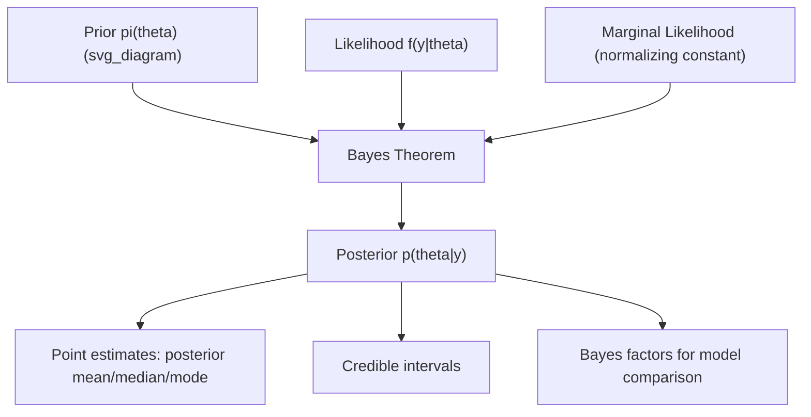

## Conditional Probability and Bayes' Theorem

### Introduction

Conditional probability formalizes how information updates beliefs, and Bayes' theorem provides the precise mechanism for inverting conditional relationships. Together they underlie Bayesian econometrics, likelihood-based inference, diagnostic reasoning, and the interpretation of instrumental variables, selection models, and treatment-effect estimators involving conditioning sets.

### Conditional Probability

**Definition**

For events $A, B$ with $P(B) > 0$:

$$P(A \mid B) = \frac{P(A \cap B)}{P(B)}$$

**Key Points**

- $P(\cdot \mid B)$ satisfies all three Kolmogorov axioms and is therefore itself a valid probability measure, restricted to the "reduced" sample space $B$.
- Conditioning is undefined when $P(B) = 0$; extending conditional probability to zero-probability conditioning events (e.g., conditioning on a continuous random variable taking a specific value) requires the measure-theoretic definition via Radon–Nikodym derivatives.
- **Multiplication rule**: $P(A \cap B) = P(A \mid B) P(B) = P(B \mid A) P(A)$.
- **Chain rule** for $n$ events:

  $$P(A_1 \cap A_2 \cap \cdots \cap A_n) = P(A_1)\, P(A_2\mid A_1)\, P(A_3 \mid A_1 \cap A_2) \cdots P(A_n \mid A_1 \cap \cdots \cap A_{n-1})$$

  used to factor joint likelihoods in time series models (e.g., the exact likelihood of an AR(1) process as a product of conditional densities).

### Law of Total Probability

**Definition**

For a partition $\{B_1, B_2, \dots, B_n\}$ of the sample space $\Omega$ (mutually exclusive, exhaustive, each with $P(B_i)>0$):

$$P(A) = \sum_{i=1}^n P(A \mid B_i)\, P(B_i)$$

**Key Points**

- This is the formal justification for "conditioning arguments" used throughout econometrics — e.g., decomposing an unconditional moment as a probability-weighted average of conditional moments across regimes, states, or subpopulations.
- Generalizes directly to continuous conditioning variables via integration: $P(A) = \int P(A \mid X=x)\, f_X(x)\, dx$, the discrete-to-continuous analog central to mixture model likelihoods.
- Forms the denominator in Bayes' theorem, ensuring the posterior distribution integrates/sums to 1.

### Bayes' Theorem

**Definition**

$$P(B_i \mid A) = \frac{P(A \mid B_i)\, P(B_i)}{\sum_j P(A \mid B_j)\, P(B_j)} = \frac{P(A\mid B_i)P(B_i)}{P(A)}$$

For a continuous parameter $\theta$ and data $y$:

$$p(\theta \mid y) = \frac{f(y\mid\theta)\,\pi(\theta)}{\int f(y\mid\theta')\,\pi(\theta')\,d\theta'} \propto f(y\mid\theta)\,\pi(\theta)$$

**Key Points**

- In the Bayesian econometrics reading: $\pi(\theta)$ is the **prior**, $f(y\mid\theta)$ is the **likelihood**, $p(\theta\mid y)$ is the **posterior**, and $\int f(y\mid\theta')\pi(\theta')\,d\theta'$ is the **marginal likelihood** (model evidence), which normalizes the posterior and also serves as the basis for Bayesian model comparison via Bayes factors.
- The proportionality form $p(\theta\mid y) \propto f(y\mid\theta)\pi(\theta)$ is the operational version used in MCMC methods (Metropolis-Hastings, Gibbs sampling), since the normalizing constant is often intractable and unnecessary for sampling-based posterior computation.
- As the sample size grows, under standard regularity conditions the posterior concentrates around the maximum likelihood estimate and becomes approximately normal (the **Bernstein–von Mises theorem**), providing an asymptotic equivalence between Bayesian and frequentist inference. [Inference: the specific rate and regularity conditions required for this equivalence vary by model class and should be checked against the relevant theorem statement]

**Illustration**

**Example**

Classic diagnostic testing illustration, directly transferable to econometric misclassification problems (e.g., imperfect treatment indicators): let $D$ = "has condition," $T$ = "tests positive," with $P(D)=0.01$, $P(T\mid D)=0.95$ (sensitivity), $P(T\mid D^c)=0.05$ (false positive rate). Then:

$$P(D\mid T) = \frac{P(T\mid D)P(D)}{P(T\mid D)P(D) + P(T\mid D^c)P(D^c)} = \frac{0.95 \times 0.01}{0.95\times 0.01 + 0.05\times 0.99} \approx 0.161$$

This demonstrates the **base rate effect**: even a highly accurate test yields a low posterior probability when the prior probability $P(D)$ is small — directly analogous to why weak instruments or low-prevalence treatment indicators produce highly uncertain posterior/conditional inferences despite seemingly strong conditional relationships.

### Odds Form and Likelihood Ratios

**Key Points**

- Bayes' theorem can be restated multiplicatively in odds form:

  $$\frac{P(B_1\mid A)}{P(B_2\mid A)} = \frac{P(A\mid B_1)}{P(A\mid B_2)} \times \frac{P(B_1)}{P(B_2)}$$

  i.e., **posterior odds = likelihood ratio × prior odds** — this form underlies sequential/recursive Bayesian updating and is computationally convenient since it avoids computing the normalizing constant.
- The **likelihood ratio** $P(A\mid B_1)/P(A\mid B_2)$ quantifies the evidential weight of data $A$ in discriminating between hypotheses $B_1, B_2$, connecting directly to Neyman-Pearson hypothesis testing theory (the likelihood ratio test statistic).

### Sequential Bayesian Updating

**Key Points**

- Given conditionally independent observations $y_1, \dots, y_n \mid \theta$, the posterior after observing all data equals the posterior obtained by updating sequentially, one observation at a time:

  $$p(\theta\mid y_1,\dots,y_n) \propto \pi(\theta) \prod_{i=1}^n f(y_i\mid\theta)$$
- This sequential-updating equivalence is the theoretical basis for online/recursive Bayesian filtering (e.g., Kalman filtering in state-space econometric models), where the posterior at time $t-1$ serves as the prior for incorporating information at time $t$.
- **Conjugate priors** (e.g., Beta-Binomial, Normal-Normal, Gamma-Poisson) yield posteriors in the same distributional family as the prior, enabling closed-form sequential updates without numerical integration — widely used in Bayesian VAR and structural break models for computational tractability.

### Independence and Conditional Independence

**Key Points**

- $A$ and $B$ are independent iff $P(A\mid B) = P(A)$, equivalently $P(A\cap B)=P(A)P(B)$.
- **Conditional independence**: $A \perp B \mid C$ means $P(A\cap B\mid C) = P(A\mid C)P(B\mid C)$ — the formal concept underlying the **unconfoundedness/ignorability assumption** in causal inference and treatment effect estimation: treatment assignment is independent of potential outcomes *conditional on* observed covariates.
- Conditional independence does not imply (and is not implied by) marginal independence — a critical distinction when specifying instrumental variable exclusion restrictions (the instrument must be conditionally independent of the error term, not necessarily marginally independent of all other variables).

### Common Pitfalls

**Key Points**

- **Base rate neglect**: ignoring the prior $P(B_i)$ when interpreting conditional probabilities, leading to systematic overestimation of $P(B\mid A)$ when the base rate of $B$ is low (as in the diagnostic testing example above).
- **Confusion of the inverse** (prosecutor's fallacy): treating $P(A\mid B)$ as equal to $P(B\mid A)$ — these are equal only in the special case $P(A) = P(B)$.
- Conflating conditional independence with marginal independence when specifying instrumental variable or ignorability assumptions — a subtle but consequential error in causal identification arguments.
- Applying discrete-partition Bayes' theorem formulas directly to continuous parameters without recognizing the need to replace sums with integrals over the (typically continuous) parameter space.

**Related Topics**

- Bayesian inference: priors, posteriors, and credible intervals
- Conjugate prior families and computational Bayesian methods (MCMC, Gibbs sampling)
- Likelihood ratio tests and the Neyman-Pearson lemma
- Conditional independence and causal identification (unconfoundedness)
- Bernstein–von Mises theorem and Bayesian-frequentist asymptotic equivalence
- State-space models and Kalman filtering as sequential Bayesian updating