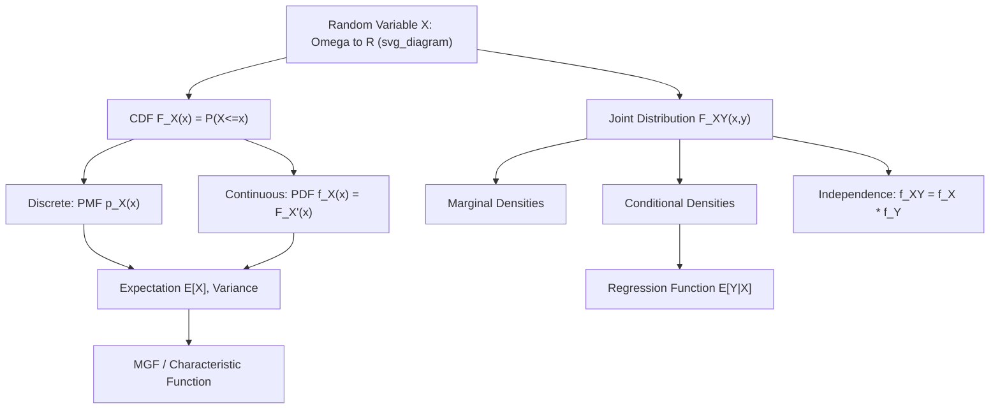

## Random Variables and Probability Distributions

### Introduction

Random variables translate abstract sample-space outcomes into numerical quantities that can be analyzed, summarized, and manipulated mathematically. Probability distributions characterize the full stochastic behavior of these quantities and form the direct building blocks of likelihood functions, moment conditions, and every parametric or semiparametric econometric model.

### Random Variables

**Definition**

A **random variable** $X$ is a measurable function $X: \Omega \to \mathbb{R}$ from a probability space $(\Omega,\mathcal{F},P)$ to the real line, satisfying $X^{-1}((-\infty,a]) \in \mathcal{F}$ for all $a \in \mathbb{R}$.

**Key Points**

- $X$ induces a **distribution (pushforward) measure** on $\mathbb{R}$: $P_X(B) = P(X^{-1}(B))$ for Borel sets $B$.
- **Discrete random variables** take values in a countable set; **continuous random variables** have a distribution absolutely continuous with respect to Lebesgue measure (admitting a density via the Radon–Nikodym theorem); **mixed random variables** combine both (e.g., censored variables like observed hours worked, which have a point mass at zero and a continuous component above zero).
- A **random vector** $\mathbf{X} = (X_1,\dots,X_k)$ generalizes this to $\mathbb{R}^k$-valued measurable functions, foundational for multivariate econometric models.

### Cumulative Distribution Function (CDF)

**Definition**

$$F_X(x) = P(X \le x)$$

**Key Points**

- Properties: non-decreasing, right-continuous, $\lim_{x\to-\infty}F_X(x)=0$, $\lim_{x\to\infty}F_X(x)=1$.
- The CDF fully characterizes the distribution of $X$ regardless of type (discrete, continuous, or mixed), making it the most general representation.
- $P(a < X \le b) = F_X(b) - F_X(a)$; for continuous $X$, $P(X=a)=0$ for any single point $a$, so $P(a<X\le b) = P(a\le X\le b)$.
- The **generalized inverse (quantile function)** $F_X^{-1}(\tau) = \inf\{x: F_X(x)\ge\tau\}$ underlies quantile regression and the probability integral transform used in simulation (inverse transform sampling) and goodness-of-fit testing.

### Probability Mass Function and Probability Density Function

**Definition**

For discrete $X$: $p_X(x) = P(X=x)$, with $\sum_x p_X(x) = 1$.

For continuous $X$ with CDF $F_X$ differentiable: $f_X(x) = F_X'(x)$, so $P(a\le X\le b) = \int_a^b f_X(x)\,dx$ and $\int_{-\infty}^\infty f_X(x)\,dx = 1$.

**Key Points**

- $f_X(x)$ is not a probability itself (it can exceed 1); only integrals of $f_X$ over intervals yield probabilities.
- Existence of a density requires $F_X$ to be absolutely continuous — a genuine restriction ruling out, e.g., purely singular continuous distributions (measure zero in practice for standard econometric models but relevant in some theoretical constructions).

### Expectation and Moments

**Definition**

$$E[X] = \int_{-\infty}^\infty x\, f_X(x)\,dx \quad \text{(continuous)}, \qquad E[X] = \sum_x x\, p_X(x) \quad \text{(discrete)}$$

More generally, $E[g(X)] = \int g(x) f_X(x)\,dx$ (law of the unconscious statistician).

**Key Points**

- **Variance**: $\text{Var}(X) = E[(X-E[X])^2] = E[X^2] - (E[X])^2$.
- **Moments**: the $k$-th moment is $E[X^k]$; **central moments** are $E[(X-E[X])^k]$. Skewness ($k=3$, standardized) and kurtosis ($k=4$, standardized) characterize asymmetry and tail thickness, both routinely diagnosed in residual analysis.
- **Moment Generating Function**: $M_X(t) = E[e^{tX}]$, when it exists in a neighborhood of 0, uniquely determines the distribution and generates moments via $E[X^k] = M_X^{(k)}(0)$.
- **Characteristic Function**: $\phi_X(t) = E[e^{itX}]$ always exists (unlike the MGF) and uniquely determines the distribution — the theoretical tool underlying proofs of the Central Limit Theorem via Lévy's continuity theorem.
- Not all distributions have finite moments of every order (e.g., the Cauchy distribution has no finite mean); this has direct consequences for the applicability of standard asymptotic theory to heavy-tailed financial return data.

### Common Discrete Distributions

**Key Points**

- **Bernoulli($p$)**: $P(X=1)=p$, $P(X=0)=1-p$; $E[X]=p$, $\text{Var}(X)=p(1-p)$ — the building block of binary choice models (logit/probit).
- **Binomial($n,p$)**: sum of $n$ i.i.d. Bernoulli$(p)$; $P(X=k) = \binom{n}{k}p^k(1-p)^{n-k}$.
- **Poisson($\lambda$)**: $P(X=k) = e^{-\lambda}\lambda^k/k!$; $E[X]=\text{Var}(X)=\lambda$ — the canonical model for count data (e.g., number of patents, transactions), with the equidispersion property motivating negative binomial alternatives when overdispersion is present.
- **Geometric** and **Negative Binomial**: model waiting times and overdispersed counts respectively.
- **Multinomial**: the vector generalization of the binomial, foundational for multinomial logit models of discrete choice.

### Common Continuous Distributions

**Key Points**

- **Uniform($a,b$)**: constant density $1/(b-a)$ on $[a,b]$ — the basis of the probability integral transform and simulation methods.
- **Normal (Gaussian)** $N(\mu,\sigma^2)$: $f(x) = \frac{1}{\sqrt{2\pi\sigma^2}}\exp\left(-\frac{(x-\mu)^2}{2\sigma^2}\right)$ — central to classical linear regression theory via the Gauss-Markov and asymptotic normality results.
- **Exponential($\lambda$)**: memoryless waiting-time distribution, $f(x)=\lambda e^{-\lambda x}$, $x\ge0$ — used in duration/survival models (e.g., unemployment spell length) as the constant-hazard baseline case.
- **Gamma($\alpha,\beta$)** and **Chi-squared** ($\chi^2_k$, a special case of Gamma): the $\chi^2_k$ distribution arises as the distribution of the sum of $k$ squared independent standard normals, foundational to variance estimation and goodness-of-fit tests.
- **Student's $t$**: heavier-tailed than normal, arising as the sampling distribution of a standardized sample mean when the population variance is estimated — the basis of $t$-tests in finite samples.
- **$F$-distribution**: ratio of two independent scaled chi-squared variables, underlying $F$-tests for joint linear hypotheses (e.g., testing multiple regression coefficients jointly).
- **Beta($\alpha,\beta$)**: flexible distribution on $[0,1]$, the conjugate prior for the Bernoulli/Binomial likelihood in Bayesian econometrics.
- **Log-normal**: if $\ln X \sim N(\mu,\sigma^2)$, commonly used for modeling strictly positive, right-skewed variables such as wages or firm size.

### Joint, Marginal, and Conditional Distributions

**Definition**

Joint CDF: $F_{X,Y}(x,y) = P(X\le x, Y\le y)$. Joint density (continuous case): $f_{X,Y}(x,y) = \partial^2 F_{X,Y}/\partial x\,\partial y$.

**Marginal density**: $f_X(x) = \int_{-\infty}^\infty f_{X,Y}(x,y)\,dy$.

**Conditional density**: $f_{X\mid Y}(x\mid y) = f_{X,Y}(x,y)/f_Y(y)$, for $f_Y(y)>0$.

**Key Points**

- $X \perp Y$ (independence) iff $f_{X,Y}(x,y) = f_X(x)f_Y(y)$ for all $x,y$ — the joint density factors into the product of marginals.
- **Covariance**: $\text{Cov}(X,Y) = E[(X-E[X])(Y-E[Y])] = E[XY]-E[X]E[Y]$; **Correlation**: $\rho_{X,Y} = \text{Cov}(X,Y)/(\sigma_X\sigma_Y) \in [-1,1]$.
- Zero covariance does not imply independence (except in special cases like joint normality) — a frequently misapplied simplification in applied regression diagnostics.
- $E[Y\mid X=x] = \int y\, f_{Y\mid X}(y\mid x)\,dy$ defines the **regression function**, the theoretical object that linear and nonparametric regression estimate.

**Illustration**

### Transformations of Random Variables

**Key Points**

- For a monotonic differentiable transformation $Y=g(X)$, the change-of-variables formula gives:

  $$f_Y(y) = f_X(g^{-1}(y)) \left|\frac{d}{dy}g^{-1}(y)\right|$$
- For non-monotonic transformations, sum contributions across all inverse branches.
- The **probability integral transform** — $F_X(X) \sim \text{Uniform}(0,1)$ for continuous $X$ — underlies simulation methods, copula theory, and specification testing (e.g., testing whether residuals follow their assumed distribution).
- Sums, products, and ratios of random variables often require convolution or Jacobian-based multivariate transformation techniques; the sum of independent normals remains normal, a special closure property exploited throughout linear model theory.

### Common Pitfalls

**Key Points**

- Confusing the density value $f_X(x)$ with a probability — densities can exceed 1 and are only meaningful when integrated over a region.
- Assuming zero correlation implies independence outside the joint-normal (or otherwise special) case — a common source of misspecification when relying solely on correlation diagnostics.
- Neglecting to check whether moments of a claimed distribution actually exist (e.g., assuming a finite variance for heavy-tailed data) before applying moment-based asymptotic results. [Inference: whether a given empirical series exhibits heavy tails severe enough to invalidate standard asymptotics is an empirical question requiring formal testing, not something assumable from distribution family alone]
- Misapplying the change-of-variables formula by omitting the Jacobian term, especially in multivariate transformations relevant to simulation-based estimation.

**Related Topics**

- Central Limit Theorem and convergence in distribution
- Joint, conditional, and marginal distribution theory in multivariate models
- Moment generating functions and characteristic functions
- Copulas and dependence modeling
- Maximum likelihood estimation and parametric distribution families
- Transformation techniques and the probability integral transform