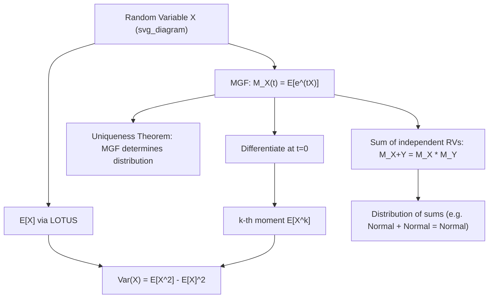

## Expectation, Variance, and Moment Generating Functions

### Introduction

Expectation and variance summarize the location and dispersion of a random variable's distribution, while moment generating functions (MGFs) provide a unified analytical tool for computing moments and establishing distributional results. These operators are the essential building blocks of estimator properties (bias, efficiency), regression theory, and the derivation of sampling distributions used throughout econometric inference.

### Expectation

**Definition**

For continuous $X$ with density $f_X$: $E[X] = \int_{-\infty}^\infty x f_X(x)\,dx$. For discrete $X$: $E[X] = \sum_x x\, p_X(x)$. More generally (law of the unconscious statistician):

$$E[g(X)] = \int g(x) f_X(x)\,dx$$

**Key Points**

- **Linearity of expectation**: $E[aX+bY+c] = aE[X]+bE[Y]+c$ for any random variables $X,Y$ and constants $a,b,c$ — holds *regardless of dependence structure*, a property exploited constantly in deriving unbiasedness of estimators (e.g., $E[\hat\beta_{OLS}] = \beta$ relies only on linearity, not independence of regressors).
- Existence of $E[X]$ requires $\int |x| f_X(x)\,dx < \infty$ (absolute integrability); some distributions (Cauchy) have no finite expectation.
- **Law of Iterated Expectations**: $E[X] = E[E[X\mid Y]]$ — the theoretical basis for deriving unconditional moments from conditional model specifications, central to instrumental variables and panel data theory.
- $E[g(X)] \neq g(E[X])$ in general (except for affine $g$); **Jensen's Inequality** gives $E[g(X)] \ge g(E[X])$ for convex $g$ (and $\le$ for concave $g$) — relevant to bias in log-linearized models and to the direction of bias when applying nonlinear transformations to unbiased estimators.

### Variance and Covariance

**Definition**

$$\text{Var}(X) = E[(X-E[X])^2] = E[X^2] - (E[X])^2$$

$$\text{Cov}(X,Y) = E[(X-E[X])(Y-E[Y])] = E[XY] - E[X]E[Y]$$

**Key Points**

- $\text{Var}(X) \ge 0$ always; $\text{Var}(X)=0$ iff $X$ is a.s. constant.
- **Variance of a linear combination**: 

  $$\text{Var}(aX+bY) = a^2\text{Var}(X) + b^2\text{Var}(Y) + 2ab\,\text{Cov}(X,Y)$$

  generalizing to $\text{Var}(\mathbf{a}^\top\mathbf{X}) = \mathbf{a}^\top\Sigma\mathbf{a}$ for a random vector $\mathbf{X}$ with covariance matrix $\Sigma$ — the direct basis for computing the variance of any linear estimator (e.g., $\text{Var}(\hat\beta_{OLS}) = \sigma^2(X^\top X)^{-1}$).
- If $X \perp Y$, $\text{Cov}(X,Y)=0$ and $\text{Var}(X+Y)=\text{Var}(X)+\text{Var}(Y)$; the converse does not hold in general.
- **Law of Total Variance**: 

  $$\text{Var}(X) = E[\text{Var}(X\mid Y)] + \text{Var}(E[X\mid Y])$$

  decomposes total variance into within-group and between-group components — foundational to ANOVA, random effects panel models, and hierarchical/multilevel model variance decomposition.
- **Covariance matrix** $\Sigma$ of a random vector is always positive semidefinite; strict positive definiteness (no perfect linear dependence among components) is required for standard GLS and multivariate normal density formulas to be well-defined.

**Example**

Deriving $\text{Var}(\bar{X})$ for i.i.d. sample mean: with $X_1,\dots,X_n$ i.i.d., $\text{Var}(X_i)=\sigma^2$,

$$\text{Var}(\bar X) = \text{Var}\left(\frac{1}{n}\sum_i X_i\right) = \frac{1}{n^2}\sum_i\text{Var}(X_i) = \frac{\sigma^2}{n}$$

using independence to zero out cross-covariance terms — the direct source of the $\sqrt{n}$ convergence rate underlying standard errors and the Central Limit Theorem.

### Higher Moments: Skewness and Kurtosis

**Key Points**

- $k$-th **central moment**: $\mu_k = E[(X-E[X])^k]$.
- **Skewness**: $\gamma_1 = \mu_3/\sigma^3$ — measures asymmetry; positive skewness indicates a longer right tail (common in wage and firm-size distributions).
- **Kurtosis**: $\gamma_2 = \mu_4/\sigma^4$ — measures tail heaviness relative to the normal ($\gamma_2=3$ for $N(\mu,\sigma^2)$); **excess kurtosis** $= \gamma_2 - 3$. Financial return series frequently exhibit excess kurtosis (fat tails), a stylized fact motivating GARCH-type and Student-$t$ error specifications. [Inference: the degree of excess kurtosis is an empirical, series-specific property and should not be assumed a priori without diagnostic testing]

### Moment Generating Functions

**Definition**

$$M_X(t) = E[e^{tX}]$$

defined for $t$ in some open interval containing 0 where the expectation is finite.

**Key Points**

- **Moment generation property**: $E[X^k] = M_X^{(k)}(0)$, the $k$-th derivative of $M_X$ evaluated at $t=0$ — provides a systematic alternative to direct integration for computing moments of standard distributions.
- **Uniqueness**: if the MGF exists in a neighborhood of 0, it uniquely determines the distribution — two random variables with the same MGF (where both exist) have the same distribution.
- **Sums of independent random variables**: if $X \perp Y$, then $M_{X+Y}(t) = M_X(t)M_Y(t)$ — this multiplicative property is the standard technique for deriving the distribution of sums (e.g., proving the sum of independent normals is normal, or that the sum of independent Poissons is Poisson).
- **Linear transformation**: $M_{aX+b}(t) = e^{bt}M_X(at)$.
- Not every distribution has an MGF that exists in a neighborhood of 0 (e.g., the Cauchy and, more relevantly for econometrics, some heavy-tailed distributions used to model extreme financial events) — the **characteristic function** $\phi_X(t)=E[e^{itX}]$ always exists and is used as a more general substitute in formal proofs (e.g., the Lévy continuity theorem underlying CLT proofs).

**Example**

MGF of $N(\mu,\sigma^2)$: $M_X(t) = \exp(\mu t + \tfrac{1}{2}\sigma^2 t^2)$. Differentiating:

$$M_X'(t) = (\mu+\sigma^2 t)M_X(t) \implies M_X'(0) = \mu = E[X]$$

$$M_X''(t) = \sigma^2 M_X(t) + (\mu+\sigma^2t)^2 M_X(t) \implies M_X''(0) = \sigma^2+\mu^2 = E[X^2]$$

confirming $\text{Var}(X) = E[X^2]-(E[X])^2 = \sigma^2$, consistent with the defining parameters.

**Illustration**

### Cumulant Generating Function

**Key Points**

- The **cumulant generating function** $K_X(t) = \ln M_X(t)$ generates **cumulants** $\kappa_k = K_X^{(k)}(0)$ via Taylor expansion; $\kappa_1 = E[X]$, $\kappa_2 = \text{Var}(X)$, $\kappa_3$ relates to skewness, $\kappa_4$ to excess kurtosis.
- Cumulants of sums of independent random variables are additive ($\kappa_k(X+Y) = \kappa_k(X)+\kappa_k(Y)$), a property that simplifies higher-order asymptotic expansions (e.g., Edgeworth expansions used to refine normal approximations in finite-sample econometric theory).

### Multivariate Extensions

**Key Points**

- **Mean vector**: $E[\mathbf{X}] = (E[X_1],\dots,E[X_k])^\top$.
- **Covariance matrix**: $\Sigma = E[(\mathbf{X}-E[\mathbf{X}])(\mathbf{X}-E[\mathbf{X}])^\top]$, a symmetric positive semidefinite $k\times k$ matrix with $\Sigma_{ii}=\text{Var}(X_i)$ and $\Sigma_{ij}=\text{Cov}(X_i,X_j)$.
- **Joint MGF**: $M_{\mathbf{X}}(\mathbf{t}) = E[e^{\mathbf{t}^\top\mathbf{X}}]$; for the multivariate normal, $M_{\mathbf{X}}(\mathbf{t}) = \exp(\mathbf{t}^\top\boldsymbol\mu + \tfrac{1}{2}\mathbf{t}^\top\Sigma\mathbf{t})$, the analytical basis for deriving that any linear combination of jointly normal variables is itself normal.

### Common Pitfalls

**Key Points**

- Assuming $E[g(X)] = g(E[X])$ for nonlinear $g$; Jensen's Inequality only bounds, rather than equates, these quantities except in the affine case.
- Applying variance formulas for sums while forgetting the covariance cross-terms when variables are dependent — a frequent source of error in computing standard errors for correlated (e.g., clustered or serially correlated) data.
- Assuming an MGF exists for any distribution encountered; heavy-tailed distributions may lack an MGF, requiring characteristic-function-based arguments instead.
- Confusing sample moments (computed from data) with population moments (theoretical expectations) — the former are estimators of the latter and are themselves random variables subject to sampling variability.

**Related Topics**

- Central Limit Theorem and Edgeworth expansions
- Law of Large Numbers and consistency of moment estimators
- Multivariate normal distribution and linear combinations of random vectors
- Method of moments and generalized method of moments (GMM) estimation
- Characteristic functions and Lévy's continuity theorem
- Variance decomposition in panel and hierarchical models