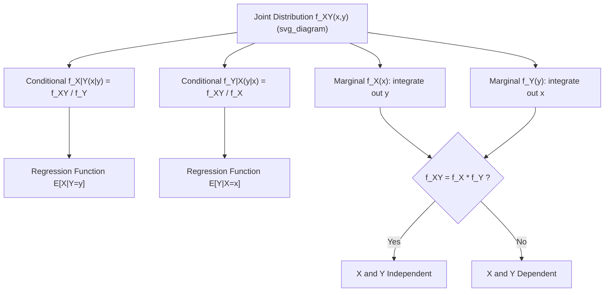

## Joint, Marginal, and Conditional Distributions

### Introduction

Joint, marginal, and conditional distributions describe how multiple random variables relate to one another, forming the mathematical foundation for regression analysis, dependence modeling, and multivariate econometric methods. Nearly every econometric model — regression, systems of equations, panel data, time series — is fundamentally a statement about a conditional distribution.

### Joint Distributions

**Definition**

For random variables $X, Y$, the **joint CDF** is:

$$F_{X,Y}(x,y) = P(X\le x, Y\le y)$$

For jointly continuous $X,Y$, the **joint density** satisfies:

$$F_{X,Y}(x,y) = \int_{-\infty}^x\int_{-\infty}^y f_{X,Y}(u,v)\,dv\,du, \qquad f_{X,Y}(x,y) = \frac{\partial^2 F_{X,Y}(x,y)}{\partial x\,\partial y}$$

For discrete $X,Y$, the **joint PMF** is $p_{X,Y}(x,y) = P(X=x,Y=y)$.

**Key Points**

- $f_{X,Y}(x,y) \ge 0$ and $\int\int f_{X,Y}(x,y)\,dx\,dy = 1$ (analogously $\sum\sum p_{X,Y}(x,y)=1$ in the discrete case).
- $P((X,Y)\in A) = \int\int_A f_{X,Y}(x,y)\,dx\,dy$ for any measurable region $A$ — the basis for computing probabilities over joint events (e.g., probability that two correlated asset returns both fall below a threshold).
- The joint distribution contains strictly more information than the two marginals alone; the same pair of marginals is consistent with infinitely many different joint distributions differing in dependence structure — the motivating insight behind copula theory.

### Marginal Distributions

**Definition**

$$f_X(x) = \int_{-\infty}^\infty f_{X,Y}(x,y)\,dy \qquad \text{(continuous)}, \qquad p_X(x) = \sum_y p_{X,Y}(x,y) \quad \text{(discrete)}$$

**Key Points**

- "Marginalizing out" $Y$ recovers the distribution of $X$ alone, discarding information about how $X$ and $Y$ co-vary.
- Marginal distributions are always derivable from the joint distribution, but the reverse is not true — the joint cannot in general be reconstructed from the marginals alone without an assumption on dependence (e.g., independence).
- In panel and hierarchical econometric models, marginal (population-averaged) effects and conditional (subject-specific) effects can differ substantially when the model is nonlinear — a critical distinction in random effects vs. fixed effects nonlinear panel models.

### Conditional Distributions

**Definition**

For jointly continuous $X,Y$ with $f_Y(y)>0$:

$$f_{X\mid Y}(x\mid y) = \frac{f_{X,Y}(x,y)}{f_Y(y)}$$

For discrete variables: $p_{X\mid Y}(x\mid y) = p_{X,Y}(x,y)/p_Y(y)$.

**Key Points**

- $f_{X\mid Y}(\cdot\mid y)$ is a valid density in $x$ for each fixed $y$: non-negative and integrates to 1.
- The **regression function** $E[Y\mid X=x] = \int y\,f_{Y\mid X}(y\mid x)\,dy$ is the object that linear regression, nonparametric regression, and quantile regression all aim to estimate — regression is fundamentally the study of conditional distributions (or specific functionals of them).
- **Conditional variance** $\text{Var}(Y\mid X=x)$ characterizes heteroskedasticity when it varies with $x$ — directly motivating robust standard errors, weighted least squares, and GARCH-type conditional variance models in time series.
- Bayes' theorem for densities follows immediately from the definition: 

  $$f_{X\mid Y}(x\mid y) = \frac{f_{Y\mid X}(y\mid x)f_X(x)}{f_Y(y)}$$

  the continuous analog used throughout Bayesian econometrics to derive posteriors from likelihoods and priors.

**Illustration**

### Independence Revisited

**Key Points**

- $X \perp Y$ iff $f_{X,Y}(x,y) = f_X(x)f_Y(y)$ for all $(x,y)$ — equivalently, $f_{X\mid Y}(x\mid y) = f_X(x)$ for all $y$ with $f_Y(y)>0$: conditioning on $Y$ provides no information about $X$.
- Under independence, $E[XY]=E[X]E[Y]$ and $\text{Cov}(X,Y)=0$, but the converse fails in general — zero covariance captures only *linear* dependence, while independence rules out *any* form of statistical dependence, linear or nonlinear.
- Joint normality is a notable special case where zero correlation does imply independence, but this equivalence does not extend to non-Gaussian joint distributions — a common source of misapplied intuition.

### Covariance, Correlation, and Dependence Structure

**Key Points**

- $\text{Cov}(X,Y) = E[XY]-E[X]E[Y]$; $\rho_{X,Y}=\text{Cov}(X,Y)/(\sigma_X\sigma_Y)$ measures the strength and direction of *linear* association, bounded in $[-1,1]$ by the Cauchy-Schwarz inequality.
- Nonlinear dependence can exist even when $\rho_{X,Y}=0$ (e.g., $Y=X^2$ with $X$ symmetric around 0), motivating rank-based (Spearman) or nonparametric dependence measures, and more generally **copula-based** dependence modeling that separates marginal behavior from dependence structure entirely.
- **Sklar's Theorem** states that any joint CDF can be decomposed as $F_{X,Y}(x,y) = C(F_X(x),F_Y(y))$ for some copula function $C$, providing the theoretical justification for modeling marginals and dependence structure separately — widely used in multivariate financial risk modeling.

### Multivariate Generalizations

**Key Points**

- For a random vector $\mathbf{X}=(X_1,\dots,X_k)$, the joint density $f_{\mathbf{X}}(x_1,\dots,x_k)$ generalizes all the above concepts; marginals are obtained by integrating out the remaining $k-1$ variables, and conditional densities condition on any subset of components.
- The **multivariate normal distribution** has closed-form marginal and conditional distributions: if $(\mathbf{X}_1,\mathbf{X}_2)$ is jointly normal with mean $(\boldsymbol\mu_1,\boldsymbol\mu_2)$ and covariance $\begin{pmatrix}\Sigma_{11}&\Sigma_{12}\\\Sigma_{21}&\Sigma_{22}\end{pmatrix}$, then:

  $$\mathbf{X}_1 \mid \mathbf{X}_2=\mathbf{x}_2 \sim N\big(\boldsymbol\mu_1+\Sigma_{12}\Sigma_{22}^{-1}(\mathbf{x}_2-\boldsymbol\mu_2),\ \Sigma_{11}-\Sigma_{12}\Sigma_{22}^{-1}\Sigma_{21}\big)$$

  This formula is the direct analytical origin of the OLS regression coefficient formula and of GLS/BLUP formulas in random effects models.
- **Exchangeability**: a weaker-than-i.i.d. assumption where the joint distribution is invariant to permutation of indices — relevant in panel data and Bayesian hierarchical model specification (de Finetti's theorem connects exchangeability to conditional i.i.d. structure given a latent parameter).

**Example**

Deriving the conditional expectation formula that underlies OLS: given jointly normal $(Y,X)$ with $\text{Cov}(Y,X)=\sigma_{YX}$, $\text{Var}(X)=\sigma_X^2$:

$$E[Y\mid X=x] = \mu_Y + \frac{\sigma_{YX}}{\sigma_X^2}(x-\mu_X) = \beta_0+\beta_1 x$$

where $\beta_1 = \sigma_{YX}/\sigma_X^2 = \text{Cov}(Y,X)/\text{Var}(X)$ is exactly the population regression slope — showing that under joint normality, the linear regression function is not an approximation but the *exact* conditional expectation function.

### Common Pitfalls

**Key Points**

- Assuming zero correlation implies independence outside the jointly normal (or other special) case.
- Confusing marginal effects with conditional (subject-specific) effects in nonlinear panel models, leading to misinterpretation of average partial effects versus individual-level effects.
- Treating the linear conditional expectation formula (valid exactly under joint normality) as a universal truth rather than recognizing that, for general joint distributions, $E[Y\mid X]$ may be nonlinear, and OLS estimates only the best *linear* approximation to it.
- Neglecting that reconstructing a joint distribution from marginals requires an explicit dependence assumption (independence or a specified copula) — marginals alone are insufficient.

**Related Topics**

- Copula theory and dependence modeling
- Linear regression as conditional expectation under joint normality
- Multivariate normal distribution theory
- Conditional variance and heteroskedasticity
- Exchangeability and de Finetti's theorem
- Panel data models: marginal vs. conditional effects