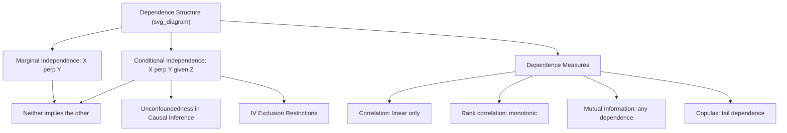

## Independence and Dependence Structures

### Introduction

Independence assumptions underpin the sampling theory used to derive standard errors, consistency, and asymptotic normality, while dependence structures characterize departures from independence that are pervasive in time series, panel, and spatial econometric data. Correctly identifying and modeling dependence is essential for valid inference, since misspecified independence assumptions produce invalid standard errors even when point estimates remain consistent.

### Statistical Independence

**Definition**

Random variables $X$ and $Y$ are **independent** if their joint CDF factors as the product of marginal CDFs:

$$F_{X,Y}(x,y) = F_X(x)F_Y(y) \quad \forall x,y$$

equivalently, for densities/PMFs: $f_{X,Y}(x,y) = f_X(x)f_Y(y)$.

**Key Points**

- Independence implies (but is not implied by) zero covariance: $\text{Cov}(X,Y)=0$ captures only linear dependence, while independence rules out any functional dependence.
- Under independence: $E[XY]=E[X]E[Y]$, $\text{Var}(X+Y)=\text{Var}(X)+\text{Var}(Y)$, $M_{X+Y}(t)=M_X(t)M_Y(t)$ — all standard results used throughout sampling theory derivations.
- **Mutual independence** of $n$ variables requires the joint distribution to factor over *every* subset, not merely pairwise — **pairwise independence does not imply mutual independence**, a classical counterexample construction relevant to experimental design with multiple correlated treatments.
- For a random sample, the **i.i.d. assumption** (independent and identically distributed) combines independence with an additional requirement that all variables share the same marginal distribution — jointly, these two assumptions license the standard law of large numbers and central limit theorem derivations.

### Conditional Independence

**Definition**

$X \perp Y \mid Z$ if:

$$f_{X,Y\mid Z}(x,y\mid z) = f_{X\mid Z}(x\mid z)\,f_{Y\mid Z}(y\mid z) \quad \forall x,y,z$$

**Key Points**

- Conditional independence neither implies nor is implied by marginal independence — $X$ and $Y$ may be dependent marginally but conditionally independent given $Z$ (a **confounding** structure), or independent marginally but conditionally dependent given $Z$ (a phenomenon sometimes called **collider bias** or **explaining-away**).
- The **unconfoundedness (ignorability) assumption** in causal inference — $\{Y(0),Y(1)\} \perp D \mid X$ — is a conditional independence statement asserting that, given observed covariates $X$, treatment assignment $D$ is as good as random with respect to potential outcomes.
- Conditional independence underlies the **exclusion restriction** in instrumental variables: the instrument $Z$ must be independent of the structural error $\varepsilon$ (often stated conditionally on included exogenous regressors), while being correlated with the endogenous regressor.
- **Graphical models / DAGs** formalize conditional independence relationships via d-separation criteria, providing a visual and algorithmic framework for reasoning about which conditioning sets block or open dependence paths — increasingly used in causal identification strategy design.

### Measures of Dependence Beyond Correlation

**Key Points**

- **Pearson correlation** $\rho_{X,Y}$ captures only linear association and can be zero even under strong nonlinear dependence (e.g., $Y=X^2$).
- **Spearman's rank correlation** and **Kendall's tau** capture monotonic (not necessarily linear) dependence, more robust to outliers and nonlinear-but-monotonic relationships.
- **Mutual information** $I(X;Y) = \int\int f_{X,Y}(x,y)\log\frac{f_{X,Y}(x,y)}{f_X(x)f_Y(y)}\,dx\,dy$ captures *any* form of statistical dependence, equal to zero if and only if $X\perp Y$ — increasingly used in machine-learning-adjacent econometric variable selection.
- **Copulas** (via Sklar's theorem) fully separate marginal behavior from dependence structure, allowing flexible modeling of tail dependence (e.g., joint extreme events in financial returns) that Gaussian correlation cannot capture.

**Illustration**

### Dependence in Time Series: Serial Correlation

**Definition**

For a stochastic process $\{X_t\}$, the **autocovariance function** is $\gamma(h) = \text{Cov}(X_t, X_{t+h})$, and the **autocorrelation function (ACF)** is $\rho(h) = \gamma(h)/\gamma(0)$.

**Key Points**

- **Strict stationarity** requires the joint distribution of any collection of observations to be invariant to time shifts; **weak (covariance) stationarity** requires only that the mean is constant and $\gamma(h)$ depends only on $h$, not on $t$ — the operational assumption underlying most time series estimation.
- **White noise**: $\{X_t\}$ with $E[X_t]=0$, $\text{Var}(X_t)=\sigma^2$, and $\gamma(h)=0$ for $h\neq0$ — uncorrelated but not necessarily independent (i.i.d. noise is a stronger special case).
- **Martingale difference sequences (MDS)**: $E[X_t\mid\mathcal{F}_{t-1}]=0$, a conditional-mean-zero property weaker than independence but sufficient for many CLT-type results (martingale CLT) used in time series and GMM asymptotics.
- **Ergodicity**: loosely, time averages converge to ensemble (population) averages as $T\to\infty$ — the time series analog of the law of large numbers, required (alongside stationarity) for consistent estimation from a single observed time series path.
- Serial dependence, if ignored, does not bias OLS point estimates under standard exogeneity but invalidates the usual standard error formulas, motivating **HAC (heteroskedasticity and autocorrelation consistent)** standard errors (Newey-West).

### Dependence in Panel and Clustered Data

**Key Points**

- Observations within the same cluster (firm, individual over time, geographic region) are typically dependent due to shared unobserved characteristics, even after conditioning on observed covariates.
- **Cluster-robust standard errors** explicitly allow for arbitrary within-cluster dependence while maintaining independence *across* clusters — a compromise dependence structure that requires enough clusters for the associated asymptotic theory to provide good finite-sample approximation. [Inference: what constitutes a "sufficient" number of clusters for reliable inference is a finite-sample, empirically debated question and depends on the specific data configuration]
- **Random effects models** explicitly parameterize within-group dependence via a shared latent component, inducing an equicorrelated (compound symmetric) covariance structure as a specific parametric dependence assumption.

### Copulas: Modeling Dependence Structure Directly

**Key Points**

- **Sklar's Theorem**: any joint distribution $F_{X,Y}(x,y)$ can be written as $F_{X,Y}(x,y) = C(F_X(x),F_Y(y))$ for a unique copula function $C$ (given continuous marginals) — this decomposition separates the marginal distributions entirely from the dependence structure encoded in $C$.
- **Gaussian copula**: implies dependence entirely captured by linear correlation, with zero tail dependence — a property later identified as contributing to underestimated joint default risk in some structured credit models, a cautionary example in applied dependence modeling.
- **Archimedean copulas** (Clayton, Gumbel, Frank) allow explicit modeling of asymmetric tail dependence — e.g., stronger joint co-movement in market downturns than upturns, relevant to portfolio risk and financial contagion modeling.

### Common Pitfalls

**Key Points**

- Assuming zero correlation implies independence — only rules out linear dependence; nonlinear dependence can remain fully undetected by correlation-based diagnostics.
- Treating pairwise independence as sufficient for mutual independence when specifying joint models for more than two variables.
- Ignoring serial or cluster dependence when computing standard errors, leading to understated standard errors and overstated statistical significance — one of the most common practical inference errors in applied econometrics.
- Confusing conditional independence assumptions (e.g., unconfoundedness) with marginal independence — these are distinct assumptions requiring separate justification, and conflating them can lead to invalid causal identification arguments.
- Relying on Gaussian correlation structures to capture tail dependence when the underlying phenomenon (e.g., joint extreme events) exhibits asymmetric or heavy-tailed dependence better captured by non-Gaussian copulas.

**Related Topics**

- Time series stationarity, ergodicity, and martingale difference sequences
- Cluster-robust and HAC standard errors
- Copula theory and tail dependence modeling
- Causal graphs (DAGs) and d-separation
- Instrumental variables and exclusion restrictions
- Panel data random effects and fixed effects models