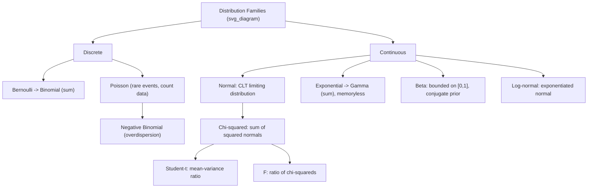

## Common Discrete and Continuous Distributions

### Introduction

A working command of standard distributional families is essential for model specification, simulation, and interpreting estimation output throughout statistics and econometrics. Each distribution below arises naturally from specific data-generating mechanisms (binary outcomes, counts, waiting times, sums of squared normals) that recur constantly in applied econometric modeling.

### Discrete Distributions

#### Bernoulli Distribution

**Definition**

$X \in \{0,1\}$ with $P(X=1)=p$, $P(X=0)=1-p$.

**Key Points**

- $E[X]=p$, $\text{Var}(X)=p(1-p)$.
- The fundamental building block of binary choice models (logit, probit): the response variable in these models is Bernoulli with success probability $p=P(Y=1\mid X)$ modeled as a function of covariates.

#### Binomial Distribution

**Definition**

Sum of $n$ i.i.d. Bernoulli$(p)$ trials: $X \sim \text{Binomial}(n,p)$,

$$P(X=k) = \binom{n}{k}p^k(1-p)^{n-k}, \quad k=0,1,\dots,n$$

**Key Points**

- $E[X]=np$, $\text{Var}(X)=np(1-p)$.
- Used to model aggregated binary outcomes (e.g., number of successes out of $n$ independent trials); the normal approximation to the binomial (via CLT) underlies large-sample proportion tests.

#### Poisson Distribution

**Definition**

$$P(X=k) = \frac{e^{-\lambda}\lambda^k}{k!}, \quad k=0,1,2,\dots$$

**Key Points**

- $E[X]=\text{Var}(X)=\lambda$ (the **equidispersion property**).
- The canonical model for count data: number of patents filed, number of transactions, number of insurance claims.
- Arises as the limiting distribution of Binomial$(n,p)$ as $n\to\infty$, $p\to0$, $np\to\lambda$ (Poisson limit theorem) — relevant to modeling rare events in large populations.
- Equidispersion is frequently violated in applied count data (overdispersion, $\text{Var}(X)>E[X]$), motivating the **Negative Binomial** as a standard alternative with an additional dispersion parameter.

#### Geometric and Negative Binomial

**Key Points**

- **Geometric($p$)**: number of failures before first success, $P(X=k)=(1-p)^k p$, $k=0,1,2,\dots$; $E[X]=(1-p)/p$. Memoryless: $P(X\ge s+t\mid X\ge s)=P(X\ge t)$.
- **Negative Binomial($r,p$)**: number of failures before the $r$-th success, generalizing the geometric; commonly reparameterized in count-data regression as a Poisson-Gamma mixture, allowing $\text{Var}(X) = \mu + \alpha\mu^2 > E[X]=\mu$ to accommodate overdispersion.

#### Multinomial Distribution

**Key Points**

- Vector generalization of the binomial: $(X_1,\dots,X_k)$ with $\sum X_i = n$, $P(X_1=x_1,\dots,X_k=x_k) = \frac{n!}{x_1!\cdots x_k!}p_1^{x_1}\cdots p_k^{x_k}$.
- Directly underlies the multinomial logit model for unordered discrete choice among $k$ alternatives, and the likelihood function for contingency table analysis.

#### Hypergeometric Distribution

**Key Points**

- Models sampling without replacement from a finite population of size $N$ with $K$ successes: $P(X=k) = \binom{K}{k}\binom{N-K}{n-k}/\binom{N}{n}$.
- Relevant to finite-population survey sampling theory and exact tests (e.g., Fisher's exact test) where the standard i.i.d. binomial approximation is invalid due to finite-population correlation.

### Continuous Distributions

#### Uniform Distribution

**Key Points**

- $\text{Uniform}(a,b)$: constant density $f(x)=1/(b-a)$ on $[a,b]$; $E[X]=(a+b)/2$, $\text{Var}(X)=(b-a)^2/12$.
- Central to the **probability integral transform** ($F_X(X)\sim\text{Uniform}(0,1)$ for continuous $X$) used in simulation, copula construction, and goodness-of-fit testing.

#### Normal (Gaussian) Distribution

**Definition**

$$f(x) = \frac{1}{\sqrt{2\pi\sigma^2}}\exp\left(-\frac{(x-\mu)^2}{2\sigma^2}\right), \quad x\in\mathbb{R}$$

**Key Points**

- $E[X]=\mu$, $\text{Var}(X)=\sigma^2$; symmetric, mesokurtic (kurtosis exactly 3).
- Closed under linear combination: any linear combination of jointly normal variables is normal — the property underlying exact finite-sample distribution theory for OLS under normal errors.
- Emerges asymptotically as the limiting distribution of standardized sums/estimators via the Central Limit Theorem, providing the theoretical justification for normal-approximation-based inference even when underlying data are non-normal, given sufficient sample size. [Inference: what constitutes a "sufficient" sample size for the normal approximation to be adequate is application- and distribution-specific]

#### Exponential Distribution

**Key Points**

- $f(x) = \lambda e^{-\lambda x}$, $x\ge0$; $E[X]=1/\lambda$, $\text{Var}(X)=1/\lambda^2$.
- **Memoryless property**: $P(X > s+t \mid X>s) = P(X>t)$ — implies a constant hazard rate, used as the baseline (null) case in duration/survival models of unemployment spells, firm survival, or time-to-default, against which more flexible hazard specifications (Weibull, log-logistic) are compared.

#### Gamma Distribution

**Key Points**

- $f(x) = \frac{\beta^\alpha}{\Gamma(\alpha)}x^{\alpha-1}e^{-\beta x}$, $x>0$; $E[X]=\alpha/\beta$, $\text{Var}(X)=\alpha/\beta^2$.
- Generalizes the exponential ($\alpha=1$) and sums of independent exponentials ($\alpha=$ integer, the Erlang case); the conjugate prior for the Poisson rate parameter in Bayesian count-data models.

#### Chi-Squared Distribution

**Key Points**

- $\chi^2_k$: distribution of the sum of $k$ squared independent standard normal variables; a special case of Gamma$(\alpha=k/2,\beta=1/2)$; $E[X]=k$, $\text{Var}(X)=2k$.
- Foundational to variance estimation (the sampling distribution of $(n-1)s^2/\sigma^2$ under normality) and to goodness-of-fit and likelihood ratio test statistics, which are asymptotically $\chi^2$-distributed under the null hypothesis.

#### Student's t-Distribution

**Key Points**

- Arises as the distribution of $\bar X - \mu)/(s/\sqrt n)$ when the population variance is estimated from the sample under normality; has heavier tails than the normal, with degrees of freedom $\nu$ controlling tail thickness (converging to $N(0,1)$ as $\nu\to\infty$).
- The basis of finite-sample $t$-tests for individual regression coefficients; increasingly heavy-tailed for small $\nu$, reflecting greater uncertainty from variance estimation.

#### F-Distribution

**Key Points**

- Ratio of two independent, appropriately scaled $\chi^2$ variables: $F = (\chi^2_{d_1}/d_1)/(\chi^2_{d_2}/d_2)$.
- Underlies $F$-tests for joint linear hypotheses on multiple regression coefficients (e.g., testing whether a group of coefficients are jointly zero) and for comparing nested model fit.

#### Beta Distribution

**Key Points**

- $f(x) = \frac{1}{B(\alpha,\beta)}x^{\alpha-1}(1-x)^{\beta-1}$, $x\in[0,1]$; flexible shape controlled by $\alpha,\beta$ (uniform when $\alpha=\beta=1$).
- The conjugate prior for the success probability in Bernoulli/Binomial likelihoods in Bayesian econometrics; also used to model bounded outcome variables such as proportions or market shares directly (Beta regression).

#### Log-Normal Distribution

**Key Points**

- If $\ln X \sim N(\mu,\sigma^2)$, then $X$ is log-normal; commonly used for strictly positive, right-skewed variables such as wages, firm size, and asset prices.
- $E[X] = e^{\mu+\sigma^2/2}$ (note: not $e^\mu$) — a frequent source of bias if naively back-transforming log-linear model predictions without the correction term (the "retransformation bias" issue in log-linear regression forecasting).

**Illustration**

### Relationships Among Distributions

**Key Points**

- Binomial → Normal (large $n$, moderate $p$, via CLT); Binomial → Poisson (large $n$, small $p$, fixed $np$).
- Sum of $k$ independent squared standard normals → $\chi^2_k$; ratio of standardized normal to square root of scaled independent $\chi^2$ → Student's $t$; ratio of two independent scaled $\chi^2$'s → $F$.
- Gamma with integer shape parameter → sum of i.i.d. exponentials (Erlang distribution); Gamma with $\alpha=k/2,\beta=1/2$ → $\chi^2_k$.
- These interrelationships are not coincidental: they follow directly from the closure properties of the normal distribution under linear transformation and quadratic forms, and from the moment generating function multiplicative property for sums of independent variables.

### Common Pitfalls

**Key Points**

- Assuming equidispersion (Poisson) holds for count data without checking — overdispersion is common in applied count data and biases standard errors (though not necessarily point estimates) if uncorrected.
- Naively exponentiating predicted values from a log-linear model to recover level predictions without applying the retransformation correction $e^{\hat\mu+\hat\sigma^2/2}$, understating the true conditional mean.
- Using the normal approximation for small-sample inference when a $t$-distribution (accounting for estimated variance) is more appropriate, understating uncertainty in small samples.
- Applying continuous distribution formulas (e.g., density-based probability statements) to discrete data, or vice versa, without appropriate continuity corrections when using normal approximations to discrete distributions.

**Related Topics**

- Maximum likelihood estimation for parametric distribution families
- Generalized linear models (link functions and exponential family distributions)
- Central Limit Theorem and distributional convergence
- Count data models: Poisson, Negative Binomial, zero-inflated variants
- Duration/survival analysis and hazard functions
- Sampling distributions of test statistics ($t$, $F$, $\chi^2$)