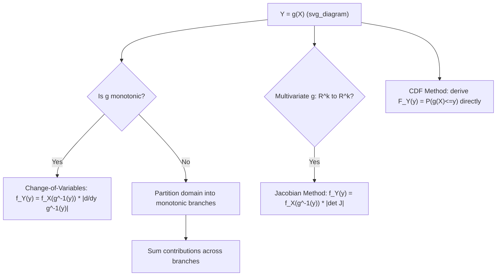

## Transformations of Random Variables

### Introduction

Transformation techniques provide the analytical machinery to derive the distribution of a function of one or more random variables from the original distribution(s). These methods are essential for deriving sampling distributions of test statistics, establishing properties of estimators under nonlinear transformations, and justifying simulation algorithms used throughout computational econometrics.

### The CDF (Distribution Function) Method

**Definition**

For $Y=g(X)$, derive $F_Y(y) = P(g(X)\le y)$ directly by expressing the event $\{g(X)\le y\}$ in terms of $X$, then differentiate to obtain $f_Y(y)=F_Y'(y)$.

**Key Points**

- The most general and always-applicable method, though algebraically more cumbersome than the change-of-variables formula for monotonic $g$.
- Particularly useful when $g$ is not monotonic (e.g., $Y=X^2$), where the event $\{X^2\le y\}$ must be expressed as $\{-\sqrt y \le X \le \sqrt y\}$, requiring careful handling of the domain.

**Example**

Deriving the $\chi^2_1$ distribution from $Y=X^2$ where $X\sim N(0,1)$:

$$F_Y(y) = P(X^2\le y) = P(-\sqrt y\le X\le\sqrt y) = F_X(\sqrt y)-F_X(-\sqrt y), \quad y\ge0$$

Differentiating using the chain rule and the symmetry of the standard normal density $\phi$:

$$f_Y(y) = \frac{1}{2\sqrt y}\left[\phi(\sqrt y)+\phi(-\sqrt y)\right] = \frac{1}{\sqrt{2\pi y}}e^{-y/2}, \quad y>0$$

which is exactly the $\chi^2_1$ density — the foundational building block for the $\chi^2_k$ distribution as a sum of $k$ such terms.

### Change-of-Variables Formula (Monotonic Transformations)

**Definition**

For $Y=g(X)$ with $g$ strictly monotonic and differentiable, with inverse $g^{-1}$:

$$f_Y(y) = f_X\big(g^{-1}(y)\big)\left|\frac{d}{dy}g^{-1}(y)\right|$$

**Key Points**

- The absolute value of the Jacobian term $|d g^{-1}(y)/dy|$ corrects for the local "stretching" or "compressing" of probability mass induced by the transformation — omitting it is a common and consequential error.
- Equivalently expressed via $\left|\frac{dy}{dx}\right|$: $f_Y(y) = f_X(x)/|g'(x)|$ evaluated at $x=g^{-1}(y)$.
- For linear transformations $Y=aX+b$ ($a\neq0$): $f_Y(y) = \frac{1}{|a|}f_X\left(\frac{y-b}{a}\right)$ — the basis for standardization ($Z=(X-\mu)/\sigma$) and location-scale families.

**Example**

Deriving that a linear transformation of a normal remains normal: if $X\sim N(\mu,\sigma^2)$ and $Y=aX+b$,

$$f_Y(y) = \frac{1}{|a|}\cdot\frac{1}{\sqrt{2\pi\sigma^2}}\exp\left(-\frac{\left(\frac{y-b}{a}-\mu\right)^2}{2\sigma^2}\right) = \frac{1}{\sqrt{2\pi a^2\sigma^2}}\exp\left(-\frac{(y-(a\mu+b))^2}{2a^2\sigma^2}\right)$$

confirming $Y\sim N(a\mu+b, a^2\sigma^2)$ — the closure property underlying standardization, forecast interval construction, and the exact finite-sample normality of OLS coefficient estimates under normal errors.

### Non-Monotonic Transformations

**Key Points**

- When $g$ is not one-to-one, the domain must be partitioned into regions where $g$ is monotonic, with each inverse branch contributing separately:

$$f_Y(y) = \sum_{i} f_X\big(g_i^{-1}(y)\big)\left|\frac{d}{dy}g_i^{-1}(y)\right|$$

summed over all branches $g_i^{-1}$ satisfying $g(g_i^{-1}(y))=y$.

- The $Y=X^2$ example above is the canonical two-branch case ($x=\pm\sqrt y$), generalizing directly to deriving $\chi^2$ and folded-normal type distributions relevant in absolute-value transformations of residuals.

### Multivariate Transformations: The Jacobian Method

**Definition**

For a bijective transformation $\mathbf{Y}=g(\mathbf{X})$ mapping $\mathbb{R}^k\to\mathbb{R}^k$ with inverse $\mathbf{x}=g^{-1}(\mathbf{y})$:

$$f_{\mathbf{Y}}(\mathbf{y}) = f_{\mathbf{X}}\big(g^{-1}(\mathbf{y})\big)\,\left|\det J\right|$$

where $J$ is the Jacobian matrix of partial derivatives $J_{ij} = \partial x_i/\partial y_j$.

**Key Points**

- $|\det J|$ generalizes the scalar absolute-derivative correction to the multivariate case, capturing the local volume-scaling effect of the transformation.
- Used directly to derive the joint distribution of order statistics, the distribution of linear combinations of multivariate normal vectors, and to establish change-of-measure results in likelihood-based estimation.
- When only a subset of transformed variables is of interest (e.g., deriving the marginal distribution of $Y_1=g_1(X_1,X_2)$ alone), an auxiliary variable $Y_2$ is often introduced to make the transformation bijective, followed by integrating out $Y_2$ from the resulting joint density.

**Illustration**

### Sums, Products, and Ratios of Random Variables

**Key Points**

- **Convolution** for sums: if $X\perp Y$, $f_{X+Y}(z) = \int f_X(x)f_Y(z-x)\,dx$ — used to derive that sums of independent normals are normal, sums of independent Poissons are Poisson, and sums of independent Gammas (with common rate) are Gamma.
- MGF/characteristic function approach often provides a computationally simpler route than direct convolution: since $M_{X+Y}(t)=M_X(t)M_Y(t)$ for independent $X,Y$, matching the resulting MGF to a known family identifies the sum's distribution without performing the convolution integral directly.
- **Ratios**: the ratio of two independent normals is Cauchy (no finite moments); the ratio of a standard normal to the square root of a scaled independent $\chi^2$ yields the Student's $t$-distribution — the derivation underlying the exact finite-sample distribution of the $t$-statistic under normal errors.
- **Products**: relevant to deriving the distribution of variance estimators and quadratic forms in normal random vectors (e.g., $X^\top A X$ for symmetric idempotent $A$, central to deriving degrees-of-freedom results in linear regression via Cochran's theorem).

### The Probability Integral Transform

**Definition**

For continuous $X$ with CDF $F_X$: $U = F_X(X) \sim \text{Uniform}(0,1)$.

**Key Points**

- Conversely, if $U\sim\text{Uniform}(0,1)$, then $X=F_X^{-1}(U)$ has CDF $F_X$ — the **inverse transform sampling** method, the standard algorithm for simulating random draws from an arbitrary distribution given only its (invertible) CDF, widely used in Monte Carlo and bootstrap-based econometric methods.
- Underlies **specification testing**: if a fitted model is correctly specified, the transformed residuals $F_{\hat\theta}(y_i)$ should be approximately Uniform$(0,1)$, providing a basis for goodness-of-fit diagnostics (e.g., PIT histograms in density forecast evaluation).
- Foundational to **copula construction**: transforming each marginal to Uniform$(0,1)$ via its own CDF isolates the dependence structure, which is then modeled separately via a copula function (Sklar's theorem).

### Order Statistics as a Transformation

**Key Points**

- Given i.i.d. $X_1,\dots,X_n$, the order statistics $X_{(1)}\le\cdots\le X_{(n)}$ are obtained via a (non-injective on the original labels, but well-defined) transformation of the sample; their joint density is $f_{X_{(1)},\dots,X_{(n)}}(x_1,\dots,x_n) = n!\prod_i f_X(x_i)$ for $x_1<\cdots<x_n$.
- The distribution of the sample minimum, maximum, and median can be derived via the CDF method applied to order statistics, directly relevant to extreme value theory used in financial risk and quantile estimation.

### Common Pitfalls

**Key Points**

- Omitting the Jacobian (absolute derivative or determinant) term when applying the change-of-variables formula — the single most common computational error in transformation problems.
- Applying the monotonic change-of-variables formula directly to a non-monotonic transformation without partitioning the domain into monotonic branches.
- Assuming a transformed variable retains desirable properties (unbiasedness, normality) of the original variable without formal verification — nonlinear transformations of unbiased estimators are generally biased (Jensen's inequality), and nonlinear transformations of normal variables are generally non-normal.
- Confusing the density transformation formula with the CDF transformation formula, particularly when transformations are non-monotonic and the CDF method must be used directly rather than the shortcut Jacobian formula.

**Related Topics**

- Distribution theory: chi-squared, Student's t, and F derivations
- Monte Carlo simulation and inverse transform sampling
- Copula theory and the probability integral transform
- Order statistics and extreme value theory
- Delta method for transformations of asymptotically normal estimators
- Quadratic forms in normal vectors and Cochran's theorem