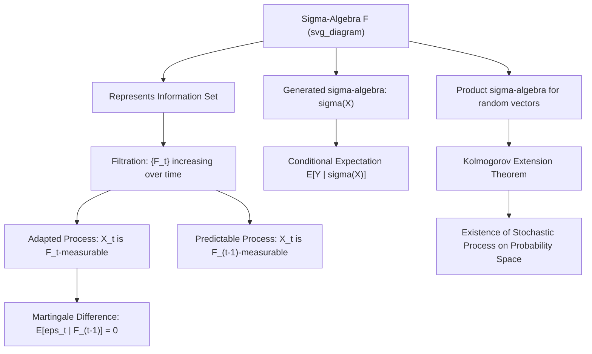

## Measure-Theoretic Probability and Sigma-Algebras

### Introduction

Building on introductory probability, a rigorous treatment of measure-theoretic foundations is necessary to formally establish asymptotic results in econometrics — laws of large numbers, central limit theorems for dependent data, and empirical process theory all require the precise apparatus of $\sigma$-algebras, filtrations, and measurable functions rather than the informal density-based treatment sufficient for elementary probability.

### Sigma-Algebras Revisited: Information and Measurability

**Definition**

A $\sigma$-algebra $\mathcal{F}$ on $\Omega$ is a collection of subsets closed under complementation and countable unions, containing $\Omega$. A function $X:\Omega\to\mathbb{R}$ is $\mathcal{F}$-measurable if $\{\omega: X(\omega)\le a\}\in\mathcal{F}$ for all $a$.

**Key Points**

- In asymptotic econometrics, $\sigma$-algebras are interpreted as **information sets**: $\mathcal{F}$-measurability of a random variable formalizes the statement that the variable's value is fully determined (knowable) given the information encoded in $\mathcal{F}$.
- The **Borel $\sigma$-algebra** $\mathcal{B}(\mathbb{R})$, generated by open sets, is the standard measurable structure on $\mathbb{R}$; a function is a genuine random variable precisely when it is Borel-measurable.
- **Generated $\sigma$-algebras**: $\sigma(X)$, the smallest $\sigma$-algebra making $X$ measurable, formalizes "the information contained in observing $X$" — central to defining conditional expectation given a random variable rather than given an abstract sub-$\sigma$-algebra.
- Sub-$\sigma$-algebras $\mathcal{G}\subset\mathcal{F}$ represent coarser information sets; nested sequences of $\sigma$-algebras represent evolving information over time.

### Filtrations and Adapted Processes

**Definition**

A **filtration** $\{\mathcal{F}_t\}_{t\ge0}$ is an increasing sequence of $\sigma$-algebras: $\mathcal{F}_s\subseteq\mathcal{F}_t$ for $s\le t$. A stochastic process $\{X_t\}$ is **adapted** to $\{\mathcal{F}_t\}$ if $X_t$ is $\mathcal{F}_t$-measurable for each $t$.

**Key Points**

- Filtrations formalize the accumulation of information over time — $\mathcal{F}_t$ represents "everything knowable up to and including time $t$."
- The **natural filtration** generated by a process $\{X_t\}$ is $\mathcal{F}_t=\sigma(X_s: s\le t)$ — the smallest filtration to which $\{X_t\}$ is adapted, used implicitly whenever conditioning "on the past" in time series models.
- **Predictability**: a process $\{X_t\}$ is predictable if $X_t$ is $\mathcal{F}_{t-1}$-measurable (known one period ahead) — this distinction between adapted and predictable processes is essential in defining valid instruments and lagged regressors that avoid simultaneity bias.
- **Martingale difference sequences** are defined directly via filtrations: $E[\varepsilon_t\mid\mathcal{F}_{t-1}]=0$, the foundational assumption for GMM and many time series estimators' asymptotic theory, strictly weaker than the i.i.d. assumption.

### Measurable Spaces, Product Spaces, and Random Vectors

**Key Points**

- For a random vector $\mathbf{X}=(X_1,\dots,X_k):\Omega\to\mathbb{R}^k$, measurability is defined with respect to the **product Borel $\sigma$-algebra** $\mathcal{B}(\mathbb{R}^k) = \mathcal{B}(\mathbb{R})\otimes\cdots\otimes\mathcal{B}(\mathbb{R})$.
- **Product measures**: for independent random variables, the joint probability measure on the product space is the product measure $P_X\times P_Y$; **Fubini's theorem** permits computing expectations as iterated integrals under this structure, subject to integrability conditions — justifying the standard "integrate out one variable at a time" computations used throughout multivariate econometrics.
- Infinite-dimensional product spaces (e.g., the space of infinite sequences $\{X_t\}_{t=1}^\infty$) require the **Kolmogorov Extension Theorem** to establish existence of a consistent probability measure on the full sequence space given only finite-dimensional distributions — the formal justification for treating a stochastic process as defined on a single underlying probability space.

**Illustration**

### Conditional Expectation as Projection

**Definition**

Given $(\Omega,\mathcal{F},P)$ and sub-$\sigma$-algebra $\mathcal{G}\subset\mathcal{F}$, $E[X\mid\mathcal{G}]$ is the unique (a.s.) $\mathcal{G}$-measurable random variable satisfying $\int_A E[X\mid\mathcal{G}]\,dP = \int_A X\,dP$ for all $A\in\mathcal{G}$.

**Key Points**

- For $X\in L^2(\Omega,\mathcal{F},P)$, $E[X\mid\mathcal{G}]$ is precisely the **orthogonal projection** of $X$ onto the subspace $L^2(\Omega,\mathcal{G},P)$ of $\mathcal{G}$-measurable, square-integrable random variables — this Hilbert space interpretation directly parallels the projection interpretation of the OLS fitted values as the projection of $Y$ onto the column space of $X$.
- **Law of Iterated Expectations** (tower property): $E[E[X\mid\mathcal{F}_1]\mid\mathcal{F}_2] = E[X\mid\mathcal{F}_2]$ for $\mathcal{F}_2\subset\mathcal{F}_1$, following directly from the defining integral property.
- **Conditional Jensen's Inequality**: $g(E[X\mid\mathcal{G}]) \le E[g(X)\mid\mathcal{G}]$ for convex $g$ — the measure-theoretic generalization used in deriving bounds on conditional risk and in proving properties of conditional variance decompositions.

### Almost Sure Convergence and Modes of Convergence

**Key Points**

- $X_n \to X$ **almost surely (a.s.)** if $P(\{\omega: X_n(\omega)\to X(\omega)\}) = 1$ — the strongest standard mode of stochastic convergence, underlying the **Strong Law of Large Numbers**.
- $X_n \to X$ **in probability** if $\forall\varepsilon>0$, $P(|X_n-X|>\varepsilon)\to0$ — a weaker mode, sufficient for consistency results, implied by (but not implying) almost sure convergence.
- $X_n \to X$ **in $L^p$** if $E[|X_n-X|^p]\to0$ — requires existence of $p$-th moments, implies convergence in probability via Markov's/Chebyshev's inequality.
- $X_n \to X$ **in distribution** if $F_{X_n}(x)\to F_X(x)$ at all continuity points of $F_X$ — the weakest mode, sufficient for the Central Limit Theorem's conclusion, and does not require $X_n, X$ to be defined on a common probability space.
- These modes form a strict hierarchy (a.s. $\implies$ in probability $\implies$ in distribution; $L^p\implies$ in probability), with precise implications formalized via the **Borel-Cantelli lemmas** and **Skorokhod representation theorem**, both requiring genuine measure-theoretic tools beyond elementary probability.

### Uniform Integrability and Convergence Theorems

**Key Points**

- **Uniform integrability (UI)** of $\{X_n\}$: $\lim_{K\to\infty}\sup_n E[|X_n|\mathbb{1}\{|X_n|>K\}] = 0$ — the precise condition under which convergence in probability upgrades to convergence in $L^1$ (mean), critical for establishing that estimator bias vanishes asymptotically rather than merely that the estimator concentrates near the truth.
- **Dominated Convergence Theorem**: pointwise (or a.s.) convergence plus domination by an integrable function implies convergence of expectations — the standard tool for justifying interchange of limits and expectations throughout consistency proofs.
- **Monotone Convergence Theorem** and **Fatou's Lemma** provide related but weaker tools applicable when domination fails but monotonicity or nonnegativity holds.

### Applications to Asymptotic Theory in Econometrics

**Key Points**

- The **Strong Law of Large Numbers** for i.i.d. sequences with finite mean: $\bar X_n \to \mu$ a.s. — the rigorous justification for treating sample averages as consistent estimators of population means, requiring measure-theoretic almost-sure convergence machinery for a full proof (via Kolmogorov's SLLN or the Etemadi SLLN for i.i.d. sequences).
- **Uniform Laws of Large Numbers (ULLN)** extend pointwise consistency to uniform consistency over a parameter space, a measure-theoretic requirement (often established via stochastic equicontinuity, itself resting on Donsker-class and entropy conditions) essential for consistency of extremum estimators (MLE, GMM, nonlinear least squares).
- **Martingale Central Limit Theorems** generalize the classical i.i.d. CLT to dependent, heterogeneously distributed data satisfying the martingale difference property with respect to a filtration — the standard tool for establishing asymptotic normality of GMM and time series estimators under dependence.

### Common Pitfalls

**Key Points**

- Treating conditional expectation given an abstract sub-$\sigma$-algebra as equivalent to the elementary density-ratio definition of conditioning on a random variable's realized value — the two coincide when conditioning on $\sigma(X)$ but the measure-theoretic definition is strictly more general (e.g., conditioning on an entire past sample path).
- Assuming almost sure convergence and convergence in probability are interchangeable — a.s. convergence is strictly stronger and requires additional structure (e.g., via Borel-Cantelli) to establish, while convergence in probability is typically what is actually proven and needed for consistency results.
- Neglecting uniform integrability when asserting that convergence in probability implies convergence of expectations — without UI, convergence in probability alone does not guarantee $E[X_n]\to E[X]$.
- Confusing adapted processes (measurable at time $t$) with predictable processes (measurable at time $t-1$) when specifying valid instruments or constructing test statistics that require strict exogeneity or predetermined regressors.

**Related Topics**

- Laws of large numbers: weak, strong, and uniform versions
- Martingale theory and martingale central limit theorems
- Empirical process theory and stochastic equicontinuity
- Modes of stochastic convergence and their implications
- Kolmogorov extension theorem and existence of stochastic processes
- Hilbert space theory and projection interpretations of conditional expectation