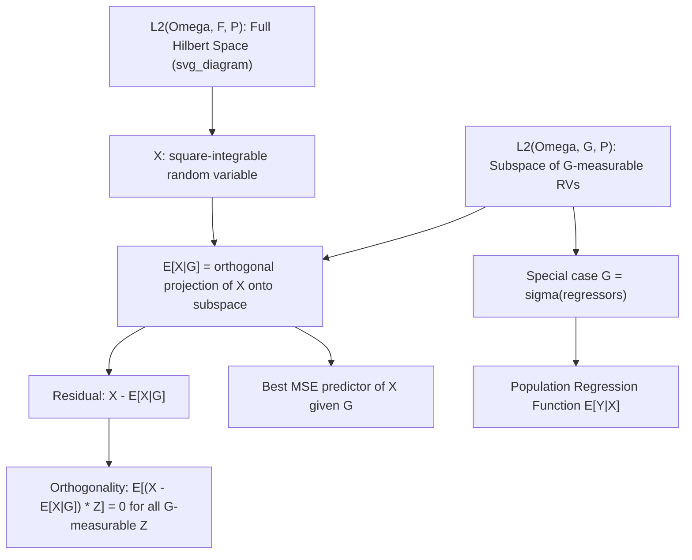

## Conditional Expectation as a Projection

### Introduction

Viewing conditional expectation as an orthogonal projection in a Hilbert space unifies seemingly disparate econometric concepts — OLS regression, GLS, GMM efficiency, and best linear predictors — under a single geometric framework. This perspective clarifies why regression coefficients minimize mean squared error, why orthogonality conditions characterize optimal estimators, and why efficiency comparisons reduce to comparing projection subspaces.

### The Hilbert Space $L^2(\Omega,\mathcal{F},P)$

**Definition**

$L^2(\Omega,\mathcal{F},P)$ is the space of random variables $X$ on $(\Omega,\mathcal{F},P)$ with $E[X^2]<\infty$, equipped with inner product:

$$\langle X, Y\rangle = E[XY]$$

and induced norm $\|X\| = \sqrt{E[X^2]}$.

**Key Points**

- $L^2$ is a complete inner product space (a genuine Hilbert space) — completeness (every Cauchy sequence converges within the space) is what permits projection theorems to apply rigorously.
- $\langle X,Y\rangle = E[XY] = \text{Cov}(X,Y)+E[X]E[Y]$; for mean-zero variables, the inner product reduces to covariance, so "orthogonality" in this space corresponds exactly to zero covariance.
- The norm $\|X\|^2 = E[X^2]$ is the (uncentered) second moment; $\|X-E[X]\|^2 = \text{Var}(X)$, so distances in this space correspond directly to variances and mean squared errors — the geometric quantity econometric estimators are typically designed to minimize.

### Conditional Expectation as Orthogonal Projection

**Definition**

For $\mathcal{G}\subset\mathcal{F}$ a sub-$\sigma$-algebra, $L^2(\Omega,\mathcal{G},P)$ is the (closed) subspace of $\mathcal{G}$-measurable, square-integrable random variables. Then:

$$E[X\mid\mathcal{G}] = \text{proj}_{L^2(\Omega,\mathcal{G},P)}(X)$$

i.e., $E[X\mid\mathcal{G}]$ is the unique element of $L^2(\Omega,\mathcal{G},P)$ minimizing $\|X - Z\|^2 = E[(X-Z)^2]$ over all $\mathcal{G}$-measurable $Z\in L^2$.

**Key Points**

- This is a direct consequence of the **Hilbert Projection Theorem**: for any closed subspace $M$ of a Hilbert space and any point $X$, there exists a unique closest point in $M$, characterized by the **orthogonality condition** $X - \text{proj}_M(X) \perp M$.
- Applied here: $E[(X - E[X\mid\mathcal{G}])Z] = 0$ for all $\mathcal{G}$-measurable $Z\in L^2$ — the **orthogonality principle**, which is precisely the defining property used to derive and verify conditional expectations in applied settings.
- This projection characterization *is* the reason conditional expectation is the **best predictor** (in mean-squared-error sense) of $X$ given the information in $\mathcal{G}$: no other $\mathcal{G}$-measurable function of the data achieves lower expected squared prediction error.

**Illustration**

### Connection to OLS and Best Linear Prediction

**Key Points**

- **Population OLS** is the projection of $Y$ onto the *linear* subspace spanned by $\{1, X_1,\dots,X_k\}$ (rather than the full space of all measurable functions of $X$): $\beta = \arg\min_b E[(Y - X^\top b)^2]$, with the resulting **normal equations** $E[X(Y-X^\top\beta)]=0$ being exactly the orthogonality condition restricted to the linear subspace.
- This clarifies the precise sense in which OLS is "correctly specified": OLS always estimates the best *linear* predictor, coinciding with $E[Y\mid X]$ exactly only when the true conditional expectation function happens to be linear (e.g., under joint normality) — otherwise OLS is a well-defined but approximative projection.
- **Nonparametric regression** (kernel, series, sieve methods) can be understood as projecting onto progressively richer (larger) subspaces that approximate the full $L^2(\Omega,\sigma(X),P)$ space, trading off approximation bias against estimation variance as the subspace grows with sample size.

### Generalized Least Squares as a Change of Inner Product

**Key Points**

- GLS arises from redefining the inner product to account for a known covariance structure $\Omega$: $\langle X,Y\rangle_\Omega = X^\top\Omega^{-1}Y$, under which the GLS estimator is again the projection of $Y$ onto the column space of $X$, but measured in the $\Omega$-weighted geometry rather than the standard Euclidean one.
- This reframing explains the **Gauss-Markov theorem** and its GLS generalization geometrically: OLS is BLUE under spherical errors because it is the correct orthogonal projection in the *standard* inner product; when errors are heteroskedastic or correlated, the correct inner product changes, and only GLS achieves the corresponding orthogonal (and hence minimum-variance) projection.

### Sequential Projections and the Law of Iterated Expectations

**Key Points**

- If $\mathcal{G}_1 \subset \mathcal{G}_2$ (a coarser information set nested within a finer one), then projecting onto $\mathcal{G}_2$ and then onto $\mathcal{G}_1$ is equivalent to projecting directly onto $\mathcal{G}_1$:

  $$E[E[X\mid\mathcal{G}_2]\mid\mathcal{G}_1] = E[X\mid\mathcal{G}_1]$$
- Geometrically, this states that composing two orthogonal projections onto nested subspaces equals the projection onto the smaller (coarser) subspace directly — a standard fact about nested projections in Hilbert space theory, giving the **Law of Iterated Expectations** a transparent geometric proof rather than requiring direct measure-theoretic verification each time.
- This projection view directly explains why the residual from a "long regression" (on a larger information set) is orthogonal to the residual structure implied by any "short regression" nested within it — a fact used in the Frisch-Waugh-Lovell theorem and in sequential moment condition constructions in GMM.

### Efficiency Comparisons via Projection Geometry

**Key Points**

- Comparing two estimators' asymptotic efficiency often reduces to comparing which one projects onto a larger (more informative) subspace: an estimator using more valid moment conditions projects onto a richer subspace and (weakly) achieves lower asymptotic variance — the geometric intuition behind the **efficiency bound** results in GMM (using the optimal weighting matrix corresponds to an efficient projection with respect to the correct metric).
- The **Cramér-Rao lower bound** and **semiparametric efficiency bounds** can be interpreted via the geometry of projecting the score function onto (or orthogonal to) nuisance-parameter tangent spaces in the relevant Hilbert space of score functions — a perspective foundational to modern semiparametric efficiency theory. [Inference: the full semiparametric efficiency bound derivation requires additional technical machinery (tangent spaces, influence functions) beyond the basic projection intuition sketched here, so this connection should be understood as illustrative rather than a complete derivation]

### Residuals as Orthogonal Complements

**Key Points**

- The residual $U = X - E[X\mid\mathcal{G}]$ satisfies $E[U\mid\mathcal{G}]=0$ (a strictly stronger property than mere uncorrelatedness $E[UZ]=0$ for $\mathcal{G}$-measurable $Z$, though the two coincide within $L^2$ under the projection framework restricted to that space).
- $\text{Var}(X) = \text{Var}(E[X\mid\mathcal{G}]) + \text{Var}(U)$ — the **Law of Total Variance**, which follows immediately from the Pythagorean theorem applied to the orthogonal decomposition $X = E[X\mid\mathcal{G}] + U$ in the Hilbert space, providing a direct geometric derivation of a result otherwise proven via direct algebraic manipulation of variance definitions.
- This orthogonal decomposition is the conceptual basis for **ANOVA-style variance decompositions**, R-squared interpretation (the fraction of variance explained by the projection onto the regressor subspace), and hierarchical/multilevel model variance partitioning.

**Example**

Geometric derivation of $R^2$: with $\hat Y = \text{proj}_{\text{span}(1,X)}(Y)$ the OLS fitted values,

$$\text{Var}(Y) = \text{Var}(\hat Y) + \text{Var}(Y-\hat Y)$$

by the Pythagorean theorem (since $\hat Y \perp (Y-\hat Y)$ by the projection orthogonality condition), giving:

$$R^2 = \frac{\text{Var}(\hat Y)}{\text{Var}(Y)} = 1 - \frac{\text{Var}(Y-\hat Y)}{\text{Var}(Y)}$$

directly interpretable as the squared cosine of the angle between $Y$ and its projection $\hat Y$ in the $L^2$ geometry — making $R^2 \in [0,1]$ an immediate geometric consequence rather than a separately derived algebraic fact.

### Common Pitfalls

**Key Points**

- Conflating the population (theoretical) projection $E[Y\mid X]$ with the finite-sample OLS estimator $\hat\beta$ — the Hilbert space projection framework describes the population object that OLS *estimates*, not sample-based estimation error, which requires separate asymptotic theory.
- Assuming OLS recovers the true conditional expectation function $E[Y\mid X]$ in general — it recovers only the best *linear* projection unless $E[Y\mid X]$ happens to be linear in $X$.
- Treating "uncorrelated with $\mathcal{G}$" ($E[UZ]=0$ for all $\mathcal{G}$-measurable $Z\in L^2$) as equivalent to "mean-independent of $\mathcal{G}$" ($E[U\mid\mathcal{G}]=0$) outside the specific $L^2$ projection context — mean independence is a strictly stronger, non-linear notion of orthogonality in general.
- Overextending the projection intuition to nonlinear or non-$L^2$ settings without appropriate technical qualification, since the Hilbert Projection Theorem specifically requires a complete inner product space and a closed subspace.

**Related Topics**

- Gauss-Markov theorem and generalized least squares geometry
- Frisch-Waugh-Lovell theorem
- GMM efficiency and optimal weighting matrices
- Semiparametric efficiency bounds and influence functions
- ANOVA and variance decomposition
- Nonparametric and sieve regression as function-space projection