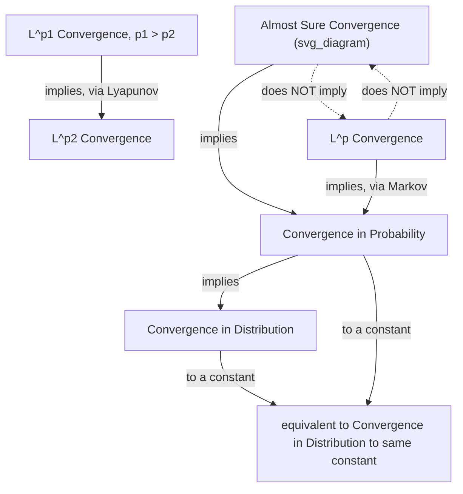

## Modes of Stochastic Convergence

### Introduction

Precise characterization of how sequences of random variables converge underlies every asymptotic result in econometrics: consistency, asymptotic normality, and the validity of large-sample inference all depend on specifying and correctly applying the appropriate mode of convergence. The four principal modes — almost sure, in probability, in $L^p$, and in distribution — form a hierarchy with distinct implications and distinct roles in estimation theory.

### Convergence in Probability

**Definition**

$X_n \xrightarrow{p} X$ if for every $\varepsilon>0$:

$$\lim_{n\to\infty} P(|X_n - X| > \varepsilon) = 0$$

**Key Points**

- The standard mode used to define **consistency**: an estimator $\hat\theta_n$ is consistent for $\theta_0$ if $\hat\theta_n \xrightarrow{p} \theta_0$.
- Weaker than almost sure convergence: convergence in probability allows $X_n$ to occasionally deviate substantially from $X$, as long as the probability of large deviations vanishes.
- **Weak Law of Large Numbers (WLLN)**: for i.i.d. $X_i$ with finite mean $\mu$, $\bar X_n \xrightarrow{p} \mu$ — provable via Chebyshev's inequality when variance is finite, or more generally via characteristic function arguments.
- **Slutsky's Theorem**: if $X_n \xrightarrow{d} X$ and $Y_n \xrightarrow{p} c$ (a constant), then $X_n + Y_n \xrightarrow{d} X+c$, $X_nY_n\xrightarrow{d} cX$, and (for $c\neq0$) $X_n/Y_n \xrightarrow{d} X/c$ — the essential tool combining consistent variance estimators with asymptotically normal statistics to construct valid test statistics (e.g., $t$-statistics using estimated standard errors).

### Almost Sure Convergence

**Definition**

$X_n \xrightarrow{a.s.} X$ if:

$$P\left(\lim_{n\to\infty} X_n = X\right) = 1$$

**Key Points**

- The strongest of the four standard modes: convergence occurs pathwise, for almost every outcome $\omega$, not merely with vanishing probability of deviation.
- **Strong Law of Large Numbers (SLLN)**: for i.i.d. $X_i$ with finite mean $\mu$, $\bar X_n \xrightarrow{a.s.} \mu$ (Kolmogorov's SLLN) — a strictly stronger conclusion than the WLLN, requiring more delicate proof techniques (typically via the Borel-Cantelli lemmas or martingale convergence arguments).
- Almost sure convergence implies convergence in probability, but the converse fails in general — a classical counterexample involves a sequence of shrinking-probability "typewriter" indicator functions that converge in probability to 0 but fail to converge almost surely for any fixed $\omega$.
- In applied econometrics, results are often stated using convergence in probability (sufficient for consistency) even when the underlying proof technique establishes the stronger almost sure result, since the weaker mode suffices for the practical conclusion needed. [Inference: whether a specific published result states convergence in probability or almost surely depends on the particular proof technique used, so this should be checked against the specific source]

### Convergence in $L^p$ (Mean-Square and Beyond)

**Definition**

$X_n \xrightarrow{L^p} X$ if:

$$\lim_{n\to\infty} E[|X_n - X|^p] = 0$$

for $p\ge1$. The case $p=2$ is called **convergence in mean square** (or $L^2$).

**Key Points**

- Requires existence of the $p$-th moment of $X_n$ and $X$ for all $n$ — a genuine restriction not shared by convergence in probability or in distribution.
- $L^p$ convergence implies convergence in probability via **Markov's inequality**: $P(|X_n-X|>\varepsilon) \le E[|X_n-X|^p]/\varepsilon^p \to 0$.
- Mean-square convergence is the natural mode for establishing consistency via direct bias-variance calculations: if $E[(\hat\theta_n-\theta_0)^2] = \text{Bias}(\hat\theta_n)^2 + \text{Var}(\hat\theta_n) \to 0$, then $\hat\theta_n \xrightarrow{L^2} \theta_0$, and hence $\hat\theta_n \xrightarrow{p} \theta_0$ — this is the standard elementary technique for proving consistency of estimators with tractable finite-sample moments.
- $L^p$ convergence for $p_1 > p_2 \ge 1$ implies $L^{p_2}$ convergence (via Jensen's/Lyapunov's inequality), giving a further hierarchy within the $L^p$ modes themselves.

### Convergence in Distribution

**Definition**

$X_n \xrightarrow{d} X$ if:

$$\lim_{n\to\infty} F_{X_n}(x) = F_X(x)$$

at every point $x$ where $F_X$ is continuous.

**Key Points**

- The weakest of the four modes: does not require $X_n$ and $X$ to be defined on the same probability space, and convergence in distribution alone does not imply that $X_n$ and $X$ are numerically close for any given realization.
- The mode used to state the **Central Limit Theorem**: $\sqrt{n}(\bar X_n - \mu)/\sigma \xrightarrow{d} N(0,1)$, and more generally, the asymptotic normality results underlying construction of confidence intervals and hypothesis tests for essentially all standard econometric estimators.
- Convergence in probability to a *constant* implies convergence in distribution to that same constant (a degenerate limiting distribution) — the reverse implication (convergence in distribution to a constant implies convergence in probability) also holds, a special equivalence used in verifying consistency via a degenerate limiting normal distribution (as variance shrinks appropriately with $n$).
- **Continuous Mapping Theorem**: if $X_n \xrightarrow{d} X$ and $g$ is continuous (a.e. with respect to the distribution of $X$), then $g(X_n) \xrightarrow{d} g(X)$ — used constantly to derive limiting distributions of transformed statistics (e.g., the limiting distribution of a Wald statistic as a continuous function of an asymptotically normal estimator).

**Illustration**

### Hierarchy and Non-Implications

**Key Points**

- **Implications**: a.s. $\implies$ in probability $\implies$ in distribution; $L^p \implies$ in probability $\implies$ in distribution; $L^{p_1} \implies L^{p_2}$ for $p_1>p_2$.
- **Non-implications**: convergence in probability does *not* imply almost sure convergence (without additional structure, e.g., a summable rate of convergence enabling a Borel-Cantelli argument); almost sure convergence does *not* imply $L^p$ convergence (without uniform integrability, since a.s. convergent sequences can still have exploding moments along a vanishing-probability path); convergence in distribution does *not* imply convergence in probability (except in the special degenerate-limit case noted above).
- **Uniform integrability** is precisely the missing ingredient that upgrades a.s. or in-probability convergence to $L^p$ convergence — establishing UI is a standard, sometimes nontrivial, step in proving convergence of expected loss functions (e.g., mean squared error) rather than merely establishing consistency itself.

### Rates of Convergence and Stochastic Order Notation

**Key Points**

- $X_n = o_p(a_n)$ ("small $o_p$") means $X_n/a_n \xrightarrow{p} 0$ — the sequence is asymptotically negligible relative to $a_n$.
- $X_n = O_p(a_n)$ ("big $O_p$", **bounded in probability**) means for every $\varepsilon>0$ there exists $M,N$ such that $P(|X_n/a_n|>M)<\varepsilon$ for all $n>N$ — the sequence does not grow faster than $a_n$ in probability, without necessarily vanishing relative to it.
- These stochastic order symbols are used pervasively in econometric asymptotic derivations: e.g., stating that $\hat\theta_n - \theta_0 = O_p(n^{-1/2})$ (the standard parametric rate) or that a remainder term in a Taylor expansion is $o_p(n^{-1/2})$ (asymptotically negligible relative to the leading term), a shorthand that packages precise convergence-in-probability statements into convenient algebraic manipulation rules.
- **Lyapunov's and Chebyshev's inequalities** provide the standard elementary tools for establishing explicit convergence rates in $O_p/o_p$ notation from moment bounds.

### Delta Method as an Application of Modes of Convergence

**Key Points**

- The delta method combines convergence in distribution (of $\sqrt n(\hat\theta_n-\theta_0)$) with the Continuous Mapping Theorem and a first-order Taylor expansion (using convergence in probability of $\hat\theta_n$ to $\theta_0$ to control the remainder term) to derive the limiting distribution of $\sqrt n(g(\hat\theta_n)-g(\theta_0))$ — a canonical illustration of how the different modes of convergence interact within a single derivation.
- The remainder term in the Taylor expansion is shown to be $o_p(1)$ using consistency ($\hat\theta_n\xrightarrow{p}\theta_0$) combined with continuity of $g'$, after which Slutsky's theorem combines the negligible remainder with the leading asymptotically normal term.

### Common Pitfalls

**Key Points**

- Assuming almost sure convergence when only convergence in probability has actually been established (or is needed) — the two are not interchangeable, and results proven for one mode do not automatically transfer to the other.
- Assuming convergence in distribution implies numerical closeness between $X_n$ and its limit $X$ for a given sample — convergence in distribution is a statement about the entire distribution, not about pathwise behavior, and does not support probabilistic statements about $|X_n - X|$ directly.
- Applying $L^p$ convergence results (e.g., mean squared error consistency arguments) without verifying that the relevant moments actually exist and are finite — a genuine restriction not required by convergence in probability or in distribution.
- Neglecting to verify uniform integrability when claiming that a.s. or in-probability convergence upgrades to convergence of expectations (e.g., asserting that a consistent estimator's expected loss necessarily converges to zero without this additional condition).

**Related Topics**

- Laws of large numbers: weak, strong, and uniform versions
- Central Limit Theorem and its extensions (Lindeberg-Feller, martingale CLT)
- Slutsky's theorem and the Continuous Mapping Theorem
- Delta method and asymptotic normality of transformed estimators
- Stochastic order notation ($O_p$, $o_p$) in asymptotic derivations
- Uniform integrability and convergence of moments