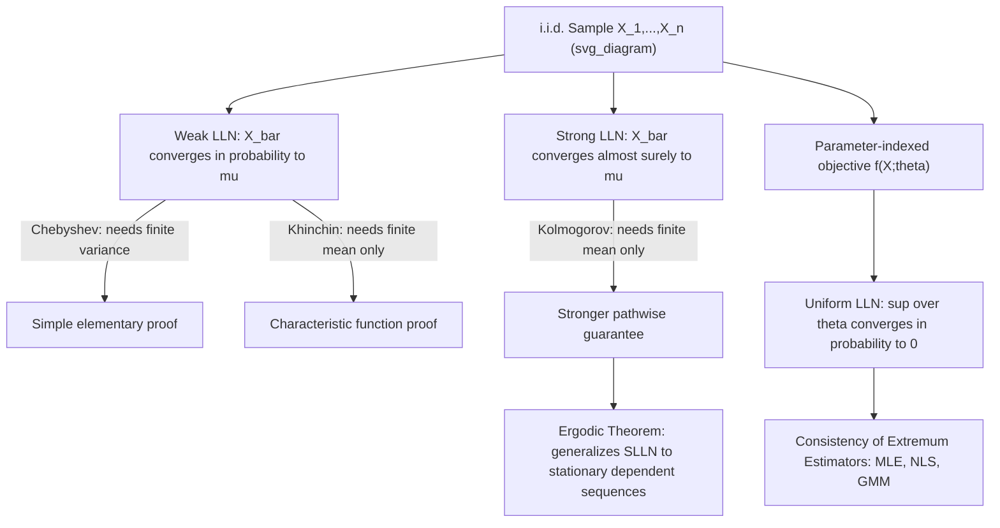

## Laws of Large Numbers

### Introduction

Laws of large numbers formalize the intuition that sample averages stabilize around population values as sample size grows, providing the theoretical justification for treating estimators as consistent and for the entire enterprise of learning population parameters from finite samples. Weak, strong, and uniform versions address progressively more demanding requirements relevant to different classes of econometric estimators.

### Weak Law of Large Numbers (WLLN)

**Definition**

For i.i.d. random variables $X_1,\dots,X_n$ with $E[X_i]=\mu$:

$$\bar X_n = \frac{1}{n}\sum_{i=1}^n X_i \xrightarrow{p} \mu \quad \text{as } n\to\infty$$

**Key Points**

- **Chebyshev's proof** (assuming finite variance $\sigma^2$): by Chebyshev's inequality, $P(|\bar X_n-\mu|>\varepsilon) \le \text{Var}(\bar X_n)/\varepsilon^2 = \sigma^2/(n\varepsilon^2) \to 0$ — the simplest and most commonly taught proof technique, though it requires finite variance, a stronger condition than the WLLN itself actually needs.
- **Khinchin's WLLN**: for i.i.d. variables, only a finite *mean* (not necessarily finite variance) is required for convergence in probability — established via characteristic function arguments (showing $\phi_{\bar X_n}(t) \to e^{it\mu}$, the characteristic function of the constant $\mu$) rather than the variance-based Chebyshev approach.
- Convergence in probability (not almost sure) is the conclusion — sufficient for establishing **consistency** of the sample mean as an estimator of the population mean, the standard practical use case in econometrics.
- Does not require identical distribution in the strictest form: generalizations exist for independent, non-identically distributed sequences under suitable conditions on the variances (e.g., a Lindeberg-type condition bounding the growth of variances).

### Strong Law of Large Numbers (SLLN)

**Definition**

For i.i.d. random variables $X_1,\dots,X_n$ with $E[X_i]=\mu$:

$$\bar X_n \xrightarrow{a.s.} \mu \quad \text{as } n\to\infty$$

**Key Points**

- **Kolmogorov's SLLN**: for i.i.d. sequences, finite mean $E|X_i|<\infty$ is sufficient (no finite variance required) for almost sure convergence — a genuinely stronger conclusion than the WLLN under comparably weak moment conditions, proven via more delicate techniques (Kolmogorov's inequality combined with a truncation argument, or via martingale convergence theorems).
- The distinction between weak and strong convergence matters practically: strong convergence guarantees that, with probability 1, any single infinite realization of the sample path eventually stabilizes near $\mu$ and stays there — a pathwise guarantee not delivered by the weak law alone, relevant to simulation-based methods that rely on a single long simulated path (e.g., MCMC ergodic averages).
- For non-i.i.d. but stationary and **ergodic** sequences, the **Ergodic Theorem** (Birkhoff) generalizes the SLLN: time averages converge almost surely to the expectation under the invariant (stationary) distribution — the theoretical basis for consistent estimation from a single observed time series path, since econometricians typically observe only one realization of a time series process rather than repeated independent draws.

### Uniform Law of Large Numbers (ULLN)

**Definition**

For a class of functions $\{f(\cdot;\theta): \theta\in\Theta\}$, the ULLN states:

$$\sup_{\theta\in\Theta} \left|\frac{1}{n}\sum_{i=1}^n f(X_i;\theta) - E[f(X_i;\theta)]\right| \xrightarrow{p} 0$$

**Key Points**

- Pointwise consistency of $\frac{1}{n}\sum_i f(X_i;\theta) \to E[f(X_i;\theta)]$ for each fixed $\theta$ is insufficient to guarantee consistency of an extremum estimator $\hat\theta_n = \arg\max_\theta \frac{1}{n}\sum_i f(X_i;\theta)$ — **uniform** convergence over the entire parameter space is required, since the maximizer of the sample objective could, without uniformity, converge to a point that is not the maximizer of the population objective.
- Standard sufficient conditions for a ULLN include: compactness of the parameter space $\Theta$, continuity of $f(x;\theta)$ in $\theta$ for each $x$, and a dominance condition (e.g., $|f(x;\theta)| \le b(x)$ for an integrable envelope function $b$) — conditions directly traceable to the Dominated Convergence Theorem and Arzelà-Ascoli-type compactness arguments from real analysis.
- The ULLN is the technical backbone of consistency proofs for essentially all extremum estimators in econometrics: MLE, nonlinear least squares, and GMM all rely on a ULLN to establish that the sample objective function converges uniformly to its population counterpart, which is the essential ingredient (combined with a unique population maximizer/minimizer) for consistency.

**Illustration**

### Laws of Large Numbers Under Dependence

**Key Points**

- The i.i.d. assumption can be relaxed to accommodate the weakly dependent data common in time series and spatial econometrics, provided dependence decays sufficiently with distance/lag.
- **Mixing conditions** (alpha-mixing, phi-mixing) formalize "asymptotic independence" — the dependence between $X_t$ and $X_{t+h}$ vanishes as $h\to\infty$ at a specified rate — and, combined with stationarity, deliver LLN-type results for time series data (used to establish consistency of sample autocovariances and other time series statistics).
- **Martingale Difference Sequences (MDS)**: if $\{X_t\}$ is an MDS with respect to a filtration $\{\mathcal{F}_t\}$ (i.e., $E[X_t\mid\mathcal{F}_{t-1}]=0$), a Strong Law of Large Numbers for martingales applies under mild moment conditions — directly relevant to establishing consistency of GMM sample moment conditions constructed from model residuals in dynamic models.
- **Ergodicity** (rather than independence) is the operationally essential condition for LLN-type results with dependent data: loosely, it ensures that a single long time series realization contains enough "independent-like" information to consistently estimate population moments, even though successive observations are correlated.

### Rates of Convergence

**Key Points**

- The LLN itself is a qualitative (asymptotic) statement; the **Central Limit Theorem** subsequently characterizes the *rate* and *distributional shape* of the remaining deviation: $\sqrt n(\bar X_n - \mu) \xrightarrow{d} N(0,\sigma^2)$, establishing the standard $\sqrt n$ convergence rate for parametric estimators under i.i.d. sampling.
- **Berry-Esseen bounds** provide non-asymptotic rates for how quickly the CLT approximation becomes accurate as a function of $n$ and the third absolute moment of the underlying distribution — relevant to assessing finite-sample reliability of normal-approximation-based inference. [Inference: whether a specific finite sample size is "large enough" for the CLT approximation to be reliable depends on the underlying distribution's higher moments and is an empirical, model-specific question]
- **Exponential concentration inequalities** (Hoeffding, Bernstein) provide sharper non-asymptotic tail bounds than Chebyshev's inequality under additional boundedness or sub-Gaussian tail assumptions, increasingly used in high-dimensional econometrics (LASSO consistency proofs) where uniform convergence rates over growing-dimensional parameter spaces are needed.

### Applications in Econometric Estimation Theory

**Key Points**

- **Consistency of the sample mean, sample variance, and sample covariance/correlation** as estimators of their population counterparts follows directly from (weak or strong) LLN applied to the relevant transformed random variables (e.g., $X_i^2$ for the second moment).
- **Consistency of OLS**: $\hat\beta_{OLS} = \beta + (X^\top X/n)^{-1}(X^\top\varepsilon/n)$ relies on LLN-type convergence of $X^\top X/n \to E[X_iX_i^\top]$ (assumed invertible) and $X^\top\varepsilon/n \to E[X_i\varepsilon_i] = 0$ (under exogeneity), both applications of the WLLN or SLLN to sample averages of transformed data.
- **Consistency of GMM**: requires a ULLN to ensure the sample moment function $\frac{1}{n}\sum_i g(X_i;\theta)$ converges uniformly to the population moment function $E[g(X_i;\theta)]$, combined with a unique-zero (identification) condition on the population moments.

### Common Pitfalls

**Key Points**

- Assuming pointwise consistency of a sample objective function at each fixed parameter value is sufficient for consistency of the estimator that maximizes/minimizes it — uniform convergence (ULLN) is generally required, and its absence is a common source of inconsistency in poorly specified extremum estimators.
- Applying the i.i.d.-based LLN directly to time series or panel data without verifying stationarity and an appropriate weak-dependence (mixing) or ergodicity condition.
- Confusing the qualitative conclusion of a LLN (convergence to the true value) with a statement about the rate of that convergence — the LLN alone says nothing about how fast $\bar X_n$ approaches $\mu$; the CLT (or explicit concentration inequalities) is required for rate statements.
- Overlooking that Kolmogorov's SLLN requires only finite mean (not finite variance) — practitioners sometimes assume finite variance is a strict prerequisite for any form of the law of large numbers to apply.

**Related Topics**

- Central Limit Theorem and Berry-Esseen bounds
- Uniform convergence and consistency of extremum estimators
- Martingale difference sequences and time series asymptotics
- Mixing conditions and weak dependence in time series
- Concentration inequalities (Hoeffding, Bernstein) in high-dimensional estimation
- Ergodic theory and stationary stochastic processes