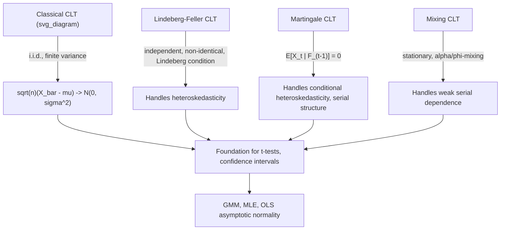

## Central Limit Theorems and Their Variants

### Introduction

Central limit theorems establish that appropriately scaled sums or averages of random variables converge in distribution to a normal limit, providing the theoretical foundation for constructing confidence intervals, conducting hypothesis tests, and justifying normal-approximation-based inference throughout econometrics — even when the underlying data are not themselves normally distributed. Variants extending beyond the classical i.i.d. case accommodate the heterogeneity and dependence structures pervasive in real economic data.

### Classical (Lindeberg-Lévy) Central Limit Theorem

**Definition**

For i.i.d. random variables $X_1,\dots,X_n$ with $E[X_i]=\mu$, $\text{Var}(X_i)=\sigma^2<\infty$:

$$\sqrt{n}(\bar X_n - \mu) \xrightarrow{d} N(0,\sigma^2)$$

equivalently, $\frac{\sqrt n(\bar X_n-\mu)}{\sigma} \xrightarrow{d} N(0,1)$.

**Key Points**

- Requires only finite variance — no assumption of an underlying normal distribution for $X_i$ is needed, explaining the theorem's centrality: it justifies normal-approximation inference regardless of the population distribution's shape, provided the variance is finite and $n$ is sufficiently large.
- The standard proof proceeds via characteristic functions: showing $\phi_{\sqrt n(\bar X_n-\mu)/\sigma}(t) \to e^{-t^2/2}$ (the characteristic function of $N(0,1)$), then invoking Lévy's Continuity Theorem to conclude convergence in distribution.
- The $\sqrt n$ scaling is essential and specific: it is precisely the rate that produces a non-degenerate limiting distribution — without it, $\bar X_n - \mu \to 0$ (a degenerate point mass, per the LLN), while faster scalings diverge.
- This is the theoretical basis for the standard $t$-statistic's asymptotic normality, standard confidence interval construction ($\hat\theta \pm 1.96 \cdot \text{SE}$), and large-sample hypothesis testing procedures used throughout applied econometrics.

### Lindeberg-Feller CLT (Independent, Non-Identically Distributed)

**Definition**

For independent (not necessarily identically distributed) $X_1,\dots,X_n$ with $E[X_i]=\mu_i$, $\text{Var}(X_i)=\sigma_i^2$, let $s_n^2=\sum_{i=1}^n\sigma_i^2$. If the **Lindeberg condition** holds:

$$\forall \varepsilon>0: \quad \frac{1}{s_n^2}\sum_{i=1}^n E\left[(X_i-\mu_i)^2 \mathbb{1}\{|X_i-\mu_i|>\varepsilon s_n\}\right] \to 0$$

then $\frac{1}{s_n}\sum_{i=1}^n(X_i-\mu_i) \xrightarrow{d} N(0,1)$.

**Key Points**

- The Lindeberg condition formalizes the requirement that no single observation's variance dominates the total variance $s_n^2$ as $n\to\infty$ — ruling out a small number of extreme-variance observations from driving the sum's behavior.
- Directly applicable to heteroskedastic regression settings: if regression errors have observation-specific variances $\sigma_i^2$ that do not degenerate pathologically, the Lindeberg-Feller CLT justifies the asymptotic normality of the (appropriately normalized) sum of weighted residuals underlying heteroskedasticity-robust inference.
- A simpler sufficient condition (**Lyapunov's condition**) requires only a bound on $(2+\delta)$-th absolute moments for some $\delta>0$: $\frac{1}{s_n^{2+\delta}}\sum_i E|X_i-\mu_i|^{2+\delta} \to 0$ — easier to verify in practice than the Lindeberg condition directly, at the cost of requiring a marginally stronger moment condition.

### Martingale Central Limit Theorem

**Definition**

For a martingale difference sequence $\{X_t\}$ with respect to filtration $\{\mathcal{F}_t\}$ (i.e., $E[X_t\mid\mathcal{F}_{t-1}]=0$), under conditions on the conditional variance $\sigma_t^2 = E[X_t^2\mid\mathcal{F}_{t-1}]$ (a conditional Lindeberg condition, plus convergence of $\frac{1}{n}\sum_t\sigma_t^2$ to a constant or well-behaved limit):

$$\frac{1}{\sqrt n}\sum_{t=1}^n X_t \xrightarrow{d} N(0,\sigma^2)$$

**Key Points**

- Replaces the independence assumption of the classical CLT with the strictly weaker martingale difference property — the conditional mean is zero given the past, but the conditional variance and higher moments may depend on the past in essentially arbitrary ways.
- The essential tool for establishing asymptotic normality of GMM estimators and other estimators whose scores or moment conditions form a martingale difference sequence with respect to the natural filtration of the data — directly applicable to dynamic time series models where regression errors are serially uncorrelated conditional on the past but may exhibit conditional heteroskedasticity (e.g., ARCH/GARCH-type error structures).
- Because it accommodates conditional heteroskedasticity naturally, the martingale CLT provides the theoretical foundation for the asymptotic normality result underlying heteroskedasticity-robust standard errors in dynamic models, without requiring the stronger i.i.d. or unconditional-homoskedasticity assumptions of the classical CLT.

**Illustration**

### CLT for Weakly Dependent (Mixing) Processes

**Key Points**

- For stationary, weakly dependent time series satisfying appropriate **mixing conditions** (alpha-mixing or phi-mixing, with mixing coefficients decaying at a sufficient rate) and moment conditions, a CLT applies to the sample mean with an adjusted asymptotic variance:

  $$\sqrt n(\bar X_n - \mu) \xrightarrow{d} N(0,\sigma_{LR}^2)$$

  where $\sigma_{LR}^2 = \gamma(0) + 2\sum_{h=1}^\infty \gamma(h)$ is the **long-run variance**, summing the autocovariance function $\gamma(h)$ across all lags rather than using the raw variance $\gamma(0)$ alone.
- The long-run variance formula directly motivates **HAC (heteroskedasticity and autocorrelation consistent) standard error estimation** (Newey-West), which estimates $\sigma_{LR}^2$ using a weighted sum of sample autocovariances, truncated and down-weighted at higher lags via a kernel (e.g., Bartlett kernel) to ensure a positive semidefinite estimator.
- Mixing-based CLTs are the standard theoretical justification for asymptotically valid inference in time series regression models (e.g., ARMA, VAR) with serially correlated but weakly dependent errors.

### Multivariate Central Limit Theorem

**Definition**

For i.i.d. random vectors $\mathbf{X}_1,\dots,\mathbf{X}_n \in \mathbb{R}^k$ with $E[\mathbf{X}_i]=\boldsymbol\mu$, $\text{Cov}(\mathbf{X}_i)=\Sigma$:

$$\sqrt n(\bar{\mathbf{X}}_n - \boldsymbol\mu) \xrightarrow{d} N(\mathbf{0},\Sigma)$$

**Key Points**

- The direct multivariate generalization, proven via the **Cramér-Wold device**: $\sqrt n(\bar{\mathbf{X}}_n-\boldsymbol\mu) \xrightarrow{d} N(\mathbf{0},\Sigma)$ if and only if every fixed linear combination $\mathbf{a}^\top\sqrt n(\bar{\mathbf{X}}_n-\boldsymbol\mu) \xrightarrow{d} N(0,\mathbf{a}^\top\Sigma\mathbf{a})$ for all $\mathbf{a}\in\mathbb{R}^k$ — reducing the multivariate problem to repeated application of the univariate CLT.
- Foundational to the asymptotic normality of vector-valued estimators: OLS coefficient vectors, GMM parameter vectors, and MLE parameter vectors are all established via this multivariate CLT (applied to score functions or moment conditions) combined with the delta method and Slutsky-type arguments.
- Combined with a consistent estimator $\hat\Sigma$ of $\Sigma$, the multivariate CLT underlies **Wald tests** for joint linear or nonlinear hypotheses on parameter vectors, where the test statistic's asymptotic $\chi^2$ distribution follows from the quadratic form of an asymptotically normal vector.

### Functional Central Limit Theorem (Donsker's Theorem)

**Key Points**

- Extends the CLT from a fixed sum to the entire **partial-sum process**: for i.i.d. mean-zero, finite-variance $X_i$, the normalized partial-sum process $W_n(r) = \frac{1}{\sigma\sqrt n}\sum_{i=1}^{\lfloor nr\rfloor} X_i$ converges in distribution (in an appropriate function space, typically the Skorokhod space) to a **standard Brownian motion** $W(r)$ on $[0,1]$.
- Foundational to the asymptotic theory of **unit root and cointegration tests** (Dickey-Fuller, Phillips-Perron, Johansen tests) in nonstationary time series econometrics, where test statistics converge not to standard normal or chi-squared distributions but to functionals of Brownian motion, requiring specialized (non-standard) critical value tables.
- Also underlies the theoretical justification for empirical process-based specification tests (e.g., Kolmogorov-Smirnov-type tests), where the empirical CDF process, appropriately normalized, converges to a Brownian bridge.

### Rates of Convergence: Berry-Esseen Bounds

**Key Points**

- The **Berry-Esseen theorem** provides an explicit, non-asymptotic bound on the rate of convergence in the classical CLT: 

  $$\sup_x \left|F_{\sqrt n(\bar X_n-\mu)/\sigma}(x) - \Phi(x)\right| \le \frac{C\rho}{\sigma^3\sqrt n}$$

  where $\rho=E|X_i-\mu|^3$ and $C$ is a universal constant.
- This provides a formal, quantitative sense in which the CLT approximation improves at rate $O(n^{-1/2})$, and that the quality of the approximation for a given finite $n$ depends on the skewness/third-moment properties of the underlying distribution — more skewed or heavy-tailed distributions require larger $n$ for the normal approximation to be reliable. [Inference: translating this rate bound into a specific "large enough $n$" recommendation for a particular applied dataset requires knowledge of the relevant moments, which are typically unknown and must be estimated or bounded separately]

### Common Pitfalls

**Key Points**

- Applying the classical i.i.d. CLT to time series data without accounting for serial dependence — using the raw sample variance instead of the long-run variance $\sigma_{LR}^2$ systematically understates standard errors when data are positively autocorrelated.
- Assuming CLT-based normal approximations are automatically reliable at commonly used sample sizes without considering the underlying distribution's skewness or tail behavior, which governs the actual rate of convergence per Berry-Esseen-type bounds.
- Applying standard CLT-based (normal or chi-squared) critical values to test statistics in nonstationary (unit root) time series contexts, where the relevant asymptotic distribution is instead a functional of Brownian motion, requiring specialized critical value tables (e.g., Dickey-Fuller tables) rather than standard normal tables.
- Conflating the Lindeberg condition (a technical sufficient condition for heterogeneous CLTs) with a substantive economic assumption — it is a purely mathematical requirement ruling out one extreme-variance observation from dominating the sum, generally satisfied automatically under mild regularity conditions on the data-generating process but not something to be tested empirically in the way structural assumptions are.

**Related Topics**

- Laws of large numbers and consistency
- HAC standard errors and long-run variance estimation
- Wald, LM, and likelihood ratio tests based on asymptotic normality
- Unit root and cointegration testing (Dickey-Fuller, Johansen)
- Functional central limit theorems and empirical process theory
- Delta method for transformations of asymptotically normal estimators
- GARCH models and conditional heteroskedasticity