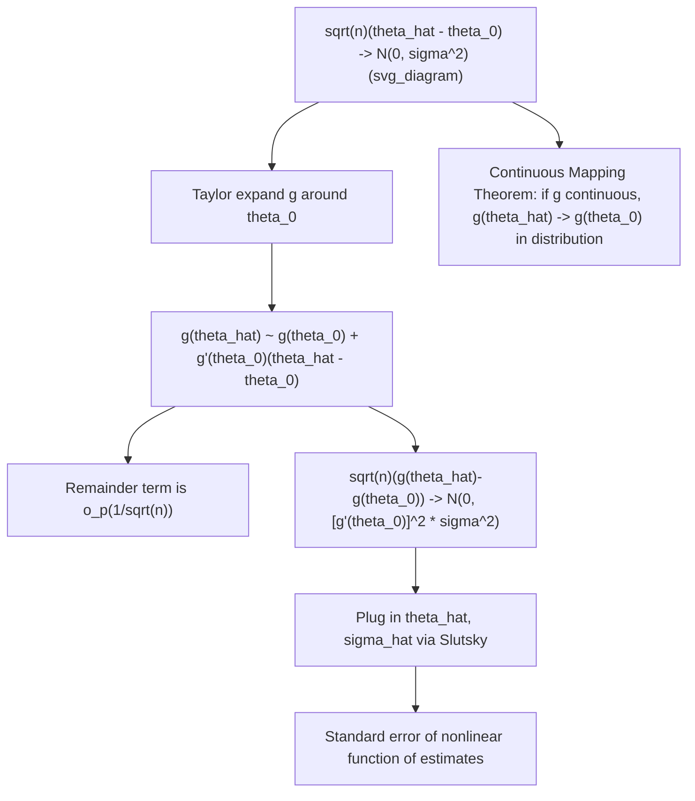

## The Delta Method and Continuous Mapping Theorem

### Introduction

The Continuous Mapping Theorem and the Delta Method together provide the standard toolkit for deriving asymptotic distributions of transformed statistics — a near-universal requirement in econometrics, since applied interest frequently centers on nonlinear functions of estimated parameters (marginal effects, elasticities, ratios of coefficients, standardized treatment effects) rather than the raw parameter estimates themselves.

### Continuous Mapping Theorem

**Definition**

If $X_n \xrightarrow{d} X$ and $g$ is continuous at every point of a set $C$ with $P(X\in C)=1$, then:

$$g(X_n) \xrightarrow{d} g(X)$$

The same conclusion holds if $\xrightarrow{d}$ is replaced by $\xrightarrow{p}$ or $\xrightarrow{a.s.}$ throughout (with continuity required only at the limit point/almost every path).

**Key Points**

- Continuity need not hold everywhere — only on a set receiving full probability mass under the limiting distribution, a technical relaxation that accommodates transformations with isolated discontinuities (e.g., $g(x)=1/x$ discontinuous only at $x=0$, harmless if $P(X=0)=0$).
- Applies component-wise and to multivariate transformations: if $\mathbf{X}_n \xrightarrow{d} \mathbf{X}$ in $\mathbb{R}^k$ and $g:\mathbb{R}^k\to\mathbb{R}^m$ is continuous, then $g(\mathbf{X}_n)\xrightarrow{d} g(\mathbf{X})$ — directly used to derive the limiting distribution of vector-valued functions of asymptotically normal parameter vectors.
- Unlike the delta method, the Continuous Mapping Theorem requires no differentiability — only continuity — making it applicable to transformations that are continuous but non-smooth (absolute value, min/max functions, indicator-based transformations under appropriate conditions).
- Combined with **Slutsky's theorem**, the CMT is the standard route for establishing the limiting distribution of test statistics that combine an asymptotically normal component with a consistently estimated nuisance quantity (e.g., a $t$-statistic combining $\hat\beta$ and an estimated standard error).

**Example**

Deriving the limiting distribution of a variance ratio: if $\hat\theta_n \xrightarrow{d} N(\theta_0,\tau^2)$ with $\theta_0\neq0$, the function $g(x)=1/x^2$ is continuous at $\theta_0$ (since $\theta_0\neq0$), so by the CMT:

$$g(\hat\theta_n) = \frac{1}{\hat\theta_n^2} \xrightarrow{d} \frac{1}{\theta_0^2}$$

Note this gives convergence to a *constant* (a degenerate limit), not a further normal distribution — the CMT alone describes where the transformed sequence lands in distribution, not the fluctuation scale around that point; characterizing that fluctuation requires the delta method instead.

### The Delta Method

**Definition**

If $\sqrt n(\hat\theta_n - \theta_0) \xrightarrow{d} N(0,\sigma^2)$ and $g$ is continuously differentiable at $\theta_0$ with $g'(\theta_0)\neq0$, then:

$$\sqrt n\big(g(\hat\theta_n) - g(\theta_0)\big) \xrightarrow{d} N\big(0,\ [g'(\theta_0)]^2\sigma^2\big)$$

**Key Points**

- Derived via a first-order Taylor expansion: $g(\hat\theta_n) \approx g(\theta_0) + g'(\theta_0)(\hat\theta_n-\theta_0)$, with the remainder shown to be asymptotically negligible ($o_p(n^{-1/2})$) using consistency of $\hat\theta_n$ and continuity of $g'$ near $\theta_0$.
- The scaling factor $[g'(\theta_0)]^2$ has a direct interpretation: the asymptotic variance of the transformed estimator is the original variance scaled by the squared local slope of the transformation — steep transformations amplify sampling variability, flat transformations dampen it.
- **Degenerate case**: if $g'(\theta_0)=0$, the standard delta method gives a degenerate (zero-variance) limiting distribution, and a *second-order* delta method is required, involving the Hessian $g''(\theta_0)$ and yielding a (scaled, shifted) chi-squared rather than normal limiting distribution — a case that arises, for instance, when testing hypotheses that place the true parameter exactly at a transformation's critical point.
- In practice, $\theta_0$ and $\sigma^2$ are unknown and replaced by consistent estimates $\hat\theta_n$ and $\hat\sigma^2$ (invoking Slutsky's theorem to justify this substitution without altering the limiting distribution) — this **plug-in delta method** standard error is what appears in applied output for nonlinear functions of estimated coefficients (e.g., `nlcom` in Stata, marginal effects computations).

**Illustration**

### Multivariate Delta Method

**Definition**

If $\sqrt n(\hat{\boldsymbol\theta}_n - \boldsymbol\theta_0) \xrightarrow{d} N(\mathbf{0},\Sigma)$ and $g:\mathbb{R}^k\to\mathbb{R}^m$ is continuously differentiable at $\boldsymbol\theta_0$ with Jacobian $\nabla g(\boldsymbol\theta_0)$ (an $m\times k$ matrix), then:

$$\sqrt n\big(g(\hat{\boldsymbol\theta}_n) - g(\boldsymbol\theta_0)\big) \xrightarrow{d} N\big(\mathbf{0},\ \nabla g(\boldsymbol\theta_0)\,\Sigma\,\nabla g(\boldsymbol\theta_0)^\top\big)$$

**Key Points**

- Directly generalizes the scalar case: the "sandwich" form $\nabla g\,\Sigma\,\nabla g^\top$ propagates the covariance matrix $\Sigma$ through the linear approximation given by the Jacobian, exactly analogous to how a linear transformation $A\mathbf{X}$ of a random vector has covariance $A\,\text{Cov}(\mathbf{X})\,A^\top$.
- The standard method for computing standard errors of nonlinear combinations of regression coefficients: e.g., a marginal effect at a specific covariate value, a ratio of two coefficients ($\beta_1/\beta_2$), an elasticity, or a predicted probability from a probit/logit model — all computed via the sandwich formula with $\nabla g$ evaluated at the point estimates.
- Requires $g$ to be differentiable at $\boldsymbol\theta_0$ with a full-rank (or otherwise well-behaved) Jacobian at that point; near-singular Jacobians (e.g., near a ratio $\beta_1/\beta_2$ where $\beta_2$ is near zero) produce poor finite-sample approximations even though the asymptotic theory remains formally valid — a recognized practical concern often called "weak identification" of the transformed parameter in that neighborhood. [Inference: the specific finite-sample threshold at which the delta-method approximation becomes unreliable near a near-singular Jacobian depends on the application and is typically assessed via simulation or bootstrap comparison rather than a universal rule]

**Example**

Standard error of an odds ratio in logistic regression: given $\hat\beta$ with asymptotic variance $\hat\sigma^2_\beta$, the odds ratio is $g(\beta)=e^\beta$, with $g'(\beta)=e^\beta$. The delta method gives:

$$\text{Var}(e^{\hat\beta}) \approx (e^{\hat\beta})^2 \hat\sigma^2_\beta \quad\implies\quad \text{SE}(e^{\hat\beta}) \approx e^{\hat\beta}\,\text{SE}(\hat\beta)$$

exactly the formula routinely reported alongside exponentiated logit coefficients in applied output.

### Relationship Between the Two Theorems

**Key Points**

- The Continuous Mapping Theorem describes convergence *in distribution* of $g(X_n)$ to $g(X)$ whenever $g$ is continuous — it says nothing about the *rate* of convergence or the scale of fluctuation around the limit.
- The Delta Method is a specific, more detailed application relevant when $X_n$ is itself already centered and scaled (i.e., $\sqrt n(\hat\theta_n-\theta_0)$ converges to a non-degenerate limit) and one wants the *analogous* centered-and-scaled statement for $g(\hat\theta_n)$ — it exploits differentiability (not just continuity) to obtain this finer-grained result.
- In practice, both are typically invoked together within a single derivation: the CMT (via Slutsky) handles convergence of estimated nuisance parameters (e.g., $\hat\sigma^2\to\sigma^2$) to constants, while the delta method handles the transformation of the primary asymptotically normal estimator — the combination is what ultimately justifies, for instance, the asymptotic validity of a $t$-statistic constructed from $\hat\theta$ and its estimated standard error for a nonlinear function $g(\hat\theta)$.

### Common Applications in Econometrics

**Key Points**

- **Marginal effects in nonlinear models** (probit, logit, Tobit): the marginal effect $\partial P(Y=1\mid X)/\partial X_j$ is a nonlinear function of the estimated coefficients, with standard errors computed via the delta method.
- **Elasticities**: computed as nonlinear transformations of regression coefficients (e.g., in log-log or semi-log models), requiring delta-method standard errors when reported at a specific point (e.g., at the sample mean of covariates).
- **Impulse response functions in VAR models**: nonlinear functions of the estimated VAR coefficients, with delta-method (or bootstrap) confidence bands routinely reported in applied time series work.
- **Testing nonlinear hypotheses**: Wald tests of nonlinear restrictions ($H_0: g(\theta)=0$) rely directly on the delta method to derive the asymptotic (chi-squared) distribution of the test statistic under the null.

### Common Pitfalls

**Key Points**

- Applying the standard (first-order) delta method when $g'(\theta_0)=0$, producing a spuriously degenerate variance estimate near zero — the second-order delta method (or an alternative approach) is required in this case.
- Using delta-method standard errors for highly nonlinear transformations evaluated far from the point where the linear (Taylor) approximation is accurate, or when the Jacobian is near-singular — the linearization underlying the delta method can perform poorly in finite samples even when asymptotically justified, motivating bootstrap alternatives in such cases.
- Confusing the Continuous Mapping Theorem (a statement about convergence in distribution of $g(X_n)$ to $g(X)$, requiring only continuity) with the Delta Method (a statement about the specific centered-and-scaled asymptotic normal distribution of $g(\hat\theta_n)$, requiring differentiability) — the two address related but distinct questions and require different regularity conditions.
- Neglecting the multivariate sandwich formula's requirement that $\nabla g(\boldsymbol\theta_0)\Sigma\nabla g(\boldsymbol\theta_0)^\top$ be evaluated at consistent estimates via Slutsky's theorem — using the wrong evaluation point or omitting off-diagonal covariance terms in $\Sigma$ produces incorrect standard errors for nonlinear combinations of correlated parameter estimates.

**Related Topics**

- Slutsky's theorem and modes of stochastic convergence
- Wald tests for nonlinear hypotheses
- Asymptotic variance estimation via the sandwich formula
- Marginal effects and elasticities in nonlinear models
- Bootstrap methods as an alternative to delta-method inference
- Maximum likelihood asymptotic theory and the information matrix