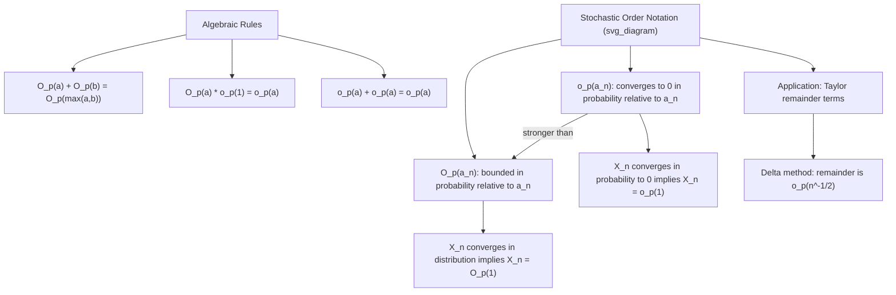

## Stochastic Order Notation

### Introduction

Stochastic order notation ($O_p$, $o_p$, and related symbols) provides a compact algebraic language for tracking the magnitude and asymptotic negligibility of random sequences, mirroring deterministic big-O/little-o notation from real analysis but adapted to probabilistic convergence. This notation is indispensable for writing and reading asymptotic derivations in econometrics — Taylor expansions, remainder term analysis, and rate-of-convergence statements are routinely expressed and manipulated in $O_p/o_p$ shorthand.

### Deterministic Order Notation Review

**Definition**

For deterministic sequences $a_n, b_n$: $a_n = O(b_n)$ if $\exists M,N$ such that $|a_n/b_n|\le M$ for all $n>N$ (bounded ratio); $a_n=o(b_n)$ if $a_n/b_n\to0$.

**Key Points**

- These purely analytic (non-random) definitions provide the template that stochastic order notation adapts to random sequences — familiarity with the deterministic case clarifies the probabilistic generalization.
- $O(1)$ denotes a bounded sequence; $o(1)$ denotes a sequence converging to zero — these baseline cases recur constantly as building blocks in more complex order statements.

### $O_p$: Bounded in Probability

**Definition**

$X_n = O_p(a_n)$ if for every $\varepsilon>0$, there exist $M<\infty$ and $N$ such that:

$$P\left(\left|\frac{X_n}{a_n}\right| > M\right) < \varepsilon \quad \text{for all } n > N$$

Equivalently, $X_n/a_n$ is **bounded in probability** (or "tight").

**Key Points**

- $X_n = O_p(1)$ means $X_n$ is bounded in probability — it does not necessarily converge, but the probability of $X_n$ taking arbitrarily large values vanishes as $n$ grows, ruling out the sequence "escaping to infinity" in probability.
- Any sequence converging in distribution is automatically $O_p(1)$: if $X_n \xrightarrow{d} X$ for some proper (non-degenerate or degenerate) random variable $X$, then $X_n=O_p(1)$ — this is why asymptotically normal estimators, once appropriately scaled, are routinely described as $O_p(1)$.
- A sequence converging in probability to a constant $c$ satisfies $X_n = c + O_p(1)$ trivially (and more informatively, $X_n - c = o_p(1)$, the stronger statement below).
- $O_p$ statements combine algebraically much like deterministic $O$: if $X_n=O_p(a_n)$ and $Y_n=O_p(b_n)$, then $X_n+Y_n = O_p(\max(a_n,b_n))$ and $X_nY_n = O_p(a_nb_n)$ — these algebraic rules are what make $O_p/o_p$ notation practically useful for tracking terms through multi-step derivations without re-deriving convergence from first principles at each step.

### $o_p$: Convergence to Zero in Probability (Rate)

**Definition**

$X_n = o_p(a_n)$ if:

$$\frac{X_n}{a_n} \xrightarrow{p} 0$$

**Key Points**

- $X_n = o_p(1)$ is precisely equivalent to $X_n \xrightarrow{p} 0$ — this is simply a notational restatement of ordinary convergence in probability to zero.
- $o_p(a_n)$ describes a sequence that vanishes *faster* than $a_n$ in probability — used pervasively to describe remainder terms in Taylor expansions that are asymptotically negligible relative to the leading term under study.
- The relationship $o_p(a_n) \implies O_p(a_n)$ holds (vanishing implies bounded), but not conversely — a strictly stronger statement about the rate of decay, not merely boundedness.
- Algebraic rules: $o_p(a_n) + o_p(a_n) = o_p(a_n)$; $O_p(a_n)\cdot o_p(1) = o_p(a_n)$ (a bounded term times a vanishing term is vanishing at the bounded term's implied rate); $o_p(a_n)\cdot o_p(b_n) = o_p(a_nb_n)$.

**Illustration**

### Standard Parametric Rate: $O_p(n^{-1/2})$

**Key Points**

- Under standard regularity conditions, parametric estimators (OLS, MLE, GMM with correctly specified moment conditions) satisfy $\hat\theta_n - \theta_0 = O_p(n^{-1/2})$ — the estimation error shrinks at the "root-$n$" rate, equivalently stated as $\sqrt n(\hat\theta_n-\theta_0) = O_p(1)$.
- This rate is the benchmark against which other estimators are compared: **nonparametric estimators** (kernel regression, series estimators) typically converge at slower rates (e.g., $O_p(n^{-2/5})$ for optimally-tuned kernel regression under standard smoothness assumptions) due to the curse of dimensionality and the need to simultaneously control bias and variance via a bandwidth or smoothing parameter.
- **Super-consistent estimators** in cointegration analysis (e.g., the OLS estimator of a cointegrating vector) converge at rate $O_p(n^{-1})$, faster than the standard parametric rate — a distinctive feature of nonstationary time series estimation exploited in unit root and cointegration testing theory.

### Application: Taylor Expansion Remainder Terms

**Definition**

A first-order Taylor expansion of $g$ around $\theta_0$, evaluated at $\hat\theta_n$:

$$g(\hat\theta_n) = g(\theta_0) + g'(\theta_0)(\hat\theta_n-\theta_0) + R_n$$

where the remainder $R_n$ is characterized using stochastic order notation.

**Key Points**

- Under standard conditions ($g$ twice continuously differentiable, $\hat\theta_n-\theta_0 = O_p(n^{-1/2})$), the remainder satisfies $R_n = O_p((\hat\theta_n-\theta_0)^2) = O_p(n^{-1})= o_p(n^{-1/2})$ — the remainder is of smaller order than the leading term $g'(\theta_0)(\hat\theta_n-\theta_0) = O_p(n^{-1/2})$, and is therefore asymptotically negligible after multiplying through by $\sqrt n$.
- This precise order-of-magnitude bookkeeping is exactly what justifies the delta method's conclusion: $\sqrt n\,R_n = O_p(n^{-1/2}) = o_p(1)$, so the remainder vanishes (in probability) after scaling, leaving only the leading linear term to determine the limiting distribution via Slutsky's theorem.
- Similar remainder-term bookkeeping using $O_p/o_p$ notation appears throughout M-estimation theory (establishing asymptotic normality of extremum estimators via a stochastic Taylor expansion of the first-order condition around the true parameter) and in higher-order asymptotic refinements (Edgeworth expansions, bootstrap higher-order accuracy results).

### Uniform Stochastic Order Notation

**Key Points**

- $O_p$ and $o_p$ can be extended to hold **uniformly** over a parameter space: $\sup_{\theta\in\Theta} |X_n(\theta)| = o_p(1)$ states that a sequence of stochastic processes indexed by $\theta$ vanishes in probability uniformly across the entire parameter space, not merely pointwise at each fixed $\theta$.
- Uniform $o_p(1)$ statements are precisely what a **Uniform Law of Large Numbers** delivers, and are essential (rather than merely convenient) for establishing consistency of extremum estimators, since pointwise convergence at each fixed $\theta$ is generally insufficient to control the behavior of an estimator that itself searches over $\theta$.
- **Stochastic equicontinuity**, a technical condition used in establishing uniform CLTs for empirical processes (relevant to semiparametric and nonparametric estimation theory), is naturally expressed using uniform $o_p$ notation: the modulus of continuity of a normalized empirical process vanishes uniformly in probability as the mesh of the parameter grid shrinks.

### Comparing $O_p/o_p$ to Convergence in Distribution

**Key Points**

- $O_p/o_p$ notation concerns the *magnitude* (rate) of a sequence, while convergence in distribution concerns its *limiting shape*; the two are complementary rather than competing tools — a full asymptotic normality statement like $\sqrt n(\hat\theta_n-\theta_0) \xrightarrow{d} N(0,\sigma^2)$ simultaneously implies the rate statement $\hat\theta_n-\theta_0 = O_p(n^{-1/2})$ (a weaker, magnitude-only conclusion) while providing strictly more information (the specific limiting distribution).
- In practice, $O_p/o_p$ notation is most useful as an intermediate bookkeeping device *within* a derivation (tracking which terms are negligible and which are not), while the final result of interest is typically stated as a full convergence-in-distribution statement.

### Common Pitfalls

**Key Points**

- Treating $O_p(a_n)$ as equivalent to "converges to a constant times $a_n$" — $O_p$ only asserts boundedness in probability relative to $a_n$, not convergence to any particular limit or even the existence of a limit.
- Confusing $O_p(1)$ (bounded in probability, the weaker statement) with $o_p(1)$ (converges to zero in probability, the stronger statement) — a frequent notational slip with substantive consequences, since remainder terms must generally be shown to be $o_p$ (not merely $O_p$) of the relevant rate for asymptotic negligibility arguments (e.g., in the delta method) to go through.
- Applying pointwise $O_p/o_p$ results where a *uniform* version (over a parameter space) is actually required — as with the ULLN, pointwise negligibility of an approximation error at each fixed parameter value does not guarantee negligibility uniformly across an estimator's search space, a distinction essential to rigorous consistency proofs for extremum estimators.
- Manipulating $O_p/o_p$ expressions using purely formal algebraic rules without verifying the underlying regularity conditions (differentiability, moment existence) that justify each step — the notation streamlines bookkeeping but does not substitute for verifying the conditions that make the underlying convergence statements valid.

**Related Topics**

- Modes of stochastic convergence (in probability, almost surely, in distribution)
- Delta method and Taylor expansion-based asymptotic derivations
- Uniform laws of large numbers and stochastic equicontinuity
- M-estimation asymptotic theory
- Nonparametric estimation rates and the curse of dimensionality
- Cointegration and super-consistency in nonstationary time series