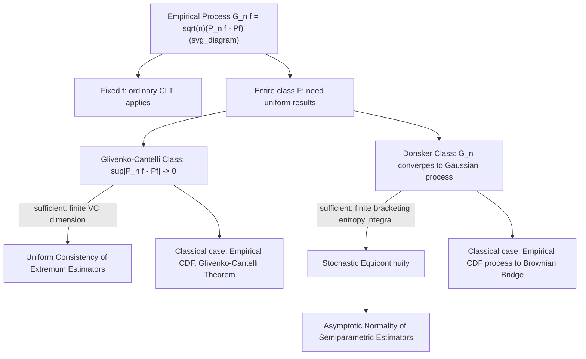

## Empirical Process Theory

### Introduction

Empirical process theory studies the asymptotic behavior of empirical distributions and empirical averages as stochastic processes indexed by a class of functions, rather than as fixed-dimensional vectors. This function-indexed perspective is essential for establishing uniform convergence, asymptotic normality, and rates of convergence for semiparametric and nonparametric econometric estimators — problems where classical finite-dimensional asymptotic theory does not directly apply.

### The Empirical Process

**Definition**

For i.i.d. observations $X_1,\dots,X_n$ with distribution $P$, and a class of functions $\mathcal{F} = \{f:\mathcal{X}\to\mathbb{R}\}$, the **empirical measure** is $P_n f = \frac{1}{n}\sum_{i=1}^n f(X_i)$, and the (centered, scaled) **empirical process** is:

$$\mathbb{G}_n f = \sqrt n(P_n f - Pf) = \frac{1}{\sqrt n}\sum_{i=1}^n \big(f(X_i) - E[f(X_i)]\big)$$

viewed as a stochastic process indexed by $f \in \mathcal{F}$.

**Key Points**

- For a single fixed $f$, $\mathbb{G}_n f \xrightarrow{d} N(0,\text{Var}(f(X_1)))$ by the ordinary CLT — the innovation of empirical process theory is studying the *joint* behavior of $\mathbb{G}_n f$ across the *entire* function class $\mathcal{F}$ simultaneously, rather than one $f$ at a time.
- The classical special case $\mathcal{F} = \{\mathbb{1}\{X\le t\}: t\in\mathbb{R}\}$ recovers the **empirical CDF process** $\sqrt n(F_n(t)-F(t))$, the object underlying the Kolmogorov-Smirnov test and other distributional goodness-of-fit procedures.
- The complexity of $\mathcal{F}$ (measured via covering numbers, bracketing numbers, or VC dimension) determines whether uniform convergence and a functional CLT hold over the class — richer (higher-dimensional or less smooth) classes require more data to achieve the same uniform approximation quality, a precise formalization of intuitive "curse of dimensionality" concerns in nonparametric estimation.

### Glivenko-Cantelli Classes: Uniform Law of Large Numbers

**Definition**

$\mathcal{F}$ is a **Glivenko-Cantelli class** for $P$ if:

$$\sup_{f\in\mathcal{F}} |P_n f - Pf| \xrightarrow{a.s.} 0 \quad \text{(or in probability)}$$

**Key Points**

- This is precisely the Uniform Law of Large Numbers stated in function-class language: the classical Glivenko-Cantelli theorem (uniform convergence of the empirical CDF to the true CDF) is the special case $\mathcal{F}=\{\mathbb{1}\{X\le t\}\}$.
- **Sufficient conditions** for a Glivenko-Cantelli class include finite **VC dimension** (Vapnik-Chervonenkis dimension, a combinatorial complexity measure counting how many distinct patterns of inclusion/exclusion the class can produce on finite point sets) or finite **bracketing entropy** (a measure of how many small "brackets" are needed to cover the class at a given approximation tolerance).
- Establishing that the class of functions defining a GMM or extremum estimator's objective is Glivenko-Cantelli is the standard modern route to proving consistency of extremum estimators, replacing case-by-case elementary ULLN verification with a general entropy/VC-dimension-based sufficient condition.

### Donsker Classes: Uniform Central Limit Theorem

**Definition**

$\mathcal{F}$ is a **Donsker class** for $P$ if the empirical process $\mathbb{G}_n$, viewed as a random element of the space of bounded functions on $\mathcal{F}$, converges in distribution (in an appropriate functional sense) to a **Gaussian process** $\mathbb{G}$ with covariance structure $\text{Cov}(\mathbb{G}f,\mathbb{G}g) = P(fg)-Pf\,Pg$.

**Key Points**

- The classical Donsker theorem (functional CLT for the empirical CDF, converging to a Brownian bridge) is the special case $\mathcal{F}=\{\mathbb{1}\{X\le t\}\}$ — the "functional CLT" invoked in unit root and specification testing theory is precisely a statement about this class being Donsker.
- **Sufficient conditions** for the Donsker property are stronger than for Glivenko-Cantelli, typically requiring finite **bracketing entropy integral** $\int_0^1 \sqrt{\log N_{[]}(\varepsilon,\mathcal{F},L_2(P))}\,d\varepsilon < \infty$ (the Dudley entropy integral condition), or finite VC dimension combined with an integrable envelope function.
- The Donsker property is the technical requirement underlying **stochastic equicontinuity**, itself the key condition needed to establish asymptotic normality (not merely consistency) of semiparametric two-step estimators, where a nonparametrically estimated nuisance function enters a parametric estimating equation.

**Illustration**

### Complexity Measures: VC Dimension and Entropy

**Key Points**

- **VC (Vapnik-Chervonenkis) dimension**: the size of the largest finite set of points that the class $\mathcal{F}$ (viewed as indicator functions of sets) can "shatter" (produce every possible inclusion/exclusion pattern on). Parametric classes (e.g., half-spaces defined by a $k$-dimensional linear index) typically have VC dimension growing linearly in the parameter dimension $k$, while highly flexible nonparametric classes may have infinite VC dimension.
- **Covering numbers** $N(\varepsilon,\mathcal{F},\|\cdot\|)$: the minimum number of $\varepsilon$-balls (in a specified metric, typically $L_2(P)$) needed to cover $\mathcal{F}$ — smaller covering numbers (slower growth as $\varepsilon\to0$) indicate a "smaller," less complex function class.
- **Bracketing numbers** $N_{[]}(\varepsilon,\mathcal{F},L_2(P))$: the minimum number of pairs of functions $(l_j,u_j)$ with $l_j \le f \le u_j$ for every $f$ in the bracket, and $\|u_j-l_j\|_{L_2(P)}\le\varepsilon$, needed to cover $\mathcal{F}$ — a refinement of covering numbers particularly natural for establishing Donsker-type results.
- These complexity measures formalize precisely how "rich" a function class can be while still admitting uniform LLN and CLT results, providing the rigorous foundation for the informal notion that "too flexible" nonparametric or machine-learning-based first-stage estimators can break standard asymptotic theory for downstream parameters unless complexity is appropriately controlled (e.g., via sample splitting/cross-fitting in modern double/debiased machine learning approaches).

### Application: Semiparametric Two-Step Estimation

**Key Points**

- Many econometric estimators involve two stages: a nonparametric or flexible first-stage estimate $\hat h(x)$ (e.g., a propensity score, a control function, or a machine-learning-based nuisance function), plugged into a second-stage parametric estimating equation for a finite-dimensional parameter $\theta$ of interest.
- Naively treating $\hat h$ as if it were the true $h$ (ignoring first-stage estimation error) can invalidate standard asymptotic normality results for $\hat\theta$ unless the first-stage estimation error satisfies a stochastic equicontinuity condition ensuring it does not contribute a non-negligible additional variance term — empirical process theory (via Donsker-class conditions on the relevant score/moment function class) provides the formal apparatus to verify when this "first-stage negligibility" holds.
- **Neyman orthogonality / Double machine learning**: constructing moment conditions that are locally insensitive (orthogonal) to first-stage nuisance parameter estimation error relaxes the Donsker-class complexity requirements on the first stage, permitting flexible machine learning first-stage estimators (which may not individually satisfy classical Donsker conditions) while preserving valid root-$n$ asymptotic inference for the parameter of interest, typically combined with sample-splitting/cross-fitting to control overfitting bias. [Inference: the precise conditions under which Neyman-orthogonal moment constructions fully substitute for Donsker-class requirements are an active area of methodological development and depend on the specific estimator and nuisance-function class under study]

### Weak Convergence in Function Spaces

**Key Points**

- Since $\mathbb{G}_n$ is a stochastic process (a random function on $\mathcal{F}$) rather than a finite-dimensional random vector, its convergence in distribution must be formalized in an appropriate function space (typically $\ell^\infty(\mathcal{F})$, the space of bounded functions on $\mathcal{F}$ with the uniform norm), requiring measure-theoretic care beyond ordinary weak convergence theory for real-valued or vector-valued sequences.
- The **Continuous Mapping Theorem** extends to this functional setting: if $\mathbb{G}_n \rightsquigarrow \mathbb{G}$ (weak convergence in the function space sense) and $\phi$ is a continuous functional (e.g., the supremum functional $\phi(g)=\sup_{f}|g(f)|$), then $\phi(\mathbb{G}_n) \xrightarrow{d} \phi(\mathbb{G})$ — this is precisely how the limiting Kolmogorov-Smirnov distribution (the supremum of a Brownian bridge) is derived from the functional CLT for the empirical CDF process.

### Common Pitfalls

**Key Points**

- Verifying pointwise (fixed-$f$) consistency or asymptotic normality and implicitly assuming this extends to uniform results over the entire function class $\mathcal{F}$ — uniform convergence genuinely requires additional complexity control (Glivenko-Cantelli or Donsker conditions), not merely pointwise convergence at each $f$.
- Applying standard root-$n$ asymptotic normality theory to two-step semiparametric estimators without verifying that first-stage nonparametric estimation error is asymptotically negligible (via a stochastic equicontinuity or Donsker-class argument) — a step frequently glossed over in applied treatments but essential for valid inference.
- Assuming flexible machine-learning-based nuisance function estimators (with potentially very high or unbounded classical complexity measures) automatically preserve valid downstream inference — without Neyman-orthogonal moment construction and sample-splitting, such approaches can produce substantial finite-sample bias and invalid inference, motivating the specific methodological structure of modern double/debiased ML approaches.
- Confusing VC dimension (a specific combinatorial complexity measure) with the number of parameters in a model — the two can differ substantially, particularly for nonparametric or sieve-based estimators where "effective complexity" grows with sample size in a controlled way.

**Related Topics**

- Uniform laws of large numbers and consistency of extremum estimators
- Semiparametric efficiency theory and influence functions
- Double/debiased machine learning and Neyman orthogonality
- Functional central limit theorems and Donsker's theorem
- Kolmogorov-Smirnov and other empirical-process-based specification tests
- Sieve estimation and nonparametric regression rates