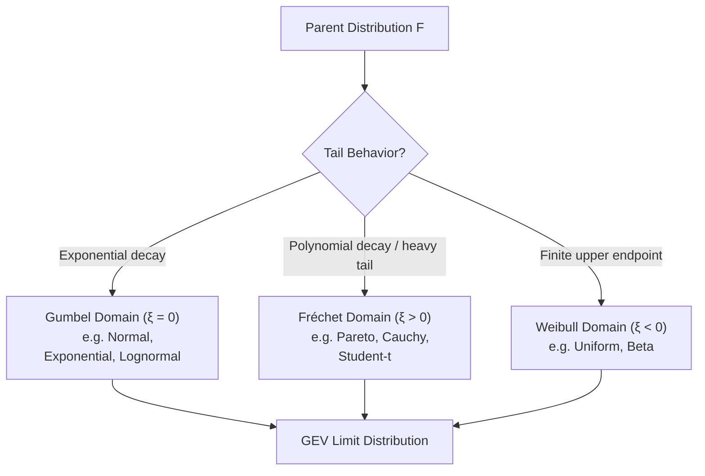

## Extreme Value Theory

### Overview and Motivation

Extreme Value Theory (EVT) is the branch of probability theory concerned with the stochastic behavior of the tail of a distribution — the maxima, minima, or exceedances over high thresholds — rather than the bulk of the distribution, which is the focus of the Central Limit Theorem (CLT). While the CLT governs the behavior of sample means (a "central" statistic), EVT governs the behavior of sample extremes (a "boundary" statistic).

EVT is foundational in:

- Financial risk management (Value-at-Risk, Expected Shortfall, stress testing)
- Hydrology and climate science (flood levels, extreme rainfall)
- Insurance (catastrophic loss modeling)
- Reliability engineering (failure times of components)
- Econometrics (heavy-tailed returns, structural break magnitudes)

**Key Points**

- EVT answers: "What is the distribution of the maximum (or minimum) of $n$ i.i.d. random variables as $n \to \infty$?"
- It provides a rigorous asymptotic justification for modeling tails independently of the distribution's center.
- Two complementary approaches dominate: the **Block Maxima (BM)** method and the **Peaks-Over-Threshold (POT)** method.

---

### The Fisher–Tippett–Gnedenko Theorem

This is the central limit theorem of EVT. Let $X_1, X_2, \ldots, X_n$ be i.i.d. random variables with common CDF $F$, and define the sample maximum:

$$M_n = \max(X_1, X_2, \ldots, X_n)$$

If there exist normalizing sequences $a_n > 0$ and $b_n \in \mathbb{R}$ such that

$$\frac{M_n - b_n}{a_n} \xrightarrow{d} G$$

for some non-degenerate distribution $G$, then $G$ must belong to one of three families, jointly known as the **Generalized Extreme Value (GEV) distribution**:

$$G_\xi(x) = \exp\left\{ -\left[1 + \xi \left(\frac{x - \mu}{\sigma}\right)\right]^{-1/\xi} \right\}, \quad 1 + \xi\left(\frac{x-\mu}{\sigma}\right) > 0$$

where $\mu \in \mathbb{R}$ is the location parameter, $\sigma > 0$ is the scale parameter, and $\xi \in \mathbb{R}$ is the shape (tail index) parameter. When $\xi = 0$, the expression is interpreted via its limit:

$$G_0(x) = \exp\left\{-\exp\left[-\left(\frac{x-\mu}{\sigma}\right)\right]\right\}$$

**Key Points**

- This theorem is the tail analogue of the CLT — it shows the *only possible* limiting shapes for normalized maxima, regardless of the parent distribution $F$ (subject to regularity conditions).
- A distribution $F$ for which such $a_n, b_n$ exist is said to lie in the **maximum domain of attraction (MDA)** of $G_\xi$, written $F \in D(G_\xi)$.

---

### The Three Domains of Attraction

The sign of $\xi$ determines the tail behavior and corresponds to three classical named families:

#### 1. Gumbel Domain ($\xi = 0$)

- Distributions with exponentially decaying tails.
- Examples: Normal, Exponential, Gamma, Lognormal.
- The GEV reduces to: $G(x) = \exp\{-e^{-(x-\mu)/\sigma}\}$, supported on all of $\mathbb{R}$.

#### 2. Fréchet Domain ($\xi > 0$)

- Distributions with heavy (polynomially decaying) tails, i.e., $1 - F(x) \sim x^{-1/\xi}$ as $x \to \infty$.
- Examples: Pareto, Cauchy, Student's $t$, Fréchet itself.
- Lower bounded support: $x > \mu - \sigma/\xi$.
- [Inference] In econometrics, most financial return series with fat tails (e.g., equity log-returns) are empirically found to lie in this domain, with $\xi$ often estimated in the range $0.1$–$0.4$, though the exact value is data-dependent and estimation-method-dependent.

#### 3. Weibull Domain ($\xi < 0$)

- Distributions with a **finite upper endpoint**.
- Examples: Uniform, Beta.
- Upper bounded support: $x < \mu - \sigma/\xi$.

**Example**

For i.i.d. standard Exponential($1$) variables, $F(x) = 1 - e^{-x}$. Taking $a_n = 1$, $b_n = \ln n$:

$$P(M_n - \ln n \le x) = \left(1 - \frac{e^{-x}}{n}\right)^n \to \exp(-e^{-x})$$

This is exactly the Gumbel CDF, confirming Exponential $\in D(G_0)$.

---

### Mermaid Diagram: EVT Domain Classification

---

### Peaks-Over-Threshold (POT) Method and the GPD

While Block Maxima wastes data (only one point per block is used), the **Peaks-Over-Threshold** approach models all exceedances over a high threshold $u$, making more efficient use of data — highly relevant in econometric applications with limited extreme observations.

**Pickands–Balkema–de Haan Theorem**: For a sufficiently high threshold $u$, the conditional distribution of exceedances $Y = X - u$, given $X > u$, converges to the **Generalized Pareto Distribution (GPD)**:

$$H_{\xi,\sigma}(y) = \begin{cases} 1 - \left(1 + \xi \dfrac{y}{\sigma}\right)^{-1/\xi}, & \xi \neq 0 \\[6pt] 1 - \exp\left(-\dfrac{y}{\sigma}\right), & \xi = 0 \end{cases}$$

for $y \ge 0$ (and $0 \le y \le -\sigma/\xi$ when $\xi < 0$).

**Key Points**

- The shape parameter $\xi$ in the GPD is *identical* to the $\xi$ in the GEV distribution for the same underlying data — this consistency is a core theoretical result linking BM and POT.
- $\xi > 0$: GPD reduces to a (shifted) ordinary Pareto distribution — infinite variance if $\xi \ge 0.5$, infinite mean if $\xi \ge 1$.
- $\xi = 0$: GPD reduces to the Exponential distribution.
- $\xi < 0$: GPD has a finite upper bound (Pareto Type II with bounded support).

---

### Threshold Selection

Choosing $u$ involves a bias–variance trade-off:

- **Too low**: violates the asymptotic justification for the GPD approximation → biased parameter estimates.
- **Too high**: too few exceedances remain → high variance in estimates.

**Practical diagnostic tools:**

1. **Mean Residual Life (MRL) Plot**: Plots the sample mean of excesses $e(u) = E[X - u \mid X > u]$ against candidate thresholds $u$. For a true GPD tail, $e(u)$ is linear in $u$ above the appropriate threshold. Choose the lowest $u$ where linearity begins.
2. **Parameter Stability Plots**: Plot GPD parameter estimates (reparametrized $\sigma^* = \sigma - \xi u$, and $\xi$) across a range of thresholds; select $u$ where estimates stabilize within confidence bands.
3. Automated methods: [Unverified] various automated threshold selection algorithms (e.g., based on minimizing asymptotic MSE, or bootstrap-based) have been proposed in the literature, but no method is universally agreed upon as best practice, and results can be sensitive to sample size and true tail thickness.

---

### Estimation Methods

#### Maximum Likelihood Estimation (MLE)

For GPD, given exceedances $y_1, \ldots, y_k$ over threshold $u$, the log-likelihood (for $\xi \neq 0$) is:

$$\ell(\xi, \sigma) = -k \ln \sigma - \left(1 + \frac{1}{\xi}\right) \sum_{i=1}^{k} \ln\left(1 + \xi \frac{y_i}{\sigma}\right)$$

maximized numerically subject to $1 + \xi y_i / \sigma > 0$ for all $i$.

- Regularity conditions for standard MLE asymptotics (consistency, asymptotic normality) require $\xi > -0.5$. For $\xi \le -0.5$, non-standard asymptotic theory applies.

#### Method of Moments / Probability-Weighted Moments (PWM)

- Often more stable than MLE in small samples, particularly for $\xi$ near zero.
- [Inference] Generally preferred over MLE only for small samples or when $\xi$ is close to the ML boundary conditions, since MLE typically has better efficiency asymptotically.

#### L-Moments

- Robust alternative, especially popular in hydrology; less sensitive to outliers within the exceedance sample itself.

**Example**

Suppose 50 daily loss exceedances over a threshold of $u = \$2\text{M}$ from a portfolio yield MLE estimates $\hat{\xi} = 0.28$, $\hat{\sigma} = \$0.85\text{M}$. The estimated 99.9% Value-at-Risk (extending beyond the observed threshold) is obtained by inverting the GPD tail:

$$\text{VaR}_p = u + \frac{\hat{\sigma}}{\hat{\xi}}\left[\left(\frac{n}{k}(1-p)\right)^{-\hat{\xi}} - 1\right]$$

where $n$ is the total sample size and $k$ is the number of exceedances.

---

### Return Levels and Return Periods

A central quantity in EVT applications is the **return level** $x_T$: the value expected to be exceeded on average once every $T$ periods (e.g., years).

From the GEV fit to block maxima (with block size = 1 period):

$$x_T = \mu - \frac{\sigma}{\xi}\left[1 - \left(-\ln\left(1 - \frac{1}{T}\right)\right)^{-\xi}\right], \quad \xi \neq 0$$

**Key Points**

- $x_T$ increases without bound as $T \to \infty$ if $\xi \ge 0$ (Fréchet/Gumbel), but is bounded above by $\mu - \sigma/\xi$ if $\xi < 0$ (Weibull).
- Confidence intervals for $x_T$ are typically constructed via the delta method or profile likelihood; profile likelihood intervals are generally preferred as they better respect the asymmetry of the sampling distribution, especially for long return periods.

---

### Dependence and Extremal Index

Real-world data (especially financial time series) are rarely i.i.d. — volatility clustering induces serial dependence in extremes. The **extremal index** $\theta \in (0, 1]$ measures the degree of clustering of extremes:

$$\theta = \lim_{n \to \infty} \frac{-n^{-1}\ln P(M_n \le u_n)}{-n^{-1}\ln F(u_n)^n}$$

Intuitively, $\theta^{-1}$ approximates the mean cluster size of exceedances above a high threshold. $\theta = 1$ corresponds to no clustering (asymptotic independence of extremes), while $\theta < 1$ indicates extremal clustering.

**Key Points**

- For stationary sequences satisfying mixing conditions (e.g., $D(u_n)$ condition of Leadbetter), the GEV limit theorem still holds, but the effective sample size for extremes is reduced by factor $\theta$.
- **Declustering** (e.g., via runs method or blocks method) is used in practice to extract approximately independent cluster maxima before applying standard POT theory.

---

### Multivariate Extreme Value Theory (Brief)

When extremes across multiple variables must be modeled jointly (e.g., co-crashes across asset classes), univariate EVT extends via:

- **Copula-based approaches**: extremal (tail) dependence captured via copulas such as the logistic, Gumbel, or asymmetric logistic extreme value copulas.
- **Tail Dependence Coefficient**: 

  $$\lambda_U = \lim_{q \to 1^-} P(Y > F_Y^{-1}(q) \mid X > F_X^{-1}(q))$$

  measures the probability of joint extreme events; $\lambda_U = 0$ implies asymptotic independence.

[Inference] In applied macro-finance, asymmetric or skewed dependence structures (stronger tail dependence in market downturns than upturns) are commonly reported, though the specific magnitude is highly sample- and asset-class-dependent.

---

### Diagram: POT Method Workflow (SVG)

<svg xmlns="http://www.w3.org/2000/svg" viewBox="0 0 760 260" font-family="Helvetica, Arial, sans-serif">
<text x="380" y="20" text-anchor="middle" font-size="14" font-weight="bold">Peaks-Over-Threshold Method Workflow (svg_diagram)</text>
<rect x="20" y="50" width="150" height="50" rx="6" fill="#eef4fb" stroke="#4a7ab5" />
<text x="95" y="80" text-anchor="middle" font-size="11">Raw Time Series Data</text>
<line x1="170" y1="75" x2="220" y2="75" stroke="#333" stroke-width="1.5" marker-end="url(#arrow)" />
<rect x="220" y="50" width="150" height="50" rx="6" fill="#eef4fb" stroke="#4a7ab5" />
<text x="295" y="72" text-anchor="middle" font-size="11">Select Threshold u</text>
<text x="295" y="86" text-anchor="middle" font-size="9">(MRL Plot / Stability Plot)</text>
<line x1="370" y1="75" x2="420" y2="75" stroke="#333" stroke-width="1.5" marker-end="url(#arrow)" />
<rect x="420" y="50" width="150" height="50" rx="6" fill="#eef4fb" stroke="#4a7ab5" />
<text x="495" y="72" text-anchor="middle" font-size="11">Extract Exceedances</text>
<text x="495" y="86" text-anchor="middle" font-size="9">Y = X − u | X &gt; u</text>
<line x1="570" y1="75" x2="620" y2="75" stroke="#333" stroke-width="1.5" marker-end="url(#arrow)" />
<rect x="620" y="50" width="120" height="50" rx="6" fill="#eef4fb" stroke="#4a7ab5" />
<text x="680" y="80" text-anchor="middle" font-size="11">Decluster</text>
<line x1="680" y1="100" x2="680" y2="140" stroke="#333" stroke-width="1.5" marker-end="url(#arrow)" />
<rect x="580" y="140" width="160" height="50" rx="6" fill="#fdf2e3" stroke="#c98a2b" />
<text x="660" y="162" text-anchor="middle" font-size="11">Fit GPD via MLE</text>
<text x="660" y="176" text-anchor="middle" font-size="9">estimate ξ, σ</text>
<line x1="580" y1="165" x2="420" y2="165" stroke="#333" stroke-width="1.5" marker-end="url(#arrow)" />
<rect x="260" y="140" width="160" height="50" rx="6" fill="#fdf2e3" stroke="#c98a2b" />
<text x="340" y="162" text-anchor="middle" font-size="11">Diagnostics</text>
<text x="340" y="176" text-anchor="middle" font-size="9">QQ-plot, PP-plot</text>
<line x1="260" y1="165" x2="170" y2="165" stroke="#333" stroke-width="1.5" marker-end="url(#arrow)" />
<rect x="20" y="140" width="150" height="50" rx="6" fill="#e9f7ef" stroke="#3a9553" />
<text x="95" y="162" text-anchor="middle" font-size="11">Estimate Return</text>
<text x="95" y="176" text-anchor="middle" font-size="9">Levels / VaR / ES</text>
</svg>

---

### Model Diagnostics

- **QQ-plot / PP-plot**: Compares empirical quantiles/probabilities of exceedances against the fitted GPD; systematic curvature indicates threshold misspecification.
- **Return Level Plot**: Empirical vs. model-implied return levels across return periods, with confidence bands.
- **Likelihood Ratio Test** for $\xi = 0$: Tests whether the Gumbel/Exponential special case is adequate against the full GEV/GPD.

---

### Connections to Broader Econometrics

- **Heavy-tailed regression errors**: EVT informs robust inference when error distributions violate finite-variance assumptions underlying classical OLS asymptotics.
- **Hill Estimator**: A semi-parametric alternative to full GPD fitting for estimating the tail index $\alpha = 1/\xi$ directly from order statistics, widely used in finance for power-law tail estimation:

  $$\hat{\xi}_{\text{Hill}} = \frac{1}{k}\sum_{i=1}^{k} \ln X_{(n-i+1)} - \ln X_{(n-k)}$$
- **Structural relationship to CLT**: Both are "stability" results — CLT for sums (attracted to Normal/stable laws), EVT for maxima (attracted to GEV family) — reflecting a deep duality in limit theory for i.i.d. sequences.

**Next Steps**

- Generalized Pareto Distribution: full derivation and moment properties
- Hill estimator and tail index estimation
- Copula theory and tail dependence
- Stationary time series extremes (extremal index, mixing conditions)
- Value-at-Risk and Expected Shortfall estimation
- Regular variation and subexponential distributions
- Multivariate and spatial extremes
- Non-stationary EVT (time-varying GEV/GPD parameters, climate applications)