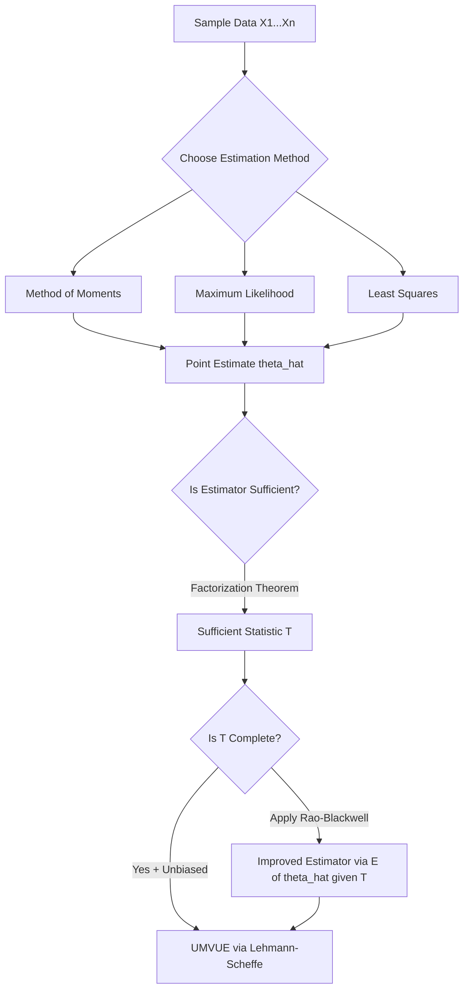

## Point estimation and sufficiency

### Overview

Point estimation is the branch of statistical inference concerned with producing a single "best guess" value for an unknown population parameter $\theta$ from observed sample data. A **point estimator** is a function $T(X_1, \dots, X_n)$ of the sample that maps observed data to a single value in the parameter space. **Sufficiency** is a formal criterion for determining whether a statistic captures all the information in a sample that is relevant to estimating $\theta$, allowing data reduction without loss of inferential content.

### Point Estimators: Definitions

An estimator is a random variable (a function of the sample before it is observed); an estimate is its realized numerical value once data is observed.

**Notation**

- Population parameter: $\theta$ (possibly vector-valued)
- Estimator: $\hat{\theta} = T(X_1, \dots, X_n)$
- Estimate: the realized value $T(x_1, \dots, x_n)$

**Common estimators**

- Sample mean: $\bar{X} = \frac{1}{n}\sum_{i=1}^n X_i$ estimates the population mean $\mu$
- Sample variance: $S^2 = \frac{1}{n-1}\sum_{i=1}^n (X_i - \bar{X})^2$ estimates $\sigma^2$
- Sample proportion: $\hat{p} = \frac{1}{n}\sum_{i=1}^n X_i$ for Bernoulli data estimates $p$

### Desirable Properties of Estimators

**Unbiasedness**

An estimator is unbiased if $E[\hat{\theta}] = \theta$ for all $\theta$ in the parameter space. The bias is defined as

$$\text{Bias}(\hat{\theta}) = E[\hat{\theta}] - \theta$$

The divisor $n-1$ in $S^2$ (Bessel's correction) exists precisely to make $E[S^2] = \sigma^2$; using $n$ instead produces a biased (downward) estimator of variance.

**Consistency**

An estimator is consistent if it converges in probability to the true parameter as $n \to \infty$:

$$\hat{\theta}_n \xrightarrow{p} \theta$$

Consistency is an asymptotic property; an estimator can be biased in finite samples yet consistent (bias vanishing as $n \to \infty$), or unbiased yet inconsistent in pathological cases.

**Efficiency**

Among unbiased estimators, efficiency compares variances: $\hat{\theta}_1$ is more efficient than $\hat{\theta}_2$ if $\text{Var}(\hat{\theta}_1) < \text{Var}(\hat{\theta}_2)$. The **Cramér–Rao Lower Bound (CRLB)** gives the theoretical minimum variance achievable by any unbiased estimator:

$$\text{Var}(\hat{\theta}) \geq \frac{1}{I(\theta)}$$

where $I(\theta)$ is the Fisher information,

$$I(\theta) = E\left[\left(\frac{\partial}{\partial \theta}\log f(X;\theta)\right)^2\right] = -E\left[\frac{\partial^2}{\partial \theta^2}\log f(X;\theta)\right]$$

An unbiased estimator that attains the CRLB is called **efficient**.

**Mean Squared Error (MSE)**

MSE decomposes into variance and squared bias, providing a criterion that balances both:

$$\text{MSE}(\hat{\theta}) = E[(\hat{\theta}-\theta)^2] = \text{Var}(\hat{\theta}) + \big[\text{Bias}(\hat{\theta})\big]^2$$

This decomposition underlies the bias–variance tradeoff central to both classical estimation and modern machine learning regularization.

### Methods of Point Estimation

**Method of Moments (MoM)**

Equates sample moments to theoretical (population) moments and solves for $\theta$. For a distribution with $k$ parameters, set the first $k$ sample moments equal to their theoretical counterparts:

$$\frac{1}{n}\sum_{i=1}^n X_i^j = E[X^j], \quad j = 1, \dots, k$$

MoM estimators are simple to compute but are often less efficient than maximum likelihood estimators and can occasionally fall outside the valid parameter space.

**Maximum Likelihood Estimation (MLE)**

Chooses $\hat{\theta}$ to maximize the likelihood function $L(\theta; x_1,\dots,x_n) = \prod_{i=1}^n f(x_i;\theta)$, equivalently maximizing the log-likelihood

$$\ell(\theta) = \sum_{i=1}^n \log f(x_i;\theta)$$

MLE is obtained by solving the score equation $\frac{\partial \ell(\theta)}{\partial \theta} = 0$. Under standard regularity conditions, MLE is consistent, asymptotically efficient (attains the CRLB asymptotically), and asymptotically normal:

$$\sqrt{n}(\hat{\theta}_{MLE} - \theta) \xrightarrow{d} N\left(0, I(\theta)^{-1}\right)$$

MLE is the dominant estimation paradigm in econometrics (e.g., logit/probit models, GARCH models) because of these asymptotic guarantees, though it can be biased in finite samples and computationally intensive without closed-form solutions (requiring numerical optimization such as Newton–Raphson).

**Method of Least Squares**

Minimizes the sum of squared residuals; in linear regression this yields the Ordinary Least Squares (OLS) estimator $\hat{\beta} = (X'X)^{-1}X'y$. Under the Gauss–Markov assumptions, OLS is the Best Linear Unbiased Estimator (BLUE).

### Sufficiency

A statistic $T(X_1,\dots,X_n)$ is **sufficient** for $\theta$ if the conditional distribution of the sample $(X_1,\dots,X_n)$ given $T$ does not depend on $\theta$. Informally, once $T$ is known, the individual data points carry no additional information about $\theta$ — $T$ has "used up" all the information in the sample relevant to $\theta$.

Formally:

$$f(x_1,\dots,x_n \mid T=t; \theta) \text{ does not depend on } \theta$$

**Fisher–Neyman Factorization Theorem**

$T(X)$ is sufficient for $\theta$ if and only if the joint density/mass function factors as

$$f(x_1,\dots,x_n;\theta) = g(T(x_1,\dots,x_n);\theta)\, h(x_1,\dots,x_n)$$

where $g$ depends on the data only through $T$ and involves $\theta$, and $h$ does not depend on $\theta$. This is the primary practical tool for identifying sufficient statistics without computing conditional distributions directly.

**Worked Example: Bernoulli sufficiency**

For $X_1,\dots,X_n \overset{iid}{\sim} \text{Bernoulli}(p)$:

$$f(x_1,\dots,x_n;p) = \prod_{i=1}^n p^{x_i}(1-p)^{1-x_i} = p^{\sum x_i}(1-p)^{n-\sum x_i}$$

Setting $T = \sum_{i=1}^n X_i$, $g(T;p) = p^T(1-p)^{n-T}$ and $h(x_1,\dots,x_n)=1$. By factorization, $T = \sum X_i$ (equivalently $\bar{X}$) is sufficient for $p$: knowing the total number of successes is as informative as knowing the entire sequence of individual outcomes.

**Minimal Sufficiency**

A sufficient statistic $T$ is **minimal sufficient** if it is a function of every other sufficient statistic — it achieves the maximum possible data reduction while remaining sufficient. Minimal sufficiency is typically established via the Lehmann–Scheffé characterization: $T(x)$ is minimal sufficient if

$$\frac{f(x;\theta)}{f(y;\theta)} \text{ is constant in } \theta \iff T(x) = T(y)$$

**Completeness and the Lehmann–Scheffé Theorem**

A sufficient statistic $T$ is **complete** if $E[g(T)] = 0$ for all $\theta$ implies $g(T) = 0$ almost surely. A statistic that is both complete and sufficient plays a central role in the **Lehmann–Scheffé Theorem**: if $T$ is complete sufficient and $\hat{\theta} = g(T)$ is unbiased for $\theta$, then $\hat{\theta}$ is the unique **Uniformly Minimum Variance Unbiased Estimator (UMVUE)**.

**Rao–Blackwell Theorem**

Given any unbiased estimator $\hat{\theta}$ and a sufficient statistic $T$, the improved estimator

$$\tilde{\theta} = E[\hat{\theta} \mid T]$$

is also unbiased and satisfies $\text{Var}(\tilde{\theta}) \leq \text{Var}(\hat{\theta})$. This theorem formalizes why "conditioning on a sufficient statistic never hurts" and, combined with completeness, provides a constructive route to the UMVUE (Rao–Blackwellization).

### Diagram: Estimation and Sufficiency Workflow

### Relevance to Econometrics

Sufficiency underlies the practical rule that regression output need not report every raw observation: OLS coefficient estimates, together with the residual sum of squares, constitute (under normality) a sufficient summary of the sample for inference about $\beta$ and $\sigma^2$. MLE-based estimation in econometrics (logit, probit, Tobit, ARCH/GARCH) relies on the same asymptotic efficiency guarantees derived from Fisher information and the CRLB discussed above. [Inference] In finite, small-sample econometric settings, the asymptotic optimality of MLE may not hold exactly, and bias-corrected or bootstrap-based alternatives are sometimes preferred in applied practice.

**Related Topics**

- Interval estimation and confidence intervals
- Bias-variance tradeoff and shrinkage estimators (Ridge, Lasso)
- Exponential family distributions and natural sufficient statistics
- Asymptotic theory: consistency, asymptotic normality, delta method
- Bayesian point estimation (posterior mean, MAP) versus frequentist estimation
- Ancillarity and Basu's Theorem