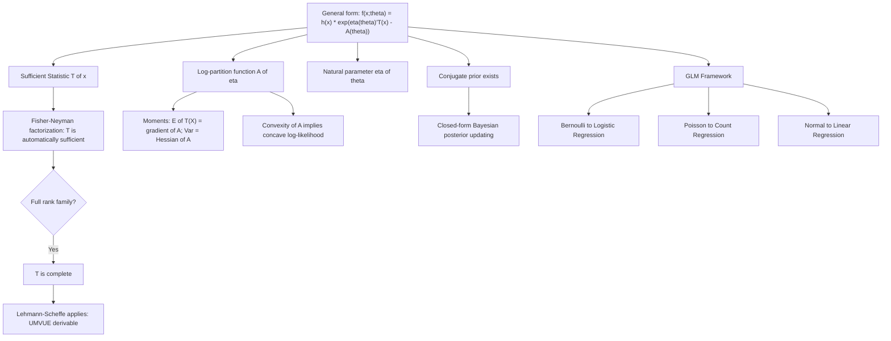

## Exponential family distributions

### Overview

The exponential family is a broad class of probability distributions sharing a common parametric form that makes them exceptionally tractable for statistical inference. Membership in this family guarantees the existence of low-dimensional sufficient statistics, well-behaved likelihood functions, and conjugate Bayesian priors. Most classical distributions used in statistics and econometrics — Normal, Bernoulli, Binomial, Poisson, Exponential, Gamma, Beta, Multinomial — belong to this family.

### General Form

A distribution belongs to the exponential family if its density (or mass function) can be written as:

$$f(x;\theta) = h(x)\, \exp\Big(\eta(\theta)^\top T(x) - A(\theta)\Big)$$

where:

- $h(x)$: base measure, depends on data only
- $\eta(\theta)$: natural (canonical) parameter, a function of $\theta$
- $T(x)$: sufficient statistic
- $A(\theta)$: log-partition function (cumulant generating function), ensures the density integrates/sums to 1

**Canonical form**

When parameterized directly in terms of $\eta$, the density is written:

$$f(x;\eta) = h(x)\exp\big(\eta^\top T(x) - A(\eta)\big)$$

with

$$A(\eta) = \log\int h(x)\exp(\eta^\top T(x))\,dx$$

### Key Structural Properties

**Sufficiency (automatic)**

By construction, $T(x)$ (or $\sum_i T(x_i)$ for an iid sample) is a sufficient statistic for $\theta$ via the Fisher–Neyman factorization theorem — the exponential family form *is* the factorization. For a sample $X_1,\dots,X_n$:

$$f(x_1,\dots,x_n;\theta) = \left[\prod_{i=1}^n h(x_i)\right]\exp\left(\eta(\theta)^\top \sum_{i=1}^n T(x_i) - nA(\theta)\right)$$

so $\sum_i T(X_i)$ is jointly sufficient, and its dimension does not grow with $n$ — a defining computational advantage.

**Moments via the log-partition function**

$A(\eta)$ acts as a cumulant generating function for $T(X)$:

$$E[T(X)] = \nabla_\eta A(\eta), \qquad \text{Var}(T(X)) = \nabla^2_\eta A(\eta)$$

This provides closed-form moment expressions without direct integration, and the positive semi-definiteness of $\nabla^2_\eta A(\eta)$ implies $A(\eta)$ is convex, which in turn guarantees the log-likelihood is concave in $\eta$ — a critical property for MLE optimization.

**Completeness**

If the natural parameter space contains an open set in $\mathbb{R}^k$ (the family is "full rank" / non-curved), the sufficient statistic $T(X)$ is complete as well as sufficient. This makes exponential families the natural setting for applying the Lehmann–Scheffé theorem to derive UMVUEs directly.

**Conjugacy**

For every exponential family likelihood, there exists a conjugate prior of matching functional form, so that the posterior remains in the same family after observing data — the algebraic basis of tractable Bayesian updating (e.g., Beta prior with Binomial likelihood, Gamma prior with Poisson likelihood).

### Canonical Examples

**Bernoulli($p$)**

$$f(x;p) = p^x(1-p)^{1-x} = \exp\left(x\log\frac{p}{1-p} + \log(1-p)\right)$$

- $T(x) = x$
- $\eta = \log\frac{p}{1-p}$ (the logit — the canonical link in logistic regression)
- $A(\eta) = \log(1+e^{\eta})$
- $h(x) = 1$

**Poisson($\lambda$)**

$$f(x;\lambda) = \frac{\lambda^x e^{-\lambda}}{x!} = \frac{1}{x!}\exp\big(x\log\lambda - \lambda\big)$$

- $T(x) = x$, $\eta = \log\lambda$, $A(\eta) = e^{\eta}$, $h(x) = 1/x!$

**Normal($\mu, \sigma^2$)** (both parameters unknown — two-parameter exponential family)

$$f(x;\mu,\sigma^2) = \frac{1}{\sqrt{2\pi\sigma^2}}\exp\left(\frac{\mu x}{\sigma^2} - \frac{x^2}{2\sigma^2} - \frac{\mu^2}{2\sigma^2} - \frac{1}{2}\log(2\pi\sigma^2)\right)$$

- $T(x) = (x, x^2)$
- $\eta = \left(\frac{\mu}{\sigma^2}, -\frac{1}{2\sigma^2}\right)$
- Jointly sufficient statistic: $\left(\sum X_i, \sum X_i^2\right)$, equivalent to $(\bar{X}, S^2)$

### Non-Members (Contrast Cases)

- **Uniform($0,\theta$)**: support depends on $\theta$, violating the required condition that support cannot depend on the parameter — not an exponential family member
- **Student's t-distribution**: cannot be written in the required form due to its heavy-tailed structure
- **Cauchy distribution**: similarly excluded

These distributions therefore lack low-dimensional sufficient statistics; for the Uniform($0,\theta$) case, the sufficient statistic is instead the sample maximum $X_{(n)}$, but this arises from a different mechanism (boundary/support dependence), not the exponential family factorization.

### Relevance to Econometrics

The exponential family is the mathematical foundation of the **Generalized Linear Model (GLM)** framework used throughout applied econometrics: linear regression (Normal), logistic/probit regression (Bernoulli/Binomial), Poisson regression for count data, and Gamma regression for positive continuous outcomes. In each GLM, the "canonical link function" connecting the linear predictor to the mean of $Y$ is precisely $\eta(\theta)$ from the exponential family form above, which is why the logit link arises naturally for binary outcomes and the log link for counts. [Inference] Software implementations (e.g., R's `glm()`, Python's `statsmodels`) exploit the concavity of $A(\eta)$ to guarantee numerically stable convergence of iteratively reweighted least squares (IRLS) when the canonical link is used, though convergence behavior with non-canonical links may vary.

### Diagram: Exponential Family Structure

**Related Topics**

- Sufficiency, minimal sufficiency, and completeness (Chapter link)
- Generalized Linear Models (GLM) and link functions
- Maximum likelihood estimation in curved vs. full exponential families
- Conjugate Bayesian priors and posterior updating
- Fisher information and the Cramér–Rao Lower Bound
- Iteratively Reweighted Least Squares (IRLS) estimation algorithm