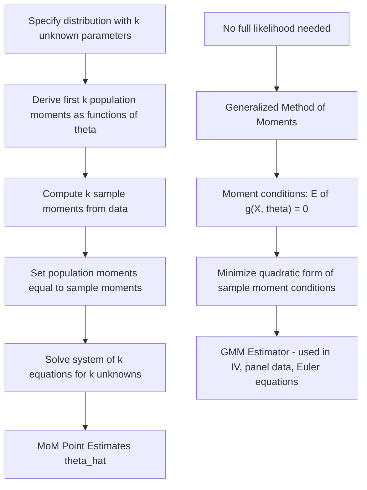

## Method of moments estimation

### Overview

The Method of Moments (MoM) is one of the oldest and most straightforward techniques for point estimation, introduced by Karl Pearson in 1894. It estimates unknown population parameters by equating theoretical (population) moments to their sample analogues and solving the resulting system of equations. While generally less efficient than maximum likelihood estimation, MoM is prized for its computational simplicity, minimal distributional assumptions, and utility in providing starting values for iterative MLE algorithms.

### Population and Sample Moments

**Population moments** (raw/uncentered), as functions of the parameter(s) $\theta$:

$$\mu_j(\theta) = E[X^j] = \int x^j f(x;\theta)\,dx, \quad j = 1, 2, \dots$$

**Sample moments**, computed directly from data:

$$m_j = \frac{1}{n}\sum_{i=1}^n X_i^j$$

By the Law of Large Numbers, $m_j \xrightarrow{p} \mu_j(\theta)$ as $n \to \infty$, which is the justification for equating them.

**Central moments** (about the mean) are sometimes used instead of raw moments for convenience, particularly the second central moment:

$$\mu_2 = E[(X-\mu)^2] = \sigma^2, \qquad \hat{\sigma}^2 = \frac{1}{n}\sum_{i=1}^n (X_i - \bar{X})^2$$

### General Procedure

For a distribution with $k$ unknown parameters $\theta = (\theta_1,\dots,\theta_k)$:

1. Derive the first $k$ population moments as functions of $\theta$: $\mu_1(\theta), \dots, \mu_k(\theta)$
2. Compute the corresponding $k$ sample moments: $m_1, \dots, m_k$
3. Set up the system of equations: $\mu_j(\theta) = m_j$ for $j=1,\dots,k$
4. Solve the system for $\hat{\theta}_1, \dots, \hat{\theta}_k$ in terms of $m_1,\dots,m_k$

### Worked Example 1: Normal Distribution

For $X_1,\dots,X_n \overset{iid}{\sim} N(\mu, \sigma^2)$, two parameters require two moment equations.

$$\mu_1(\theta) = E[X] = \mu, \qquad \mu_2(\theta) = E[X^2] = \sigma^2 + \mu^2$$

Setting these equal to sample moments $m_1 = \bar{X}$ and $m_2 = \frac{1}{n}\sum X_i^2$:

$$\hat{\mu} = \bar{X}, \qquad \hat{\sigma}^2 = m_2 - \bar{X}^2 = \frac{1}{n}\sum_{i=1}^n (X_i - \bar{X})^2$$

Note the MoM variance estimator uses divisor $n$, not $n-1$ — it is therefore a biased (though consistent) estimator of $\sigma^2$, in contrast to the standard unbiased sample variance $S^2$.

### Worked Example 2: Gamma Distribution

For $X_i \overset{iid}{\sim} \text{Gamma}(\alpha, \beta)$ (shape $\alpha$, rate $\beta$), with $E[X] = \alpha/\beta$ and $\text{Var}(X) = \alpha/\beta^2$:

$$\mu_1 = \frac{\alpha}{\beta}, \qquad \mu_2 - \mu_1^2 = \frac{\alpha}{\beta^2}$$

Solving simultaneously:

$$\hat{\beta} = \frac{\bar{X}}{\hat{\sigma}^2}, \qquad \hat{\alpha} = \frac{\bar{X}^2}{\hat{\sigma}^2}$$

where $\hat{\sigma}^2 = m_2 - \bar{X}^2$. This is a classic case where MoM yields simple closed-form estimators, whereas the MLE for the Gamma shape parameter requires solving a transcendental equation involving the digamma function numerically.

### Generalized Method of Moments (GMM)

GMM, developed by Hansen (1982), extends MoM to settings with more moment conditions than parameters (overidentified systems) and does not require raw distributional moments — instead using arbitrary **moment conditions** derived from economic/behavioral theory:

$$E[g(X_i;\theta_0)] = 0$$

where $g(\cdot)$ is a vector of $q$ functions and $\theta$ has dimension $k \leq q$. The GMM estimator minimizes a quadratic form in the sample analogue of these conditions:

$$\hat{\theta}_{GMM} = \arg\min_{\theta}\; \bar{g}_n(\theta)^\top W_n\, \bar{g}_n(\theta)$$

where $\bar{g}_n(\theta) = \frac{1}{n}\sum_i g(X_i;\theta)$ and $W_n$ is a positive-definite weighting matrix. The efficient GMM estimator uses $W_n = \hat{S}^{-1}$, the inverse of the (consistently estimated) covariance matrix of the moment conditions, which minimizes asymptotic variance among all choices of $W_n$.

GMM is the workhorse estimator in modern applied econometrics — it underlies instrumental variables (IV) estimation, dynamic panel data models (Arellano–Bond), and rational expectations/Euler equation estimation, precisely because it accommodates moment conditions from theory (e.g., orthogonality of instruments and errors) without requiring a fully specified likelihood.

### Properties of MoM Estimators

| Property | MoM | MLE |
| --- | --- | --- |
| Consistency | Yes, generally (via LLN) | Yes, under regularity conditions |
| Asymptotic normality | Yes, generally | Yes |
| Efficiency | Generally not efficient | Asymptotically efficient |
| Computational cost | Low (often closed-form) | Higher (often requires numerical optimization) |
| Can violate parameter constraints | Yes (e.g., negative variance estimate possible in small/unusual samples) | Generally respects constraints if likelihood correctly bounded |
| Requires full distributional specification | No | Yes |

**Asymptotic distribution**: Under regularity conditions, $\sqrt{n}(\hat{\theta}_{MoM} - \theta) \xrightarrow{d} N(0, V)$ where $V$ depends on the Jacobian of the moment-matching equations and the covariance of the sample moments — generally $V \neq I(\theta)^{-1}$, confirming MoM does not, in general, attain the Cramér–Rao Lower Bound.

### When MoM Is Preferred Over MLE

- The likelihood function is intractable, unknown, or computationally expensive, but low-order moments are easy to derive
- As a starting value ("warm start") for iterative MLE numerical optimization, improving convergence speed and avoiding poor local optima
- In GMM form, when the researcher wants to remain agnostic about the full distribution and rely only on credible moment conditions (e.g., orthogonality conditions in IV estimation)

### Diagram: MoM Estimation Procedure

### Relevance to Econometrics

GMM is foundational to identification strategies in applied microeconometrics and macroeconometrics: two-stage least squares (2SLS) is a special case of GMM under exact identification, and the Hansen J-test for overidentifying restrictions is a direct byproduct of the GMM objective function's minimized value, used to test the validity of instruments. [Inference] In small samples with many overidentifying moment conditions, efficient GMM estimates of the weighting matrix can be poorly behaved, and Continuously Updated GMM (CU-GMM) or bootstrap-based corrections are sometimes used in applied work to address this, though the specific correction chosen may vary by study design.

**Related Topics**

- Maximum likelihood estimation and asymptotic efficiency comparison
- Generalized Method of Moments (GMM) and instrumental variables estimation
- Overidentification and the Hansen J-test
- Two-stage least squares (2SLS) as a GMM special case
- Sufficiency and exponential family distributions
- Simulated Method of Moments (SMM) for intractable likelihoods