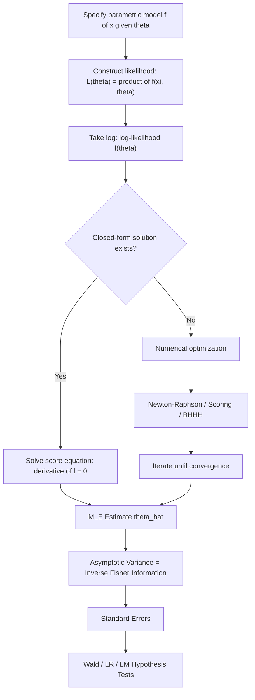

## Maximum likelihood estimation

### Overview

Maximum Likelihood Estimation (MLE), formalized by R.A. Fisher in the 1920s, is the dominant framework for point estimation in modern statistics and econometrics. It selects the parameter value $\hat{\theta}$ that makes the observed data most probable under the assumed statistical model, by maximizing the likelihood function. MLE's popularity rests on its strong, well-understood asymptotic properties: consistency, efficiency, and asymptotic normality.

### The Likelihood Function

For a sample $x_1,\dots,x_n$ from a distribution with density/mass function $f(x;\theta)$, the **likelihood function** treats the joint density as a function of $\theta$ for fixed observed data:

$$L(\theta; x_1,\dots,x_n) = \prod_{i=1}^n f(x_i;\theta)$$

(valid for iid observations; for dependent data, the joint density is used directly without factoring into a product).

**Log-likelihood**: Because products of many small probabilities are numerically unstable and analytically inconvenient, the log-likelihood is used instead (monotonic transformation preserves the location of the maximum):

$$\ell(\theta) = \log L(\theta) = \sum_{i=1}^n \log f(x_i;\theta)$$

### The Maximum Likelihood Estimator

$$\hat{\theta}_{MLE} = \arg\max_{\theta \in \Theta} \ell(\theta)$$

**First-order condition (score equation)**: If $\ell(\theta)$ is differentiable and the maximum is interior, $\hat{\theta}$ solves:

$$\frac{\partial \ell(\theta)}{\partial \theta}\Big|_{\theta=\hat\theta} = 0$$

This derivative, $S(\theta) = \partial \ell(\theta)/\partial\theta$, is the **score function**. Its expectation is zero at the true parameter value: $E[S(\theta_0)] = 0$, a key identity used in deriving the Cramér–Rao bound and the asymptotic distribution of MLE.

**Second-order condition**: A genuine maximum requires the Hessian (matrix of second derivatives) to be negative (semi-)definite at $\hat\theta$, i.e., $\ell(\theta)$ is locally concave there.

### Worked Example 1: Bernoulli/Binomial

For $X_1,\dots,X_n \overset{iid}{\sim} \text{Bernoulli}(p)$:

$$\ell(p) = \sum_{i=1}^n \left[x_i\log p + (1-x_i)\log(1-p)\right]$$

$$\frac{\partial \ell}{\partial p} = \frac{\sum x_i}{p} - \frac{n - \sum x_i}{1-p} = 0 \implies \hat{p}_{MLE} = \frac{1}{n}\sum_{i=1}^n x_i = \bar{X}$$

The MLE coincides with the intuitive sample proportion, and is also the MoM estimator here.

### Worked Example 2: Normal Distribution

For $X_1,\dots,X_n \overset{iid}{\sim} N(\mu,\sigma^2)$:

$$\ell(\mu,\sigma^2) = -\frac{n}{2}\log(2\pi) - \frac{n}{2}\log\sigma^2 - \frac{1}{2\sigma^2}\sum_{i=1}^n (x_i-\mu)^2$$

Solving $\partial\ell/\partial\mu = 0$ and $\partial\ell/\partial\sigma^2 = 0$ jointly:

$$\hat{\mu}_{MLE} = \bar{X}, \qquad \hat{\sigma}^2_{MLE} = \frac{1}{n}\sum_{i=1}^n (X_i-\bar{X})^2$$

Note $\hat{\sigma}^2_{MLE}$ uses divisor $n$, making it a biased estimator of $\sigma^2$ (though asymptotically unbiased/consistent) — a standard illustration that MLE does not guarantee finite-sample unbiasedness even though it guarantees asymptotic efficiency.

### Asymptotic Properties (Regularity Conditions Required)

Under standard regularity conditions (identifiability, differentiability of $\ell(\theta)$, support not depending on $\theta$, interchangeability of differentiation and integration):

**1. Consistency**: $\hat{\theta}_{MLE} \xrightarrow{p} \theta_0$ as $n \to \infty$

**2. Asymptotic Normality**:

$$\sqrt{n}(\hat{\theta}_{MLE} - \theta_0) \xrightarrow{d} N\left(0,\, I_1(\theta_0)^{-1}\right)$$

where $I_1(\theta_0)$ is the Fisher information from a single observation.

**3. Asymptotic Efficiency**: The MLE attains the Cramér–Rao Lower Bound asymptotically — no consistent, asymptotically normal estimator has smaller asymptotic variance.

**4. Invariance Property**: For any function $g(\cdot)$, the MLE of $g(\theta)$ is $g(\hat{\theta}_{MLE})$ — a property not generally shared by other estimation methods (e.g., unbiased estimators are not invariant to nonlinear transformations).

### Numerical Optimization

Closed-form solutions exist only for select distributions (Normal, Bernoulli, Poisson, exponential family in general). For most econometric models (logit, probit, Tobit, ARCH/GARCH, mixture models), $\ell(\theta)$ must be maximized numerically.

**Newton–Raphson**: Iteratively updates using the Hessian:

$$\theta_{(k+1)} = \theta_{(k)} - \left[H(\theta_{(k)})\right]^{-1} S(\theta_{(k)})$$

where $H(\theta) = \partial^2 \ell(\theta)/\partial\theta\partial\theta^\top$ is the Hessian. Converges quadratically near the optimum but requires computing/inverting the Hessian each iteration.

**Method of Scoring**: Replaces the observed Hessian with the negative expected Fisher information $-I(\theta)$, often more numerically stable:

$$\theta_{(k+1)} = \theta_{(k)} + \left[I(\theta_{(k)})\right]^{-1} S(\theta_{(k)})$$

**BHHH (Berndt–Hall–Hall–Hausman) Algorithm**: Approximates the information matrix using the outer product of individual score contributions, $\hat{I}(\theta) \approx \sum_i s_i(\theta)s_i(\theta)^\top$, avoiding second-derivative computation entirely — widely used in econometric software for likelihood maximization.

[Inference] Convergence to a global maximum is not guaranteed when $\ell(\theta)$ is not globally concave (e.g., some mixture models or models with multiple local optima); practitioners often address this using multiple starting values, though the specific safeguard used can vary by implementation.

### Standard Errors and Inference

Given the asymptotic normality result, standard errors for $\hat\theta_{MLE}$ are estimated as the square roots of the diagonal of the inverse information matrix, evaluated at $\hat\theta$:

$$\widehat{\text{SE}}(\hat\theta_j) = \sqrt{\left[I_n(\hat\theta)^{-1}\right]_{jj}}$$

using either the **observed information** $-H(\hat\theta)$ (Hessian-based) or the **expected information** $E[-H(\theta)]$ evaluated at $\hat\theta$.

**Hypothesis testing** built on MLE uses three asymptotically equivalent classical tests:

- **Likelihood Ratio (LR) test**: $-2\log\left[\frac{L(\theta_0)}{L(\hat\theta)}\right] \xrightarrow{d} \chi^2_r$ under $H_0$
- **Wald test**: based on the distance of $\hat\theta$ from $\theta_0$, scaled by estimated variance
- **Lagrange Multiplier (LM/Score) test**: based on the score function evaluated at the restricted estimate $\tilde\theta$

### Diagram: MLE Estimation Pipeline

### Relevance to Econometrics

MLE underlies nearly all limited dependent variable models used in applied econometrics: logit and probit for binary outcomes, ordered logit/probit for ordinal outcomes, Tobit for censored data, Poisson/Negative Binomial regression for count data, and GARCH-family models for conditional heteroskedasticity in financial time series. Quasi-Maximum Likelihood Estimation (QMLE) extends the framework further, remaining consistent even when the assumed distribution is misspecified, provided the conditional mean (or other first-moment structure) is correctly specified — this robustness underlies the popularity of Poisson QMLE for count data even when the equidispersion assumption of the true Poisson distribution fails.

**Related Topics**

- Cramér–Rao Lower Bound and asymptotic efficiency
- Exponential family distributions and closed-form MLE derivations
- Likelihood Ratio, Wald, and Lagrange Multiplier tests
- Quasi-Maximum Likelihood Estimation (QMLE) and robust standard errors
- Logit, probit, and limited dependent variable models
- Numerical optimization methods (Newton–Raphson, BHHH, EM algorithm)