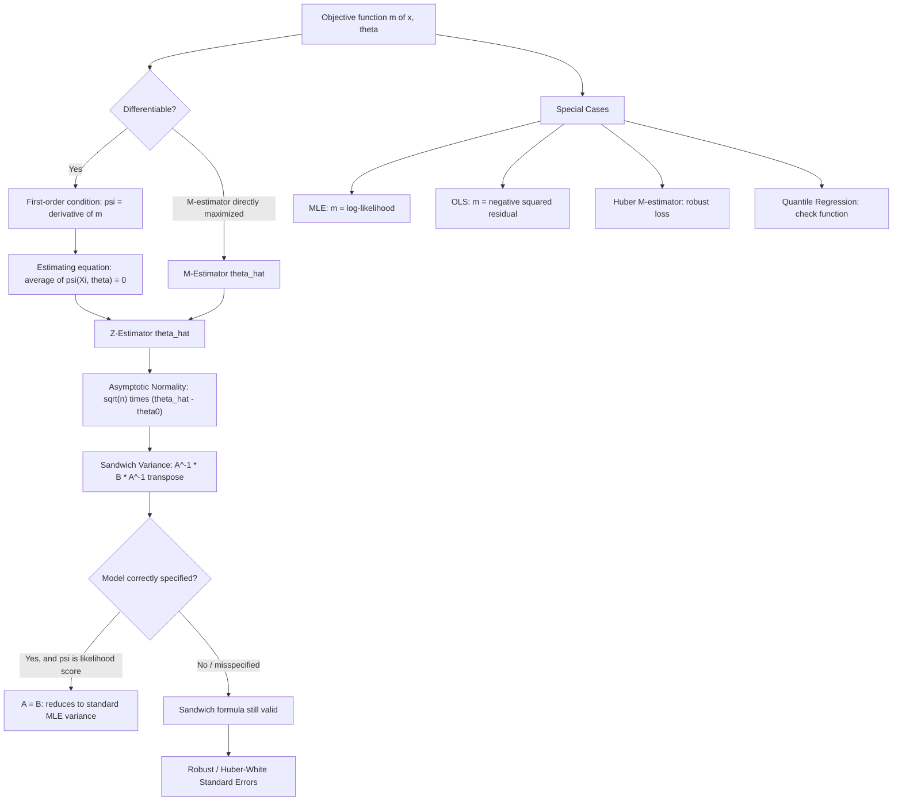

## M-estimation and Z-estimation

### Overview

M-estimation and Z-estimation form a unifying framework that generalizes maximum likelihood, least squares, and quantile regression under a single asymptotic theory. An **M-estimator** is defined as the maximizer (or minimizer) of an objective (criterion) function that is a sample average, while a **Z-estimator** ("zero"-estimator) is defined as the solution to a sample-average estimating equation set to zero. The two frameworks are closely related — differentiable M-estimation problems reduce to Z-estimation via first-order conditions.

### M-Estimators: Definition

An M-estimator $\hat{\theta}_n$ is defined as:

$$\hat{\theta}_n = \arg\max_{\theta \in \Theta} \; \frac{1}{n}\sum_{i=1}^n m(X_i;\theta)$$

(or equivalently, $\arg\min$ of $-m(X_i;\theta)$), where $m(\cdot\,;\theta)$ is a known objective function. The term "M-estimator" stands for "maximum-likelihood-type" estimator, reflecting the fact that MLE is the canonical special case.

**Special cases recovered by choice of $m$**

| Estimator | $m(X_i;\theta)$ | Notes |
| --- | --- | --- |
| MLE | $\log f(X_i;\theta)$ | Maximizes log-likelihood |
| OLS | $-(Y_i - X_i^\top\beta)^2$ | Minimizes squared residuals |
| LAD (Least Absolute Deviations) | $-\lvert Y_i - X_i^\top\beta \rvert$ | Robust to outliers; estimates conditional median |
| Quantile regression | $-\rho_\tau(Y_i - X_i^\top\beta)$ | $\rho_\tau$ is the asymmetric "check function" |
| Huber M-estimator | Huber loss (quadratic near 0, linear in tails) | Robust regression, bounded influence |

### Z-Estimators: Definition

A Z-estimator $\hat{\theta}_n$ solves a sample-average **estimating equation**:

$$\frac{1}{n}\sum_{i=1}^n \psi(X_i;\hat{\theta}_n) = 0$$

where $\psi(\cdot\,;\theta)$ is a known (typically vector-valued) function, sometimes called the "score function" or "influence function" in this generalized context.

**Relationship to M-estimation**: If $m(x;\theta)$ is differentiable in $\theta$, setting $\psi(x;\theta) = \partial m(x;\theta)/\partial\theta$ converts the M-estimation maximization problem into a Z-estimation root-finding problem via the first-order condition — this is precisely how the MLE score equation arises. Not every Z-estimator originates from an M-estimation problem, however: $\psi$ need not be a gradient of any objective function, making Z-estimation strictly more general (e.g., GMM moment conditions are Z-type equations without necessarily deriving from a single scalar objective in the overidentified case).

### Asymptotic Theory

**Consistency**: Under regularity conditions — including a uniform law of large numbers ensuring $\frac{1}{n}\sum m(X_i;\theta) \xrightarrow{p} E[m(X;\theta)]$ uniformly in $\theta$, and identifiability (the population objective $E[m(X;\theta)]$ is uniquely maximized at $\theta_0$) — the M-estimator is consistent: $\hat\theta_n \xrightarrow{p} \theta_0$.

**Asymptotic Normality (the Sandwich Formula)**: Under further smoothness conditions, M/Z-estimators are asymptotically normal:

$$\sqrt{n}(\hat\theta_n - \theta_0) \xrightarrow{d} N\left(0,\; A(\theta_0)^{-1} B(\theta_0) \big[A(\theta_0)^{-1}\big]^\top\right)$$

where:

- $A(\theta_0) = E\left[-\frac{\partial \psi(X;\theta_0)}{\partial \theta}\right]$ (the expected Jacobian/"bread")
- $B(\theta_0) = E\left[\psi(X;\theta_0)\psi(X;\theta_0)^\top\right]$ (the covariance of the estimating function/"meat")

This is the celebrated **sandwich variance formula**. When the model is correctly specified and $\psi$ is the true likelihood score, the information matrix equality $A(\theta_0) = B(\theta_0)$ holds, and the sandwich formula collapses to the familiar $A(\theta_0)^{-1} = I(\theta_0)^{-1}$ — recovering the standard MLE asymptotic variance as a special case. Under model misspecification, $A \neq B$ in general, and using only $A^{-1}$ (ignoring the sandwich) yields incorrect standard errors.

### Robust ("Sandwich") Standard Errors

Because the sandwich formula remains valid even when the working model is misspecified (a property inherited from the general Z-estimator theory), **heteroskedasticity-consistent (HC) standard errors** in OLS regression (the White/Huber-White estimator) and **cluster-robust standard errors** are direct applications of M-estimation asymptotic theory. In practice, $A$ and $B$ are estimated by their sample analogues:

$$\hat{A} = -\frac{1}{n}\sum_{i=1}^n \frac{\partial \psi(X_i;\hat\theta)}{\partial \theta}, \qquad \hat{B} = \frac{1}{n}\sum_{i=1}^n \psi(X_i;\hat\theta)\psi(X_i;\hat\theta)^\top$$

giving the estimated sandwich covariance $\widehat{\text{Var}}(\hat\theta) = \frac{1}{n}\hat A^{-1}\hat B\hat A^{-\top}$, which is the formula implemented by "robust" standard error options in econometric software.

### Robust Estimation: The Huber M-Estimator

A primary motivation for M-estimation historically was **robustness to outliers** in regression. The Huber loss function is:

$$\rho_k(u) = \begin{cases} \frac{1}{2}u^2 & \lvert u \rvert \leq k \\ k\lvert u\rvert - \frac{1}{2}k^2 & \lvert u \rvert > k \end{cases}$$

with corresponding $\psi$-function (derivative) $\psi_k(u) = \max(-k,\min(k,u))$ — a "clipped" residual. This behaves like OLS (quadratic loss) for small residuals but like LAD (linear loss) for large residuals, bounding the influence of outliers on the fitted parameters — a property OLS (unbounded quadratic loss) does not have. The tuning constant $k$ controls the trade-off between efficiency (small $k$ reduces robustness but sacrifices some efficiency at the Normal model) and robustness to contamination.

### The Estimating Equations (GEE) Framework

Z-estimation directly generalizes to correlated/longitudinal data via **Generalized Estimating Equations (GEE)**, widely used in panel data and biostatistics, where $\psi$ incorporates a working correlation structure for repeated measurements without requiring the full joint likelihood to be correctly specified — consistency of the GEE estimator for the mean-structure parameters holds even if the working correlation structure is misspecified, though efficiency is affected.

### Diagram: M/Z-Estimation Framework

### Relevance to Econometrics

M/Z-estimation theory is the rigorous foundation underlying nearly every "robust standard error" option available in applied econometric software (`robust`, `vce(cluster ...)`, HC0–HC3 estimators), since these are simply sandwich-variance estimates applied to the OLS/GMM estimating equations. Quantile regression, robust regression against outliers/leverage points, and GEE-based panel estimators are all directly parameterized as special cases of this single asymptotic framework, which is why textbooks increasingly present GMM, MLE, and OLS asymptotics as instances of one unified M/Z-estimation theory rather than as separate topics.

**Related Topics**

- Generalized Method of Moments (GMM) as a Z-estimator special case
- Heteroskedasticity-consistent and cluster-robust standard errors
- Quantile regression and the check-function loss
- Robust statistics: breakdown point and influence functions
- Generalized Estimating Equations (GEE) for panel/longitudinal data
- Quasi-Maximum Likelihood Estimation (QMLE) and misspecification-robust inference