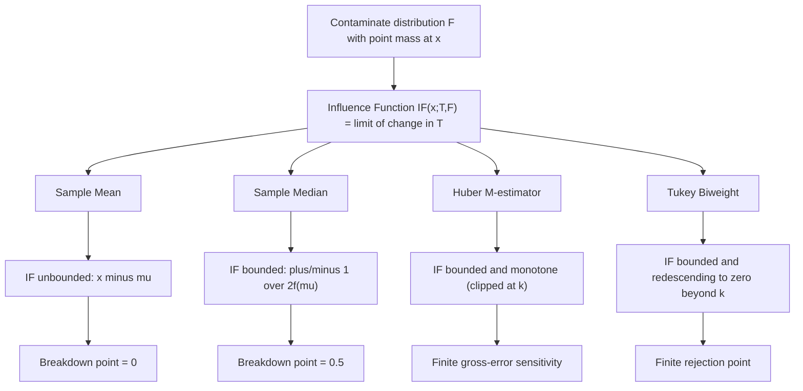

## Robust estimation and influence functions

### Overview

Robust estimation studies how to construct estimators that remain reliable when data deviate from idealized modeling assumptions — particularly in the presence of outliers, heavy-tailed error distributions, or small departures from the assumed parametric family. The **influence function**, introduced by Frank Hampel (1974), is the central diagnostic tool of this theory: it measures how sensitive an estimator is to a small perturbation (contamination) at a single data point, providing a formal basis for comparing the robustness of different estimators.

### Motivation: The Fragility of Classical Estimators

Classical estimators optimized purely for efficiency under an idealized model (e.g., OLS and the sample mean under exact Normality) can have **unbounded sensitivity** to outliers. A single sufficiently extreme observation can shift the sample mean or an OLS coefficient by an arbitrary amount — the estimator has no built-in resistance to contamination, even though it is optimal (efficient, even attaining the CRLB) when the Normal model holds exactly.

### The Influence Function

**Definition (Gateaux derivative form)**: For an estimator expressed as a statistical functional $T(F)$ of the underlying distribution $F$, the influence function at point $x$ is:

$$IF(x; T, F) = \lim_{\epsilon \to 0^+} \frac{T\big((1-\epsilon)F + \epsilon \delta_x\big) - T(F)}{\epsilon}$$

where $\delta_x$ is a point mass (Dirac measure) at $x$, and $\epsilon$ represents an infinitesimally small fraction of contamination introduced at the point $x$. Intuitively, $IF(x;T,F)$ measures the (normalized, asymptotic) rate of change of the estimator's value caused by adding an infinitesimal contaminating observation at $x$.

**Connection to asymptotic variance**: Under regularity conditions, the asymptotic variance of $\sqrt{n}(T(\hat F_n) - T(F))$ equals

$$\text{AsyVar}(T) = E_F\left[IF(X;T,F)^2\right]$$

so the influence function also directly determines the estimator's asymptotic efficiency — connecting robustness theory back to classical estimation efficiency (CRLB) theory.

### Worked Example: Sample Mean vs. Sample Median

**Sample mean** ($T(F) = \int x\,dF(x)$):

$$IF(x;\bar X, F) = x - \mu$$

This is **unbounded** as $x \to \pm\infty$ — a single extreme outlier can exert arbitrarily large influence on the sample mean, formally confirming its fragility.

**Sample median** (for a distribution with density $f$ and median $\mu$):

$$IF(x;\text{median}, F) = \frac{\text{sign}(x-\mu)}{2f(\mu)}$$

This is **bounded** (it takes only two values, $\pm 1/[2f(\mu)]$) regardless of how extreme $x$ is — the median's influence saturates rather than growing without bound, formally demonstrating its robustness relative to the mean.

### Key Robustness Measures Derived from the Influence Function

**Gross-error sensitivity**: The supremum of the absolute influence function, measuring the worst-case effect of a single contaminating point:

$$\gamma^* = \sup_x \lvert IF(x;T,F) \rvert$$

An estimator with finite $\gamma^*$ is called **B-robust** (bias-robust); the sample mean has $\gamma^* = \infty$, while the median has finite $\gamma^*$.

**Rejection point**: The distance $\rho^*$ beyond which $IF(x;T,F) = 0$ — points farther than $\rho^*$ from the center have zero influence. Estimators with finite rejection points (e.g., certain redescending M-estimators) completely reject sufficiently extreme outliers.

**Breakdown point**: The largest fraction of arbitrarily contaminated data an estimator can tolerate before producing an arbitrarily bad (unbounded) result. The sample mean has a breakdown point of $0$ (a single arbitrarily large observation can break it), while the sample median has a breakdown point of $0.5$ (up to just under half the data can be contaminated without the median diverging) — the theoretical maximum for any reasonable location estimator.

### Robust Estimators in Practice

**Huber M-estimator** (see also: M-estimation and Z-estimation): The Huber loss produces a bounded, monotone $\psi$-function:

$$\psi_k(u) = \max(-k, \min(k, u))$$

giving a finite gross-error sensitivity $\gamma^* = k$ while retaining reasonably high efficiency at the Normal model for suitably chosen $k$ (commonly $k \approx 1.345\sigma$ for 95% efficiency relative to OLS under exact Normality).

**Tukey's biweight (bisquare) estimator**: A **redescending** M-estimator whose $\psi$-function returns to zero for large residuals:

$$\psi_k(u) = \begin{cases} u\left(1-(u/k)^2\right)^2 & \lvert u \rvert \leq k \\ 0 & \lvert u \rvert > k \end{cases}$$

This gives a finite rejection point (gross outliers receive exactly zero weight) at some cost to the convexity of the underlying objective function, which can introduce multiple local optima in the estimating equations.

**M-estimators of location/scale**: Solve $\sum_i \psi\left(\frac{x_i - \hat\mu}{\hat\sigma}\right) = 0$ jointly with a scale equation (often using the Median Absolute Deviation, MAD, as a robust initial scale estimate) via iteratively reweighted least squares (IRLS).

### Robust Regression

Extending robustness to the regression setting (where leverage points in the design matrix $X$ compound the outlier problem in $Y$):

- **LAD (Least Absolute Deviations) regression**: Minimizes $\sum_i \lvert y_i - x_i^\top\beta\rvert$; robust to outliers in $Y$ but not to high-leverage points in $X$
- **Huber/M-regression**: Bounded influence in the response residual direction, still vulnerable to leverage
- **High breakdown-point regression** (e.g., Least Trimmed Squares, LTS): Explicitly designed to resist both vertical outliers and leverage points, achieving breakdown points up to 50%

### Diagram: Influence Function Comparison

### Relevance to Econometrics

Robust estimation and influence function diagnostics matter in applied econometrics whenever data are prone to measurement error, coding errors, or genuine extreme values (e.g., firm-level financial data with occasional extreme leverage or outlier observations, survey data with recording errors): a small number of influential observations can otherwise dominate an OLS coefficient estimate without any diagnostic warning if only $R^2$ or standard errors are examined. [Inference] Applied practitioners sometimes substitute or supplement OLS with robust regression, trimming, or winsorization when influence diagnostics (e.g., Cook's distance, DFBETAS — which are themselves finite-sample analogues of the influence function) flag high-leverage points, though the specific robustness method chosen and its threshold for "influential" often vary by field convention and dataset.

**Related Topics**

- M-estimation and Z-estimation general theory
- Breakdown point and high breakdown-point regression (LTS, LMS)
- Outlier diagnostics: Cook's distance, leverage, DFBETAS
- Heteroskedasticity-consistent (sandwich) standard errors
- Quantile regression as a robust alternative to conditional-mean regression
- Winsorizing and trimming in applied data cleaning