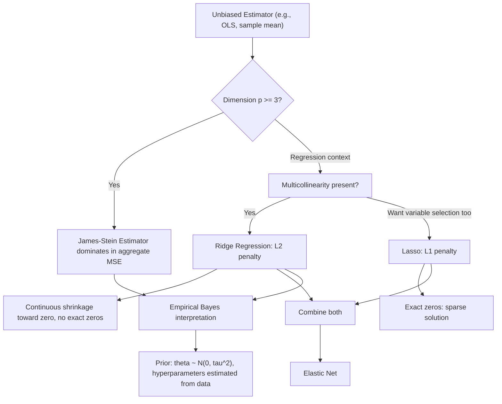

## Shrinkage estimation

### Overview

Shrinkage estimation deliberately introduces bias into an estimator by pulling ("shrinking") it toward a fixed target — typically zero, a grand mean, or a structured prior — in exchange for a reduction in variance large enough to lower overall estimation error. This bias–variance tradeoff, formalized through the Mean Squared Error decomposition, underlies some of the most consequential results in estimation theory, including the counterintuitive discovery that the ordinary sample mean is inadmissible in dimensions three and higher.

### The Bias–Variance Tradeoff Revisited

Recall the MSE decomposition for any estimator $\hat\theta$:

$$\text{MSE}(\hat\theta) = \text{Var}(\hat\theta) + \left[\text{Bias}(\hat\theta)\right]^2$$

Shrinkage estimators exploit this identity directly: a small increase in squared bias can be more than offset by a larger decrease in variance, yielding a strictly lower MSE than an unbiased (even efficient, CRLB-attaining) competitor. This directly contradicts the classical preference for unbiasedness as a primary criterion and motivates evaluating estimators on MSE (or risk) grounds instead.

### Stein's Paradox and the James–Stein Estimator

**Setup**: Let $X \sim N_p(\theta, I_p)$ (a $p$-dimensional multivariate Normal with unknown mean $\theta$ and known identity covariance), based on a single vector observation (or, equivalently, $p$ independent means each estimated with common known variance). The natural, seemingly optimal estimator is $\hat\theta_{MLE} = X$ — the componentwise sample mean, which is unbiased and is also the MLE and the UMVUE.

**Stein's Paradox (1956)**: For $p \geq 3$, the estimator $\hat\theta_{MLE} = X$ is **inadmissible** under squared-error loss $E\lVert\hat\theta - \theta\rVert^2$ — meaning there exists another estimator with MSE no larger for every $\theta$, and strictly smaller for some $\theta$. This result stunned the statistical community, since $X$ is unbiased, is the MLE, and equals the UMVUE, yet is still dominated.

**James–Stein Estimator** (1961):

$$\hat\theta_{JS} = \left(1 - \frac{(p-2)\sigma^2}{\lVert X \rVert^2}\right) X$$

This estimator shrinks every component of $X$ toward the origin (or, more generally, toward any fixed point, including a common grand mean) by a data-dependent factor. It can be shown that:

$$E\left[\lVert \hat\theta_{JS} - \theta \rVert^2\right] < E\left[\lVert X - \theta \rVert^2\right] = p\sigma^2 \quad \text{for all } \theta, \text{ when } p \geq 3$$

**Interpretation**: Even when the $p$ parameters being estimated are entirely unrelated (e.g., batting averages of different players, or means of unrelated economic time series), *jointly* shrinking them all toward a common point reduces total (aggregate) MSE across all $p$ estimates simultaneously — though the improvement is only guaranteed in aggregate risk, not necessarily for every individual component's own MSE.

**Positive-part James–Stein estimator**: Truncates the shrinkage factor to prevent sign reversal:

$$\hat\theta_{JS+} = \left(1 - \frac{(p-2)\sigma^2}{\lVert X\rVert^2}\right)^+ X, \qquad (z)^+ = \max(z,0)$$

which further dominates the standard James–Stein estimator.

### Ridge Regression as Shrinkage

In the linear regression context $Y = X\beta + \varepsilon$, **ridge regression** (Hoerl and Kennard, 1970) applies the same shrinkage logic to combat multicollinearity and reduce variance:

$$\hat\beta_{ridge} = \arg\min_\beta \left\{ \sum_{i=1}^n (y_i - x_i^\top\beta)^2 + \lambda \sum_{j=1}^p \beta_j^2 \right\} = (X^\top X + \lambda I)^{-1}X^\top Y$$

As the tuning parameter $\lambda \to 0$, $\hat\beta_{ridge} \to \hat\beta_{OLS}$; as $\lambda \to \infty$, all coefficients shrink toward zero. Ridge regression is guaranteed to reduce variance relative to OLS by construction (the added $\lambda I$ term improves the conditioning of $X^\top X$, which is especially valuable when regressors are highly collinear and $(X^\top X)^{-1}$ is near-singular), at the cost of introducing bias; for a well-chosen $\lambda$, this exchange lowers overall MSE relative to OLS.

**Bayesian interpretation**: Ridge regression is equivalent to the posterior mode (equivalently, posterior mean, given the Normal-Normal conjugacy) under a Normal prior $\beta_j \sim N(0,\tau^2)$ independently across coefficients, with $\lambda = \sigma^2/\tau^2$ — connecting shrinkage estimation directly to Bayesian point estimation.

### Lasso and Sparse Shrinkage

**Lasso** (Least Absolute Shrinkage and Selection Operator, Tibshirani 1996) replaces the ridge $L_2$ penalty with an $L_1$ penalty:

$$\hat\beta_{lasso} = \arg\min_\beta \left\{ \sum_{i=1}^n (y_i - x_i^\top\beta)^2 + \lambda \sum_{j=1}^p \lvert \beta_j \rvert \right\}$$

Unlike ridge (which shrinks coefficients continuously toward, but not exactly to, zero), the $L_1$ penalty's non-differentiability at zero produces **exact sparsity** — some coefficients are shrunk to precisely zero, performing simultaneous variable selection and shrinkage. This makes lasso a "shrink-and-select" estimator rather than a "shrink-only" estimator like ridge.

**Elastic Net**: Combines both penalties, $\lambda_1\sum\lvert\beta_j\rvert + \lambda_2\sum\beta_j^2$, addressing lasso's tendency to arbitrarily select only one variable among a group of highly correlated predictors.

### Empirical Bayes Shrinkage

Many shrinkage estimators (including James–Stein) have an **empirical Bayes** interpretation: rather than specifying a prior distribution's hyperparameters in advance (as in fully Bayesian analysis), the hyperparameters are estimated directly from the data. For the James–Stein setting, treating $\theta_j \sim N(0,\tau^2)$ as an implicit prior, the shrinkage factor $(p-2)\sigma^2/\lVert X\rVert^2$ can be interpreted as an empirical estimate of $\sigma^2/(\sigma^2+\tau^2)$, the theoretical Bayes shrinkage factor under that prior — this connects the frequentist James–Stein result to Bayesian hierarchical modeling without requiring the analyst to specify $\tau^2$ directly.

### Diagram: Shrinkage Estimation Landscape

### Relevance to Econometrics

Shrinkage methods have become central to modern applied econometrics in high-dimensional settings — variable selection among many candidate controls or instruments (e.g., Belloni, Chernozhukov, and Hansen's Post-Double-Lasso for causal inference with high-dimensional controls), forecasting with many predictors (ridge/lasso-based factor-augmented forecasting models), and shrinkage of panel data fixed effects toward a common value to reduce estimation noise in short panels. [Inference] The choice of penalty parameter $\lambda$ in applied lasso/ridge regressions is typically selected via cross-validation, though the specific cross-validation scheme (k-fold, time-series-aware rolling windows for panel/time-series econometric applications) can vary depending on the temporal or clustering structure of the data.

**Related Topics**

- Ridge regression, Lasso, and Elastic Net regularization paths
- Bias–variance tradeoff and Mean Squared Error criterion
- Bayesian point estimation and conjugate priors
- High-dimensional econometrics and post-double-selection methods
- Cross-validation for tuning parameter selection
- Empirical Bayes methods and hierarchical models