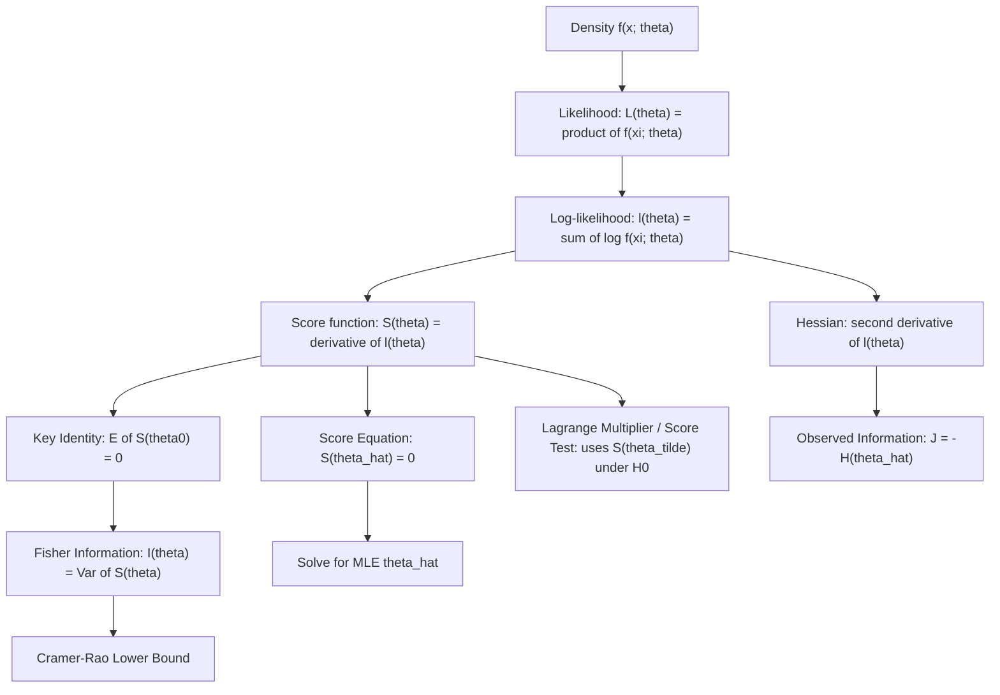

## The likelihood function and score equations

### Overview

The likelihood function is the central object of likelihood-based inference: it reinterprets the joint probability density of observed data as a function of the unknown parameter, holding the data fixed. Score equations — the first-order conditions obtained by differentiating the log-likelihood — provide the mechanism through which maximum likelihood estimates are derived and are the building block for a wide range of asymptotic inference procedures.

### The Likelihood Function

Given a parametric family of distributions $f(x;\theta)$ and observed data $x_1,\dots,x_n$, the likelihood function is:

$$L(\theta) = L(\theta; x_1,\dots,x_n) = \prod_{i=1}^n f(x_i;\theta) \quad \text{(iid case)}$$

or, more generally for possibly dependent data, $L(\theta) = f(x_1,\dots,x_n;\theta)$, the full joint density evaluated at the observed sample.

**Crucial conceptual distinction**: $f(x;\theta)$ is a density in $x$ for fixed $\theta$ (integrates to 1 over $x$); $L(\theta)$ is a function of $\theta$ for fixed, observed $x$, and does **not** in general integrate to 1 over $\theta$. The likelihood is not a probability distribution over $\theta$ in frequentist inference — this distinction becomes important when contrasting with the Bayesian posterior, which does normalize over $\theta$.

**Likelihood is defined only up to a multiplicative constant** (not depending on $\theta$): $L(\theta)$ and $c \cdot L(\theta)$ for any constant $c>0$ carry identical information about $\theta$, since they are maximized at the same value and yield the same likelihood ratios.

### The Log-Likelihood

$$\ell(\theta) = \log L(\theta) = \sum_{i=1}^n \log f(x_i;\theta)$$

The log transformation is used for three main reasons: (1) it converts products into numerically stable sums, avoiding floating-point underflow with large $n$; (2) it is a strictly monotonic transformation, so $\ell(\theta)$ and $L(\theta)$ share the same maximizer; (3) the additive structure makes differentiation and asymptotic analysis (via sums of iid terms and the CLT) tractable.

### The Score Function

The **score function** is the gradient (first derivative) of the log-likelihood with respect to $\theta$:

$$S(\theta) = \nabla_\theta \ell(\theta) = \frac{\partial \ell(\theta)}{\partial \theta}$$

For an iid sample, the score is a sum of individual contributions: $S(\theta) = \sum_{i=1}^n s(x_i;\theta)$, where $s(x_i;\theta) = \partial \log f(x_i;\theta)/\partial\theta$ is the **score contribution** of a single observation.

**Multiparameter case**: When $\theta = (\theta_1,\dots,\theta_k)$, the score is a $k$-vector:

$$S(\theta) = \left(\frac{\partial \ell}{\partial \theta_1}, \dots, \frac{\partial \ell}{\partial \theta_k}\right)^\top$$

### Key Property: Zero Mean of the Score

A foundational identity in likelihood theory is that the score has expectation zero at the true parameter value $\theta_0$:

$$E_{\theta_0}\left[s(X;\theta_0)\right] = 0$$

**Derivation sketch**: Since $\int f(x;\theta)\,dx = 1$ for all $\theta$, differentiating both sides with respect to $\theta$ (assuming regularity conditions permit interchanging differentiation and integration) gives $\int \frac{\partial f(x;\theta)}{\partial \theta}\,dx = 0$. Using the identity $\frac{\partial f}{\partial\theta} = f \cdot \frac{\partial \log f}{\partial\theta}$ (the "log-derivative trick"), this becomes $\int \frac{\partial \log f(x;\theta)}{\partial\theta} f(x;\theta)\,dx = E_\theta\left[s(X;\theta)\right] = 0$.

This identity is the basis for: (1) the score equation used to find the MLE, (2) the derivation of the Cramér–Rao Lower Bound via Cauchy–Schwarz, and (3) the Lagrange Multiplier (score) test in hypothesis testing.

### The Score Equation and MLE

The maximum likelihood estimator, when it occurs at an interior stationary point, solves the **score equation**:

$$S(\hat\theta) = 0 \quad \iff \quad \sum_{i=1}^n s(x_i;\hat\theta) = 0$$

This is a direct instance of Z-estimation (see M-estimation and Z-estimation), with $\psi(x;\theta) = s(x;\theta)$ — the score IS the estimating function for MLE. A second-order condition (negative semi-definite Hessian at $\hat\theta$) confirms a maximum rather than a minimum or saddle point.

### Worked Example: Exponential Distribution

For $X_1,\dots,X_n \overset{iid}{\sim} \text{Exponential}(\lambda)$ with $f(x;\lambda) = \lambda e^{-\lambda x}$:

$$\log f(x;\lambda) = \log\lambda - \lambda x \quad\Rightarrow\quad s(x;\lambda) = \frac{1}{\lambda} - x$$

$$S(\lambda) = \sum_{i=1}^n \left(\frac{1}{\lambda} - x_i\right) = \frac{n}{\lambda} - \sum_{i=1}^n x_i$$

Setting $S(\hat\lambda) = 0$: $\quad \hat\lambda_{MLE} = \dfrac{n}{\sum_{i=1}^n x_i} = \dfrac{1}{\bar X}$

Verification: $E[s(X;\lambda_0)] = E\left[\frac{1}{\lambda_0} - X\right] = \frac{1}{\lambda_0} - \frac{1}{\lambda_0} = 0$, confirming the zero-mean-score identity at the true value.

### The Hessian and Observed Information

The second derivative of the log-likelihood, the **Hessian**, measures the curvature of $\ell(\theta)$ around its maximum:

$$H(\theta) = \frac{\partial^2 \ell(\theta)}{\partial \theta \partial \theta^\top}$$

The **observed information** is $J(\hat\theta) = -H(\hat\theta)$, evaluated at the MLE, used directly in Newton-Raphson iterations and to construct standard errors. Its population analogue, the (expected) **Fisher information** $I(\theta) = E[-H(\theta)] = \text{Var}(S(\theta))$, connects the score function directly to the Cramér–Rao Lower Bound.

### The Score Function's Role in the Three Classical Tests

The score function underlies the **Lagrange Multiplier (LM) test** (also called the score test), one of the three asymptotically equivalent classical hypothesis tests built on likelihood theory:

$$LM = S(\tilde\theta)^\top I(\tilde\theta)^{-1} S(\tilde\theta) \xrightarrow{d} \chi^2_r \quad \text{under } H_0$$

where $\tilde\theta$ is the MLE computed under the null hypothesis's restrictions (the restricted/constrained estimator). A key practical advantage of the LM test is that it requires estimating the model **only under the null** — it does not require computing the unrestricted MLE at all, unlike the Wald test (which requires only the unrestricted MLE) or the Likelihood Ratio test (which requires both).

### Diagram: From Likelihood to Score Equation

### Relevance to Econometrics

The score function is the computational engine behind virtually every iterative estimation routine in econometric software (Newton-Raphson, BHHH, Fisher scoring for logit/probit/GARCH models), and score-based (LM) tests are widely used precisely because they avoid estimating the (potentially more complex) unrestricted model — a practical advantage exploited in tests for serial correlation (Breusch-Godfrey), heteroskedasticity (Breusch-Pagan), and functional form misspecification (RESET-adjacent LM-based tests), all of which are constructed as score/LM tests evaluated under a null-restricted model. [Inference] Numerical score-equation solvers can occasionally converge to local rather than global maxima of the log-likelihood outside of well-behaved (e.g., globally concave, exponential-family) models, and the specific safeguards used against this (multiple starting values, analytic vs. numerical derivatives) tend to vary by software implementation.

**Related Topics**

- Maximum likelihood estimation and numerical optimization
- Fisher information and the Cramér–Rao Lower Bound
- Likelihood Ratio, Wald, and Lagrange Multiplier tests
- M-estimation and Z-estimation general theory
- Asymptotic normality of the MLE
- Newton–Raphson and Fisher scoring algorithms