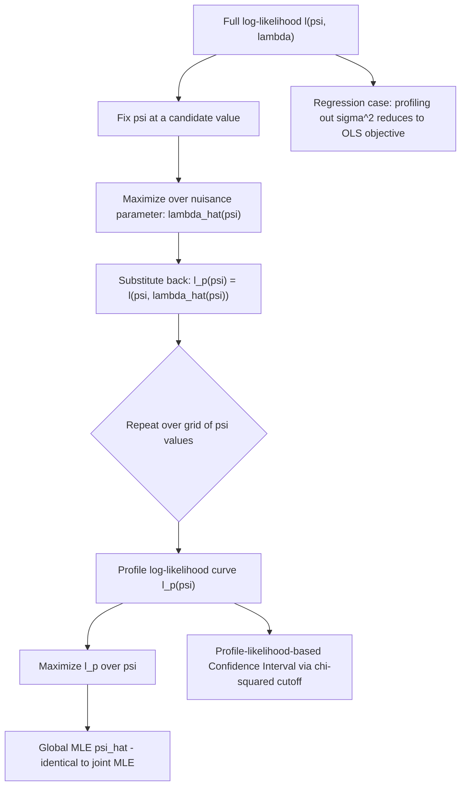

## Profile and concentrated likelihood

### Overview

The profile likelihood (also called the concentrated likelihood) is a technique for reducing a multiparameter likelihood-based inference problem to a lower-dimensional one by concentrating out ("profiling out") nuisance parameters. It provides a way to perform inference on a parameter of interest without having to jointly estimate all parameters simultaneously in every step, and underlies many two-step and iterative estimation procedures common in econometrics.

### Setup: Parameters of Interest vs. Nuisance Parameters

Partition the full parameter vector as $\theta = (\psi, \lambda)$, where:

- $\psi$ is the (typically low-dimensional) **parameter of interest**
- $\lambda$ is the (possibly high-dimensional) **nuisance parameter** — required for the model to be correctly specified, but not itself of substantive interest

Example: in $N(\mu,\sigma^2)$, if the researcher's substantive interest is in $\mu$, then $\sigma^2$ is a nuisance parameter needed to correctly specify the likelihood but not otherwise of interest.

### Definition: The Profile Likelihood

For each fixed value of $\psi$, define $\hat\lambda(\psi)$ as the value of $\lambda$ that maximizes the log-likelihood **conditional on** that fixed $\psi$:

$$\hat\lambda(\psi) = \arg\max_{\lambda} \ell(\psi,\lambda)$$

The **profile log-likelihood** is then the log-likelihood evaluated at this conditional maximizer:

$$\ell_p(\psi) = \ell\big(\psi,\hat\lambda(\psi)\big) = \max_{\lambda}\, \ell(\psi,\lambda)$$

$\ell_p(\psi)$ is a function of $\psi$ alone — the nuisance parameter has been "profiled out" by replacing it, at each value of $\psi$, with its own conditional MLE. Maximizing $\ell_p(\psi)$ over $\psi$ yields exactly the same MLE $\hat\psi$ as would be obtained by jointly maximizing the full likelihood $\ell(\psi,\lambda)$ over both parameters simultaneously — profiling is a computational reformulation, not an approximation, of the joint maximization problem.

### Worked Example: Normal Distribution, Profiling Out $\sigma^2$

For $X_1,\dots,X_n \overset{iid}{\sim} N(\mu,\sigma^2)$, treat $\mu$ as the parameter of interest and $\sigma^2$ as the nuisance parameter.

$$\ell(\mu,\sigma^2) = -\frac{n}{2}\log(2\pi\sigma^2) - \frac{1}{2\sigma^2}\sum_{i=1}^n (x_i-\mu)^2$$

**Step 1**: For fixed $\mu$, maximize over $\sigma^2$. Setting $\partial \ell/\partial\sigma^2 = 0$:

$$\hat\sigma^2(\mu) = \frac{1}{n}\sum_{i=1}^n (x_i - \mu)^2$$

**Step 2**: Substitute back into $\ell(\mu,\sigma^2)$ to obtain the profile log-likelihood:

$$\ell_p(\mu) = -\frac{n}{2}\log\left(2\pi \hat\sigma^2(\mu)\right) - \frac{n}{2}$$

Since $\hat\sigma^2(\mu) = \frac{1}{n}\sum(x_i-\mu)^2$ is minimized exactly at $\mu = \bar X$, $\ell_p(\mu)$ is maximized at $\hat\mu = \bar X$ — the same value obtained from jointly maximizing $\ell(\mu,\sigma^2)$ over both parameters, confirming the equivalence stated above.

### The "Concentrated" Likelihood in Regression: Concentrating Out $\sigma^2$

In the classical linear regression model $Y = X\beta + \varepsilon$, $\varepsilon \sim N(0,\sigma^2 I)$, the log-likelihood is:

$$\ell(\beta,\sigma^2) = -\frac{n}{2}\log(2\pi) - \frac{n}{2}\log\sigma^2 - \frac{1}{2\sigma^2}(y-X\beta)^\top(y-X\beta)$$

Profiling out $\sigma^2$ (treating $\beta$ as the parameter of interest) gives, analogously to the example above, $\hat\sigma^2(\beta) = \frac{1}{n}(y-X\beta)^\top(y-X\beta)$, and substituting back shows that maximizing the concentrated likelihood over $\beta$ is equivalent to **minimizing the residual sum of squares** $(y-X\beta)^\top(y-X\beta)$ — precisely the OLS objective. This demonstrates formally why OLS coincides with MLE for $\beta$ under Normal errors, obtained here via profile-likelihood concentration rather than by direct joint maximization.

### Properties of the Profile Likelihood

**It is not a genuine likelihood function** in the strict sense: $\ell_p(\psi)$ does not correspond to the log-density of any single well-defined statistic in general, and standard likelihood identities (e.g., the zero-mean-score property) do not automatically transfer to it without additional adjustment — this has motivated modified/adjusted profile likelihoods in the theoretical literature to correct for the "loss of information" from estimating $\lambda$.

**Curvature and standard errors**: Under regularity conditions, an analogue of the Fisher-information-based asymptotic normality result applies to $\ell_p(\psi)$, and the curvature of the profile log-likelihood at its maximum can be used to construct approximate standard errors and profile-likelihood-based confidence intervals for $\psi$, typically more accurate in small samples than the standard Wald-based intervals when the profile likelihood is notably asymmetric.

**Profile likelihood confidence intervals**: Using the same asymptotic $\chi^2$ theory as the Likelihood Ratio test, an approximate $100(1-\alpha)\%$ confidence set for $\psi$ is:

$$\left\{\psi : 2\left[\ell_p(\hat\psi) - \ell_p(\psi)\right] \leq \chi^2_{1,1-\alpha}\right\}$$

This produces intervals that need not be symmetric around $\hat\psi$, in contrast to the standard Wald interval $\hat\psi \pm z_{\alpha/2}\cdot\widehat{\text{SE}}(\hat\psi)$, and is often preferred when the profile likelihood is markedly skewed (e.g., for variance components or ratio parameters).

### Diagram: Profile Likelihood Construction

### Relevance to Econometrics

Profile likelihood underlies numerous two-step and concentrated estimation procedures in applied econometrics: nonlinear least squares and IV estimation with concentrated variance parameters, fixed-effects panel data models where individual/entity fixed effects are profiled out analytically before estimating the parameters of interest (reducing a potentially very high-dimensional joint optimization to a much smaller one), and threshold/structural break models (e.g., Hansen's threshold regression), where the threshold parameter is estimated by evaluating (profiling over) a grid of candidate threshold values and selecting the one maximizing the concentrated likelihood or minimizing the concentrated sum of squared residuals. [Inference] In panel data applications with a very large number of fixed effects (e.g., high-dimensional worker-firm matched data), profiling can substantially reduce computational burden relative to full joint estimation, though the specific numerical algorithm used to implement the profiling step (e.g., within transformation vs. iterative demeaning) varies by application and software package.

**Related Topics**

- Maximum likelihood estimation and the score equation
- Likelihood Ratio test and profile-likelihood confidence intervals
- Fixed-effects panel data estimation
- Nonlinear least squares and concentrated parameters
- Threshold and structural break models (Hansen threshold regression)
- Nuisance parameters and semiparametric efficiency