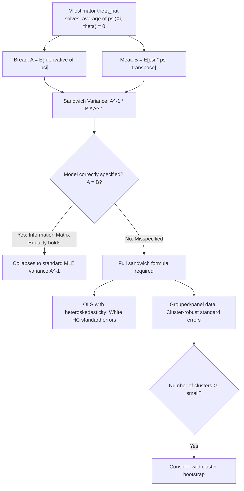

## Sandwich variance estimation under misspecification

### Overview

Sandwich variance estimation provides a method for computing valid standard errors for M-estimators (including MLE and QMLE) that remains asymptotically correct even when the assumed statistical model is misspecified. Named for the structural form of the variance formula — an inverse "bread" matrix wrapped around a "meat" matrix, wrapped by another inverse "bread" — it is the theoretical basis for the ubiquitous "robust standard errors" reported throughout applied econometrics.

### The General M-Estimation Setup

Recall that an M-estimator $\hat\theta_n$ maximizes a sample-average objective function:

$$\hat\theta_n = \arg\max_\theta \; \frac{1}{n}\sum_{i=1}^n m(X_i;\theta)$$

with associated first-order (Z-estimator) condition $\frac{1}{n}\sum_i \psi(X_i;\hat\theta_n) = 0$, where $\psi(x;\theta) = \partial m(x;\theta)/\partial\theta$.

### The Sandwich Formula

Under regularity conditions (a uniform law of large numbers, sufficient smoothness of $\psi$, and correct identification of $\theta_0$ as the unique zero of the population estimating equation $E[\psi(X;\theta_0)]=0$), the general asymptotic distribution of the M-estimator is:

$$\sqrt{n}(\hat\theta_n - \theta_0) \xrightarrow{d} N\left(0,\; \Sigma\right), \qquad \Sigma = A(\theta_0)^{-1}\, B(\theta_0)\, \left[A(\theta_0)^{-1}\right]^\top$$

where:

$$A(\theta_0) = E\left[-\frac{\partial \psi(X;\theta_0)}{\partial \theta}\right] \quad \text{("bread")}, \qquad B(\theta_0) = E\left[\psi(X;\theta_0)\,\psi(X;\theta_0)^\top\right] \quad \text{("meat")}$$

The structure $A^{-1}BA^{-1}$ (bread–meat–bread) gives the formula its name. This result holds **regardless of whether the assumed model underlying $\psi$ is correctly specified** — it is a property of any consistent Z-estimator satisfying the identification condition, not a property specific to correctly specified likelihoods.

### The Information Matrix Equality — And When It Fails

If $\psi$ is the true likelihood score function ($\psi = s(x;\theta) = \partial \log f(x;\theta)/\partial\theta$) **and** $f(x;\theta_0)$ is the true data-generating density, the **information matrix equality** holds:

$$A(\theta_0) = B(\theta_0) = I(\theta_0)$$

(the expected Hessian of the negative log-likelihood equals the variance of the score equals the Fisher information). In this special case, the sandwich formula collapses to the familiar MLE asymptotic variance $I(\theta_0)^{-1}$, and only one matrix (rather than three) needs to be estimated.

**Under misspecification** (the assumed density is wrong, as in QMLE, or the estimating equation is not a true likelihood score, as in general M-estimation), $A(\theta_0) \neq B(\theta_0)$ in general. Using $A(\hat\theta)^{-1}$ alone (the standard "model-based" or "naive" MLE variance) then yields **inconsistent** — typically too small — standard errors, understating true sampling uncertainty and inflating apparent statistical significance.

### Sample Estimation of the Sandwich Components

Given $\hat\theta_n$, the bread and meat matrices are estimated by their sample analogues:

$$\hat A = -\frac{1}{n}\sum_{i=1}^n \frac{\partial \psi(X_i;\hat\theta_n)}{\partial \theta}, \qquad \hat B = \frac{1}{n}\sum_{i=1}^n \psi(X_i;\hat\theta_n)\,\psi(X_i;\hat\theta_n)^\top$$

giving the estimated (finite-sample) sandwich covariance matrix:

$$\widehat{\text{Var}}(\hat\theta_n) = \frac{1}{n}\hat A^{-1}\hat B\, \hat A^{-1}$$

Standard errors are the square roots of the diagonal entries of this matrix — these are exactly the values reported when statistical software computes "robust" or "Huber-White" standard errors.

### Heteroskedasticity-Consistent (HC) Standard Errors in OLS

The most widely used special case is **White's heteroskedasticity-consistent standard errors** for OLS. In $Y = X\beta+\varepsilon$ with possibly heteroskedastic (but uncorrelated) errors, $\psi(x_i,y_i;\beta) = x_i(y_i - x_i^\top\beta)$, giving $\hat A = \frac{1}{n}X^\top X$ and $\hat B = \frac{1}{n}\sum_i \hat\varepsilon_i^2 x_i x_i^\top$ (using squared OLS residuals $\hat\varepsilon_i$ in place of the unknown $\varepsilon_i$). The resulting sandwich estimator is:

$$\widehat{\text{Var}}_{HC}(\hat\beta) = (X^\top X)^{-1}\left(\sum_{i=1}^n \hat\varepsilon_i^2 x_i x_i^\top\right)(X^\top X)^{-1}$$

which remains consistent regardless of the form of heteroskedasticity in $\varepsilon_i$, without requiring the researcher to correctly specify the heteroskedasticity structure — in sharp contrast to Feasible GLS, which requires modeling the variance function.

**Small-sample corrections (HC0–HC3)**: The basic formula above (HC0) can be notably biased downward in small samples or with high-leverage observations; refinements HC1 (degrees-of-freedom correction), HC2, and HC3 (leverage-adjusted, generally recommended for small samples with influential points) are commonly implemented variants.

### Cluster-Robust Standard Errors

When observations are correlated within groups (clusters) — e.g., repeated observations on the same firm, state, or individual — but independent across clusters, the meat matrix is modified to sum score contributions **within** each cluster before squaring, rather than squaring individual contributions separately:

$$\hat B_{cluster} = \frac{1}{n}\sum_{g=1}^{G} \left(\sum_{i \in g} \psi(X_i;\hat\theta)\right)\left(\sum_{i \in g} \psi(X_i;\hat\theta)\right)^\top$$

where $g$ indexes clusters. This is the standard justification for cluster-robust ("clustered") standard errors ubiquitous in panel and grouped econometric data, and it accommodates arbitrary within-cluster correlation of unknown form. [Inference] Cluster-robust standard errors are generally considered reliable only when the number of clusters $G$ is reasonably large; with a small number of clusters, the asymptotic justification for the sandwich formula weakens, and alternative small-sample corrections (e.g., wild cluster bootstrap) are frequently recommended instead, though the specific threshold for "small $G$" is a matter of ongoing methodological discussion rather than a fixed rule.

### Diagram: Sandwich Formula Construction

### Relevance to Econometrics

Sandwich/robust standard errors are close to a default convention in applied cross-sectional and panel econometrics — routinely requested via `robust` or `vce(cluster ...)` options — precisely because researchers rarely have full confidence that error variances are homoskedastic or that observations are independent across all relevant dimensions, and the sandwich formula delivers valid inference under much weaker assumptions than the classical (non-robust) standard errors that rely on the information matrix equality. This same machinery, applied to the Poisson/GARCH quasi-likelihoods discussed under Quasi-Maximum Likelihood Estimation, is precisely why QMLE-based inference requires sandwich standard errors rather than the naive model-based ones.

**Related Topics**

- M-estimation, Z-estimation, and quasi-maximum likelihood estimation
- Heteroskedasticity-consistent standard errors (HC0–HC3)
- Cluster-robust inference and the wild cluster bootstrap
- Fisher information and the information matrix equality
- Generalized Method of Moments (GMM) variance estimation
- Panel data econometrics and clustered/grouped error structures