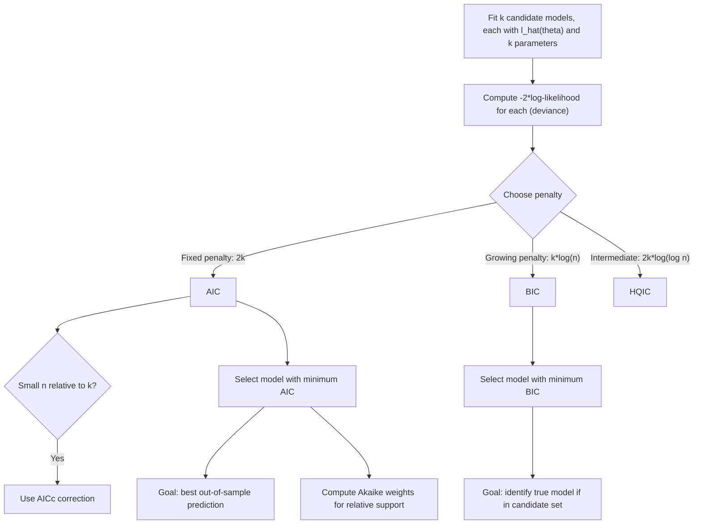

## Information criteria for model selection

### Overview

Information criteria provide formal, likelihood-based rules for comparing competing statistical models that differ in complexity (number of parameters), penalizing model fit by a measure of complexity to guard against overfitting. Unlike hypothesis tests (LR, Wald, LM), which are designed for nested model comparisons at a chosen significance level, information criteria can compare both nested and non-nested models and select among more than two candidates simultaneously, making them a cornerstone tool of applied model selection.

### The Overfitting Problem

Adding parameters to a model can never decrease the maximized log-likelihood $\ell(\hat\theta)$ (a more flexible model can always fit the observed data at least as well), so **maximum likelihood value alone is not a valid model selection criterion** — it will always favor the most complex model available, including models that overfit noise rather than capturing genuine structure. Information criteria address this by adding an explicit penalty for the number of estimated parameters.

### Akaike Information Criterion (AIC)

Introduced by Hirotugu Akaike (1974), grounded in an information-theoretic argument based on the Kullback–Leibler divergence between the fitted model and the (unknown) true data-generating process:

$$AIC = -2\ell(\hat\theta) + 2k$$

where $k$ is the number of estimated parameters in the model. **Lower AIC indicates a preferred model.**

**Theoretical justification**: AIC is (asymptotically) an approximately unbiased estimator of the expected Kullback–Leibler divergence between the fitted model and the true data-generating process (up to an additive constant common across candidate models), making it a measure of a model's expected out-of-sample predictive performance rather than merely its in-sample fit.

**Corrected AIC (AICc)**: For small sample sizes relative to the number of parameters ($n/k$ small, a commonly cited informal rule of thumb being $n/k < 40$), a finite-sample correction is recommended:

$$AICc = AIC + \frac{2k(k+1)}{n-k-1}$$

AICc converges to AIC as $n \to \infty$, but imposes a stronger complexity penalty in small samples, where the standard AIC's asymptotic derivation is less reliable.

### Bayesian Information Criterion (BIC)

Also known as the Schwarz Information Criterion (SIC), introduced by Gideon Schwarz (1978), derived from an approximation to the Bayesian marginal likelihood (evidence) under a particular class of priors:

$$BIC = -2\ell(\hat\theta) + k\log(n)$$

**Lower BIC indicates a preferred model.** Because $\log(n) > 2$ for any $n \geq 8$, BIC imposes a **stronger penalty for model complexity** than AIC for typical sample sizes, and the penalty grows with $n$ — meaning BIC increasingly favors parsimonious models as the sample size increases, unlike AIC's fixed per-parameter penalty of 2.

### AIC vs. BIC: Fundamentally Different Objectives

| Property | AIC | BIC |
| --- | --- | --- |
| Theoretical goal | Minimize predictive (out-of-sample) error | Identify the true model (if it is among candidates) |
| Penalty per parameter | $2$ (fixed) | $\log(n)$ (grows with sample size) |
| Asymptotic consistency (selecting the true model, if finite-dimensional and in the candidate set) | Not consistent — retains a positive asymptotic probability of overfitting | Consistent, under regularity conditions |
| Asymptotic efficiency (minimizing predictive risk when no true finite model exists) | Asymptotically efficient | Not asymptotically efficient |

[Unverified] The claim that BIC is "model selection consistent" formally requires that the true data-generating model be of finite dimension and included among the candidate models under comparison — a condition often treated as a convenient theoretical idealization rather than a literal assumption believed to hold in applied economic modeling, where all models are typically viewed as approximations.

### Other Information Criteria

**Hannan–Quinn Information Criterion (HQIC)**:

$$HQIC = -2\ell(\hat\theta) + 2k\log(\log n)$$

Positioned between AIC and BIC in penalty strength (since $2\log\log n$ grows more slowly than $\log n$ but faster than the constant 2, for large $n$); primarily used in time-series model order selection (e.g., choosing lag length in VAR/ARMA models) as a compromise between AIC's tendency to overfit and BIC's stronger asymptotic guarantees.

**Deviance Information Criterion (DIC)**: A Bayesian generalization used with MCMC-based posterior samples, replacing the point-estimate log-likelihood with a posterior-averaged deviance and an "effective number of parameters" term — useful for hierarchical/random-effects Bayesian models where the effective parameter count is not simply the number of named parameters.

### Practical Use in Model Selection

**Procedure**: Compute the chosen criterion for each candidate model (which may differ in included regressors, lag length, or functional form) and select the model with the minimum value. All models being compared must be fit to **the exact same set of observations** (e.g., dropping observations for missing lags must be done consistently across candidate lag-length specifications) for the comparison to be valid.

**Non-nested comparisons**: Unlike the Likelihood Ratio test (which strictly requires one model to be a special case/restriction of the other), AIC and BIC can compare models that are not nested — e.g., comparing an AR(2) model against an ARMA(1,1) model, or comparing models with entirely different sets of regressors — as long as the same dependent variable and outcome scale are used across candidates.

**Delta-AIC / Akaike weights**: Rather than treating only the minimum-AIC model as "correct," differences $\Delta_i = AIC_i - AIC_{min}$ across candidate models can be converted into relative Akaike weights, $w_i \propto \exp(-\Delta_i/2)$, providing a continuous measure of relative model support rather than a binary in/out selection.

### Diagram: Information Criteria Model Selection

### Relevance to Econometrics

Information criteria are the standard tool for lag-length selection in time-series models (AR, VAR, ARMA, ARDL), where AIC tends to select longer lag lengths (favoring predictive fit) while BIC tends to select more parsimonious specifications (favoring a simpler, more interpretable dynamic structure) — a well-documented divergence in applied macroeconometric practice. They are also routinely used to compare non-nested specifications in cross-sectional applied work (e.g., different functional forms for a hedonic pricing model, or different sets of control variables), where a formal nested hypothesis test is unavailable. [Inference] Applied researchers sometimes report results under both AIC- and BIC-selected specifications as a robustness check when the two criteria disagree on the preferred model, though the specific way disagreement is resolved or reported varies by field convention and journal norms.

**Related Topics**

- Likelihood Ratio, Wald, and Lagrange Multiplier tests
- Lag-length selection in VAR and ARMA time-series models
- Cross-validation as an alternative model-selection criterion
- Bayesian model averaging and marginal likelihood
- Overfitting and the bias-variance tradeoff
- Non-nested hypothesis testing (Vuong test, J-test)