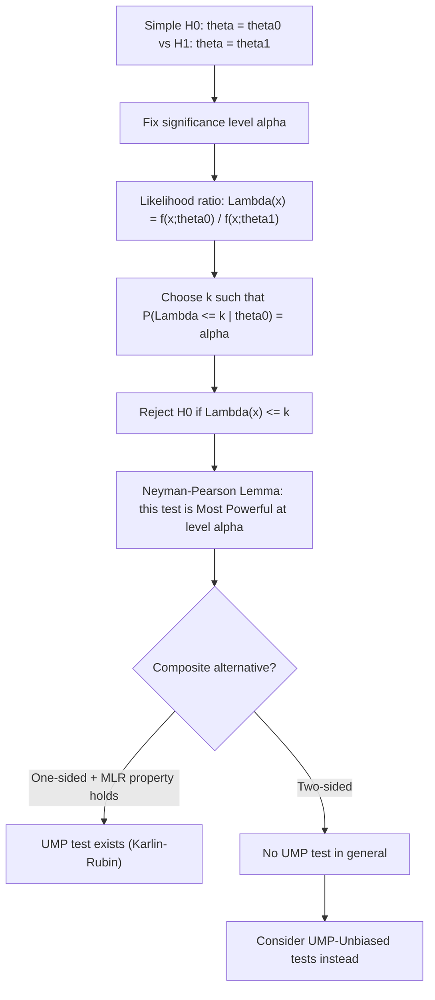

## The Neyman-Pearson framework

### Overview

The Neyman–Pearson framework, developed by Jerzy Neyman and Egon Pearson in their foundational 1933 paper, provides the formal decision-theoretic foundation of classical (frequentist) hypothesis testing. It reframes hypothesis testing as a decision problem with controllable error rates, and delivers the **Neyman–Pearson Lemma**, which identifies the most powerful possible test for comparing two simple hypotheses — the theoretical benchmark against which all other testing procedures are measured.

### Basic Setup: Simple Hypotheses

Consider testing a **null hypothesis** $H_0: \theta = \theta_0$ against an **alternative hypothesis** $H_1: \theta = \theta_1$, where both hypotheses are **simple** (each specifies a single, fully determined value of $\theta$, and hence a single completely specified distribution) — the setting in which the classical Neyman–Pearson theory is originally and most cleanly developed.

A **test** is formalized as a decision rule that partitions the sample space into a **rejection region** (critical region) $C$: if the observed data falls in $C$, $H_0$ is rejected in favor of $H_1$; otherwise $H_0$ is not rejected.

### The Two Types of Error

|  | $H_0$ true | $H_1$ true |
| --- | --- | --- |
| Reject $H_0$ | **Type I error** (probability $\alpha$) | Correct decision (power) |
| Fail to reject $H_0$ | Correct decision | **Type II error** (probability $\beta$) |

- **Size (significance level)**: $\alpha = P(\text{reject } H_0 \mid H_0 \text{ true}) = P(X \in C \mid \theta_0)$
- **Power**: $1-\beta = P(\text{reject } H_0 \mid H_1 \text{ true}) = P(X \in C \mid \theta_1)$

**The Neyman–Pearson asymmetry**: The framework treats the two hypotheses asymmetrically by design — $\alpha$ is fixed in advance at a conventional level (commonly $0.05$ or $0.01$), and the objective is then to find the test that **maximizes power** ($1-\beta$, equivalently minimizes $\beta$) subject to this constraint on $\alpha$. This formalizes the conventional practice of controlling the probability of a false positive at a pre-specified rate while doing the best possible job of detecting genuine departures from $H_0$.

### The Neyman–Pearson Lemma

**Statement**: Among all tests of $H_0: \theta=\theta_0$ vs. $H_1: \theta=\theta_1$ with significance level at most $\alpha$, the test that rejects $H_0$ when the **likelihood ratio**

$$\Lambda(x) = \frac{f(x;\theta_0)}{f(x;\theta_1)} \leq k$$

for a constant $k$ chosen so that $P(\Lambda(X)\leq k \mid \theta_0) = \alpha$, is the **most powerful test** at level $\alpha$ — no other test at the same (or lower) significance level can achieve higher power against $\theta_1$.

**Equivalent form**: Rejecting when the ratio $f(x;\theta_1)/f(x;\theta_0)$ is **large** (i.e., the data is much more likely under the alternative than under the null) is the intuitive content of the lemma — the most powerful test is precisely the one that rejects $H_0$ whenever the evidence most strongly favors $H_1$ relative to $H_0$, formalized through the likelihood ratio.

**Proof sketch**: For any other test with rejection region $C'$ of size $\alpha$ or less, and the Neyman–Pearson likelihood-ratio test's region $C$, one shows $P(C;\theta_1) - P(C';\theta_1) \geq 0$ by comparing the regions on the sets where they differ, using the defining property that $\Lambda(x)\leq k$ throughout $C$ and $\Lambda(x) > k$ throughout the complement — a direct application of the definition of the critical region combined with the size constraint.

### Worked Example: Normal Mean, Known Variance

Test $H_0: \mu=\mu_0$ vs. $H_1: \mu=\mu_1$ (with $\mu_1 > \mu_0$) for $X_1,\dots,X_n \overset{iid}{\sim} N(\mu,\sigma^2)$, $\sigma^2$ known.

The likelihood ratio $\Lambda(x) = f(x;\mu_0)/f(x;\mu_1)$ simplifies (after taking logs and algebraic manipulation) to a rejection region of the form $\bar X > c$ for some constant $c$ — that is, the Neyman–Pearson most powerful test reduces to the intuitive **one-sided z-test** based on the sample mean. Choosing $c$ so that $P(\bar X > c \mid \mu_0) = \alpha$ gives:

$$c = \mu_0 + z_\alpha \cdot \frac{\sigma}{\sqrt n}$$

where $z_\alpha$ is the upper-$\alpha$ standard normal quantile — recovering the standard one-sided test taught in introductory statistics, now shown to be **optimal** (most powerful) among all level-$\alpha$ tests for this specific simple-vs-simple comparison.

### From Simple to Composite Hypotheses: Uniformly Most Powerful (UMP) Tests

In practice, the alternative hypothesis is usually **composite** (e.g., $H_1: \theta \neq \theta_0$ or $H_1: \theta > \theta_0$, encompassing a range of values rather than a single point). A test is **Uniformly Most Powerful (UMP)** at level $\alpha$ if it is simultaneously the most powerful test against **every** value of $\theta$ in the composite alternative — a considerably stronger requirement than the simple-vs-simple Neyman–Pearson Lemma.

**Monotone Likelihood Ratio (MLR) property**: If the family $f(x;\theta)$ has the MLR property in a statistic $T(x)$ (the likelihood ratio $f(x;\theta_2)/f(x;\theta_1)$ is monotonic in $T(x)$ for any $\theta_2 > \theta_1$), then a UMP test exists for one-sided composite alternatives (e.g., $H_1:\theta>\theta_0$), and it coincides with the Neyman–Pearson test derived for any single point in the alternative — this is the Karlin–Rubin theorem. Many standard exponential family models (Normal, Poisson, Bernoulli, Exponential) satisfy the MLR property in their natural sufficient statistic, which is why UMP tests exist for these familiar one-sided testing problems.

**No UMP test generally exists for two-sided alternatives** ($H_1:\theta\neq\theta_0$): the test that is most powerful against $\theta>\theta_0$ typically differs from the one most powerful against $\theta<\theta_0$, so no single test dominates uniformly across the entire two-sided alternative — this motivates the use of alternative optimality criteria (e.g., unbiasedness, restricting attention to Uniformly Most Powerful **Unbiased** tests, UMPU) for two-sided problems.

### p-values in the Neyman–Pearson Context

[Unverified] The p-value, though ubiquitous in applied practice, sits somewhat uneasily within the strict Neyman–Pearson decision-theoretic framework, which was originally formulated around a pre-specified fixed rejection region and a binary accept/reject decision at a fixed $\alpha$, rather than a continuously-valued post-hoc summary of evidence strength; this tension is sometimes described as a hybridization of Neyman–Pearson decision theory with Fisher's earlier significance-testing tradition, and different textbooks present the relationship somewhat differently.

### Diagram: Neyman–Pearson Testing Logic

### Relevance to Econometrics

The Neyman–Pearson framework is the conceptual foundation underlying the standard practice of fixing a significance level (conventionally 5% or 1%) before conducting a hypothesis test in applied econometric work, and it underlies the derivation of optimal one-sided tests in settings such as testing for a positive treatment effect or a specific-signed coefficient restriction. The subsequent development of the Likelihood Ratio, Wald, and Lagrange Multiplier tests for composite hypotheses in multiparameter models can be understood as extending the Neyman–Pearson optimality logic (via asymptotic approximations to the likelihood ratio) beyond the simple-hypothesis case originally covered by the Lemma itself.

**Related Topics**

- Type I and Type II errors, power, and sample size determination
- Uniformly Most Powerful (UMP) and UMP-Unbiased tests
- Likelihood Ratio, Wald, and Lagrange Multiplier tests
- p-values and the Fisher vs. Neyman-Pearson testing traditions
- Monotone Likelihood Ratio (MLR) families and the Karlin–Rubin theorem
- One-sided vs. two-sided hypothesis testing