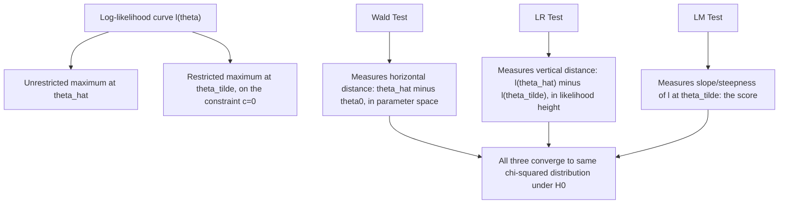

## Likelihood ratio, Wald, and Lagrange multiplier tests

### Overview

The Likelihood Ratio (LR), Wald, and Lagrange Multiplier (LM, also called the score test) tests are the three classical "trinity" of asymptotic tests for hypotheses about parameters estimated by maximum likelihood. All three are asymptotically equivalent under the null hypothesis — sharing the same limiting $\chi^2$ distribution and the same asymptotic power against local alternatives — but differ in which point(s) of the likelihood surface they require evaluating, giving each distinct computational and finite-sample properties.

### Common Setup

Consider testing a set of $r$ restrictions on a $k$-dimensional parameter $\theta$:

$$H_0: c(\theta) = 0 \quad \text{vs.} \quad H_1: c(\theta) \neq 0$$

where $c(\cdot)$ is a vector of $r$ (generally nonlinear) restriction functions (e.g., $H_0: \theta_2 = 0$ for a subset of parameters, or $H_0:\theta_1=\theta_2$).

Two estimates are relevant across the three tests:

- $\hat\theta$: the **unrestricted MLE**, maximizing $\ell(\theta)$ over the full parameter space
- $\tilde\theta$: the **restricted MLE**, maximizing $\ell(\theta)$ subject to $c(\theta)=0$

### 1. The Likelihood Ratio (LR) Test

Compares the maximized log-likelihood under the restricted and unrestricted models directly:

$$LR = -2\left[\ell(\tilde\theta) - \ell(\hat\theta)\right] = 2\left[\ell(\hat\theta) - \ell(\tilde\theta)\right]$$

Since $\hat\theta$ maximizes over a strictly larger space than $\tilde\theta$ (which is constrained), $\ell(\hat\theta) \geq \ell(\tilde\theta)$ always, so $LR \geq 0$.

**Asymptotic distribution**: Under $H_0$, $LR \xrightarrow{d} \chi^2_r$, where $r$ is the number of restrictions — this is **Wilks' Theorem** (1938), one of the foundational results of asymptotic likelihood theory.

**Requires**: Estimating **both** the restricted and unrestricted models.

### 2. The Wald Test

Based only on the **unrestricted** estimate $\hat\theta$, measuring how far the estimated restriction $c(\hat\theta)$ is from zero, scaled by its estimated precision:

$$W = c(\hat\theta)^\top \left[\hat V\right]^{-1} c(\hat\theta)$$

where $\hat V = \widehat{\text{Var}}\left(c(\hat\theta)\right) \approx \nabla c(\hat\theta)^\top \cdot I_n(\hat\theta)^{-1} \cdot \nabla c(\hat\theta)$ (via the delta method, using the estimated asymptotic covariance of $\hat\theta$).

**Simple linear restriction case** ($H_0:\theta_j = \theta_{j0}$): reduces to the familiar squared t-statistic,

$$W = \left(\frac{\hat\theta_j - \theta_{j0}}{\widehat{\text{SE}}(\hat\theta_j)}\right)^2$$

**Asymptotic distribution**: Under $H_0$, $W \xrightarrow{d} \chi^2_r$.

**Requires**: Estimating **only the unrestricted model**. This is the most commonly reported test in applied regression output (t-tests and F-tests for coefficient restrictions in OLS/MLE-based regression are Wald tests in this asymptotic framework), because software already computes $\hat\theta$ and its covariance matrix as a routine byproduct of estimation.

### 3. The Lagrange Multiplier (LM) / Score Test

Based only on the **restricted** estimate $\tilde\theta$, using the score function evaluated at $\tilde\theta$ (which is generally nonzero, since $\tilde\theta$ is not the unrestricted maximizer):

$$LM = S(\tilde\theta)^\top \left[I_n(\tilde\theta)\right]^{-1} S(\tilde\theta)$$

**Intuition**: If the null hypothesis restrictions are approximately true, the score at $\tilde\theta$ should be close to zero (since $\tilde\theta$ is then close to the true unrestricted optimum $\hat\theta$, where the score is exactly zero); a large score at $\tilde\theta$ signals that relaxing the restrictions would substantially improve the likelihood, providing evidence against $H_0$.

**Asymptotic distribution**: Under $H_0$, $LM \xrightarrow{d} \chi^2_r$.

**Requires**: Estimating **only the restricted model** — a major computational advantage when the unrestricted model is difficult or costly to estimate (e.g., testing whether a complex nonlinear term should be added to a simpler baseline model).

### Geometric Intuition: Three Ways to Measure the Same Gap

Each test exploits a different geometric feature of the same underlying log-likelihood surface near its maximum: the Wald test measures distance along the parameter axis, the LR test measures the vertical drop in log-likelihood, and the LM test measures the local slope (score) at the restricted optimum.

### Asymptotic Equivalence and Finite-Sample Ordering

All three statistics are asymptotically equivalent under $H_0$ and under local alternatives (alternatives that shrink toward $H_0$ at rate $1/\sqrt n$) — they converge to the same $\chi^2_r$ distribution and have the same asymptotic power, following directly from a common second-order Taylor expansion of $\ell(\theta)$ around $\hat\theta$.

**Finite-sample numerical ordering**: In many standard finite-sample settings (in particular, for the classical linear regression model under Normality), a well-known algebraic ordering holds:

$$W \geq LR \geq LM$$

[Unverified] This ordering can lead the three tests to different accept/reject conclusions in finite samples near conventional significance thresholds, and the direction/severity of this discrepancy has been studied extensively in the econometrics literature (e.g., Bera and Bilias, 2001), though its practical magnitude depends on the specific model, sample size, and restriction being tested.

### Choosing Among the Three Tests in Practice

| Test | Requires estimating | Best suited when |
| --- | --- | --- |
| Wald | Unrestricted model only | Unrestricted model is easy to estimate; restricted model is hard or the restriction is a simple linear/nonlinear function of $\hat\theta$ already available |
| LR | Both restricted and unrestricted models | Both models are computationally tractable; often preferred for its favorable finite-sample behavior in many settings |
| LM (score) | Restricted model only | Unrestricted model is difficult, high-dimensional, or nonstandard to estimate (e.g., testing for omitted nonlinear terms, testing for ARCH effects, testing for serial correlation against a complex alternative) |

### Relevance to Econometrics

This trinity of tests underlies nearly every hypothesis test reported by econometric software: standard t-tests and F-tests on OLS/MLE coefficients are Wald tests; the LR test is the standard tool for comparing nested MLE-based specifications (e.g., a restricted vs. unrestricted GARCH or discrete-choice model); and LM/score tests are the standard diagnostic tests for heteroskedasticity (Breusch–Pagan), serial correlation (Breusch–Godfrey), and ARCH effects (Engle's ARCH-LM test) — chosen specifically in these diagnostic contexts because they avoid estimating the (often considerably more complex) unrestricted alternative model.

**Related Topics**

- The likelihood function, score equations, and Fisher information
- Wilks' Theorem and the asymptotic $\chi^2$ distribution
- Breusch–Pagan, Breusch–Godfrey, and Engle's ARCH-LM tests
- The Neyman-Pearson framework and testing optimality
- Delta method for nonlinear function of estimators
- Information criteria (AIC/BIC) as alternatives for model comparison