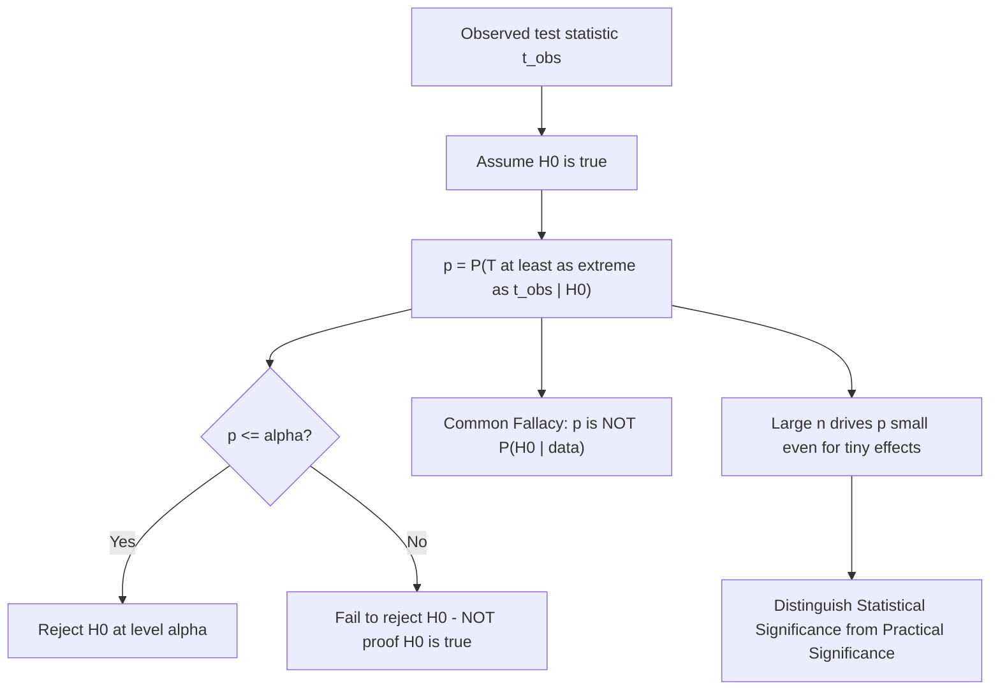

## p-values and statistical significance

### Overview

The p-value is the most widely used — and most widely misinterpreted — summary statistic in applied hypothesis testing. It quantifies how compatible observed data are with a null hypothesis, expressed as a probability under that null. Understanding both its correct formal definition and the many common misinterpretations it invites is essential for responsible statistical practice, particularly in light of ongoing methodological debate about its role in scientific inference.

### Formal Definition

Given a test statistic $T$ computed from the data, with observed value $t_{obs}$, the p-value is the probability, computed **under the null hypothesis**, of observing a test statistic at least as extreme as $t_{obs}$:

**One-sided (upper-tail) test**: $p = P(T \geq t_{obs} \mid H_0)$

**One-sided (lower-tail) test**: $p = P(T \leq t_{obs} \mid H_0)$

**Two-sided test**: $p = P(\lvert T \rvert \geq \lvert t_{obs}\rvert \mid H_0)$ (for a symmetric statistic), or more generally $2\times\min\left[P(T\geq t_{obs}\mid H_0), P(T\leq t_{obs}\mid H_0)\right]$

Crucially, the p-value is computed by treating $H_0$ **as true** and asking how surprising the observed data (or something more extreme) would be under that assumption.

### The Decision Rule

Given a pre-specified significance level $\alpha$ (conventionally $0.05$ or $0.01$):

$$\text{Reject } H_0 \text{ if } p \leq \alpha$$

This decision rule is **numerically equivalent** to the Neyman–Pearson rejection-region approach: rejecting when $p \leq \alpha$ selects exactly the same set of outcomes as a fixed critical-region test at level $\alpha$, so the p-value can be interpreted as "the smallest significance level at which $H_0$ would be rejected for this observed data."

### What the p-value IS

- The probability of the observed (or more extreme) data, **assuming $H_0$ is true**: $P(\text{data} \mid H_0)$
- A measure of the *compatibility* of the data with the null model, on a probability scale
- A **random variable** before data are observed: under $H_0$ (and standard regularity conditions), the p-value has a $\text{Uniform}(0,1)$ distribution — a fact used to construct simulation-based validity checks and to combine p-values across independent tests (e.g., Fisher's method)

### What the p-value is NOT: Common Misinterpretations

**Misinterpretation 1 — "The probability that $H_0$ is true"**: The p-value is $P(\text{data}\mid H_0)$, not $P(H_0\mid\text{data})$. Confusing these two conditional probabilities is known as the **transposed conditional fallacy** (or "prosecutor's fallacy" in a legal analogy) — computing $P(H_0\mid\text{data})$ would require Bayes' theorem and a prior probability on $H_0$, which the frequentist p-value framework does not supply.

**Misinterpretation 2 — "The probability the result occurred by chance"**: This conflates $P(\text{data}\mid H_0)$ with an unconditional statement about the data-generating mechanism; the p-value is always computed *conditional on* $H_0$ being the operative model.

**Misinterpretation 3 — "A small p-value indicates a large or practically important effect"**: The p-value conflates effect size and sample size. With a sufficiently large sample, even a trivially small, practically meaningless effect will produce an arbitrarily small p-value, because standard errors shrink toward zero as $n\to\infty$ while a fixed non-zero true effect remains fixed — a well-documented consequence of the $1/\sqrt n$ convergence rate of most standard estimators (see Fisher information and asymptotic variance). Statistical significance and practical/economic significance are conceptually distinct.

**Misinterpretation 4 — "$p > \alpha$ proves $H_0$ is true"**: Failing to reject $H_0$ is not equivalent to establishing that $H_0$ is true — it may simply reflect insufficient statistical power (see Type II error) to detect a real but smaller effect. Classical hypothesis testing is asymmetric: it is designed to control the Type I error rate, not to provide positive evidence *for* the null.

**Misinterpretation 5 — "The p-value is the probability of replicating the result"**: The p-value from a single study says nothing directly about the probability of obtaining a similarly significant result in an independent replication, a point emphasized in discussions of the replication crisis in the social and biomedical sciences.

### Statistical Significance vs. Practical Significance

**Statistical significance** ($p \leq \alpha$) is a statement about whether the observed evidence is inconsistent with $H_0$ at a pre-specified error-rate threshold. **Practical (or economic) significance** is a substantive judgment about whether the estimated magnitude of an effect is large enough to matter for real-world decisions, policy, or theory. A regression coefficient can be statistically significant (very small p-value, due to a large sample) while representing an economically negligible effect size — and conversely, a substantively large and economically important effect can fail to reach conventional significance in a small sample due to low power. Reporting confidence intervals or standardized effect sizes alongside p-values is widely recommended specifically to help distinguish these two, conceptually separate, notions of "significance."

### The American Statistical Association's 2016 Statement and Ongoing Debate

[Unverified] The American Statistical Association issued a formal statement in 2016 outlining principles for the proper use and interpretation of p-values, motivated partly by concerns about widespread misuse (including "p-hacking" — selectively analyzing or reporting results to obtain $p<0.05$) and its contribution to non-replicable findings; specific journals and subfields have since adopted varying responses (e.g., requiring pre-registration, reporting confidence intervals alongside or instead of p-values, or in a few specific journals, banning p-values/significance testing language outright), though the extent and nature of adoption differs considerably across disciplines and is not settled practice.

### Diagram: p-value Computation and Interpretation

### Relevance to Econometrics

The distinction between statistical and practical significance is especially salient in econometrics because many applied datasets (large administrative records, big survey panels, high-frequency financial data) involve very large $n$, routinely producing statistically significant coefficients on economically tiny effects — a well-recognized pattern motivating the standard practice of reporting effect sizes, elasticities, or standardized coefficients alongside p-values and t-statistics in applied empirical papers, rather than relying on significance stars alone. The replication and p-hacking concerns discussed above have also motivated the increasing use of pre-analysis plans and pre-registration in applied microeconomics and program evaluation research.

**Related Topics**

- The Neyman–Pearson framework and Type I/Type II errors
- Confidence intervals as an alternative/complement to p-values
- Multiple testing and the multiple comparisons problem
- Effect sizes, standardized coefficients, and economic significance
- Pre-registration and the replication crisis
- Likelihood Ratio, Wald, and Lagrange Multiplier tests